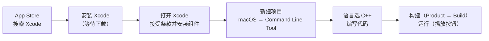

## 工具选择：为什么是 Xcode

在 Mac 上构建 C++ 程序有很多可选工具，本课程推荐的是 **Xcode**——苹果官方出品的 IDE（集成开发环境）。

客观地说，Xcode 在大项目上并不出色：作者所在的 EA 工作室就使用 Xcode 构建 iOS 游戏，像《Need for Speed：No Limits》这类大型项目的编译时间可以超过 20 分钟，代码编写过程也会因为卡顿而令人抓狂。**但对于小项目和入门学习 C++ 来说，Xcode 依然是 Mac 上最好的 IDE。**



## 安装 Xcode

在 Mac 上打开 **App Store**，搜索 "Xcode"，点击安装。安装耗时取决于你的网速。安装完成后打开 Xcode，接受所有条款与条件，它会自动安装一些必要的组件，然后进入工作界面。

## 创建第一个项目

新建项目：「File > New > Project」。**模板选择**：左侧点「macOS」，右侧选择 **Command Line Tool**（命令行工具，即纯控制台程序，最适合学习语法）。项目命名为 **Hello World**，**语言选择 C++**。

创建时会要求填写一个**组织标识符**（Organization Identifier），比如 `com.你的域名`，用系统建议或随便填一个自己拥有的域名即可——它的作用是让项目在系统里有个唯一身份，内容本身无关紧要。填写完后点击 Next，选择项目存放位置：作者的习惯是在**用户目录下建一个 Dev 文件夹**存放所有练习项目。点击 Create 完成。

> [!NOTE]
> 创建后 Xcode 可能弹出"访问你的联系人"的权限请求——本课程不需要用到，直接拒绝即可。

## Xcode 项目界面一览

创建一个项目后，从左侧能看到项目文件结构。点击顶部**项目名称**可以进入项目设置页，里面包含各种构建设置（Build Settings）和构建阶段（Build Phases），例如源文件分组、编译参数等。对本课程来说，**这些设置基本不需要改动**，保持默认即可。

项目中已经自动生成了一个 `main.cpp` 文件，里面也预置了一段代码。作者会把代码重新敲一遍，以便与系列中其他视频保持一致。

## 编写 Hello World 代码

在 `main.cpp` 中写入以下代码：

```cpp
#include <iostream>

int main()
{
    std::cout << "Hello World!" << std::endl;
    std::cin.get();
}
```

> [!NOTE]
> **这段代码在做什么**：`#include <iostream>` 引入标准输入输出库，`std::cout` 向控制台打印文本，`std::endl` 换行，`std::cin.get()` 等待用户按键后程序才结束，这样运行后的"黑窗口"不会一闪而过。后续视频会详细讲解每部分含义。

## 构建与运行

代码写完保存后，构建方式有两种：

**菜单构建**：点顶部菜单「Product > Build」，即可编译项目。完成后下方会提示 `Build succeeded`（构建成功）。

**直接运行**：点工具栏的**播放按钮**（Run），它会先自动构建再运行程序。如果是第一次运行，Xcode 会要求**启用开发者模式（Developer Mode）**，按提示启用即可。

运行时，底部会弹出控制台（Console）区域，显示程序的输出 Hello World。在这里按回车，可以看到程序正常终止。至此，Mac 上的 C++ 工具链全部验证完毕，可以开始学习 C++ 了。

> [!WARNING]
> 首次运行 Xcode 时需要启用开发者模式，否则无法调试和运行程序，按系统提示操作即可。

## 本章小结

这一集在 Mac 上完成了与 Windows 集等价的目标：装好工具链并跑通第一个程序。

**工具选择**：Xcode 虽然对大项目不友好（EA 的大型游戏编译要 20 分钟以上），但对学习和写小程序是 Mac 上最好的 IDE，本系列全程使用。

**项目创建**：通过 App Store 安装 Xcode → 新建 macOS 下的 Command Line Tool 模板项目 → 命名为 Hello World、语言选 C++ → 填一个唯一标识符 → 存放在用户目录的 Dev 文件夹。

**项目结构**：认识了项目设置（Build Settings / Build Phases）的概念，并知道本课程无需修改任何默认设置。

**验证成果**：在自动生成的 main.cpp 中编写了与其他平台视频一致的 Hello World 代码（iostream、std::cout、std::cin.get），用 Product > Build 构建成功，用播放按钮首次启用开发者模式后运行成功，控制台正确输出文字。

从下一集开始，将正式进入 C++ 工作原理的学习——那是正确书写 C++ 代码的关键。