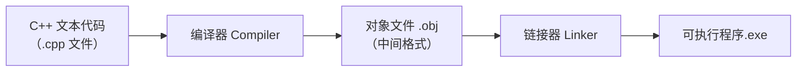

## 本节概述：编译在整条流水线里的位置

把 C++ 文本代码变成可运行的程序，需要两步大操作：**编译（Compiling）**和**链接（Linking）**。本集专注讲解**编译器**到底在做什么（链接有专门的视频）。



## 编译器唯一真正的职责

编译器需要做的事情其实很简单：**把文本文件转换成一种中间格式——对象文件（.obj）**。编译出的 .obj 再交给链接器做"缝合"工作。

编译器在产出 .obj 时依次完成几件事：

**第一步：预处理**——当场评估所有预处理器语句（# 开头的东西）。

**第二步：词法分析与语法分析**——把 C++ 英文式的代码整理成编译器能理解和推理的格式，最终生成一棵**抽象语法树（Abstract Syntax Tree，AST）**，即代码的一种树状抽象表示。

**第三步：生成机器码**——基于语法树开始真正的代码生成，即 CPU 实际执行的机器码；此外还会产出其他数据，比如存放所有常量变量的地方。

> [!NOTE]
> 概念上并不复杂——真正让编译器变复杂的是代码复杂度的增长。

## 翻译单元：C++ 不关心文件的存在

编译器为**每一个 .cpp 文件产出对应的 .obj**（之前 Hello World 项目里生成了 main.obj 和 log.obj 两个文件）。这些被单独交给编译器编译的 .cpp 文件被称作**翻译单元（Translation Unit）**。

这里要破除一个认知：**C++ 里根本不存在"文件"的概念**。与 Java 不同（Java 要求类名与文件名、文件夹与包结构强绑定），C++ 的文件只是**喂给编译器源码的方式**而已。

你负责告诉编译器某文件的类型，编译器按**扩展名约定**处理：.cpp 当 C++ 文件、.c 当 C 文件、.h 当头文件。这些约定**全部可以覆盖**——你甚至可以造 `.cherno` 文件并告诉编译器"按 C++ 编译它"，完全可行。

> [!WARNING]
> 记住：**文件本身没有意义**。之所以区分"翻译单元"和".cpp 文件"，是因为一个翻译单元并不必然等于一个 .cpp 文件——若你把多个 .cpp 用 #include 拼成一个大文件再只编译一次，那么它就是**一个翻译单元，产出一个 .obj**。常规项目里每个 .cpp 独立编译，所以通常"一个 .cpp = 一个翻译单元 = 一个 .obj"。

## 观察 .obj：为什么它们这么大

Debug 目录下的 main.obj、log.obj 分别有 30KB、46KB——因为里面通过 #include 引入了 iostream，而它在展开后包含海量内容。为了更清晰地观察编译过程，新建一个极简文件 **math.cpp**，不含任何 include：

```cpp
int Multiply(int a, int b)
{
    int result = a * b;
    return result;
}
```

编译后生成的 math.obj 只有 4KB。接下来用它观察编译的各个阶段。

## 阶段一：预处理究竟在做了什么

预处理器会遍历所有预处理器语句并求值，常用的是 `#include`、`#define`、`#if`、`#ifdef`（#pragma 系列另讲）。通过几个实验验证它的行为：

**实验 1：#include 就是复制粘贴**。新建头文件 `endbrace.h`，里面只有一条内容：`}`（一个右花括号）。把 math.cpp 里 Multiply 函数结尾的 `}` 删掉（编译报错"左花括号不匹配"），然后写 `#include "endbrace.h"`，编译竟然通过了——因为预处理器只是打开 endbrace.h、读取内容、**原样粘贴**进 math.cpp。

**实验 2：让预处理结果可视化**。项目属性 → C/C++ → 预处理 → 把"预处理到文件"设为"是"，再次编译后目录里会多出 **math.i 文件**（预处理后的 C++ 代码），用文本编辑器打开即可看到 include 已被真实展开为代码。

**实验 3：#define 是文本搜索替换**。`#define INTEGER int` 后，预处理器会把代码里所有 "INTEGER" 单词替换成 "int"。"INTEGER result = a * b;" 预处理后变成 "int result = a * b;"。甚至把宏名改成 "Cherno"，代码里的 "Cherno Multiply" 也照换不误——纯粹是符号级的文本替换。

**实验 4：#if 条件包含/排除代码**。`#if 1 ... #endif` 之间的代码会保留，`#if 0` 之间的代码会被剔除（Visual Studio 还会把被禁用的代码淡显出来）。预处理后的文件里，`#if 0` 分支的代码确实消失了。

**实验 5：滚雪球效应**。在 math.cpp 里写 `#include <iostream>` 再查看预处理文件——**62,763 行**膨胀出的东西全都来自这一行 include，且 iostream 内部还会继续 include 其他文件，像雪球滚下山越滚越大。这也解释了为什么 .obj 会那么大。

## 阶段二：把 .obj 变成可读的汇编

.obj 是二进制，无法直接阅读。转换成人能读的形式：项目属性 → C/C++ → 输出文件 → 把"汇编程序输出"设为**"仅程序集列表"**，编译后在目录里得到 **math.asm** 文件——它就是 .obj 内容的可读版本，包含机器码对应的汇编指令。（为方便看懂，下面只摘出 Multiply 函数的核心几步，真实文件里还夹着一些“搭架子”的辅助指令。）

```asm
; Multiply 函数的汇编（Debug 模式，未优化）
mov eax, dword ptr [a]   ; 把参数 a 载入 eax 寄存器
imul eax, dword ptr [b]  ; imul 乘法指令：与其相乘
mov dword ptr [result], eax  ; 结果存入 result 变量
mov eax, dword ptr [result]  ; 再把 result 移回 eax
ret                       ; eax 作为返回值返回
```

> [!WARNING]
> 这段汇编里有一个**多余的往返移动**：因为代码里先建了 result 变量，return 的是 result——于是出现"eax → result → eax"的冗余传递。这正是**不开启优化会导致代码变慢**的直观例证。若直接写成 `return a * b`，汇编就只剩载入、乘法、返回三步。

## 阶段三：优化开关与常量折叠

**开启优化**：项目属性 → 优化 → 选择"最大化速度"。注意直接开会有报错——**O2 与运行时检查（RTC）不兼容**，需要到"代码生成"里把"基本运行时检查"改为默认（关闭），因为那些运行时检查只是编译器插入的调试辅助代码。开启优化后，math.asm 大幅缩水，只剩载入寄存器、乘法、返回。

**常量折叠（Constant Folding）**：把函数改成常数运算，例如 `return 5 * 2`，看汇编——编译器直接把 10 移进返回值寄存器，连乘法指令都没生成。**能在编译期算出来的常量，就在编译期算掉**，这就是常量折叠。

**函数调用与签名**：让 Multiply 里调用另一个函数 Log（为简化，Log 不打印、只是原样返回收到的指针参数）。此时汇编里在乘法之前出现一条 **call 指令**调 Log。注意 Log 在汇编里被一堆 "@" 和随机字符"装饰"——这一串“全名”是编译器给函数起的**独一无二的招牌**（32 位平台下常见 @ 记号，64 位平台下则常以 ? 开头），链接器拼接 .obj 时就是靠它对上号的（细节见链接专题）。

**优化吞掉"无意义"的调用**：重新打开最大化速度优化后，Log 调用整个消失了——编译器判断这次调用不产生任何效果，于是直接删掉这段代码。

## 本章小结

本集彻底讲清楚了**编译器**这一环，它远没有想象中神秘：

**核心职责**：把 .cpp 文本文件转换为中间产物——对象文件 .obj（编译器只干这一步，缝合是链接器的事）。

**内部流程**：预处理（求值 #include/#define/#if 等）→ 词法/语法分析（生成抽象语法树 AST）→ 生成机器码与常量数据。

**翻译单元**：每个独立编译的 .cpp 是一个翻译单元、产出一个 .obj；C++ 没有"文件"概念，文件只是输入方式，扩展名是可覆盖的默认约定。

**预处理三兄弟**：#include 复制粘贴文件内容、#define 无脑文本替换、#if/#endif 按条件纳入或剔除代码；一行 #include \<iostream\> 展开后有 6 万多行——.obj 大就大在这里。

**机器码视角**：.obj 内含 CPU 真正执行的指令；Debug 不优化会产生冗余指令（如中间变量导致的往返移动）；开启优化后能消除冗余、做常量折叠（5×2 直接算出 10），对无副作用调用直接整段删掉。

**实用开关**：属性页里两个关键设置——"预处理到文件"（生成 .i 看预处理结果）和"汇编程序输出"（生成 .asm 看汇编），是本集观看编译产物的两大窗口。

理解编译行为，对日后调试和进阶性能优化都至关重要。