## 本节概述：引用就是指针的"语法糖"

上一集讲了指针，这一集讲**引用（Reference）**。核心结论一句话：**引用本质上就是指针，只是穿了件更漂亮的衣服**——是加在指针之上的语法糖（syntax sugar），让代码更好读、更好跟。计算机底层做的事几乎一模一样，区别只在我们怎么写、怎么用。

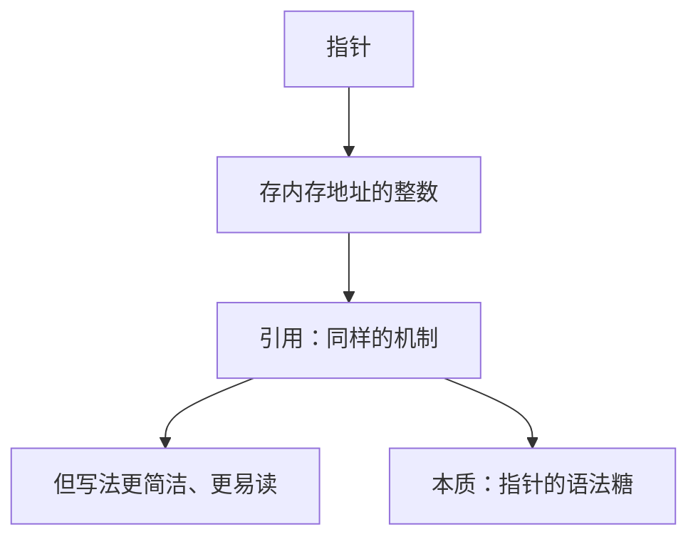

## 引用是什么：变量的别名

引用就是**给一个已存在的变量起个别名（alias）**。它和指针有两个关键区别：

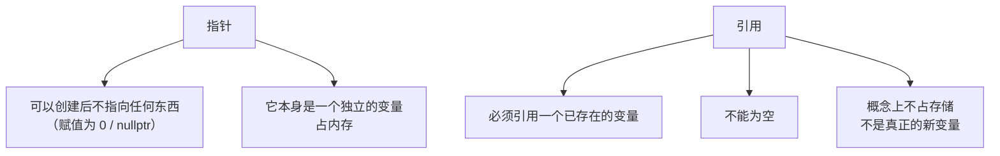

换句话说：`ref` 这个"变量"其实并不存在，它只存在于你的源代码里。编译之后你不会得到 `a` 和 `ref` 两个变量，**只有一个 `a`**。

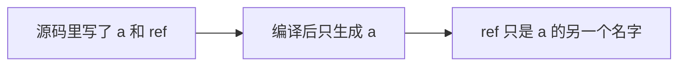

## 声明引用的语法

```cpp
int a = 5;
int& ref = a;          // ref 是 a 的引用（别名）
```

注意这个 `&` 的位置——**它紧挨着类型，是类型的一部分**，而不是像取地址那样紧挨着变量：

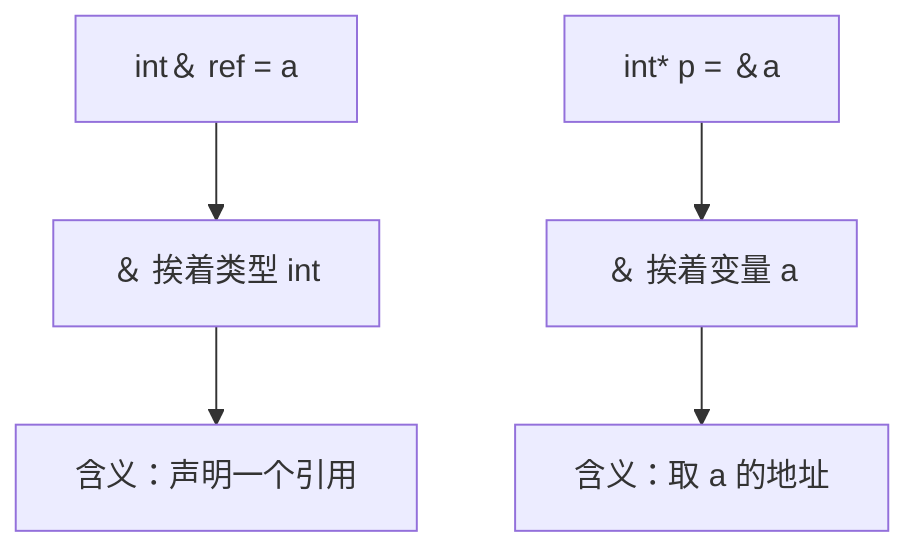

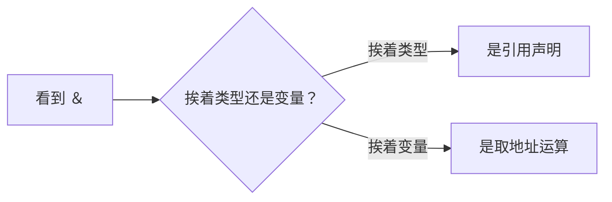

> [!TIP]
> 很多人一看到 `&` 就条件反射地认为"这是引用"或"这是取地址"，其实要看上下文：**挨着类型就是引用，挨着变量就是取地址**。

声明引用时不需要任何奇怪的操作符，直接赋一个已存在的变量就行。之后就可以**把 `ref` 完全当成 `a` 来用**：

```cpp
int a = 5;
int& ref = a;

ref = 2;                             // 等价于 a = 2
std::cout << a << std::endl;         // 输出 2
```

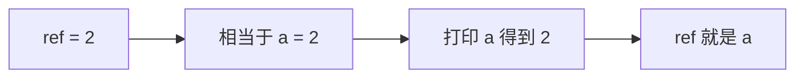

## 值传递：函数里的"复制"

假设要写一个给整数加一的函数：

```cpp
void Increment(int value)            // 值传递
{
    value++;
}
```

调用 `Increment(a)` 时，`a` 的值 **5 被复制**进函数，函数里新建了一个叫 `value` 的变量。改的是那个副本，**原来的 `a` 丝毫不动**：

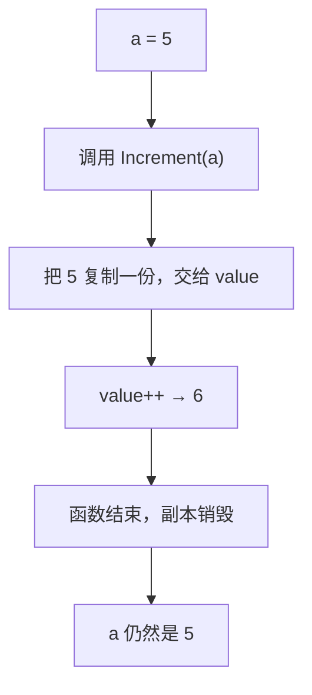

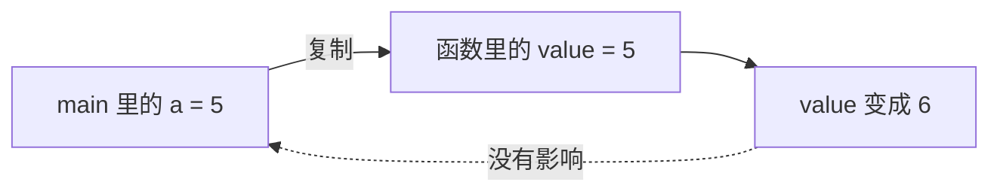

## 用指针实现"改到原变量"

想真正改到 `a`，就得把**地址**传进去。上一集学过指针就是内存地址，所以把 `&a` 传进去，函数里顺着地址去改：

```cpp
void Increment(int* value)           // 参数是指针
{
    (*value)++;                      // 先解引用，再自增
}

int main()
{
    int a = 5;
    Increment(&a);                   // 传 a 的地址
    std::cout << a << std::endl;     // 输出 6
}
```

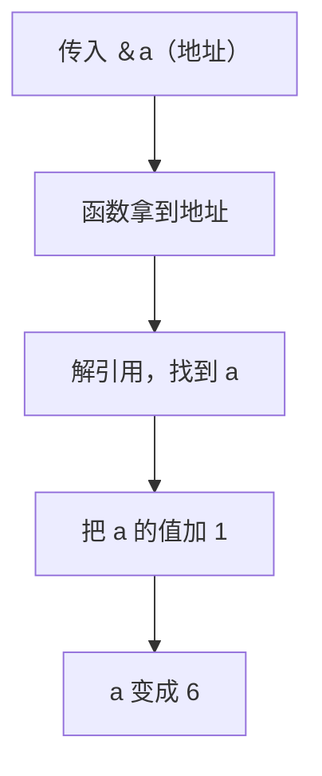

**这里必须用括号包住解引用**，否则会踩坑：

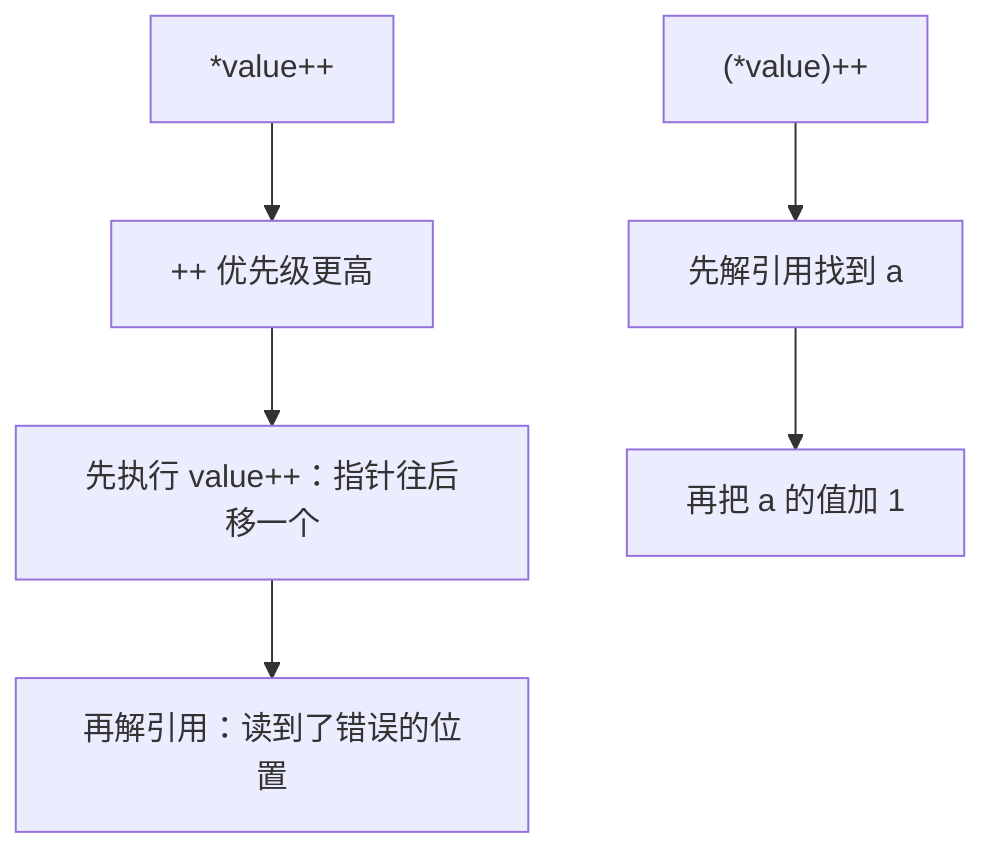

因为后缀 `++` 的优先级高于解引用 `*`，`*value++` 会被理解成"先把指针加一，再解引用"，结果递增的是**地址**而不是那个值。

## 用引用实现：更干净

既然引用就是"指针的语法糖"，同样的功能用引用写，**不需要解引用、不需要传地址**，代码立刻清爽：

```cpp
void Increment(int& value)           // 参数是引用
{
    value++;                         // 直接当成原变量用
}

int main()
{
    int a = 5;
    Increment(a);                    // 直接传 a，不用写 &
    std::cout << a << std::endl;     // 输出 6
}
```

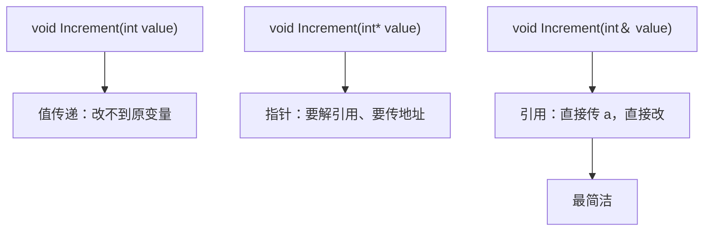

编译后，引用版本和指针版本**内部做的事完全一样**，区别只在源代码里看起来更顺眼。

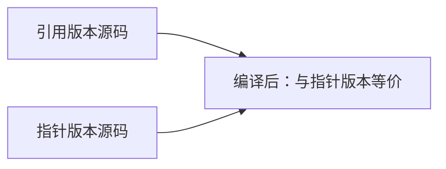

> [!TIP]
> 引用能做的事，指针都能做，而且指针更强大、更灵活。但只要能用引用解决问题，就**优先用引用**——代码更干净、更好读。

## 引用的两个硬性限制

### 限制一：必须初始化

引用必须**在声明的同时就绑定**到某个变量，不能先声明再赋值：

```cpp
int& ref;                 // 编译错误：引用必须有初始化器
```

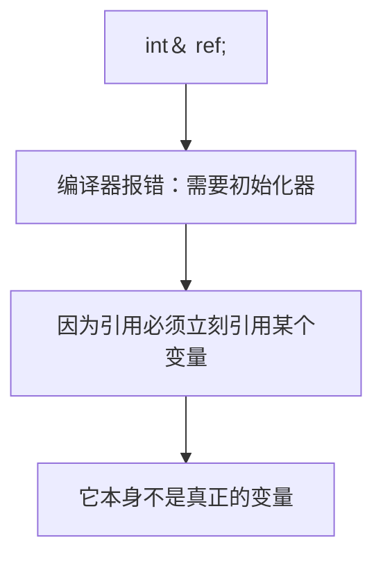

### 限制二：不能改绑

一旦引用绑定了 `a`，它就**永远是 `a` 的别名**，不能改成 `b` 的别名。写 `ref = b` 并不会"改绑"，而是**把 `b` 的值赋给了 `a`**：

```cpp
int a = 5;
int b = 8;
int& ref = a;

ref = b;                             // 不是改绑！相当于 a = b
std::cout << a << " " << b << std::endl;   // 输出 8 8
```

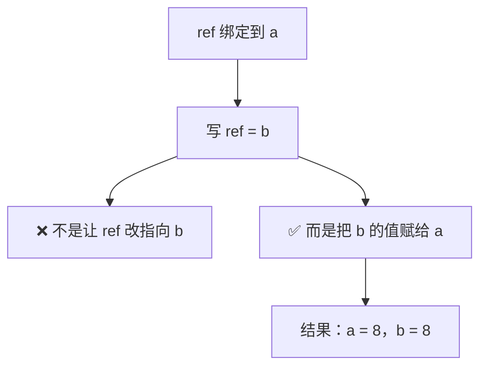

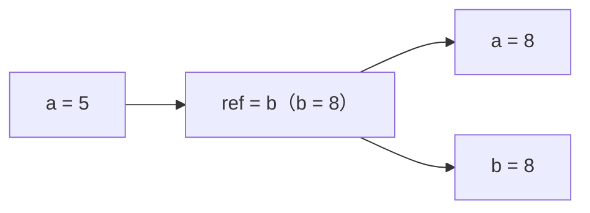

## 需要"改绑"就用指针

如果确实需要"先指向 a、之后再改成指向 b"，引用做不到——**这时候就用指针**，因为指针本身是一个可以随意改值的变量：

```cpp
int a = 5;
int b = 8;

int* ptr = &a;                       // 先指向 a
*ptr = 2;                            // a 变成 2

ptr = &b;                            // 改绑：改为指向 b
*ptr = 1;                            // b 变成 1

std::cout << a << " " << b << std::endl;   // 输出 2 1
```

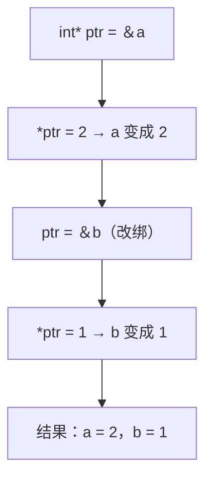

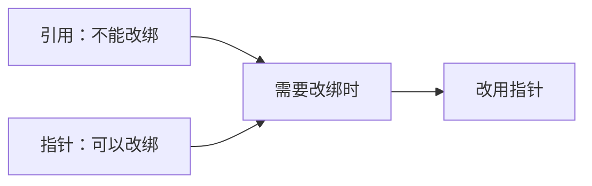

## 指针 vs 引用 对比

| 对比项 | 指针 | 引用 |
| --- | --- | --- |
| 本质 | 存地址的整数 | 变量的别名（指针的语法糖） |
| 能否为空 | 可以（0 / nullptr） | 不可以 |
| 是否必须初始化 | 不必须 | 必须 |
| 能否改绑 | 可以 | 不可以 |
| 是否占存储 | 占（它是个变量） | 概念上不占 |
| 使用方式 | 需解引用 `*` | 直接当原变量用 |
| 传参写法 | `f(&a)` | `f(a)` |
| 能力 | 更强大、更灵活 | 更简洁、更安全 |

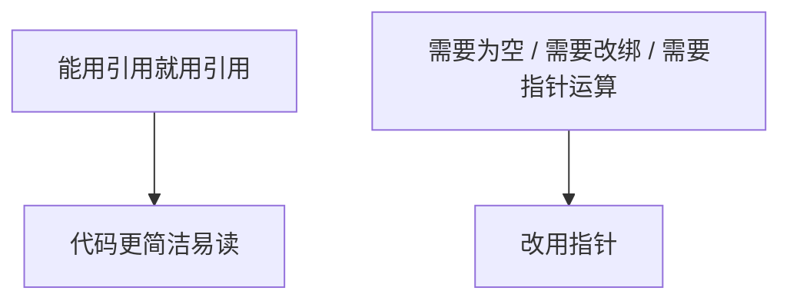

## 完整示例代码

```cpp
#include <iostream>

void IncrementByValue(int value)     // 值传递：改不到原变量
{
    value++;
}

void IncrementByPointer(int* value)  // 指针传递：要解引用
{
    (*value)++;
}

void IncrementByReference(int& value) // 引用传递：最简洁
{
    value++;
}

int main()
{
    int a = 5;
    int& ref = a;                    // ref 是 a 的别名

    ref = 2;                         // 相当于 a = 2
    std::cout << a << std::endl;     // 2

    IncrementByValue(a);             // a 不变
    IncrementByPointer(&a);          // a 加 1
    IncrementByReference(a);         // a 加 1
    std::cout << a << std::endl;     // 4

    int b = 8;
    int& ref2 = a;
    ref2 = b;                        // 不是改绑，而是 a = b
    std::cout << a << " " << b << std::endl;   // 8 8

    int* ptr = &a;                   // 需要改绑时用指针
    *ptr = 2;                        // a = 2
    ptr = &b;                        // 改指向 b
    *ptr = 1;                        // b = 1
    std::cout << a << " " << b << std::endl;   // 2 1

    std::cin.get();
}
```

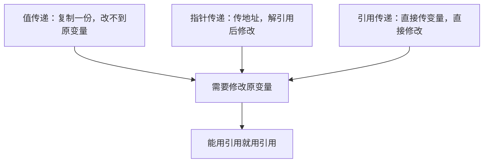

## 本章小结

**引用的本质**：就是指针，是加在指针之上的语法糖，让源码更好读。编译后做的事和指针版本完全一致。

**引用是别名**：它引用一个已存在的变量，概念上不占存储，编译后不会真的多出一个变量。

**语法要点**：`int& ref = a;`——`&` 紧挨类型是引用声明，紧挨变量是取地址运算，看上下文区分。

**值传递 vs 引用传递**：值传递会复制一份，改不到原变量；传引用（或传指针）才能真正修改原变量。

**指针版要注意优先级**：`*value++` 会先移动指针再解引用，必须写成 `(*value)++`。

**两个硬性限制**：引用必须初始化；引用一旦绑定就不能改绑（`ref = b` 只是赋值，不是改指向）。

**选型原则**：能用引用就用引用（更简洁安全）；需要为空、需要改绑、需要指针运算时，改用指针。