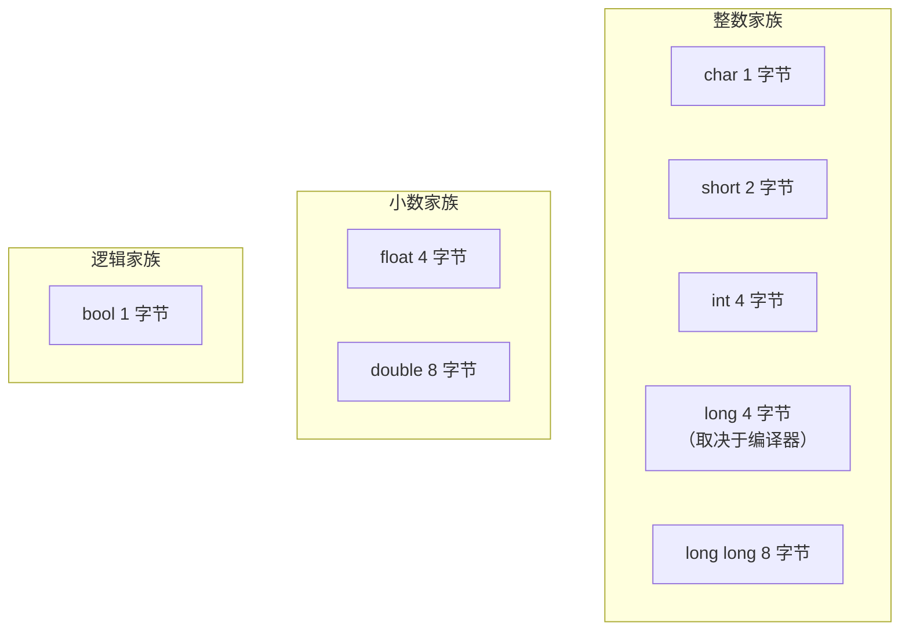
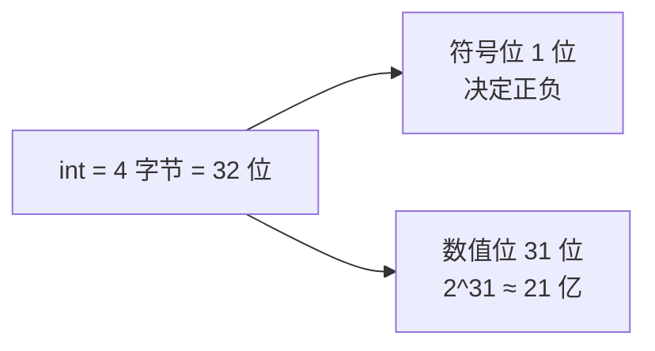
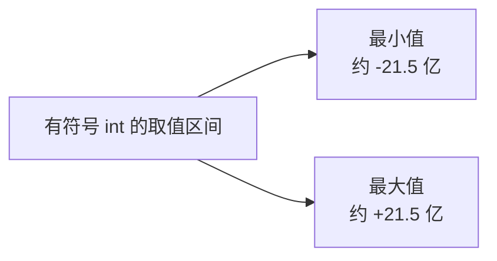
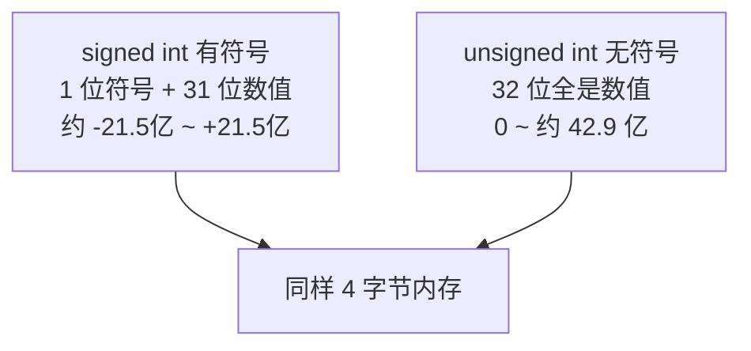
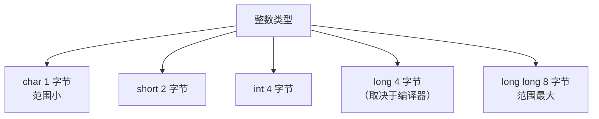
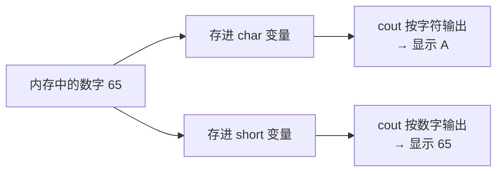
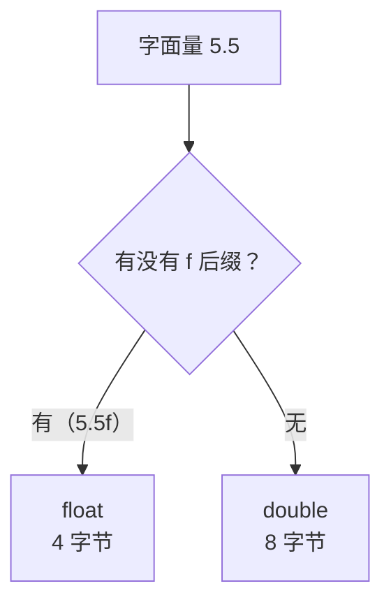
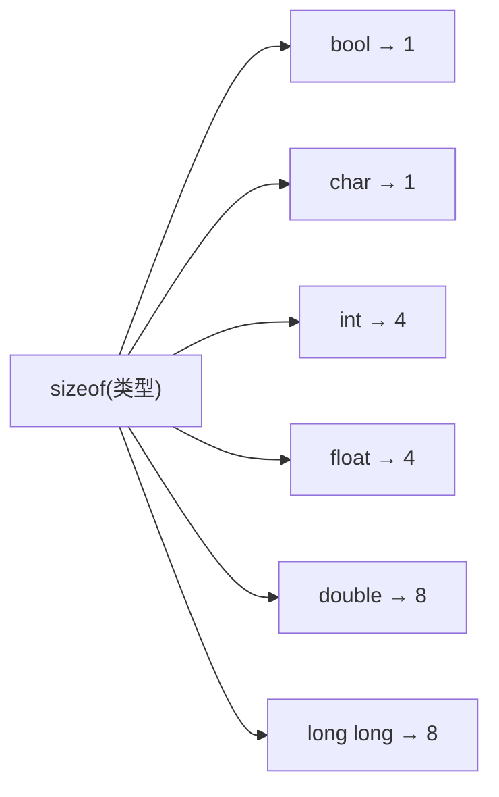
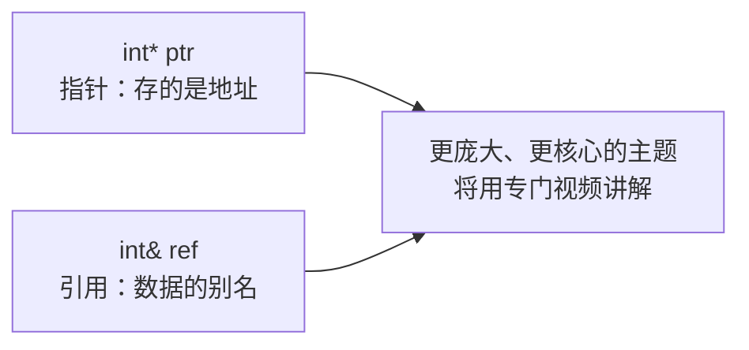

## 本节概述：给内存中的数据起名字

编写程序，大部分工作就是在**操作数据**：读取、修改、写入。而**变量（Variable）**就是给存储在内存中的数据起的**名字**——有了名字，我们才能反复地使用同一份数据。本集将带你认识 C++ 最基本的几类"数据容器"：**基本数据类型（Primitive Types）**。


下面是我们本集要反复用到的一个完整示例，先整体看一眼，然后逐步拆解每一行。

```cpp
#include <iostream>

int main()
{
    int variable = 8;                    // 整数变量，初始值 8
    std::cout << variable << std::endl;  // 输出 8

    variable = 20;                       // 修改变量：重新赋值为 20
    std::cout << variable << std::endl;  // 输出 20

    unsigned int u = 8;                  // 无符号整数（只能存正数）
    char c = 'A';                        // 字符变量，内存里实际存的是数字 65
    std::cout << c << std::endl;         // 输出 A

    float f = 5.5f;                      // 单精度小数，注意后面的 f
    double d = 5.5;                      // 双精度小数
    std::cout << f << std::endl;         // 输出 5.5

    bool flag = true;                    // 布尔值：真
    std::cout << flag << std::endl;      // 输出 1

    std::cout << sizeof(int) << std::endl;    // 输出 4（int 占 4 字节）

    std::cin.get();
}
```

## 什么是变量

假设你在做一个游戏，玩家在地图上有坐标，而且会移动。为了在每一帧都能画出玩家、判断玩家与关卡其他元素的碰撞，我们需要**把玩家的位置数据存起来，并且反复使用**——变量就是干这个的。

在 C++ 中创建一个变量，只需两步：

```cpp
int variable = 8;    // 类型 + 名字 + 赋值
```

**第一步：声明**。`int` 是变量类型，`variable` 是给这块数据起的名字，这句话告诉编译器："我要一个名叫 variable 的整数空间"。

**第二步：赋值**。`= 8` 把数字 8 放进这个空间。赋值这部分**是可选的**——你也可以只声明不赋值：

```cpp
int variable;    // 合法，但没有初始值
```

> [!WARNING]
> 只声明不赋值的变量，里面装的是内存中残留的**未知垃圾值**。因此建议声明时就直接赋好初值。

## 变量存储在哪里

当我们创建变量时，它会被存放在内存中的**栈（Stack）**或**堆（Heap）**上。现在你只需要记住一个结论：**变量会占用内存**。至于栈和堆的区别、什么时候用哪个，后面的视频会专题详细讲解。

## 基本数据类型：C++ 的积木

C++ 内置了一批**基本数据类型**，它们是一切数据的构建积木。你之后创建的任何复杂类型（类、结构体、字符串……）最终都是由这些基本类型拼出来的。

这些类型之间**唯一的区别就是大小**——占多少个字节（Byte）的内存。而具体大小由**编译器**决定，不同编译器可能略有差异。C++ 最常用的基本类型如下：

| 类型 | 大小 | 说明 |
| --- | --- | --- |
| `char` | 1 字节 | 字符，或很小的整数 |
| `short` | 2 字节 | 短整数 |
| `int` | 4 字节 | 标准整数 |
| `long` | 4 字节（常见，取决于编译器） | 长整数 |
| `long long` | 8 字节（常见） | 超长整数 |
| `float` | 4 字节 | 单精度小数 |
| `double` | 8 字节 | 双精度小数 |
| `bool` | 1 字节 | 真（true）或假（false） |



## 深入 int：4 字节能装多大

`int` 是 C++ 中最常用的整数类型，占 4 个字节。**1 字节 = 8 位（Bit）**，所以 4 字节 = **32 位**。



默认的 `int` 是**有符号（signed）**的，也就是说它可以表示负数。为此，32 位中要**拿出 1 位来记录正负号**，剩下 31 位才是真正的数值。

31 位能表示多大的数字？每一位可以是 0 或 1，所以 31 位共有 **2^31 ≈ 21 亿** 种取值。再算上符号位带来的负半边，一个 `int` 可以存储**约 -21 亿 到 +21 亿**之间的整数：



我们回到代码，验证一下变量是可以被反复修改的：

```cpp
int variable = 8;
std::cout << variable << std::endl;   // 输出 8

variable = 20;                        // 把 20 存进同一个变量
std::cout << variable << std::endl;   // 输出 20
```

## unsigned：丢掉符号位

如果你确定不需要负数，可以把那 1 位符号位也拿来存数字——这就是**无符号（unsigned）**。方法很简单，在类型前面加上 `unsigned` 关键字：

```cpp
unsigned int u = 8;    // 只能存正数
```



无符号数把 32 位全部用来存数值，所以最大值翻倍：**2^32 ≈ 42.9 亿**。代价是不能表示负数。`unsigned` 同样适用于 `char`、`short`、`long` 等其他整数类型。

## 整数类型全家福

除了 `int`，C++ 还提供了一整套整数类型，区别只在于字节数不同：



想要更大的数字就用更大的类型，想要省内存就用小的类型。每种都可以在前面加 `unsigned` 来去掉符号位、扩大正数范围。

## char：数字与字符的桥梁

`char` 传统上用来存储**字符**，但它本质上也是一个整数类型，只占 1 字节。关键在于：**字符在计算机里本质就是数字**。每个字符都有一个编号，例如大写字母 `'A'` 的编号是 65（小写 `'a'` 是 97），这套编号规则叫 **ASCII 码**。

```cpp
char c = 'A';                // 内存里实际存的就是数字 65
std::cout << c << std::endl; // 输出 A（cout 按字符处理）

char d = 65;                 // 直接存数字 65
std::cout << d << std::endl; // 同样输出 A

short s = 65;                // 换成 short 类型
std::cout << s << std::endl; // 输出 65（cout 按数字处理）
```



同样是 65 这个数字，`cout` 看到 `char` 就当成字符打印，看到 `short` 就当成数字打印。这告诉我们：**数据类型怎么用，完全取决于程序员**。虽然有一些约定俗成的习惯（比如 `char` 通常存字符），但 C++ 没有硬性规定——它给你的规则本来就很少。

## float 与 double：存储小数

想存 `5.5` 这样的小数，需要**浮点类型（Floating Point）**。C++ 提供两种常用的：`float`（4 字节）和 `double`（8 字节，精度更高）。

这里有一个新手最容易踩的坑：**小数默认是 `double` 类型**。如果你写：

```cpp
float f = 5.5;    // 注意：这其实还是 double！
```

明明写着 `float`，但 `5.5` 这个值本身是 `double`。要得到一个真正的 `float`，必须在数字后面加一个后缀 `f`（大小写都行）：

```cpp
float f = 5.5f;    // 加 f 后缀，这才是 float
double d = 5.5;    // 不加后缀，默认就是 double

std::cout << f << std::endl;   // 输出 5.5
std::cout << d << std::endl;   // 输出 5.5
```



## bool：真与假

`bool` 用来表示"是/否"，只有两个值：`true`（真）和 `false`（假）。它只占 **1 字节**。

```cpp
bool flag = true;
std::cout << flag << std::endl;   // 输出 1

flag = false;
std::cout << flag << std::endl;   // 输出 0
```

打印出来的不是 `true` / `false` 这两个英文单词，而是数字 **1** 和 **0**。因为在计算机眼里根本不存在"真"和"假"——**0 表示假，任何非 0 的数字都表示真**。

你可能已经想到：真/假只需要 1 位（0 或 1）就够了，为什么要占 1 个字节？


原因是**内存按字节（而不是按位）寻址**。程序读取或写入内存时，最小只能定位到一个字节，无法单独操作某一位。因此 `bool` 哪怕只用 1 位，也要占满 1 个字节。

## sizeof：一秒查出类型大小

既然类型大小取决于编译器，怎么知道当前机器上到底占几个字节？C++ 提供了一个运算符 **`sizeof`**：

```cpp
std::cout << sizeof(bool) << std::endl;    // 输出 1
std::cout << sizeof(char) << std::endl;    // 输出 1
std::cout << sizeof(int) << std::endl;     // 输出 4
std::cout << sizeof(float) << std::endl;   // 输出 4
std::cout << sizeof(double) << std::endl;  // 输出 8
std::cout << sizeof(long long) << std::endl; // 输出 8
```



`sizeof` 后面跟类型时习惯上写括号（`sizeof(int)`），但其实括号是可以省略的。它也可以作用于变量：`sizeof(变量名)` 会返回该变量的字节数。

## 预告：指针与引用

基本类型只是起点。我们还经常把变量转换成**指针**或**引用**：指针用星号 `*` 声明（`int* ptr;`），引用用 `&` 声明（`int& ref;`）。



指针和引用极其重要，但也比较复杂，本集先不深入。你只要记住：**一切复杂类型都由基本类型构建而成**——把基本类型吃透，后面才走得稳。

## 本章小结

**变量是给内存中的数据起的名字**。程序中要反复读取、修改的数据，都放进变量里。

**变量的本质区别是大小**。C++ 的基本数据类型之间，唯一真正的区别就是占多少字节；具体大小由编译器决定。

**整数家族**：`char`（1 字节）→ `short`（2 字节）→ `int`（4 字节）→ `long` → `long long`（8 字节）。`int` 有 32 位，1 位符号 + 31 位数值，能存约 -21.5 亿到 +21.5 亿；加 `unsigned` 去掉符号位后，正数范围翻倍到约 42.9 亿。

**字符就是数字**：`char` 本质是整数，`'A'` 对应 ASCII 码 65。`cout` 遇 `char` 按字符打印，遇其他整数类型按数字打印；类型怎么用由程序员决定。

**小数类型**：`float` 占 4 字节，`double` 占 8 字节。字面量默认是 `double`，想要 `float` 必须加 `f` 后缀。

**布尔类型**：`bool` 只有真/假，打印出来是 1/0。虽然逻辑上 1 位就够，但内存按字节寻址，所以它占 1 字节。

**查大小**：用 `sizeof(类型)` 运算符，随时可以确认任意类型在当前编译器下占几个字节。

**指针与引用**：`*` 和 `&` 留待后续专题，基本类型是构建一切类型的积木。
