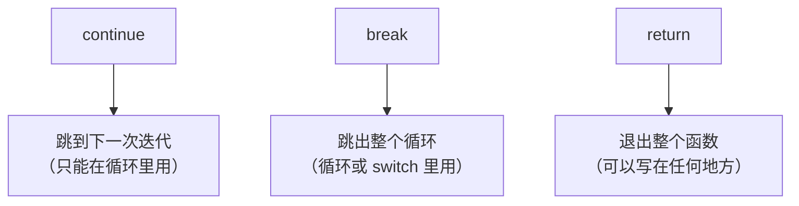
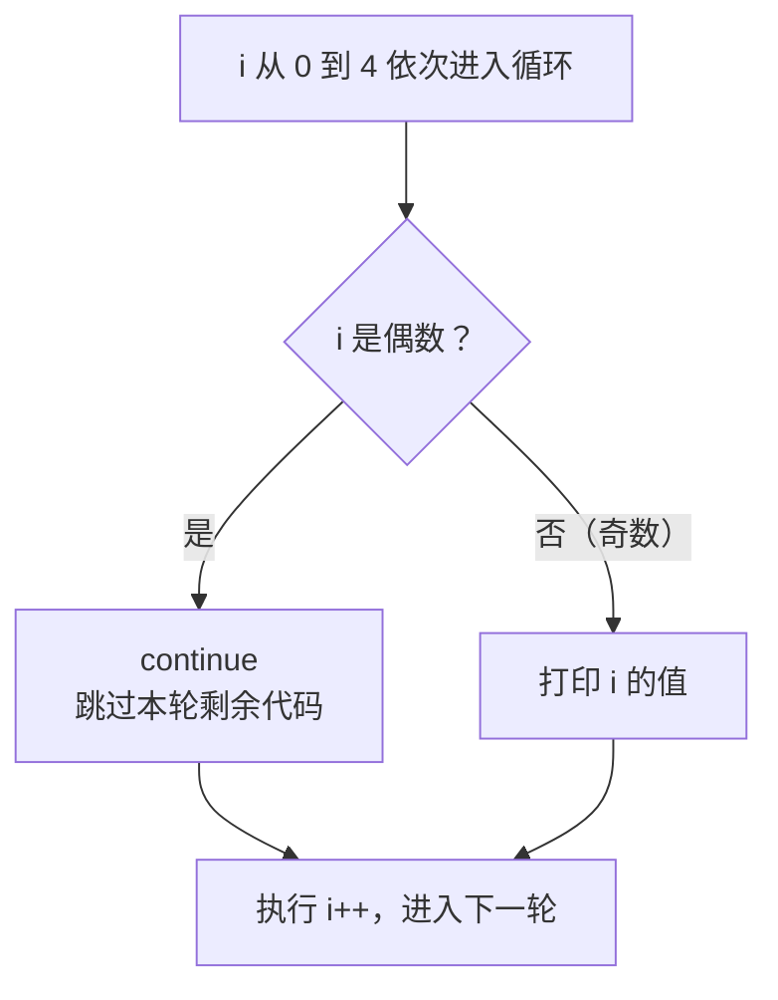
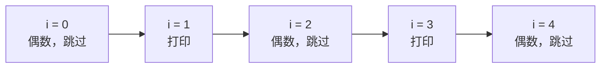
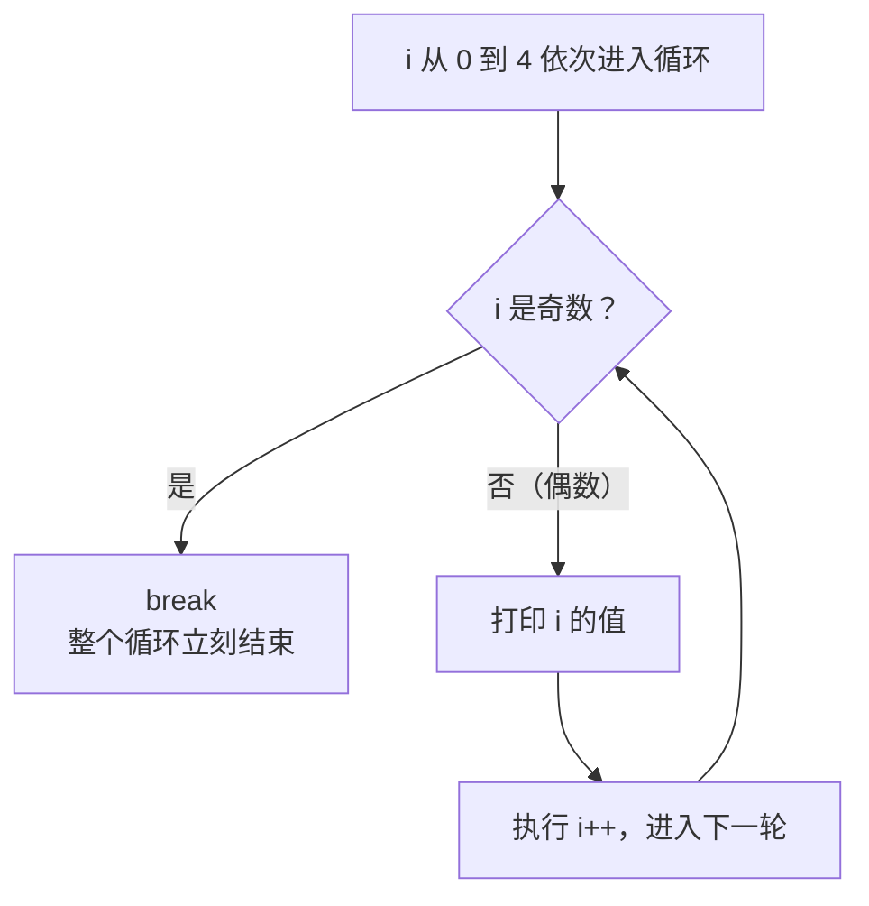
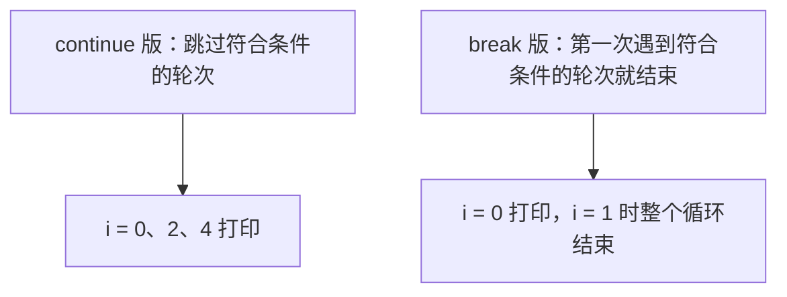
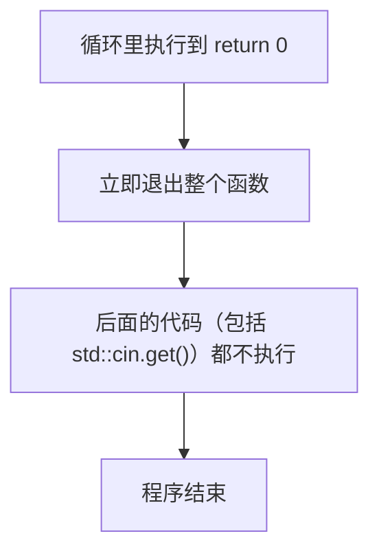
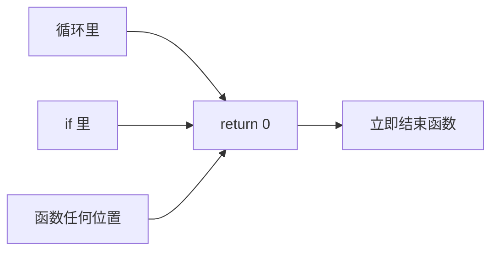
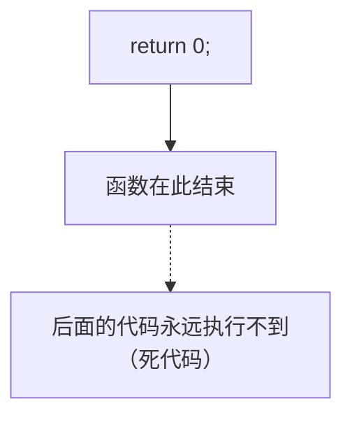

## 本节概述：给循环加"方向盘"

循环能反复执行代码，但有时我们需要**在循环中途改变节奏**：跳过某一轮、提前结束循环、甚至直接退出整个函数。这就是**控制流语句（Control Flow Statement）**——`continue`、`break`、`return`。它们是上一集循环的续篇，三者配合 `if`，构成了控制程序流程的全部工具。



## 三种控制流语句一览

| 语句 | 作用 | 使用位置 |
| --- | --- | --- |
| `continue` | 跳过当前这一轮，进入下一次迭代 | 只能在循环里 |
| `break` | 立刻结束整个循环 | 主要用于循环，也出现在 switch |
| `return` | 直接退出整个函数 | 任何地方都可以 |

> [!NOTE]
> `return` 是三者中最"猛"的：`continue` 和 `break` 只影响所在循环，`return` 直接把整个函数结束掉。另外，需要返回值的函数（如 `int main()`）写 `return` 时必须带上值（`return 0`）；只有 `void` 函数才允许光秃秃地写 `return;`。

## continue：跳到下一轮

`continue` 的意思是"**这轮我不跑了，直接进入下一轮**"。看个例子：只想在 `i` 为奇数时打印：

```cpp
#include <iostream>

int main()
{
    for (int i = 0; i < 5; i++)
    {
        if (i % 2 == 0)      // i 是偶数时
            continue;        // 跳过本轮，直接进入下一轮
        std::cout << "i = " << i << std::endl;
    }
    std::cin.get();
}
```

`i % 2` 是取余运算（`%` 是取余运算符）：偶数除以 2 余 0，奇数余 1。所以 `i % 2 == 0` 表示"i 是偶数"。流程是：



结果：`i = 1` 和 `i = 3` 被打印，偶数的三轮全部被跳过：



换成更直白的条件 `if (i > 2) continue;`：`i = 0、1、2` 正常打印，`i = 3、4` 被跳过。

用调试器观察 `continue` 有个很有意思的细节：当黄色箭头停在 `continue` 上按 F10，它**不会往下走**，而是直接**跳回 for 循环开头**，接着执行 `i++` 和条件检查——这正是"进入下一轮"在底层的样子。

## break：跳出循环

`break` 的意思是"**整个循环到此为止，立刻出去**"。把上面的 `continue` 换成 `break`（条件改为"i 是奇数"）：

```cpp
for (int i = 0; i < 5; i++)
{
    if ((i + 1) % 2 == 0)   // (i + 1) 是偶数，即 i 是奇数时
        break;              // 立刻结束整个循环
    std::cout << "i = " << i << std::endl;
}
```



结果：`i = 0` 打印（0 是偶数，条件不成立）；轮到 `i = 1` 时条件成立，`break` 触发，循环**整体结束**——后面的 `i = 2、3、4` 根本不会轮到。控制流跳出循环后，程序继续执行循环后面的代码（这里是 `std::cin.get()`）。

用同样的条件对比 `continue` 和 `break`，区别一目了然：



> [!TIP]
> `continue` 是"跳过这一轮，循环继续活下去"；`break` 是"循环立刻死掉"。另外，`break` 在 switch 语句里也会用到（讲 switch 时再说），它在所有循环类型（for、while、do-while）里的行为完全一致。

## return：直接退出函数

`return` 最彻底：不管你在循环的第几层、在代码的哪个角落，一碰到 `return`，**整个函数当场结束**。`main` 是"返回整数"的函数，所以要写 `return 0;`：

```cpp
for (int i = 0; i < 5; i++)
{
    if (i == 1)
        return 0;            // 整个函数（也就是程序）到此结束
    std::cout << "i = " << i << std::endl;
}
std::cin.get();
```



结果：`i = 0` 打印，第二次迭代时 `i == 1` 成立，`return 0` 触发，函数（也就是程序）立即结束——连让窗口停住的 `std::cin.get()` 都轮不到，程序窗口会直接关闭。用调试器看：黄色箭头碰到 `return 0` 后，直接跳到函数的右花括号，函数宣告结束。

如果把 `return` 写进 `main` 却不带值，编译会报错"main 必须返回一个值"——因为 `main` 的声明要求返回 `int`，`return` 必须给它一个整数。

## return 不限位置：写在哪都行

`continue` 和 `break` 必须待在循环里，`return` 则**完全不受限制**，可以出现在函数里任何一行：

```cpp
if (5 > 8)
    return 0;      // 条件永远不会成立，所以永远不会执行
```



## 死代码：永远执行不到的代码

甚至不需要 `if`，直接光秃秃地写 `return 0;`——但那之后的所有代码就**永远没机会执行**了，这叫**死代码（Dead Code）**：

```cpp
return 0;
std::cout << "永远不会执行";   // 死代码
```



有些语言和编译器会直接禁止你写这种代码（既然永远执行不到，不如删掉）。写代码时留意：`return` 后面的语句基本都是死代码。

## 编程逻辑的全部工具

回顾一下：`if`/`else` 条件判断、`for`/`while`/`do-while` 循环、加上 `continue`/`break`/`return` 控制流——**这就是编程逻辑的全部工具**，是唯一能改变程序行为（决定"下一行执行哪句代码"）的东西。除此之外想改变程序的走向，就只剩下直接篡改指令指针了——那可不是什么好主意。后续写真正的应用程序时，这三个语句会反复出场。

## 本章小结

**continue**：只能在循环里用，跳过当前这一轮、直接进入下一次迭代；调试时能看到它"跳回循环开头"。

**break**：主要用在循环里（switch 也会用），立刻结束整个循环，跳到循环后面的代码；与 continue 的区别是"结束循环" vs "跳过本轮"。

**return**：最强大的控制流，直接结束整个函数；需要返回值的函数必须带值（`return 0;`），只有 void 函数可以光写 `return;`；不限位置，写在哪都行；`return` 之后的代码是永远不会执行的死代码。

**理念**：条件判断 + 循环 + 控制流语句，就是编程逻辑的全部工具箱。
