## 本节概述：指针就是"存地址的整数"

指针是整个系列里最重要的一集。很多人觉得指针难，其实它简单得惊人：**指针就是一个整数，里面存着一个内存地址**——仅此而已。本集讲的是**裸指针（raw pointer）**，智能指针（smart pointer）以后再说。

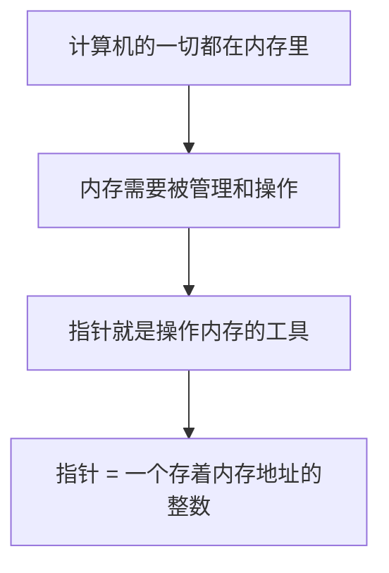

## 内存：计算机的一切

如果要在编程里挑一件最重要的事，那一定是**内存（Memory）**。程序一运行，整个程序就被加载进内存：你写的每一条指令、创建的每一个变量、从磁盘读进来的每一份数据，全都存在内存里。CPU 之所以能执行你的程序，就是因为它能从内存里取到这些指令。

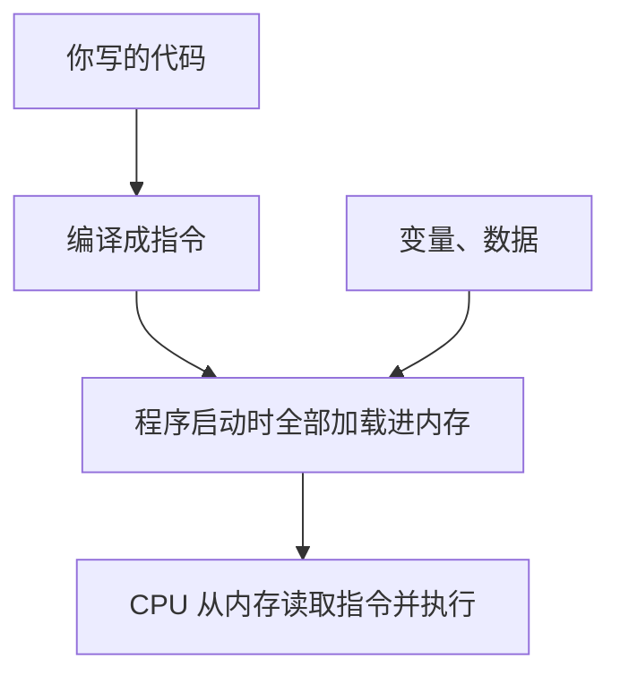

内存可以想象成**一条笔直的大街**：只有一条街，一头是起点、一头是终点，街边排着一列房子，没有对面——它就是一条**一维的线**。


把比喻对应回计算机：

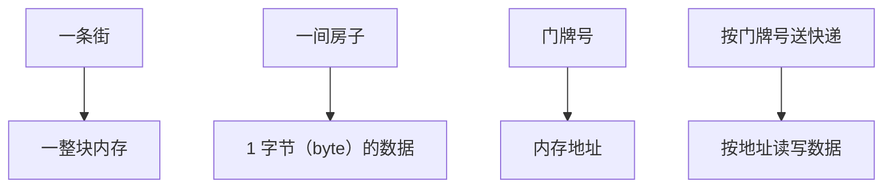

每间房子（每个字节）都有自己的门牌号（地址）。要在内存里读写数据，就必须知道地址——**指针就是那个门牌号**。程序里几乎所有的操作，说到底都是在从内存读、往内存写。

> [!NOTE]
> 完全可以写出一个不用指针的 C++ 程序，指针不是必需品。但内存是计算机能提供给你的最重要的资源，而指针让你对内存有更强的掌控力，所以它是个极有价值的工具。

## 指针的定义：一个存地址的整数

再强调一遍：**指针就是一个整数，存着一个内存地址**。

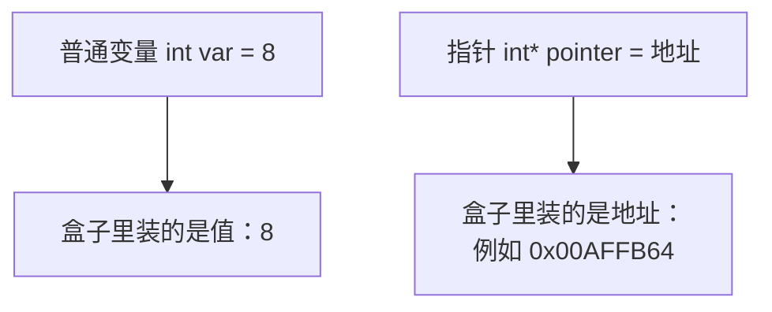

**类型对指针来说毫无意义**。不管你写的是 `int*`、`Entity*` 还是别的什么，指针本身都只是那个存地址的整数。类型是我们为了写代码方便而发明出来的"虚构概念"——它只影响我们怎么解读那块内存，不改变指针的本质。

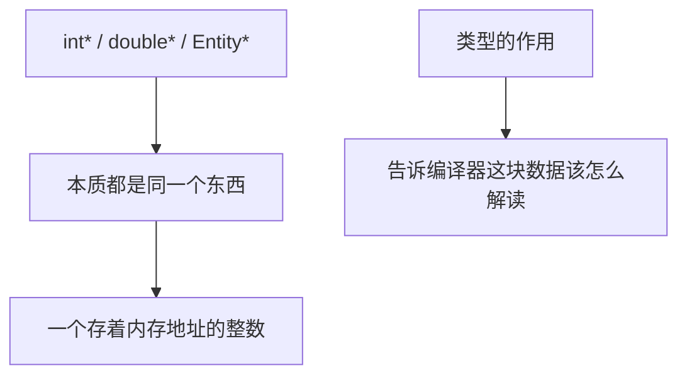

## 空指针：地址 0

先创建"最纯粹的指针"——**void 指针**。`void` 表示完全没有类型，正好对应"指针本来就不需要类型"。

```cpp
void* ptr = 0;
```

这里给指针赋的地址是 **0**。0 并不是一个有效的内存地址——内存地址不会一直排到 0，0 是无效的。所谓"指针无效"，对指针来说是个完全可以接受的状态（它只是暂时不指向任何东西），但**千万别去读写地址 0**，那会让程序直接崩溃。

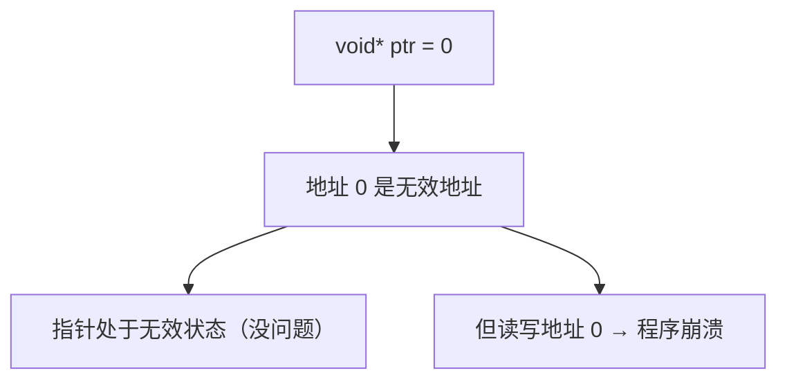

0 表示"空"，下面三种写法是一回事：

| 写法 | 含义 | 说明 |
| --- | --- | --- |
| `0` | 空地址 | 最原始的字面量写法 |
| `NULL` | 空地址 | 本质是一个 `#define` 出来的宏，值就是 0 |
| `nullptr` | 空指针 | C++11 引入的关键字，更推荐 |

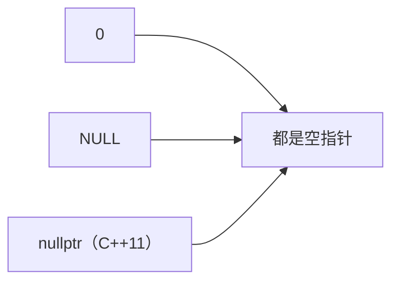

## 取地址：& 运算符

普通变量也住在内存里，也有自己的地址。想拿到它，就在变量前面加一个 **`&`（与号）**——它的意思是"你的地址是多少？"

```cpp
int var = 8;
int* pointer = &var;      // 把 var 的地址存进 pointer
```

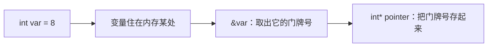

调试时把鼠标悬停在 `var` 上，看到的是它的**值 8**；悬停在 `pointer` 上，看到的是一个**十六进制显示的数字**（比如 `0x00AFFB64`）——它仍然是普普通通的一个数，只是这个数代表的是内存地址。

打开**调试 → 窗口 → 内存 → 内存 1**，把那个地址粘进去回车，就能看到计算机的真实内存：`var` 占 4 个字节，里面存着值 8。

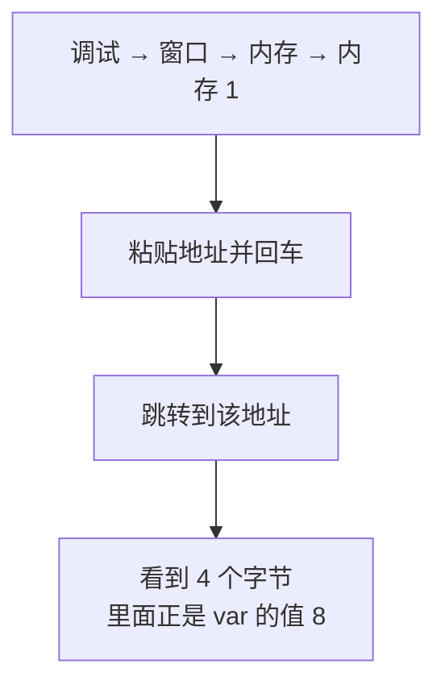

> [!TIP]
> 变量在内存里的排布是"小端序"：一个 `int` 的值 8 存成 4 个字节时，低位字节排在前面，在内存视图里读起来是倒着的。知道有这回事就行，不影响使用。

## 类型不影响指针本身

把 `void*` 改成 `int*`，地址一模一样；就算用类型转换硬改成 `double*`，地址也还是一样，内存里那 4 个字节照样存着 8。

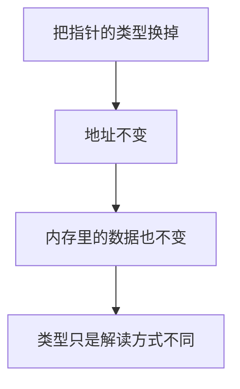

那类型到底有什么用？**它帮编译器知道该读写几个字节**：`int` 是 4 字节，所以往这个地址写值时，编译器就知道要写 4 个字节。类型是"操作内存时的说明书"，而不是指针的组成部分。

## 解引用：* 运算符

现在我们知道数据在哪了，但怎么**访问**它？这就是**解引用（dereference）**：在指针前面加一个 **`*`（星号）**，表示"顺着这个地址，找到那块数据"。

```cpp
int var = 8;
int* pointer = &var;

*pointer = 10;                            // 把 var 的值改成 10
std::cout << var << std::endl;            // 输出 10
```


所以 `var` 的值就从 8 变成了 10。用调试器单步执行 `*pointer = 10;`，内存视图里那个字节会从 `08` 变成 `0a`（十六进制的 0a 就是十进制的 10）。

**为什么不能用 void 指针解引用？** 因为编译器不知道要写几个字节——10 到底是 2 字节的 `short`、4 字节的 `int`，还是 8 字节的 `long long`？类型没告诉它，它就不敢动手：

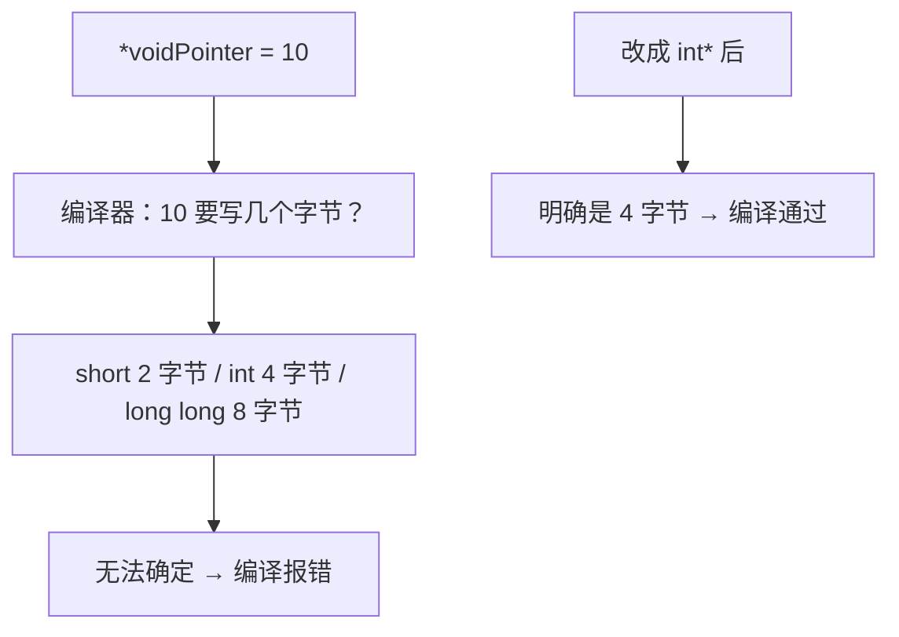

> [!WARNING]
> 如果类型写错了（比如实际是 `int` 却声明成 `double*`），解引用读写时就会按错误的大小操作内存，可能悄悄破坏别的数据。类型必须和真实数据对上。

## 指针自己有多大

指针占几个字节，**取决于程序是 32 位还是 64 位**，跟它指向什么类型无关：

| 程序位数 | 地址位数 | 指针大小 |
| --- | --- | --- |
| 16 位 | 16 位 | 2 字节 |
| 32 位 | 32 位 | 4 字节 |
| 64 位 | 64 位 | 8 字节 |

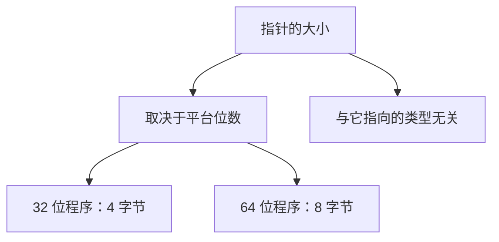

## 一个常见误解：指针不知道内存块有多大

有人说"指针指向一块内存"，这其实**不准确**。指针里只存了一个起始地址，**它完全没有记录这块内存有多大**。

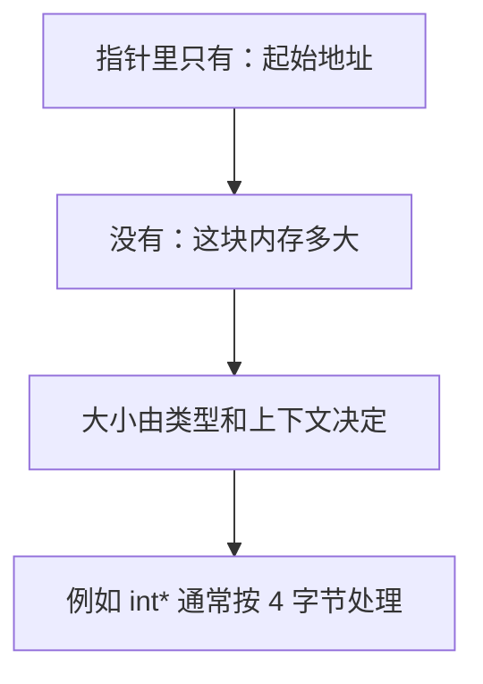

我们现在创建的变量都放在**栈（stack）**上。栈和堆的细节以后专门讲，这里先认识堆的用法。

## 在堆上分配内存：new 与 delete

想要一块自己指定大小的内存，可以用 `new` 向计算机"申请"：

```cpp
char* buffer = new char[8];      // 申请 8 个 char
```

`char` 恰好是 1 字节，所以这行代码申请了 **8 字节**内存，并返回一个**指向这块内存起始位置**的指针。

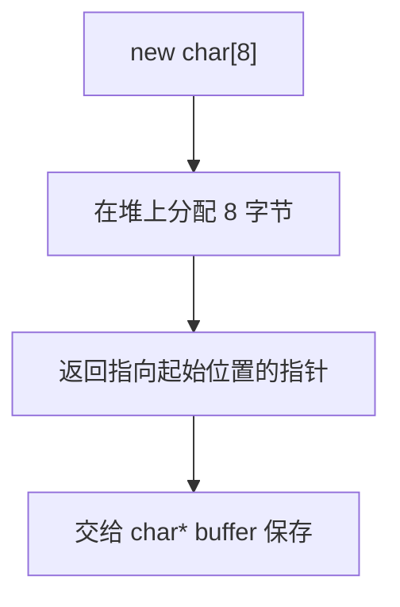

接着用 `memset` 把这 8 个字节全部填成 0：

```cpp
memset(buffer, 0, 8);            // 从 buffer 开始，填 8 个字节，每个填 0
```

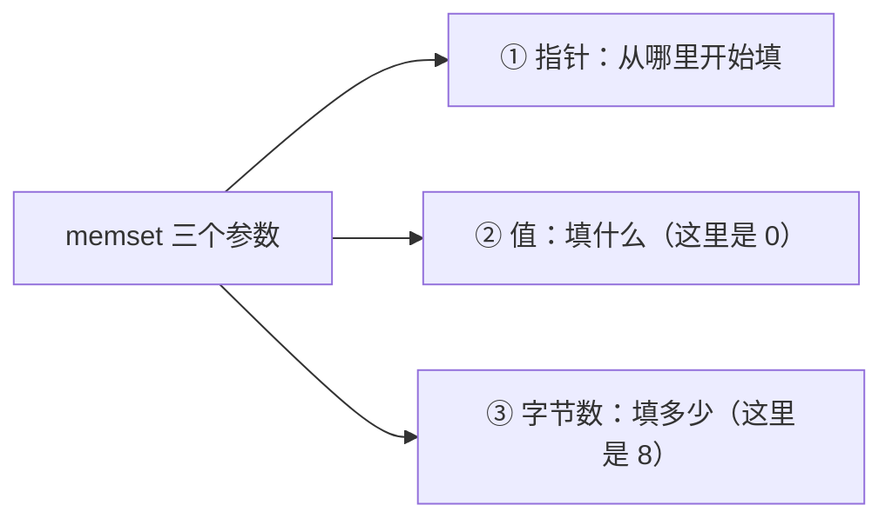

在内存视图里输入 `buffer` 回车，就能看到**连续 8 个字节全是 0**。

堆内存是"借来的"，用完要还——用 `delete` 释放。因为当初是用数组形式 `new char[8]` 申请的，所以要用**数组形式的 delete**：

```cpp
delete[] buffer;                 // 释放整块数组内存
```

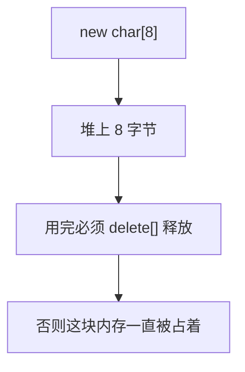

> [!TIP]
> 用 `new[]` 申请的，就要用 `delete[]` 释放；用 `new` 申请的单个对象，用 `delete` 释放。配对错了会出问题。`memset` 需要包含头文件 `<cstring>`。

## 指针的指针（双重指针）

指针本身也是变量，**它也住在内存里、也有地址**。所以我们可以再取一次地址，得到"指向指针的指针"：

```cpp
char** ptr2 = &buffer;           // 一个指向 buffer 这个指针的指针
```


道理就是"往下多走一层"：一层指针存数据的地址，两层指针存"那个存着地址的变量"的地址。

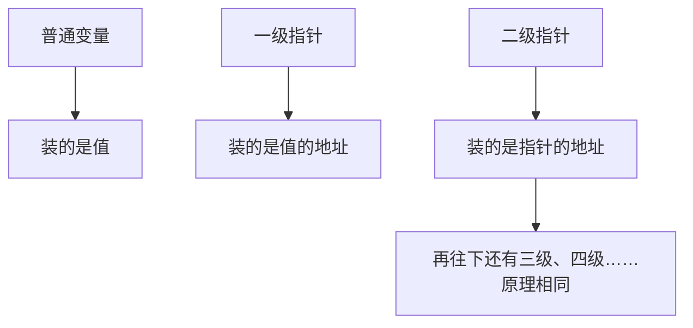

在内存视图里查看双重指针的值，会看到 4 个字节（32 位程序里地址就是 32 位）——因为小端序，这几个字节在视图里是倒着排的，把它们按顺序倒过来拼，就是 `buffer` 所在的地址。回车跳过去，正是那 8 个 0。

## 完整示例代码

```cpp
#include <iostream>
#include <cstring>

int main()
{
    void* ptr = 0;                       // 最纯粹的指针：无类型，地址为 0

    int var = 8;
    int* pointer = &var;                 // 取出 var 的地址，存进指针

    *pointer = 10;                       // 解引用，把 var 改成 10
    std::cout << var << std::endl;       // 输出 10

    char* buffer = new char[8];          // 在堆上申请 8 字节
    memset(buffer, 0, 8);                // 全部填 0

    char** ptr2 = &buffer;               // 指向指针的指针

    delete[] buffer;                     // 释放堆内存

    std::cin.get();
}
```

```mermaid
flowchart TB
    A["void* ptr = 0"] --> B["创建一个无效指针"]
    B --> C["int* pointer = &var"]
    C --> D["*pointer = 10 改写 var"]
    D --> E["new char[8] 申请堆内存"]
    E --> F["memset 填 0"]
    F --> G["delete[] 释放"]
```

## 本章小结

**内存是一切的根本**：程序、指令、变量、数据全都在内存里，内存可以想象成一条排满"字节房子"的直线，每间房子有一个地址。

**指针的本质**：一个整数，存着一个内存地址。类型对指针毫无影响——类型只是给编译器看的"解读说明书"，用来决定读写几个字节。

**空指针**：地址 0 是无效地址，代表"不指向任何东西"；`0`、`NULL`、`nullptr`（C++11）三种写法等价。

**取地址与解引用**：`&变量` 取出地址，`*指针` 顺着地址读写数据；void 指针因为不知道大小，无法直接解引用写入。

**指针的大小**：由程序位数决定（32 位程序 4 字节，64 位程序 8 字节），与指向的类型无关。

**指针不含大小信息**："指向一块内存"的说法并不准确，指针只记起始地址，不记这块内存有多大。

**堆内存**：`new char[8]` 申请 8 字节并返回起始指针，`memset` 填充，用完必须 `delete[]` 释放。

**指针的指针**：指针自己也是变量、也住在内存里，所以可以取它的地址得到二级指针，本质上只是"往下多走一层"。