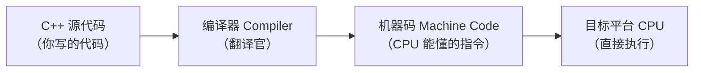
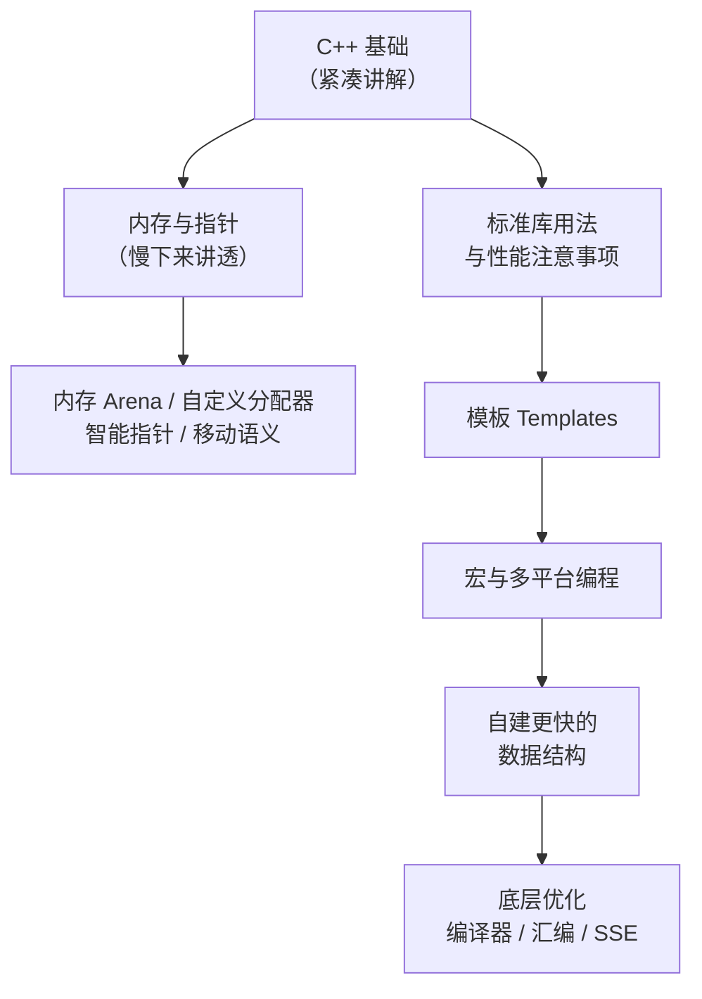

课程链接：视频《Welcome to C++》（The Cherno C++ 系列 第 1 集）

YouTube 链接：

## 这套课程讲什么

这是 TheCherno 全新的一期视频系列，目标是系统性地学会 C++。整套课程以**游戏开发**为背景来讲解，但学到的知识并不局限于游戏，游戏在这里只是作为例子，让大家更容易理解"为什么要这么做"。

这套系列面向所有人，**完全没有编程经验的零基础新人也可以跟**。不过需要注意的是：基础部分讲得比较紧凑、概括，不会逐字逐句展开。所以如果遇到完全不懂的概念，最正常的做法就是——像普通人一样打开搜索引擎去查。学习新东西的关键是**亲自动手做实验**，有热情和意愿，跟着这套课就不会有问题。

## 为什么要学 C++

很多人会问：C++ 是不是过时了？现在学它还有什么用？答案很直接：**在追求代码速度和效率的领域，C++ 依然是被用得最多的语言**。

它尤其适合两类场景：一是需要写出快速、高效代码的场景；二是面向非常特殊的硬件平台编程的场景。只要你想**直接掌控硬件**，C++ 就是正确的选择。以游戏行业为例，C++ 几乎一家独大，主流游戏引擎如 Unity、Unreal、Frostbite 都是用 C++ 写的。

> [!NOTE]
> **为什么引擎要选 C++？** 因为游戏对性能极其敏感，而 C++ 能把控制权直接下放到 CPU 指令层面，这是很多现代高级语言做不到的。

## C++ 的运行流程：从源码到机器码

理解 C++ 的关键在于搞清楚它"怎么干活"：你写的是 C++ 源代码，把代码交给**编译器**（compiler），编译器把它翻译成**机器码**（machine code）——即目标平台 CPU 真正能执行的那些指令。正因为如此，用 C++ 你可以**精确控制 CPU 执行的每一条指令**。

## 平台支持：几乎无处不在

C++ 能跑在什么平台上？**原则上哪里都能跑**——前提是存在一个能为该平台生成机器码的编译器。比如 x64 编译器会生成 x64 机器码，这个代码就跑在 x64 的 CPU 上。一个平台上只有对应的编译器，C++ 就能被转换成这个平台的原生代码。

常见的 C++ 目标平台包括：Windows、Mac、Linux 等桌面操作系统，iOS、Android 等移动操作系统，以及几乎全部游戏主机——Xbox、PlayStation，还有任天堂系设备（3DS、Wii U、Switch）。如果希望一套代码支持众多平台，C++ 是很出色的选择。

## 原生代码与虚拟机：C++ 和 Java / C# 的本质区别

还有其他"原生"（native）语言存在，但 C++ 从 80 年代早期诞生至今，流行程度无人可比。与 C#、Java 这类语言的本质区别在于：**C# 和 Java 的程序跑在"虚拟机"上**。你的代码先被编译成一种"中间语言"，等程序真正在目标平台运行时，虚拟机（virtual machine，VM）再把中间语言实时翻译成机器码。

视频里用了一个生动的比喻：假设你写了一本英文书，希望只会德语的德国读者也能读。方案一是把英文书卖给德国人，并附送一位"真人翻译官"——他现场读英文、同步说德语（这就是虚拟机的工作方式：运行时分步翻译）；方案二是直接把书翻译成德语再出版（这就是原生代码：从一开始就在目标语言里了）。

C++ 编译器直接产出特定平台的机器码，代码本身已经处在目标平台的机器语言形态中，**之后完全没有二次翻译**，相当于直接把指令"塞"给 CPU 执行。代价是：这样生成的代码只在这个平台运行。

## 重要提醒：原生代码 ≠ 快速代码

必须纠正一个误区：**"原生"并不等于"快"**。如果写得不好，C++ 代码执行起来可能很慢，甚至比有虚拟机的 C#、Java 还慢——因为虚拟机往往更擅长做运行时优化。换句话说，如果写 C++ 写得很糟，性能大概率不如 C# 或 Java。

这也解释了作者的偏好：当只是想快速写一个工具或普通程序、不追求榨干每一分性能时，C# 就是很好的选择；而本系列关注的是**真正需要性能的场景**——这正是 C++ 的用武之地，所以课程会教如何正确使用 C++、写出又快又好的代码。

> [!WARNING]
> 不要以为"用 C++ = 自动变快"。性能来自对语言的理解和正确的用法，而不是语言本身。

## 系列课程将覆盖的内容

这门课从头到尾的路线大致如下：

先紧凑地讲完**基础部分**，然后讲解如何利用 **C++ 标准库**，以及想保证性能时应避免哪些做法。接着深入 C++ 的"内部世界"：**内存与指针**——作者坦言这是多数教程讲得最差的部分，本课会慢下来认真讲透；还包括**内存 Arena（内存区域）**、**自定义分配器**、**智能指针**、**移动语义**等内容。然后是**模板**，用对了它威力极大，能让开发省力得多。之后是**宏**、**多平台编程**，并会动手**编写自己的数据结构**，目标是比标准库里的更快的速度。最后进入**底层优化**：从编译器和汇编层面做优化，例如配合 SSE 指令集优化数学函数。

> [!TIP]
> 学习建议：知识消化需要动手实验，卡住的点即时搜索。如果某个主题大家呼声很高，作者也会单独出一期深度视频。

## 关于作者 TheCherno

作者是 EA 墨尔本工作室**游戏引擎团队的软件开发者**，参与制作目前业内顶尖的移动端 3D 引擎之一，代表作是《Need for Speed：No Limits》及其 VR 版。本系列视频大约每周更新一期，支持渠道为 Patreon（patreon.com/TheCherno）。

## 本章小结

这一集是系列的导论，不需要写任何代码，但奠定了全局认知：

**其一**，C++ 因"可直接控制硬件"和"性能极致"两大特性，在游戏行业等领域地位不可撼动；主流游戏引擎全部由 C++ 编写。

**其二**，理解 C++ 的运行时机制：源代码经由编译器利润成目标平台的机器码，CPU 直接执行，没有二次翻译。

**其三**，与 Java / C# 的最大区别不在"语言好不好写"，而在执行模型——后者靠虚拟机在运行时逐段翻译中间语言，C++ 则一次编译到位；但原生代码不代表性能优秀，写不好的 C++ 甚至比虚拟机构架更慢。

**其四**，本系列路线：基础 → 标准库与性能 → 内存与指针 → 模板 → 宏与跨平台 → 自建数据结构 → 底层优化（汇编 / SSE），值得期待，也需要亲自动手实验配合学习。