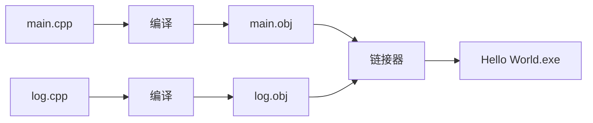
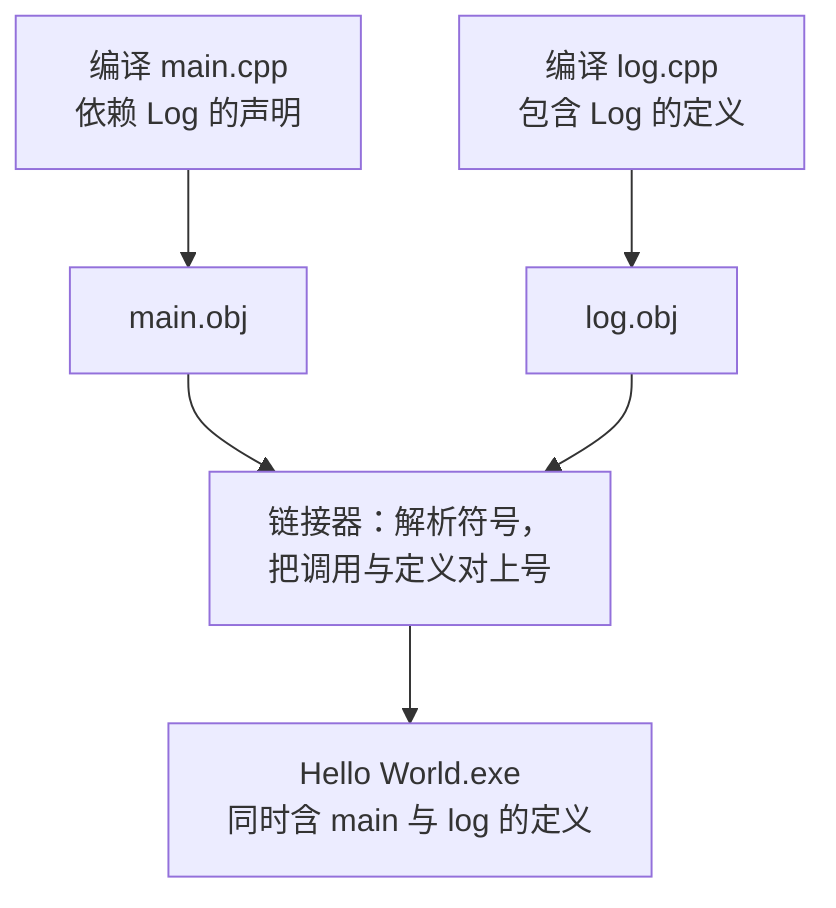

课程链接：视频《How C++ Works》（The Cherno C++ 系列 第 5 集）

YouTube 链接：（留空）

## 本节概述：从源码到可执行文件

本集讲解 C++ 程序的核心工作流：从**源代码文件**（纯文本文件）到**可执行二进制文件**（我们能运行的程序）之间发生了什么。整个过程分几步完成：


编译出来的二进制既可以是库，也可以是可执行程序，本集只讨论**可执行程序**。下面结合我们之前写的 Hello World 项目逐步拆解。

## 回顾源码：main.cpp 里发生了什么

```cpp
#include <iostream>

int main()
{
    std::cout << "Hello World!" << std::endl;
    std::cin.get();
}
```

这个看似简单的程序里其实藏着不少门道，我们从第一行开始看。

## 预处理器语句：#include 是什么

所有以 **#** 开头的语句叫**预处理器语句**（Preprocessor Statement）。编译器拿到源文件后，**第一件事就是预处理**这些语句——它们在真正编译之前执行，因此得名"预处理"。

本程序中的 `#include <iostream>` 的作用是：找到名为 `iostream` 的文件，把它的**全部内容复制粘贴到当前文件**。这类被包含的文件通常叫**头文件**（Header File）。我们包含 iostream，是因为需要拿到 `std::cout` 这个输出流对象的**声明**——它让我们能把文字打印到控制台。

> [!NOTE]
> 头文件的具体机制后续会专题深入，现在只要知道"include 就是把别人的内容粘贴进来"即可。

## 入口点：main 函数

每个 C++ 程序都有一个类似这样的 **main 函数**，它是整个应用的**入口点（Entry Point）**：运行程序时，计算机从 main 函数的第一行开始执行代码。程序执行时**逐行执行**我们写的代码（控制流语句和函数调用会改变执行顺序，但总体是逐行推进）。

所以流程是：先执行 `std::cout << "Hello World!"`，再执行 `std::cin.get()`，main 里没有其他代码了，程序随之终止。

**一个特殊之处**：main 的返回类型是 `int`，但我们并没有 `return` 任何整数——这是因为 main 是个特殊情况，**不写 return 时会被自动认为是返回 0**（代表程序成功执行）。这个放宽只对 main 函数有效。

## 理解那行奇怪的语法：运算符其实就是函数

```cpp
std::cout << "Hello World!" << std::endl;
```

对新手来说，`<<` 看着很像位运算左移，容易困惑。关键认知是：**运算符本质上就是函数**，这里 `<<` 是重载后的运算符，可以把它想成 `cout.print("Hello World!")` 这样的函数调用。

所以这行代码的实际含义是：把 `"Hello World!"` 这个字符串**推入 std::cout**，从而打印到控制台；再推入 `std::endl`，它的作用是**换一行，并立刻把刚才输出的内容真正显示出来**。

而 `std::cin.get()` 会**一直等待，直到我们按下回车键**才继续下一行代码。而下一行什么都没有——于是函数结束，返回 0，程序成功终止。

## 编译阶段：把 C++ 代码变成机器码

预处理器语句处理完后，文件进入**编译**阶段：编译器把全部 C++ 代码转换成目标平台 CPU 能执行的**机器码**。有几个设置决定了编译如何进行，对应 Visual Studio 顶部的两个下拉框：

**解决方案配置（Solution Configuration）**：一套应用于项目构建的**规则集合**。新项目默认有两个：Debug 和 Release。

**解决方案平台（Solution Platform）**：本次编译**面向的目标平台**。默认是 x86 或 Win32（两者其实是一回事），也可选 x64。x86 就是生成 32 位 Windows 程序。若工程面向多平台，这里甚至可以出现 Android 等选项——想在哪平台上构建、部署、调试，就把平台切到哪。

**项目属性页**（右键项目 → 属性）里定义的就是各配置/平台使用的具体规则。注意两个坑：

> [!WARNING]
> 修改属性前，先确认顶部**配置和平台**切换到了你真正在用的那一个（例如明明在调 Debug，属性却显示 Release，那么所有修改都不会生效——作者本人踩过几次这样的坑）。

属性页里几个关键点：**配置类型**（Configuration Type）显示为"应用程序 (.exe)"，即编译器最终产出的二进制类型，要 .exe 就保持它；**C/C++** 分类下还有包含目录、优化、代码生成、预处理器定义等大量设置——默认配置已经很合理，本课程暂不需要改动。

一个最有代表性的对比在**优化（Optimization）**选项：Release 配置下默认是"最大化速度"，而 Debug 下是"已禁用"。这正是 **Debug 模式默认比 Release 慢很多**的原因——关闭优化是为了方便调试定位问题，只是以后会发现这个代价值得。

## 每个 .cpp 单独编译：头文件不参与编译

项目里**每个 .cpp 文件都会独立编译**，而头文件本身并不参与编译——头文件是通过 `#include` 预处理器语句粘贴进 .cpp 文件后，随 .cpp 一起被编译的。



每个 .cpp 文件编译后产出一个**对象文件**，Visual Studio 编译器下扩展名为 **.obj**（源码有多少个 .cpp，就有多少个 .obj）。

## 链接器：把对象文件缝合成一个 .exe

有了众多 .obj 文件后，需要某种方式把它们**拼合成一个 .exe**——这就是**链接器（Linker）**的工作：取走所有 .obj 文件，把它们缝合到一起。链接器相关的设置在项目属性页的"链接器"选项卡下。链接的具体机制很复杂，后续有专门视频深讲。

## 实操：单独编译与看待错误

在 Visual Studio 中，**Ctrl+F7 只编译当前单个文件**（不触发链接）；也可以右键工具栏在"生成"菜单下自定义添加"编译"按钮。

做实验：故意在代码里漏掉一个分号再编译，就会得到语法错误。Visual Studio 呈现错误有两种方式——**错误列表窗口**和**输出窗口**：

> [!WARNING]
> 错误列表基本没用。它只是扫描输出窗口、抓取"error"字样的信息拼凑出来的，经常缺失信息。**想看完整、可靠的信息请盯输出窗口**——本系列后续都会以输出窗口为准。

错误信息会告诉你错误出现在第几行、例如"语法错误：花括号前缺少分号"。**双击错误行可以直接跳转到源码出错位置**。修正后重新编译即可。单独编译单个文件时不会调用链接器，所以也没有链接步骤。

编译成功后，到项目目录下会看到：对象文件 main.obj 在项目的 Debug 文件夹里（每个源文件一个）；而整个**构建项目**（Build 整个项目，而非单个文件）后，Hello World.exe 才出现在解决方案的 Debug 目录下。

## 多文件工程：声明与定义

接下来演示多文件的情况。假设不想直接调 std::cout 打印，而是想用自己的打印函数 Log，再让 Log 内部包装 cout：

```cpp
// main.cpp
#include <iostream>

void Log(const char* message)
{
    std::cout << message << std::endl;
}

int main()
{
    Log("Hello World!");
    std::cin.get();
}
```

`const char*`（字符指针）暂时不用深究，本集只需要知道它是**能装一段文本的类型**。程序运行正常——第一个函数写好了。

现在想把 Log 函数挪到单独文件 log.cpp，保持 main.cpp 干净整洁。剪切粘贴后编译 log.cpp，却报错"cout 不是 std 的成员"，原因很简单：**log.cpp 里没有包含 iostream，我们没有给出 cout 的声明**。补上 `#include <iostream>` 后，log.cpp 编译通过。

回到 main.cpp 调用 Log，又报错：**log 未找到**——因为每个文件是独立编译的，main.cpp 根本不知道别的文件里有个 Log 函数。解决办法是给 main.cpp 一个**声明（Declaration）**：

```cpp
void Log(const char* message);   // 声明：告诉编译器存在这个函数
```

**声明（Declaration）**：一句"这个函数存在"的话，没有函数体，末尾用分号结束。它像一个**承诺**——编译器无条件相信你，因为它并不负责查证 Log 实际定义在哪（参数名甚至可以省略，不过写上更易读）。

**定义（Definition）**：不仅声明了函数，还给出了**函数体**，即调用它时实际执行的代码。

```cpp
void Log(const char* message)    // 定义：带函数体
{
    std::cout << message << std::endl;
}
```

于是 main.cpp 的编译通过了——当然，编译器此时只是"信任"你。真正把 main 里的 Log 调用和 log.cpp 里的 Log 定义**对上号**的，是链接器：整个构建项目时，链接器会找到 Log 的定义，并把调用点"接线"上去。

## 链接错误：看似吓人，其实信息完整

如果定义没找到，就会得到**链接错误**。把 log.cpp 里函数名改成 Logger 试试：单独编译 main.cpp 完全没报错（编译器信任声明），但**整个构建项目**时，输出窗口出现一条看起来很吓人的错误——它包含函数签名等大量额外信息，因此显得长。核心信息其实是：**有未解析的外部符号（unresolved external symbol）**——即链接器无法把这个符号解析到某个定义，找不到一个叫 log 的实体函数体。修复方式就是给 Log 提供定义（函数体），在哪一文件都行，只要存在。



> [!NOTE]
> **编译错误 vs 链接错误**：编译错误发生在单个文件的语法/声明层面；链接错误发生在最后拼装阶段，常见于"某个被调用的函数没有定义"。

## 本章小结

本集把 C++ 的"生产过程"完整走了一遍，核心是一条流水线和两个阶段：

**流水线**：源文件 → 预处理器（处理 #include 等）→ 编译器（C++ 转机器码，每个 .cpp 独立产出 .obj）→ 链接器（拼接所有 .obj 为一个 .exe）。

**预处理器**：#include 把目标文件（头文件）内容直接复制粘贴进当前文件；所有 # 开头的语句在编译前执行。

**入口点**：main 函数是程序入口，代码逐行执行；main 的 int 返回类型是特例，不写 return 默认返回 0。

**运算符即函数**：std::cout << 本质是函数调用，把字符串推入 cout 打屏；std::cin.get() 等待回车；std::endl 换行。

**Debug / Release 差异**：配置是一套构建规则，平台是目标平台；Debug 关闭优化（便于调试）所以比 Release 慢。

**声明与定义**：声明是"我承诺存在"、无函数体；定义才含函数体。编译器按声明放行，链接器负责把调用解析到定义，找不到就是"未解析外部符号"的链接错误。

**经验法则**：看错误以输出窗口为准；单个文件用 Ctrl+F7 编译，整个项目用"生成"；每个 .cpp 一个 .obj，链接器最终拼出可执行文件。