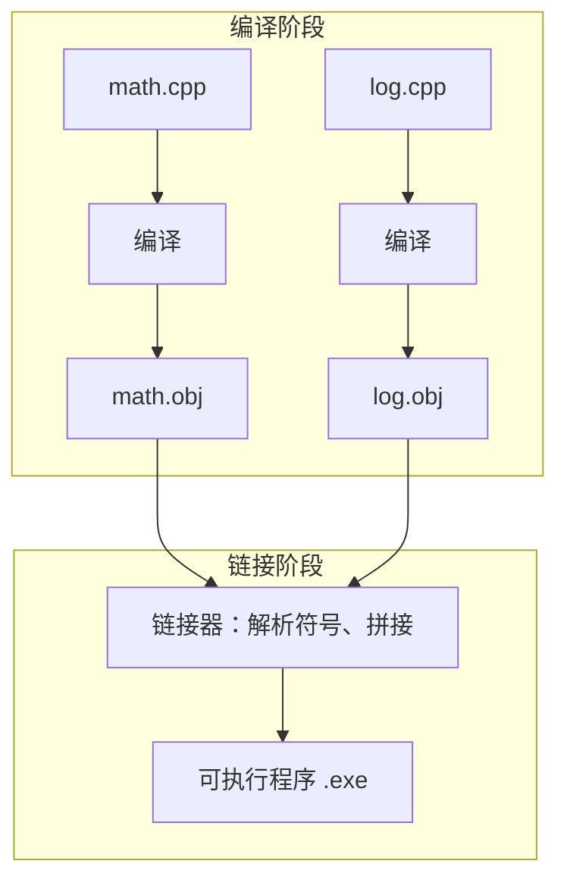
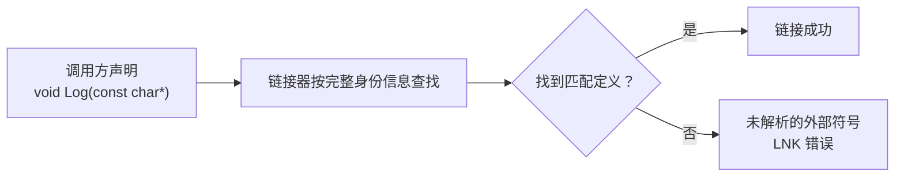

课程链接：视频《How the C++ Linker Works》（The Cherno C++ 系列 第 7 集）

YouTube 链接：（留空）

## 本节概述：链接器到底在做什么

从源文件到可执行二进制要经过两个阶段：**编译（Compiling）**和**链接（Linking）**。编译阶段每个 .cpp 文件都会被独立编译成一个对象文件（翻译单元），这些对象文件之间**互不相关、无法直接交互**。而链接阶段的核心任务就是：**找到每个符号（函数/变量）的位置，把它们链接在一起**，把分散的多个 .obj 拼成一个大程序。



> [!NOTE]
> **为什么单文件程序也需要链接？** 即使全部代码写在一个文件里、没有任何外部文件，程序运行时也需要知道**入口点（Entry Point）**在哪里——也就是 main 函数的位置。C 运行时库会"跳转到 main 并从这里开始执行"。所以链接 main、确定入口点这件事永远绕不开。

## 区分两类错误：编译错误与链接错误

Visual Studio 中两个操作能帮你区分两个阶段：**Ctrl+F7（编译当前文件）只编译、绝不链接**；而**生成（Build）或 F5（运行）则会编译 + 链接**。

关键技巧是看**错误代码**：

> [!WARNING]
> - **编译错误**：错误代码以 **C** 开头（Compiler），例如 `C2143 语法错误`（少了分号这类，由编译器报告）。
> - **链接错误**：错误代码以 **LNK** 开头（Link），例如 `LNKxxxx`，说明问题发生在链接阶段。
> 针对不同阶段诊断方向完全不同，先分清是哪种错误再去修。

## 常见链接错误一：入口点未定义（Entry Point Not Defined）

写一个只有 Multiply 和 Log 函数、**没有 main 函数**的项目，这是否算一个完整的应用？单独编译（Ctrl+F7）没有任何问题——能正常生成 math.obj；但**生成整个项目**时报错：**入口点必须定义**。原因：项目配置类型是"应用程序 (.exe)"，而每个 exe 都必须有入口点。

注意：**入口点不一定是 main 函数**。在"属性 → 链接器 → 高级"里可以自定义入口点，只是绝大多数项目都用 main。补上 main 函数后，项目成功生成 exe。

完整最小示例（math.cpp + 新增 main）：

```cpp
#include <iostream>

void Log(const char* message)
{
    std::cout << message << std::endl;
}

int Multiply(int a, int b)
{
    Log("Multiply");
    return a * b;
}

int main()
{
    std::cout << Multiply(5, 8) << std::endl;
    std::cin.get();
}
```

运行后控制台依次打印 "Multiply" 和 40。

## 常见链接错误二：未解析的外部符号（Unresolved External Symbol）

现在把 Log 函数从 math.cpp 移到独立的 log.cpp 文件，math.cpp 里只保留一行**声明**：

```cpp
void Log(const char* message);   // math.cpp 中的声明

int Multiply(int a, int b)
{
    Log("Multiply");
    return a * b;
}
```

```cpp
#include <iostream>

void Log(const char* message)    // log.cpp 中的定义
{
    std::cout << message << std::endl;
}
```

单独编译 math.cpp 完全通过——编译器只凭声明就信任有 Log 存在；链接器才负责实际找到 Log 的定义并接线。现在故意搞破坏：把 log.cpp 里函数名改为 **Logger**。单独编译 math.cpp 依旧通过，但**生成项目**时报 **LNK 未解析的外部符号**，错误信息会精确指出：缺少的符号是 log、它在哪里被引用（在 multiply 函数里）。

**两个反直觉的实验**能帮你真正理解链接器的"死脑筋"：

**实验一**：把 math.cpp 里对 Log 的调用注释掉 → 生成成功，无链接错误。因为根本没调用，链接器无需接线。

**实验二**：恢复 Log 调用，但把 main 里对 Multiply 的调用注释掉 → **仍然报链接错误**！你可能会想："Multiply 都没人用，是死代码，为啥还链接？" 因为链接器不知道**其他文件是否会在别处调用 Multiply**，它必须保守地把链接工作做完。除非有办法告诉链接器"这函数只在本文件用"——确实有，用 **static 修饰**。

## static：把符号限定在单个文件内

在 Multiply 前加上 **static**，含义是：该函数**只为此翻译单元（本 .cpp 文件）声明**，其链接范围被限制为内部。此时若 Multiply 从未在本文件内被调用，生成项目便不再报链接错误——因为链接器确认它没有对外需求的可能。

## 函数链接认的不是名字，而是完整签名

修改 log.cpp 里的 Log，把返回类型从 void 改成 int（内部返回 0）→ 生成报链接错误。因为 math.cpp 里声明的是"返回 void 的 log"。链接器找人时认的不是光秃秃的名字，而是这个函数**完整的“身份信息”**：在本项目用的 MSVC 编译器里，这份身份信息包含**返回类型 + 函数名 + 参数列表**（还有调用约定），任何一样对不上都算“查无此人”。

再给它加第二个参数 level → 同样报链接错误，信息会精确描述它期待的函数：返回 void、名为 log、只有一个 const char* 参数。恢复原状，程序又能链接通过。

> [!NOTE]
> 这里有个容易混的小细节：C++ 语言里判断两个函数是不是同一个（也就是能不能“重载”），只看**函数名和参数列表**，是不看返回类型的；但 MSVC 编译器在给函数起那个唯一“链接全名”时，却把返回类型也编了进去。所以本例里改返回类型照样会导致链接对不上。



> [!NOTE]
> 链接错误信息虽然长，但信息量很足：它告诉你具体是哪个符号、期待的签名是什么、在哪个函数里引用的。读懂 LNK 错误 = 解决一半问题。

## 常见链接错误三：重复符号（Duplicate Symbols）

两个**同签名**的函数（同名、同返回、同参数）同时存在，链接器不知道该连哪一个，报错"重复定义"。

先看一个**编译器能当场抓住**的情况：在同一文件里复制粘贴两份 Log 定义 → 编译错误，因为编译器看到同一个文件里有两个带函数体的同名函数，直接拒绝。

再来一个**链接器才抓得住**的：把第二份 Log 定义放到 math.cpp 里 → 单独编译 math.cpp（这里只有声明 + 一份定义）没问题；但生成整个项目时报 LNK 错误："log 已在 log.obj 中定义……找到一个或多个多重定义的符号"。链接器面对两个 Log 定义：math.obj 里的这份和 log.obj 里的那份，无法抉择。

## 头文件引发的重复符号：最隐蔽的坑

更隐蔽的触发方式——把 Log 的**定义**放进头文件 log.h，然后 math.cpp 和 log.cpp 都 `#include "log.h"`。请看代码都没有问题：明明只有一份定义！为什么报重复符号？

> [!WARNING]
> 根源在 **#include 的复制粘贴语义**：include 头文件 = 把文件内容原样贴进当前文件。于是 Log 的定义被复制成了两份——一份展开进 math.cpp、一份展开进 log.cpp（分别加进两个翻译单元），链接器看到两个同名定义，必然报错。

**三种修复方式**：

**方式一：加 static**——把符号链接改为内部链接，log.cpp 和 math.cpp 各自持有自己的 Log 副本，互相看不到对方，无冲突。

**方式二：加 inline**——inline 的大白话是“**允许多个地方各留一份拷贝，合并成一份，别当重复报错**”。把函数标成 inline，等于告诉链接器：这个函数可能会出现在好几个翻译单元里，它们其实是同一份，请把它们合并起来，不要报“重复定义”。这样一来，就算 log.h 里的定义被 include 进两个文件，也不会再冲突了。（顺带一提，inline 还有一层“建议编译器把函数体直接展开到调用处”的意思，但那是优化行为、不保证发生，跟这里解决重复定义是两码事。）

**方式三（推荐）**：**把定义移进唯一一个翻译单元，头文件只留声明**。因为错误的本质是同一个定义被 include 进两个翻译单元。既然它与日志相关，就把定义放进 log.cpp，log.h 里只保留形如 `void Log(const char* message);` 的声明，其他文件包含头文件仅获得声明，定义全局唯一：

```cpp
// log.h —— 只放声明
void Log(const char* message);
```

```cpp
// log.cpp —— 唯一定义处
#include <iostream>
#include "log.h"

void Log(const char* message)
{
    std::cout << message << std::endl;
}
```

## 链接器还会拉入什么：超出想象的链接来源

链接不只是拼接你自己项目的 .obj。当你的程序用到外部库时，链接器还会把**所依赖的库**一并拉进来，例如：C 运行时库、C++ 标准库、平台 API 等。链接的来源非常多元。另外链接还有**静态链接**与**动态链接**两种形式，属于后续视频的主题。

## 本章小结

本集补全了"源码 → 可执行程序"流水线的第二半程——链接：

**链接器职责**：把编译产出的所有 .obj 符号解析并拼接成一个大程序，同时拉入依赖的库（C 运行时、C++ 标准库、平台 API 等）；即使单文件程序也需要它确定入口点（main）。

**三类典型链接错误**：
① 入口点未定义（缺 main，或可自定义入口点）；
② 未解析外部符号（声明了但找不到定义，LNK 错误信息会精确指出符号与引用位置）；
③ 重复符号（两个同签名定义，链接器无法抉择）。

**关键认知**：
- 编译只按声明放行，**链接才做实际接线**——所以"编译通过 ≠ 能链接通过"。
- 链接器按**完整签名**（返回类型/函数名/参数/调用约定）匹配，不只是名字。
- 链接器绝不主动删"没用到的函数"（除非 static 声明限定在文件内）——死代码也会被链接。
- **头文件 + #include 会把同一定义复制进多个翻译单元**，是重复符号的隐蔽来源；正确姿势是头文件只放声明，定义放到唯一一个 .cpp 中。

至此，编译与链接两半管道彻底清晰，下一阶段可以安心进入真正的 C++ 语法学习。