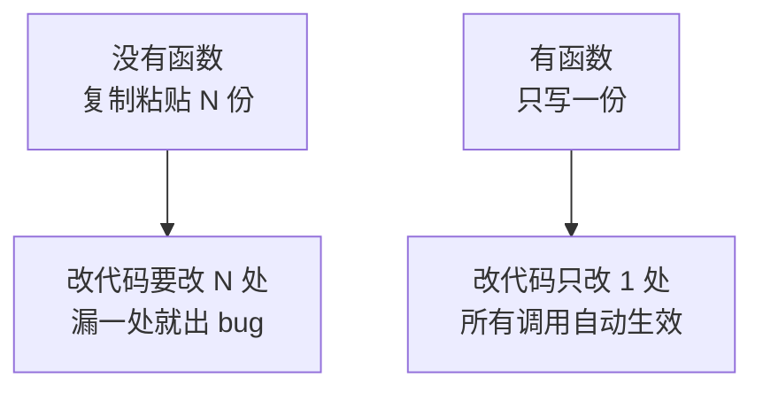
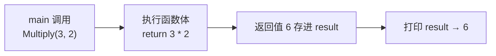
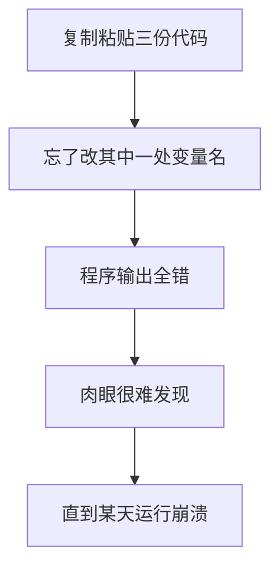
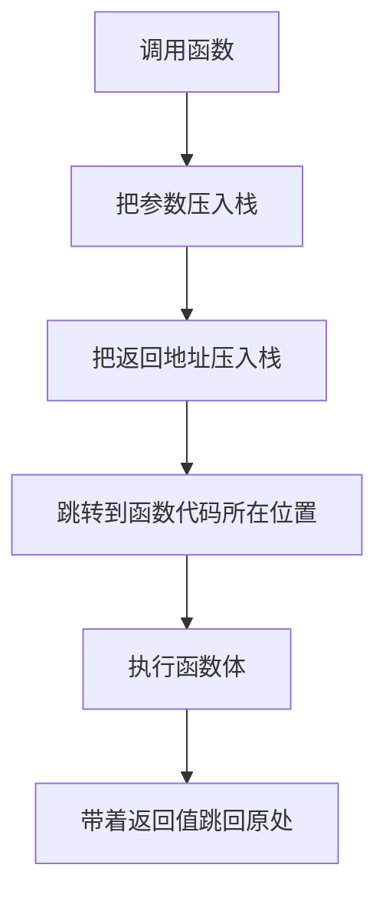
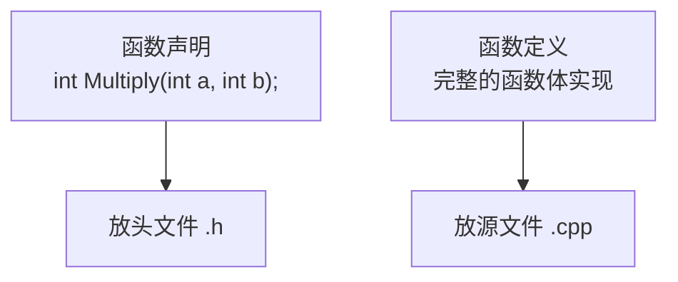

课程链接：视频《Functions in C++》（The Cherno C++ 系列 第 9 集）

YouTube 链接：（留空）

## 本节概述：把重复的代码打包成可复用的工具

写程序时，我们经常需要反复做同一件事，比如"把两个数相乘并打印结果"。如果每次都把代码复制粘贴一遍，代码会变得又长又乱，将来要改还得一处一处地改。**函数（Function）**就是解决这个问题的工具：它把一段完成特定任务的代码打包起来，起个名字，以后想用就**调用**它一次。


本集的完整示例先放在这里，后面逐段拆解。

```cpp
#include <iostream>

// 返回两个整数相乘的结果
int Multiply(int a, int b)
{
    return a * b;
}

int main()
{
    int result = Multiply(3, 2);
    std::cout << result << std::endl;   // 输出 6

    std::cin.get();
}
```

## 什么是函数

函数就是**一段完成特定任务的代码块**。之后学到类（Class）时，类里面的函数会改叫**方法（Method）**；本集说的"函数"特指不属于任何类的、独立存在的代码块。

把程序拆成一个个函数，最主要的目的就是**防止代码重复**。试想如果代码全靠复制粘贴，一旦想改某个逻辑，就必须在所有粘贴过的地方各改一遍——这种维护方式简直是灾难。而写成一个函数后，只需要改函数本身一处。



## 函数的输入与输出

可以把函数想象成一个带**输入**和**输出**的小机器：

- **输入**：通过**参数（Parameter）**传入数据。参数不是必须的。
- **输出**：通过**返回值（Return Value）**把结果交回来。也不是必须的。


## 第一个函数：multiply

我们来写一个"计算两个整数相乘"的函数。写函数需要四部分：

```cpp
int Multiply(int a, int b)   // 返回类型 + 函数名 + 参数列表
{
    return a * b;            // 函数体：真正做的事
}
```

**第一部分：返回类型**。写在最前面，表示这个函数会返回什么类型的数据。我们乘的是两个整数，结果也是整数，所以写 `int`。

**第二部分：函数名**。这里叫 `Multiply`，调用它时就用这个名字。

**第三部分：参数列表**。写在圆括号里，是函数要使用的数据。这里接收两个整数，分别命名为 `a` 和 `b`。

**第四部分：函数体**。花括号 `{}` 包住的代码，是函数真正做的事。这里用 `return` 把 `a * b` 的结果交出去。

> [!NOTE]
> `return` 后面的值就是函数的输出。遇到 `return` 时，函数立即结束，把值带回调用它的地方。

参数和返回值都不是硬性要求。比如可以写一个没有参数的函数：

```cpp
int Multiply()
{
    return 5 * 8;   // 没有参数，直接返回一个固定结果
}
```

也可以让函数什么都不返回——返回类型写成 **`void`**（意思是"空、无"）：

```cpp
void Log()
{
    std::cout << "Hello" << std::endl;   // 只做事，不返回值
}
```

## 调用函数

定义好函数后，在 main 里这样调用它：

```cpp
int result = Multiply(3, 2);          // 调用函数，把返回值存进 result
std::cout << result << std::endl;     // 输出 6
```

`Multiply(3, 2)` 的意思是：带着参数 3 和 2 去执行 `Multiply` 函数，然后把它的返回值（`a * b = 6`）存进 `result` 变量。



## 复制粘贴的坑

假如我们要算好几组乘法，并且都要打印结果。不写函数的话，只能复制粘贴：

```cpp
int result = Multiply(3, 2);
std::cout << result << std::endl;    // 6

int result2 = Multiply(8, 5);
std::cout << result << std::endl;    // 忘了改成 result2！还是打印 6

int result3 = Multiply(90, 45);
std::cout << result << std::endl;    // 同样还是 6
```

上面的 bug 是 Cherno 故意演示的：复制粘贴时**漏改了一处细节**，程序跑起来三行全输出 6，而且不仔细看根本发现不了，直到某天突然出错。这类问题在实际开发中天天发生。



## 把"相乘并打印"整个做成函数

既然"相乘 + 打印"这个组合动作要重复三次，干脆把它整个打包成一个函数。它只需要打印、不需要返回值，所以返回类型是 `void`：

```cpp
void MultiplyAndLog(int a, int b)
{
    int result = a * b;
    std::cout << result << std::endl;
}

int main()
{
    MultiplyAndLog(3, 2);     // 输出 6
    MultiplyAndLog(8, 5);     // 输出 40
    MultiplyAndLog(90, 45);   // 输出 4050

    std::cin.get();
}
```

挑选参数的原则很简单：**看这三段代码里"什么在变"**。变化的是相乘的两个数，于是它们就成了参数；不变的"相乘并打印"逻辑，就留在函数体里。

现在的 main 干净、易读，将来想改成"相减并打印"，只需改函数里的一行。这正是函数的价值。

## 别过度拆函数

函数虽好，但**不要为每行代码都建一个函数**——那样代码反而难维护、更慢。原因在于**调用函数是有代价的**：

每次调用函数，程序都要：



这一整套"跳来跳去"的操作会**减慢程序运行**。不过这个代价有个前提：编译器没有把函数**内联（Inline）**优化掉——内联的细节后面有专门视频讲解。

> [!NOTE]
> 什么时候该写函数？当你发现**同一个任务反复出现**时，就该为它写一个函数。函数的核心使命就是**防止代码重复**，而不是把程序切得越碎越好。

## main 函数的特殊待遇

细心的你可能发现了：`main` 的返回类型明明是 `int`，但我们的 main 里从头到尾没有 `return`。这不是写错了，而是 **`main` 函数享有特权**——它是唯一一个"声明了返回类型却可以不写 return"的函数。不写时编译器会**自动视为返回 0**（代表程序成功执行），效果等同于：

```cpp
int main()
{
    return 0;
}
```

别的函数没这个待遇。如果把 `Multiply` 的 `return` 删掉，编译会直接报错：

```cpp
int Multiply(int a, int b)
{
    // 什么也不返回
}
// 编译错误：'Multiply' : must return a value
```

有意思的是，这个报错只在 **Debug 模式**下出现。用 **Release 模式**编译时编译器不会报错——但这绝不代表代码是对的：如果你真的去捕获这个函数的返回值并使用，会触发**未定义行为（Undefined Behavior）**，结果不可预测。所以永远不要写"声称要返回却不返回"的函数。

> [!WARNING]
> `main` 不写 return 自动返回 0，是 C/C++ 给 `main` 的特权；其他任何声明了返回类型的函数都必须老老实实 `return` 一个值。

## 函数声明与定义

我们通常把函数拆成两部分：

- **声明（Declaration）**：只告诉编译器"存在一个这样的函数"，例如 `int Multiply(int a, int b);`，没有函数体。一般放在**头文件（Header File）**里。
- **定义（Definition）**：带函数体的完整实现。一般写在 **.cpp 文件**（也叫翻译单元，Translation Unit）里。



关于声明、定义和头文件，后面会有专门的视频深入讲解，本集先知道这个分工即可。

## 本章小结

**函数是打包特定任务的代码块**，类里的叫方法，独立的叫函数；核心目的是防止代码重复，避免复制粘贴带来的维护灾难和漏改 bug。

**函数四要素**：返回类型、函数名、参数列表（输入，可省略）、函数体（用 `return` 输出结果）。不想返回任何东西就把返回类型写成 `void`。

**调用方式**：`int result = Multiply(3, 2);` —— 把参数传进去，把返回值接住。参数选什么？看重复代码里"什么在变"。

**别过度拆分**：每次函数调用都要创建栈帧（压入参数、返回地址并跳转），有性能开销；编译器可能用内联优化掉。经验法则是"同一任务反复出现才建函数"。

**main 是特例**：它声明 `int` 却可以不写 `return`，编译器自动视为返回 0；其他函数不返回会报错（Debug 下），Release 下虽不报错但捕获返回值属于未定义行为。

**声明与定义**：声明（无函数体）放头文件，定义（完整实现）放 .cpp 源文件，后面专题细讲。
