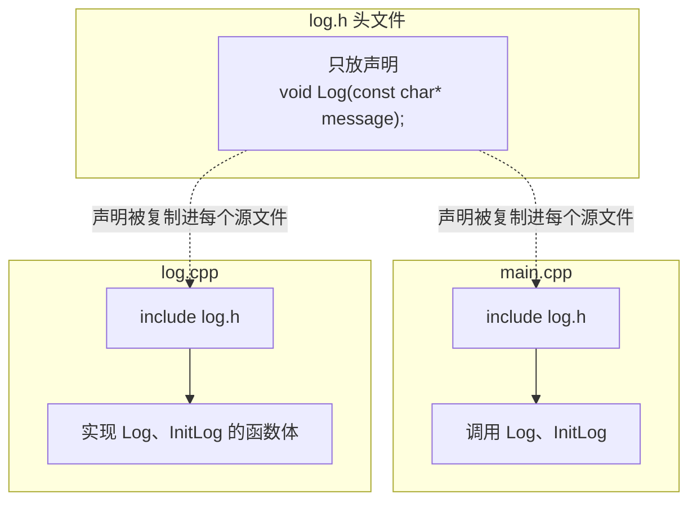
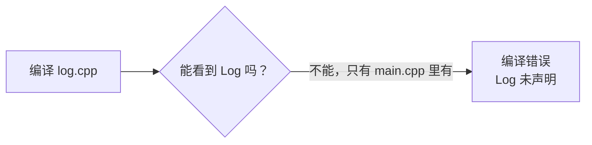
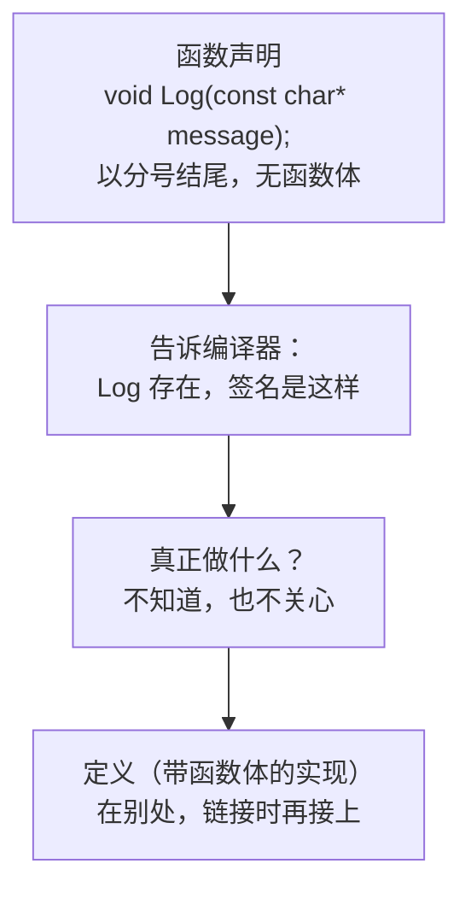
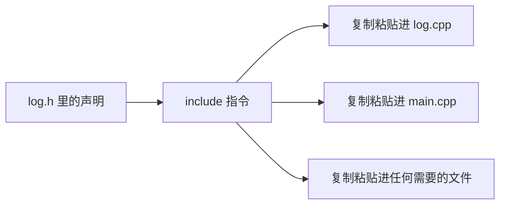
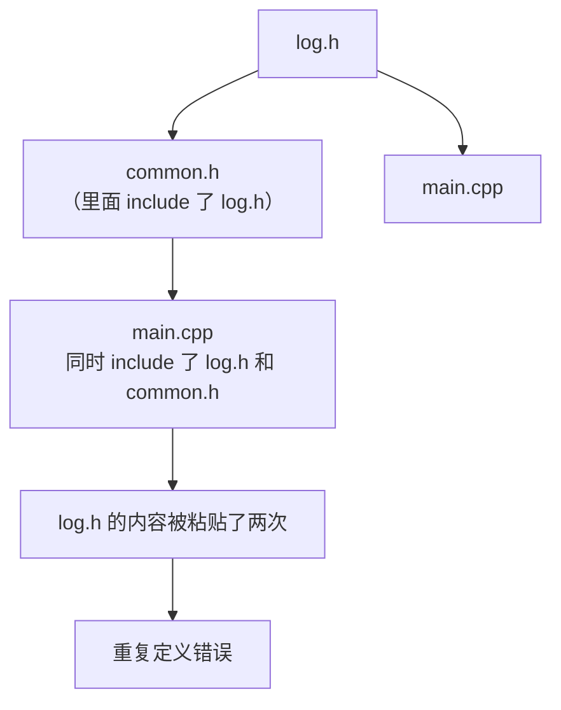
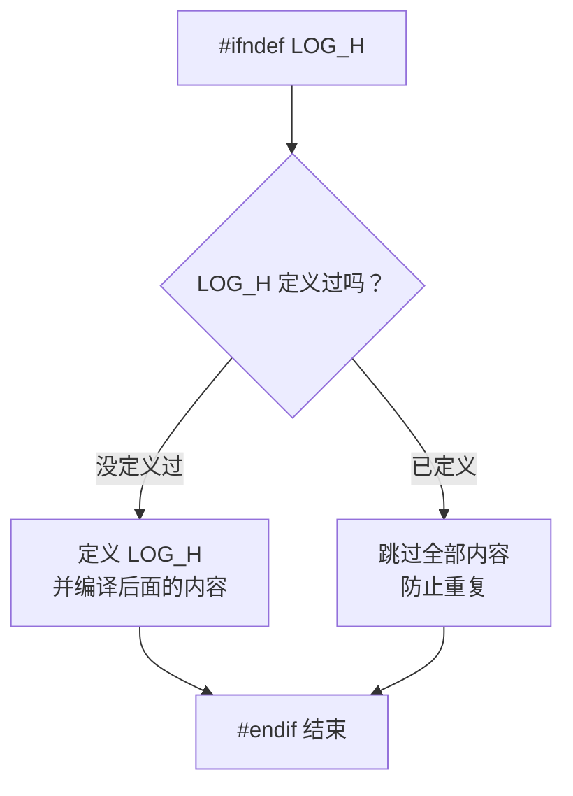
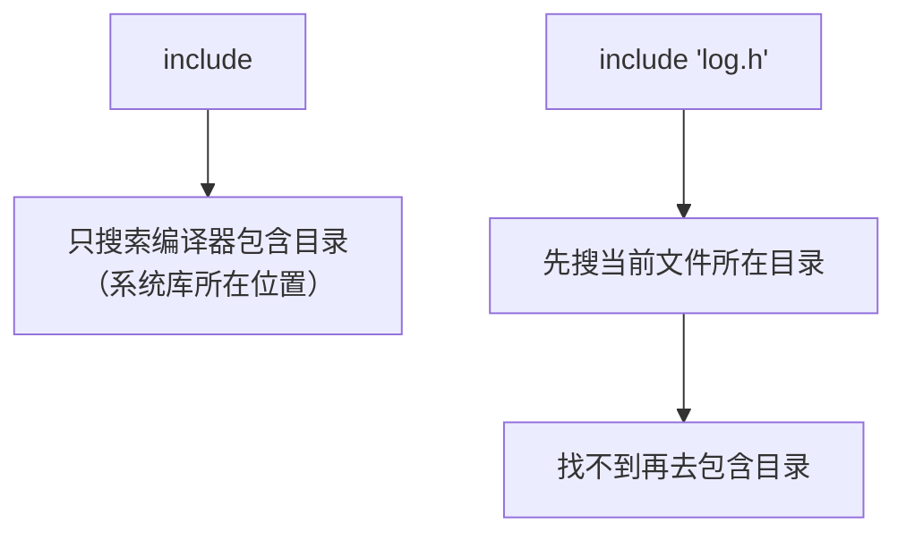
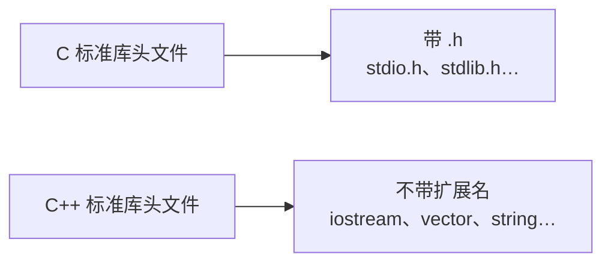

课程链接：视频《C++ Header Files》（The Cherno C++ 系列 第 10 集）

YouTube 链接：（留空）

## 本节概述：声明与实现的"公共告示板"

上一集我们学到，C++ 程序是一个函数一个函数拼起来的。但函数定义在哪个文件里？别的文件怎么知道它存在？**头文件（Header File）**就是答案：它专门存放**声明（Declaration）**——"某个函数/类型存在"这样的信息，让多个源文件共享。本集用一个小型日志模块，完整演示头文件的作用和用法。



本集最终我们要搭出这样一个结构：`log.h` 存声明，`log.cpp` 存实现，`main.cpp` 负责调用。下面一步步来。

## 为什么需要头文件

很多语言（比如 Java、C#）没有头文件的概念，C 语言虽有但风格不同。C++ 之所以需要它，根源在于**编译器的"健忘"**：

> [!NOTE]
> 编译器编译每个 .cpp 文件时，**只看得到这个文件本身**。一个函数定义在 A 文件里，B 文件编译时对它的存在**一无所知**——除非 B 文件里有它的声明。

而且 C++ 规定：**函数只能定义（Definition）一次**（否则重复定义报错），但**可以声明（Declaration）无数次**。于是我们需要一个公共的地方，集中存放"这个函数存在"的声明，让所有需要的文件都能引用——这个公共地方就是头文件。

## 没有头文件会怎样

假设我们写了这样一个日志函数，放在 `main.cpp` 里：

```cpp
// main.cpp
#include <iostream>

void Log(const char* message)      // 函数定义：带完整函数体
{
    std::cout << message << std::endl;
}

int main()
{
    Log("Hello World!");
    std::cin.get();
}
```

现在新建一个 `log.cpp`，想在里面也调用 `Log`：

```cpp
// log.cpp
int main()
{
    Log("Hello!");    // 编译报错：Log 未声明
}
```

报错的原因很直接：编译 `log.cpp` 时，编译器眼里**根本没有 Log 这个函数**。



## 函数声明：先告诉编译器"它存在"

解决办法是给 `log.cpp` 补上一句**函数声明**——把函数签名复制过来，以**分号结尾、不写函数体**：

```cpp
// log.cpp
void Log(const char* message);    // 声明：只说"这个函数存在"，没有函数体

int main()
{
    Log("Hello!");    // 现在编译通过了
}
```



但问题来了：如果十个文件都要用 `Log`，难道要在每个文件里都手抄一遍声明？这正是头文件登场的时刻。

## 把声明收进头文件

新建一个头文件 `log.h`，把声明放进去：

```cpp
// log.h
#pragma once

void Log(const char* message);    // 声明 Log
void InitLog();                   // 再声明一个 InitLog
```

然后在需要的 .cpp 文件顶部写上 `#include "log.h"`。`#include` 是**预处理器指令**，它的作用就是**把目标文件的全部内容原样复制粘贴进当前文件**。所以 `#include "log.h"` 等价于手动把那两行声明抄进来——只不过由机器自动完成，一劳永逸。



此时把 `Log` 的定义从 `main.cpp` 挪到 `log.cpp`，让"声明放头文件、实现放源文件"各司其职：

```cpp
// log.cpp —— 实现
#include "log.h"        // 先包含声明
#include <iostream>     // 再用 std::cout

void Log(const char* message)
{
    std::cout << message << std::endl;
}

void InitLog()
{
    Log("Initialized Log");
}
```

```cpp
// main.cpp —— 只负责使用
#include "log.h"
#include <iostream>

int main()
{
    InitLog();              // 调用 log.cpp 里定义的函数
    Log("Hello World!");
    std::cin.get();
}
```

现在 `main.cpp` 里的 `Log` 定义删掉了，但它通过 `log.h` 的声明照常调用；链接器负责把调用和 `log.cpp` 里的定义对上。程序输出 "Initialized Log" 和 "Hello World!"。

## 头文件保护：#pragma once

细心的你注意到 `log.h` 第一行有个 `#pragma once`，这是 Visual Studio 创建头文件时自动加上的。它是什么？

`#` 开头的是**预处理器指令**，在真正编译前由预处理器处理。`#pragma` 是发给编译器/预处理器的指令，而 **`#pragma once` 的意思是：这个头文件在同一个翻译单元里只被包含一次**。

> [!NOTE]
> 注意措辞：它防止的是**同一个 .cpp 文件（翻译单元）内**的重复包含，而不是阻止头文件被多个不同的 .cpp 包含。后者是正常且必须的。

为什么要防重复包含？因为 `#include` 是复制粘贴——同一个头文件被包含两次，内容就出现两份，一旦里面定义了什么（比如结构体），就会触发**重复定义错误**。

## 重复包含的坑：include 链

你以为自己不会犯"包含两次"这种低级错误？其实完全可能，因为 include 是可以**链式**的：



为了演示，我们在 `log.h` 里加一个结构体（头文件里放类型定义是很常见的做法）：

```cpp
// log.h
// #pragma once      // 故意注释掉

struct Player          // 定义一个结构体
{
    int x, y;
};

void Log(const char* message);
void InitLog();
```

再建一个 `common.h`，它包含 `log.h`：

```cpp
// common.h
#include "log.h"
```

然后 `log.cpp` 里同时包含两个头文件：

```cpp
// log.cpp
#include "log.h"      // 第一次包含 log.h
#include "common.h"   // 第二次：common.h 里又包含了一次 log.h
```

编译后报错：**`Player` 结构体重复定义**——因为 `log.h` 的内容被原样粘贴了两次，出现了两个同名结构体。而把 `#pragma once` 恢复后，预处理器认出 `log.h` 已经包含过，第二次直接跳过，错误消失。

## 传统写法：#ifndef 头文件保护

`#pragma once` 是较新的写法（现在 GCC、Clang、MSVC 全部支持）。在它普及之前，人们用**宏**来实现同样的效果，这种老式写法至今仍能在老代码里见到：

```cpp
// log.h —— 传统头文件保护写法
#ifndef LOG_H          // 如果 LOG_H 这个宏还没定义
#define LOG_H          // 就定义它

struct Player
{
    int x, y;
};

void Log(const char* message);

#endif                 // 结束条件编译
```

原理很简单：第一次包含时，`LOG_H` 未定义，于是进入 `#ifndef` 分支、定义 `LOG_H`、内容正常参与编译；第二次包含时，`LOG_H` 已经定义，`#ifndef` 条件不成立，**中间的全部内容被跳过**。



两种写法效果一样。`#pragma once` 更简洁，是当前主流（包括我自己）的选择；认识 `#ifndef` 写法，是为了将来读得懂老代码。

## 引号还是尖括号

你肯定注意到过两种 include 写法：

```cpp
#include <iostream>    // 尖括号
#include "log.h"       // 引号
```

两者含义不同：

- **尖括号 `< >`**：只在编译器配置的**包含目录（Include Path）**里搜索。这些目录通常是系统/编译器自带的库目录。标准库头文件（`iostream` 等）都在这里，所以用尖括号。
- **引号 `" "`**：首先**相对当前文件所在目录**搜索，找不到再去包含目录找。我们自己的头文件通常和源文件放在一起，所以用引号。



> [!NOTE]
> 规则并不是绝对的：引号几乎"哪里都能用"，把 `<iostream>` 改成 `"iostream"` 也能编译。反过来，尖括号只认包含目录。所以行业惯例是：**自己的文件用引号，标准库用尖括号**——看到代码风格就知道该去哪儿找。

## iostream 为什么没有扩展名

`iostream` 看起来不像文件名——它确实是个真实的文件，只是**故意没有扩展名**。这是 C++ 标准库作者的刻意设计，用来区分两类头文件：

- **C 标准库头文件**：带 `.h` 扩展名，如 `stdio.h`、`string.h`
- **C++ 标准库头文件**：不带扩展名，如 `iostream`、`vector`、`string`

在 Visual Studio 里右键 `#include <iostream>` → "打开文档"，就能跳转到这个真实文件；再"打开所在文件夹"，能看到它就在编译器的 include 目录里。



## 本章小结

**头文件是存放声明的公共告示板**。编译器编译每个 .cpp 时只看得到该文件自身，跨文件使用函数必须借助声明；函数只能定义一次，却能声明无数次，所以把声明集中到头文件、用 `#include` 复制进各源文件。

**声明 vs 定义**：声明以分号结尾、没有函数体，只表明"存在"；定义含完整函数体，是真正的实现。声明放头文件，定义放 .cpp。

**`#include` 就是复制粘贴**：预处理器把目标文件内容原样贴进当前文件。`#include "log.h"` 等价于手动抄一遍声明。

**防重复包含**：`#pragma once`（现代主流，各编译器都支持）或 `#ifndef / #define / #endif` 宏保护（老代码常见），防止同一头文件在**单个翻译单元**内被重复包含导致重复定义错误；include 链（A 包含 B、C 又包含 A 和 B）是重复包含的常见来源。

**引号 vs 尖括号**：尖括号只在编译器包含目录搜索（标准库用）；引号优先搜当前文件所在目录（自己的头文件用）。

**扩展名约定**：C 标准库头文件带 `.h`，C++ 标准库头文件不带扩展名（`iostream` 是真实文件，只是没后缀）。
