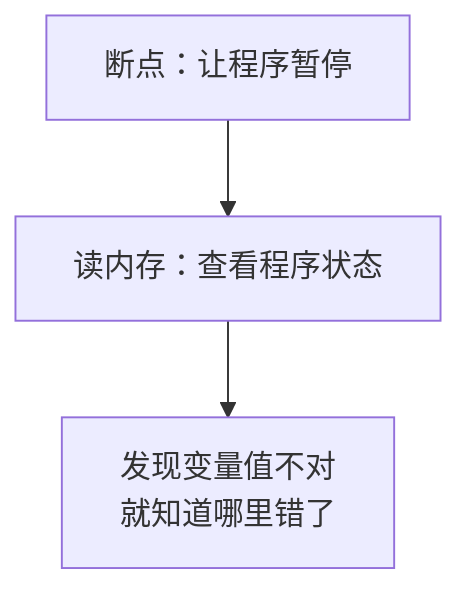
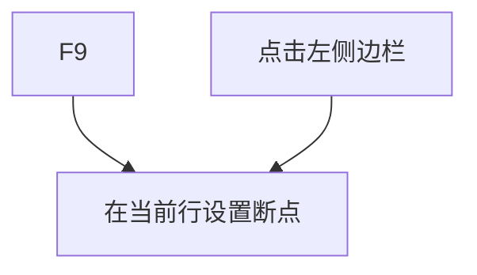
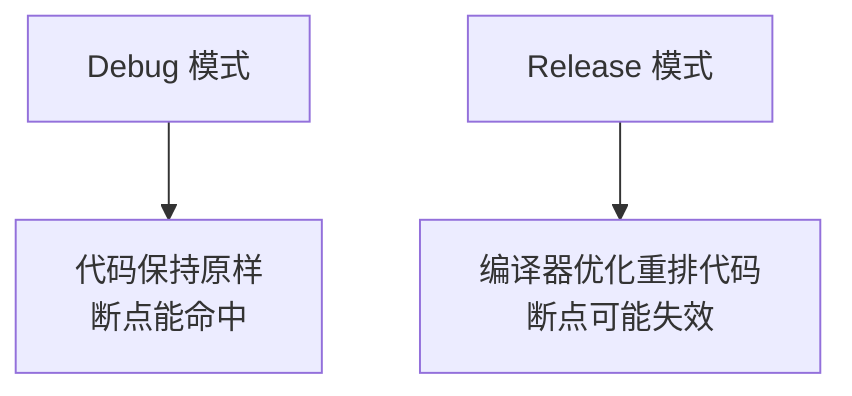
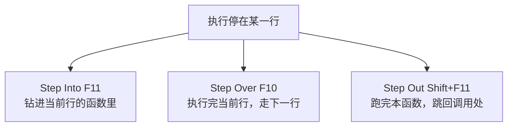
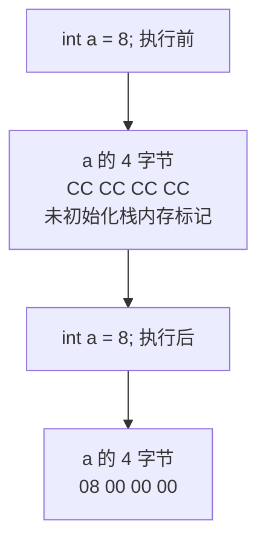
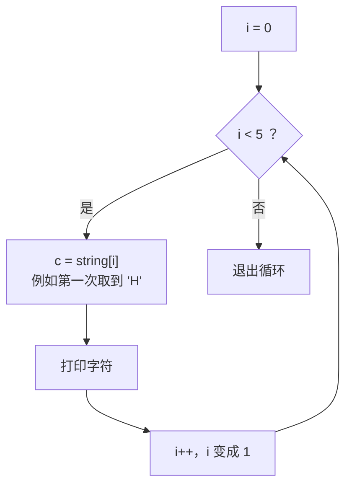

课程链接：视频《How to DEBUG C++ in VISUAL STUDIO》（The Cherno C++ 系列 第 11 集）

YouTube 链接：（留空）

## 本节概述：暂停程序，看看内存里到底发生了什么

程序写错了怎么办？调试（Debug）就是回答"我哪里做错了"的过程。本集介绍调试的两大核心武器：**断点（Breakpoint）**——让程序在指定行暂停；**查看内存（Reading Memory）**——暂停后检查所有变量的真实值。学会调试，你不仅会修 bug，还会真正看懂程序是怎么运行的。


调试工具各 IDE 都有，本集用 Visual Studio 演示。下面用上一集的 log 项目来实际操作。

## 调试是什么：计算机几乎总是对的

"调试"就是**去除代码里的 bug**，而找出 bug 的前提是**诊断**——搞清楚程序到底哪里不对劲。这里有一条程序员必须尽早接受的信念：

> [!NOTE]
> **计算机几乎总是对的**（99% 的情况）。不太可能是"我写对了但电脑抽风"——几乎都是我们自己写错了。调试的本质就是找出**你的**错误。

## 两大核心：断点 + 读内存

调试的核心可以拆成两件事，而且总是配合使用：

1. **断点（Breakpoint）**：程序中的一个标记点。当执行到达这一行时，调试器会让程序**暂停**（"break" 就是"暂停"的意思），让你检查当前状态。
2. **读内存**：所谓"状态"，归根结底就是**内存**。一个运行中的程序，它的全部就是内存——每个变量存了什么、接下来要执行哪个函数、指令指针指到哪，全都在内存里。所以能查看内存，就等于能看到程序的一切。



## 设置断点

在 Visual Studio 里设断点有两种方式：

- 光标停在那一行，按 **F9**
- 直接点击代码行左侧的灰色边栏



> [!WARNING]
> 断点要设在**真正会被执行的代码行**上。比如空行、注释行永远轮不到执行，断点设在那里毫无意义。main 函数的第一行代码就一定会被执行。

## Debug 模式 vs Release 模式

调试前务必确认当前是 **Debug 模式**。如果处于 Release 模式，编译器会**优化、重排你的代码**，断点可能永远都不会命中。



Release 模式到底做了什么，后面会有专门视频讲解，现在只需记住：**要调试就用 Debug 模式**。

## 开始调试：指令指针与调试工具栏

点击工具栏的"本地 Windows 调试器"（Local Windows Debugger）按钮启动调试——它保证程序带着调试器运行。程序跑起来后，执行到第一个断点时控制权交回 Visual Studio，进入调试布局：代码行上出现一个**黄色箭头**。

这个黄色箭头就是**指令指针（Instruction Pointer）**，它指向"**即将执行**的那一行"——注意，箭头指着这行，**不代表这行已经执行了**，而是"正要执行它"。


调试工具栏上有几个关键按钮：

| 按钮 | 快捷键 | 作用 |
| --- | --- | --- |
| 继续 | F5 | 正常运行，直到下一个断点或程序结束 |
| 单步进入 | F11 | **进入**当前行调用的函数内部 |
| 单步跳过 | F10 | 执行当前行，跳到本函数的**下一行**（不进函数内部） |
| 单步跳出 | Shift + F11 | 跑完当前函数，**回到调用它的地方** |



## 逐步执行：从断点出发

设好断点、启动调试后，程序停在断点处。我们一步步走：

**单步进入函数**：按 F11 进入 `Log` 函数内部，此时正处在函数栈帧的开头，函数体一行都还没执行。把鼠标悬停在参数 `message` 上，能看到它已经指向字符串 "Hello World!"——这就是在**读内存**。

**单步跳过**：按 F10 前进一行，此时黄色箭头移到 `std::cout << message << std::endl;` 这行——注意它**还没执行**，控制台里还没有 "Hello World!"。再按一次 F10，这行执行完，控制台才真正打印出 "Hello World!"。

**验证"箭头 = 未执行"**：停在某行时去看程序窗口，该行的输出尚未出现；执行完再去看，输出才出现。这个细节理解透了，调试就不会懵。

**单步跳出**：在 `Log` 里按 Shift + F11，直接跑完 `Log` 回到 main 的下一行。

## 观察变量：Autos、Locals、Watch

调试布局里通常会有三个重要的变量窗口：

- **Autos / Locals**：自动列出当前作用域里的局部变量（以及调试器认为你关心的变量）。
- **Watch（监视）**：手动输入变量名，持续监视它的值变化。

我们给 main 增加几个变量来练习：

```cpp
int main()
{
    int a = 8;
    a++;                       // a 变成 9

    const char* string = "hello";

    for (int i = 0; i < 5; i++)
    {
        const char c = string[i];
        std::cout << c << std::endl;
    }

    Log("Hello World!");
    std::cin.get();
}
```

（循环语句还没正式学过，本集只用来练习单步观察，下一集就会专门讲。）

在 Watch 窗口输入 `a` 回车，就能实时看到它的值。程序停在 `int a = 8;` 这一行（尚未执行）时，Watch 里 `a` 显示的是一个巨大的随机数——因为这一行还没跑，`a` 所在的内存还是**未初始化的垃圾值**。

按 F10 执行完 `int a = 8;`，Watch 里 `a` 变成 **8**，而且值会**标红**——表示自上次暂停以来它发生了变化。再按 F10 执行 `a++`，`a` 变成 **9**。

## 内存视图：直接看内存

调试菜单里有专门的**内存视图**：**调试 → 窗口 → 内存 → 内存 1**。它会打开一个面板，把程序内存逐字节展示出来：


要把某个变量"定位"到内存视图里，需要它的**内存地址**。在 Watch 窗口输入 `&a` 回车——**变量名前的 `&` 就是"取这个变量的内存地址"**——会得到一个十六进制地址，复制它粘贴进内存视图的地址栏，回车，视图就会跳到 `a` 所在的内存区域。

## 0xCC：调试模式的"未初始化"标记

你可能注意到：在内存视图里，`a` 尚未执行赋值时，它的 4 个字节是一串 **CC**（0xCC，十进制 204），而且附近的栈内存全是 CC——这看着不像"随机垃圾"，太整齐了。

这是 MSVC 调试模式故意做的：编译器知道这块内存即将用作变量但还没初始化，于是**预先把它填成 0xCC**。这样一来，如果代码里"用了没初始化的变量"，你在内存里看到 CC 就知道问题出在哪。



> [!NOTE]
> 这种"额外填 CC"的操作正是 **Debug 模式比 Release 慢**的原因之一——编译器插入了大量只对调试有用的辅助行为（填 CC、运行时检查等）。Release 模式（发布正式版、上线游戏时）会去掉这一切，让程序更快。
>
> 顺带一提：`08 00 00 00` 是数字 8 在内存中的真实样子，字节从低位到高位排列（小端序），每两个十六进制数字恰好是 1 个字节。

## 单步遍历 for 循环

循环会反复执行同一段代码，正是练习单步的好材料。在循环里设断点，反复按 F10，可以清楚地看到循环的节奏：



例如第一次迭代：`i = 0`，`c = string[0]`，即字符串 `"hello"` 的第一个字符 `'H'`；执行 `std::cout << c` 后控制台打印出 H。第二次迭代 `i = 1`，取到 `'e'`，以此类推，直到 `i = 5` 时条件 `i < 5` 不成立，循环结束。在 Watch 里加一个 `c`，每次迭代都能看到它的字符在变——这就是用调试器"看懂"控制流。

## 实用技巧：用断点跳过不关心的部分

单步很慢。如果某个循环你不想一步步走、只想直接跳到后面的 `Log("Hello World!")`，不需要一直按 F10——**在目标行设一个断点，然后按 F5（继续）**，程序会直接运行到下一个断点停下。


## 本章小结

**调试 = 断点 + 读内存**。程序的一切（变量值、指令指针、代码本身）都是内存，能查看内存就能看清程序的全部状态；断点让程序在指定行暂停，供你检查。

**信念**：计算机几乎总是对的，出错通常是我们自己写错了，调试就是找出自己的错误。

**操作速查**：F9 设断点；本地 Windows 调试器启动调试；F5 继续、F11 单步进入、F10 单步跳过、Shift+F11 单步跳出；黄色箭头指向"即将执行、尚未执行"的行；必须用 Debug 模式，Release 模式断点可能失效。

**观察窗口**：Autos/Locals 自动列出变量，Watch 手动监视指定变量（输入 `a` 看值、输入 `&a` 看地址）；内存视图（调试 → 窗口 → 内存）用地址定位、逐字节查看数据，每 2 个十六进制数字 = 1 字节。

**0xCC 的意义**：MSVC 调试模式把未初始化的栈内存填成 0xCC，看到它就知道"变量没初始化"；这类辅助行为也是 Debug 模式比 Release 慢的原因。

**循环调试**：用 F10 单步观察 `i` 与 `c` 的变化，能直观理解循环机制；不想单步时就在目标行设断点按 F5 直达。
