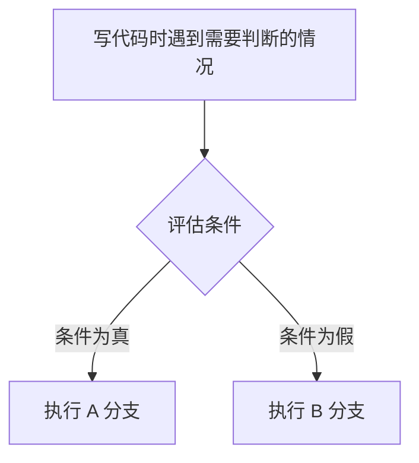
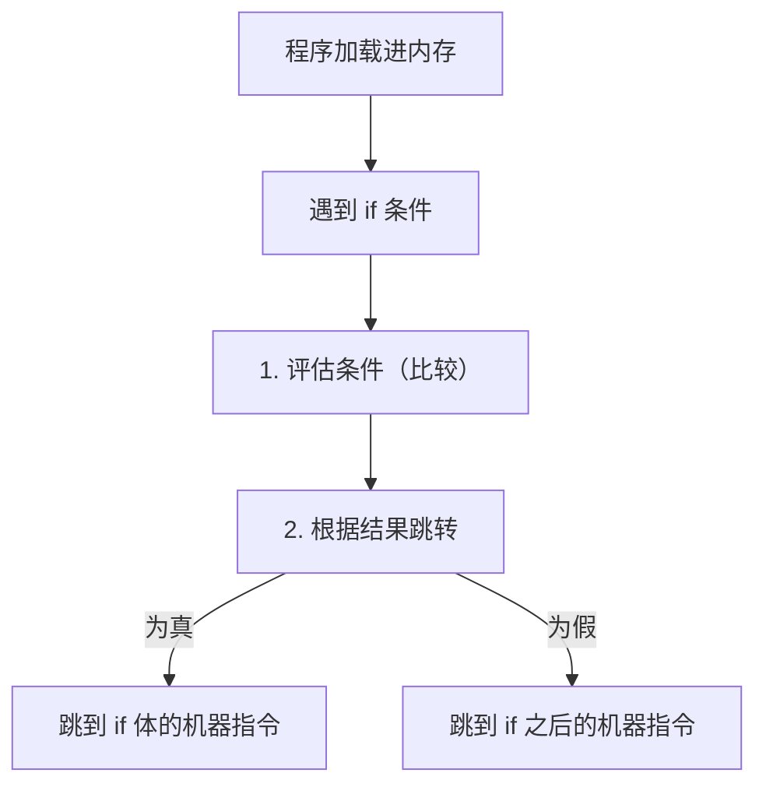
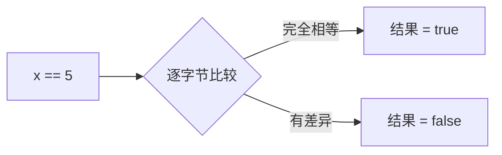
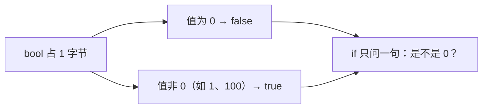
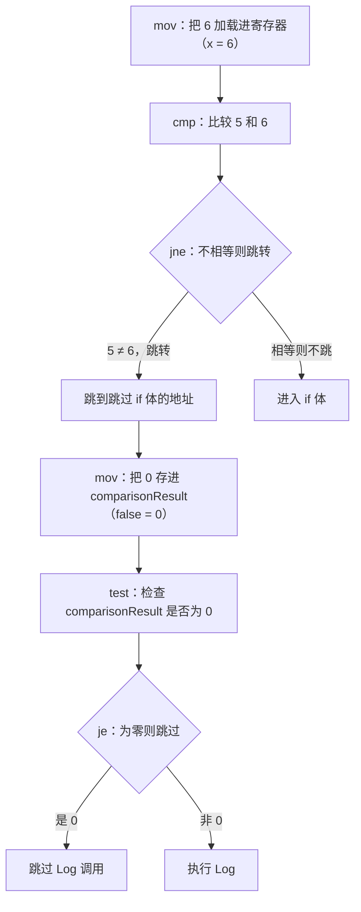
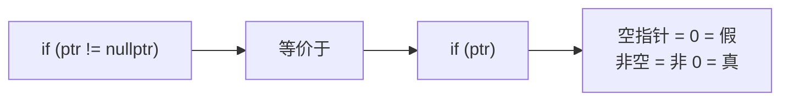
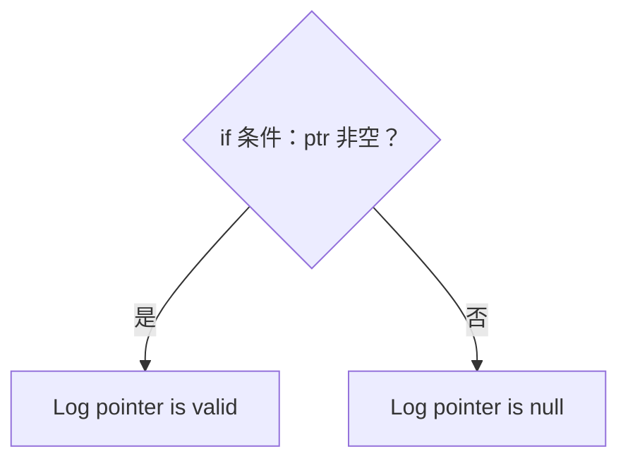
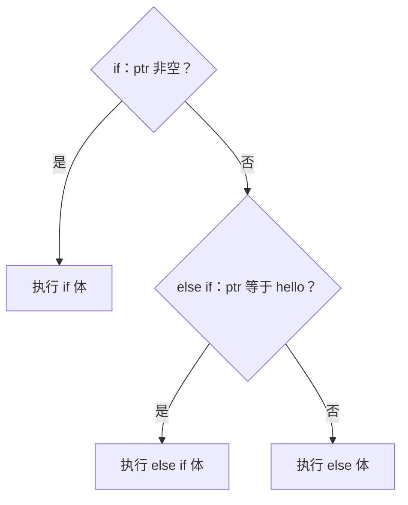
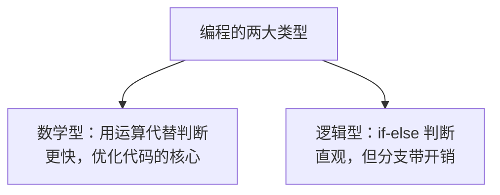

课程链接：视频《CONDITIONS and BRANCHES in C++ (if statements)》（The Cherno C++ 系列 第 12 集）

YouTube 链接：（留空）

## 本节概述：如果…那么…

程序不只会从上到下一条路走到黑，还需要"**看情况办事**"：根据某个条件成立与否，决定执行哪一段代码。这就是**条件（Condition）**与**分支（Branch）**，写起来就是 `if`、`else if`、`else`。本集除了教用法，还会掀开引擎盖——看看 `if` 在 CPU 层面到底是什么，以及为什么高手写高性能代码时会尽量避免分支。



## 条件与分支的本质：评估 + 跳转

写一个 `if` 语句，程序运行时其实发生了**两件事**：

1. **评估条件**：判断"X 是否等于 5"这类问题，得到一个"是/否"。
2. **分支跳转**：根据结果，跳到对应的代码段去执行。

跳转发生在什么层面？程序启动后，它的一切（包括所有指令）都被**加载进内存**。所谓分支，就是告诉 CPU："**跳到内存里的这一块，从那里继续执行指令**"。跳真分支走一块内存，跳假分支走另一块内存。



> [!NOTE]
> 因为要"检查条件再跳来跳去"，`if` 分支**有一点点额外开销**。追求极致性能的代码会刻意避免分支（后面优化专题会讲"如何去掉 if"）。但这远不是现在要操心的事——本集先弄懂 if 怎么用、怎么工作。

## 第一个例子：只有 x 等于 5 才打印

基于之前 log 项目写一个最朴素的例子：

```cpp
#include <iostream>
#include "log.h"

int main()
{
    int x = 5;

    if (x == 5)
    {
        Log("Hello World!");
    }

    std::cin.get();
}
```

`x == 5` 就是**条件**：问一句"x 是不是等于 5"。为真就执行大括号里的 `Log("Hello World!")`，为假就整个跳过。把 `x` 改成 6 再运行，控制台什么都没有——因为条件不成立。

## 比较运算符与 bool：比较的结果是个真/假值

`==` 叫**相等运算符（Equality Operator）**，用来比较两个值是否相等。它不是什么魔法——标准库早就实现了它：把两个整数各自那 4 字节内存逐字节对比，全相等就返回 `true`，否则返回 `false`。所有 C/C++ 运算符本质上都是"有人提前写好的函数"。

比较的结果类型是 `bool`，所以可以把它**存进变量**：

```cpp
int x = 5;
bool comparisonResult = x == 5;   // x 等于 5 → true；不等于 → false
```

然后 if 里可以直接用这个 bool：

```cpp
if (comparisonResult == true)     // 写法一：啰嗦
{
    Log("Hello World!");
}

if (comparisonResult)             // 写法二：直接写变量名，等价
{
    Log("Hello World!");
}
```

两种写法效果完全一样，原因就在下一节。



## if 的本质：检查内存是不是 0

C++ 里其实**没有真正的"真"和"假"**——一切都只是数字。`bool` 占 **1 字节（8 位）**内存，约定：

- 值是 **0** → 代表 `false`
- 值是**任何非 0 的数**（通常是 1）→ 代表 `true`

所以 `if` 语句真正做的事，就是**看一眼内存里的数字是不是 0**：是 0 就不进 if 体，不是 0 就进。



这解释了一切现象：

- `if (1)` 编译通过，且会执行——因为 1 不是 0。
- `if (0)` 不执行——因为 0 就是假。
- `if (comparisonResult)` 和 `if (comparisonResult == true)` 等价——后者多问一句"它是不是等于 1（true）"，而前者只问"它是不是 0"，两者在"非 0 即真"的规则下结果相同。
- 甚至可以 `if (x)`：x 是 6，非 0，所以成立。

```cpp
if (1)        // 非 0 → 执行
{
    Log("Hello World!");
}

if (0)        // 就是 0 → 不执行
{
    Log("Hello World!");
}

int x = 6;
if (x)        // 6 非 0 → 执行
{
    Log("Hello World!");
}
```

## 反汇编：看 CPU 到底在执行什么

上一集学的调试技术这里正好用上。给 `x = 6` 的版本设断点，调试运行后**右键 → 转到反汇编（Go To Disassembly）**，就能看到每一行源码对应的 CPU 指令（汇编），还能逐条单步、查看寄存器里的值。Debug 模式下编译器不做优化，我们能清楚看到 if 的真面目：



关键指令就三个：

- **mov**（move）：把值搬进寄存器或内存，如"把 6 赋给 x"。
- **cmp**（compare）：比较两个值。
- **jne**（jump if not equal）/ **je**（jump if equal）：**条件跳转**——不相等就跳到某地址（jne），相等就跳（je）。`if` 的分支本质就是这些条件跳转指令。

看完你就明白：`if` 在 CPU 眼里就是"比较一下，然后按结果决定跳不跳"。这套反汇编视图在调试"没有源码的程序"或"检查编译器生成的代码"时极其有用，但平时尽量别陷进去，能用断点看变量就不去啃汇编。

## 省略花括号：单行 if 的两种写法

if 体只有一行代码时，花括号可以省略：

```cpp
if (comparisonResult == true)
    Log("Hello World!");        // 单行，省略花括号

if (comparisonResult == true) Log("Hello World!");   // 也有人写成一行
```

Cherno 建议**保持多行**：单行写法调试时，断点落在这行，你分不清它是停在"条件判断"还是"调用函数"；拆成两行，用 F10 走一步就能看清哪行被执行、哪行被跳过。清晰比省两行更重要。

## 用 if 检查指针：判空技巧

因为 if 只检查"是不是 0"，而空指针（`nullptr`）的值就是 0，所以**判断指针是否为空**有个简洁写法：

```cpp
const char* ptr = "hello";

if (ptr)              // 等价于 if (ptr != nullptr)
{
    Log("pointer is valid");
}
```



指针非空（指向有效数据）时条件成立，代码执行；指针为 `nullptr`（0）时条件不成立，跳过。这种"直接把指针当条件"的写法是 C++ 风格特色，Java、C# 里通常要写得更显式。

## else：条件不成立时做什么

`if` 只管"条件成立"的情况，`else` 管**剩下的情况**：

```cpp
const char* ptr = "hello";

if (ptr)
{
    Log("pointer is valid");
}
else
{
    Log("pointer is null");
}
```



`else` 与 `if` 互斥：if 成立走 if，if 不成立才走 else，两条路永远只走一条。

## else if：原来是"else + if"的组合

想连续判断多个条件，可以用 `else if`：

```cpp
const char* ptr = "hello";

if (ptr)
{
    Log("pointer is valid");
}
else if (ptr == "hello")       // 只有第一个 if 失败才检查这里
{
    Log("pointer is hello");
}
else
{
    Log("pointer is null");
}
```



注意语义：**只有前面的 if 失败，才会检查 else if 的条件**。所以上面的代码里，当 `ptr = "hello"` 时，第一个 `if` 已经成立，`else if` 的检查根本不会发生，那段代码永远不会执行。

> [!TIP]
> 冷知识：C++ 里**根本没有 `else if` 这个关键字**。它只是"`else` + 一个完整的 `if` 语句"拼在一起写的语法糖。拆开看就是这样：
>
> ```cpp
> else
>     if (ptr == "hello") { ... }
> ```
>
> 即"否则（else）再看一个新条件（if）"。明白了这层，就能理解为什么它只在前面失败后才被检查——它本来就是嵌在 else 里的 if。

## 编程的两大类型：数学型与逻辑型

最后聊一个观念。编程大致可以分成两类：

- **数学型编程**：靠数学运算（加、乘、位运算…）得到结果。绝大多数高性能代码都是这么写出来的。
- **逻辑型编程**：靠 `if-else` 做判断，如"如果这个，就那个"。直观、必不可少——没有任何游戏或应用能完全不用 if。



后续学优化时会发现，很多本该写 `if` 的地方，高手会设法换成数学计算来提速。但那是后话——本集把 `if` 用明白，就是最好的起点。

## 本章小结

**条件与分支**：`if` 做两件事——评估条件（比较），再根据结果跳转到不同代码。程序的所有指令都住在内存里，分支就是跳转到内存的另一处继续执行。

**比较与 bool**：`==` 比较两值是否逐字节相等，结果是 `bool`。bool 占 1 字节，**0 = false，任何非 0 值 = true**——所以 `if` 的本质是"检查内存是不是 0"，这也让 `if (x)`、`if (ptr)` 这类写法成立。

**语法**：`if (条件) { 成立时执行 }`、`else { 不成立时执行 }`、`else if` 只在前面失败时才检查（本质是 else + if 的组合）。单行 if 可省略花括号，但多行更好调试。

**底层**：Debug 模式下用"右键 → 转到反汇编"能看到 `mov`/`cmp`/`jne`/`je` 等指令，`if` 的分支就是条件跳转；因为分支有开销，极致性能代码会尽量避免它。

**观念**：编程 = 数学型（运算）+ 逻辑型（判断），两者缺一不可。
