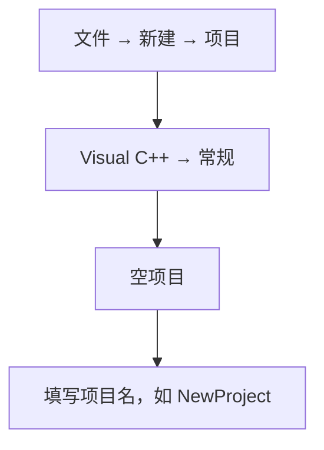
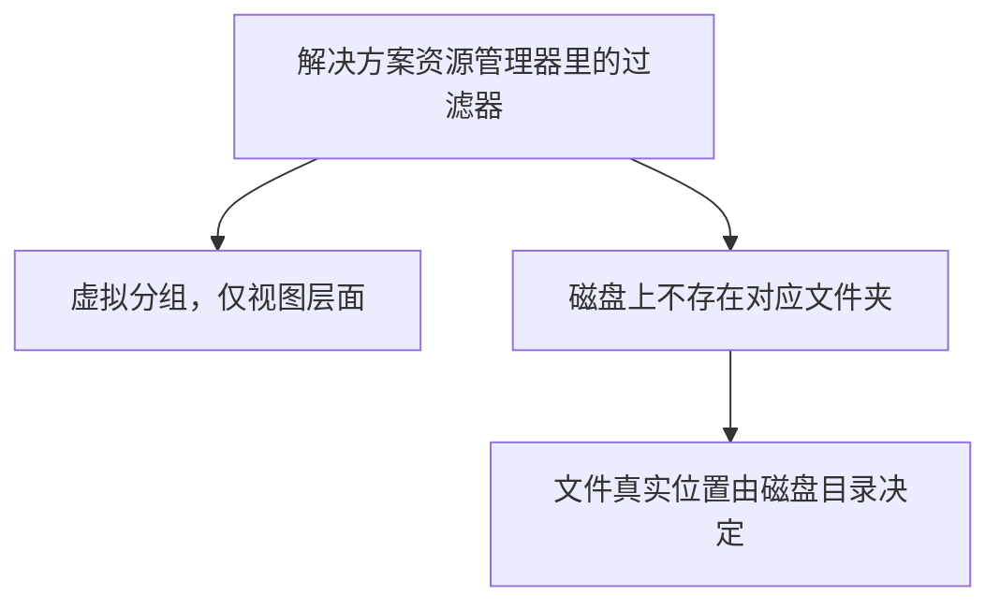

课程链接：视频《BEST Visual Studio Setup for C++ Projects!》（The Cherno C++ 系列 第 13 集）

YouTube 链接：（留空）

## 本节概述：把项目文件收拾得井井有条

新建 C++ 项目后，Visual Studio 默认生成的目录结构有点"反人类"——源码和项目文件混在一起，编译产物散落在两个不同的 Debug 文件夹里，新手常常找不到自己编译出的 .exe。本集介绍 Cherno 多年沿用的项目配置方案：项目放哪、源码怎么归类、编译产物统一输出到哪里，让每个项目都整洁可管理。


## 创建新项目：空项目起步

新建项目的路径：**文件 → 新建 → 项目 → Visual C++ → 常规（General）→ 空项目（Empty Project）**。空项目不预置任何代码文件，一切从零搭建，最干净。



## 项目放在哪：统一开发目录

项目不要存在默认的"用户文件夹"里，而是放在**磁盘根目录下的统一开发目录**，例如 `C:\dev`：

- 换电脑、换环境时路径不容易出问题（避免用户名等变化导致路径断裂）。
- 所有开发项目集中一处，方便管理和备份。

新建项目时勾选"**为解决方案创建目录（Create directory for solution）**"，Visual Studio 会自动建好项目文件夹，无需手写。

## 项目生成的文件：sln、vcxproj、filters

一个项目创建后，磁盘上会出现这些文件：

| 文件 | 格式 | 所在层级 | 作用 |
| --- | --- | --- | --- |
| `NewProject.sln` | 文本 | 解决方案目录（外层） | 解决方案文件，管理整个解决方案里的所有项目 |
| `NewProject.vcxproj` | XML | 项目目录（内层） | 项目文件，记录编译配置等一切项目设置 |
| `NewProject.vcxproj.filters` | XML | 项目目录（内层） | 过滤器文件，保存解决方案资源管理器里的虚拟分组 |
| `NewProject.vcxproj.user` | 文本 | 项目目录（内层） | 当前用户的 Visual Studio 项目配置（调试设置等） |

> [!NOTE]
> 默认情况下，解决方案名和项目名相同（都是 NewProject）。如果解决方案里只有一个项目，这没问题；但做游戏等大型工程时，一个解决方案往往含多个项目，届时通常会把解决方案和项目取不同的名字。

## 过滤器 ≠ 文件夹：虚拟分组

解决方案资源管理器里默认看到的"源文件""头文件""资源文件"是**过滤器（Filter）**，**不是磁盘上的真实文件夹**：

- 右键项目 → 添加，只有"新建筛选器"，没有"新建文件夹"。
- 新建一个筛选器，磁盘上**什么都不会多出来**。
- 文件放在哪个过滤器里、有没有放在过滤器里，**和它在磁盘上的实际位置毫无关系**——纯粹是视图层面的分组工具，可以随便拖动、随便删除，不影响编译。



所以：过滤器管"看起来整齐"，文件夹管"真正存放"。

## 显示所有文件：看清真实磁盘结构

想让解决方案资源管理器反映**真实的磁盘目录**，点项目旁的"**显示所有文件（Show All Files）**"小按钮。切换后：

- 视图展示的是硬盘上的真实目录结构。
- 右键 → 添加变成"**新建文件夹**"，真的会在磁盘上创建文件夹。


## 建 src 目录：源码与项目文件分离

Visual Studio 默认把新建的 `main.cpp` 直接丢在项目根目录，和 `.vcxproj` 挤在一起。更好的习惯：建一个 `src`（source，源码）文件夹，把**所有源码和头文件**都放进去：

1. 切到"显示所有文件"视图。
2. 新建文件夹，命名 `src`。
3. 把 `main.cpp` 拖进去（拖拽会**真实移动磁盘上的文件**）。

之后的磁盘结构是这样：`.sln` 留在外层解决方案目录，`.vcxproj` 等工程文件待在内层项目目录，源码全部收进 `src`，将来其他资源（图片、音频等）再各归其位：

```text
C:\dev\NewProject\              ← 解决方案目录（外层）
├── NewProject.sln
└── NewProject\                 ← 项目目录（内层，同名嵌套）
    ├── NewProject.vcxproj
    ├── NewProject.vcxproj.filters
    ├── NewProject.vcxproj.user
    └── src\
        └── main.cpp
```

## 默认输出目录的坑：两个 Debug

用默认配置编译 Hello World 后找 .exe，会踩一个经典的坑。编译完成后，磁盘上会出现**两个 Debug 文件夹**：

```text
C:\dev\NewProject\              ← 解决方案目录（外层）
├── Debug\                      ← 解决方案这一层：最终 exe 在这里
├── NewProject.sln
└── NewProject\                 ← 项目目录（内层）
    ├── Debug\                  ← 项目这一层：只有中间文件 .obj
    ├── NewProject.vcxproj
    └── src\
        └── main.cpp
```

输出窗口明明写着 exe 在 `NewProject\Debug\`，打开项目目录里的 Debug 一看，里面**只有中间文件（.obj），没有 exe**；再往上走一层，到**解决方案目录**的 Debug 文件夹里才找到 exe。

Visual Studio 默认把**中间文件**放在项目目录下，把**最终二进制**放在解决方案目录下，各建一个 Debug 文件夹。新手常常找不到编译出来的 exe。这个默认设置几乎所有专业开发者都会改掉——下面就是改法。

## 修改输出/中间目录：bin 方案

右键项目 → **属性（Properties）**，顶部配置选择"**所有配置（All Configurations）**"和"**所有平台（All Platforms）**"（这样一次改完全部生效）。找到**输出目录（Output Directory）**和**中间目录（Intermediate Directory）**，改成：

```text
输出目录：$(SolutionDir)bin\$(Platform)\$(Configuration)\
中间目录：$(SolutionDir)bin\intermediates\$(Platform)\$(Configuration)\
```

效果是把所有编译产物统一收到解决方案目录下的 `bin`（binary，二进制）文件夹里，按平台（Win32/x64）和配置（Debug/Release）分子目录：

```text
C:\dev\NewProject\                      ← 解决方案目录
├── NewProject.sln
├── NewProject\                         ← 项目目录
│   ├── NewProject.vcxproj
│   └── src\
│       └── main.cpp
└── bin\
    ├── Win32\                          ← 平台
    │   └── Debug\                      ← 配置
    │       └── NewProject.exe          ← 最终 exe
    └── intermediates\
        └── Win32\
            └── Debug\
                └── *.obj 等中间文件
```

这套方案的好处：

- **多项目共用**：当解决方案里有多个项目（比如主程序 + 几个 DLL），所有编译出的二进制都汇集到同一个 `bin` 文件夹，不用挨个项目目录去找。
- **中间文件单独放**：`intermediates` 单独一层，想拷贝纯二进制时，直接把对应平台的 `bin\Win32\Debug` 整个拷走即可，不会混入 .obj 等中间产物。

> [!NOTE]
> 输出目录、中间目录的路径都是**相对项目文件**的。`$(SolutionDir)` 是"解决方案目录"宏，`$(Platform)` 是平台（Win32 或 x64），`$(Configuration)` 是配置（Debug 或 Release）。这些宏值可以在 **编辑 → 宏（Macros）** 里查看，例如 `$(SolutionDir)` 展开后是 `C:\dev\NewProject\`。

## 双反斜杠陷阱

方案目录（`$(SolutionDir)`）、项目目录（`$(ProjectDir)`）这类宏的**结尾自带反斜杠**。如果照抄时不注意，写成：

```text
$(SolutionDir)\bin\...
```

就会出现 `C:\dev\NewProject\\bin\...` 的**双反斜杠**。虽然多数情况下仍能工作，但务必去掉重复的反斜杠，保持整洁。

## 清理旧产物

改完目录后，之前编译出的旧文件（项目目录里的 Debug 文件夹、默认的 bin 目录等）还留在磁盘上。右键项目 → **清理（Clean）** 不一定清得干净，最省事的办法是直接在资源管理器里**手动删除这些目录**，然后重新编译，目录结构就焕然一新。

## 本章小结

**项目组织**：项目统一放在 `C:\dev` 之类的根目录开发文件夹，勾选"为解决方案创建目录"；用 `src` 文件夹收纳全部源码，工程文件与代码分离。

**过滤器 vs 文件夹**：解决方案资源管理器里的"源文件/头文件"是虚拟过滤器，与磁盘无关；点"显示所有文件"才能看到并操作真实目录。

**编译产物重定向**：默认的"中间文件在项目目录、exe 在解决方案目录"很反直觉，改属性里的输出目录和中间目录为 `$(SolutionDir)bin\$(Platform)\$(Configuration)\` 与 `...bin\intermediates\...`，所有二进制统一进 bin、中间文件进 intermediates，多项目也能集中管理。路径宏末尾自带反斜杠，注意别写成双反斜杠。
