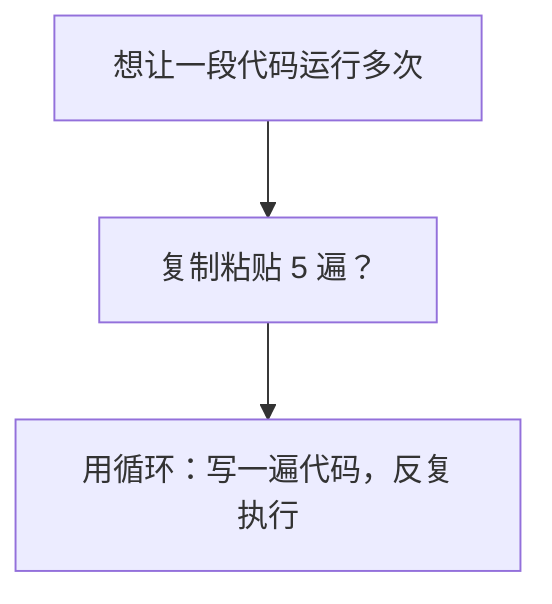
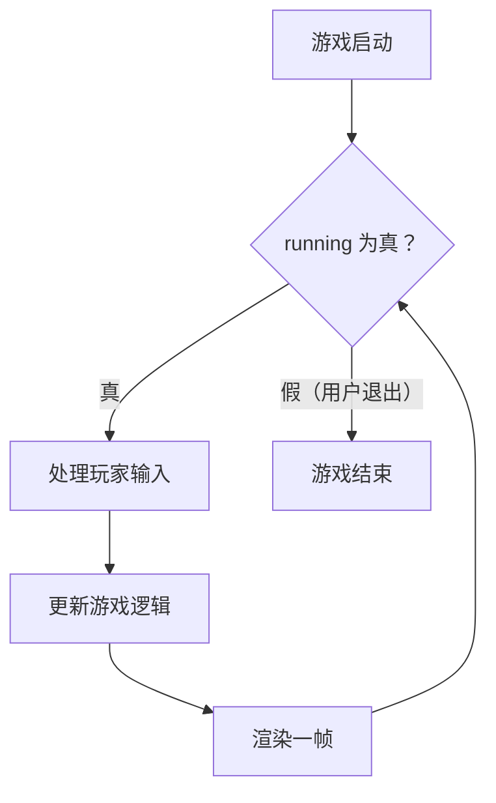
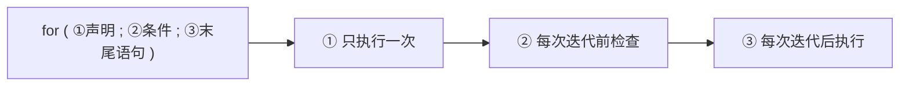
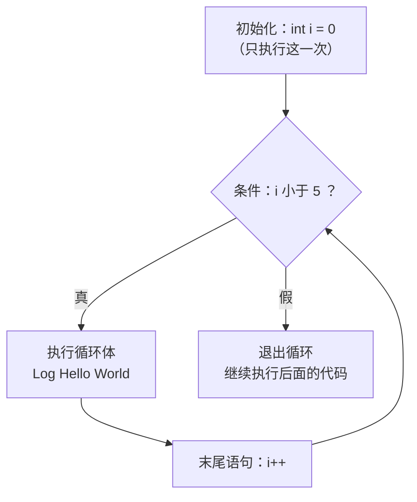
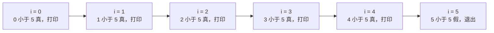
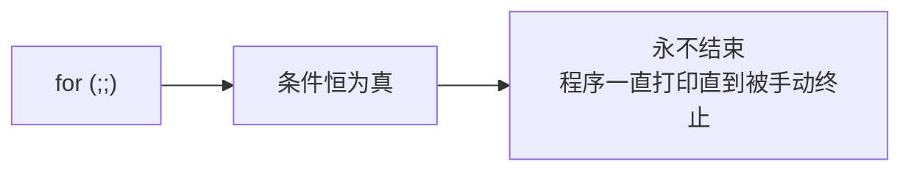
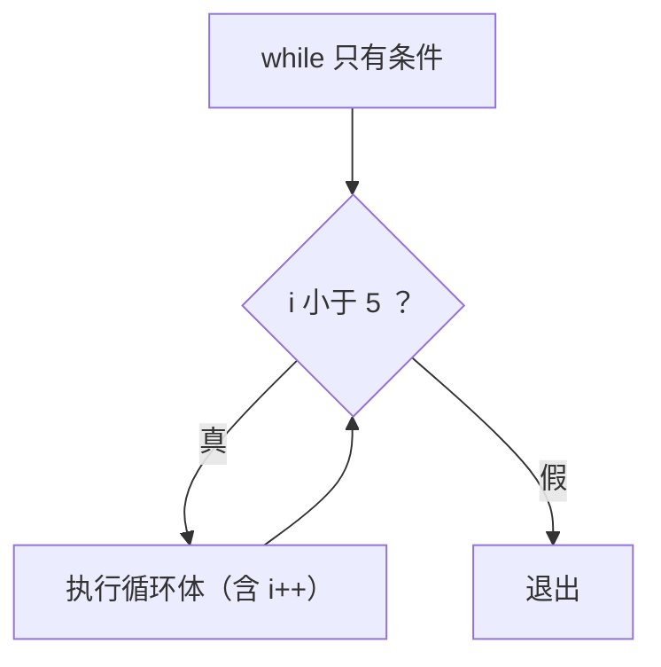
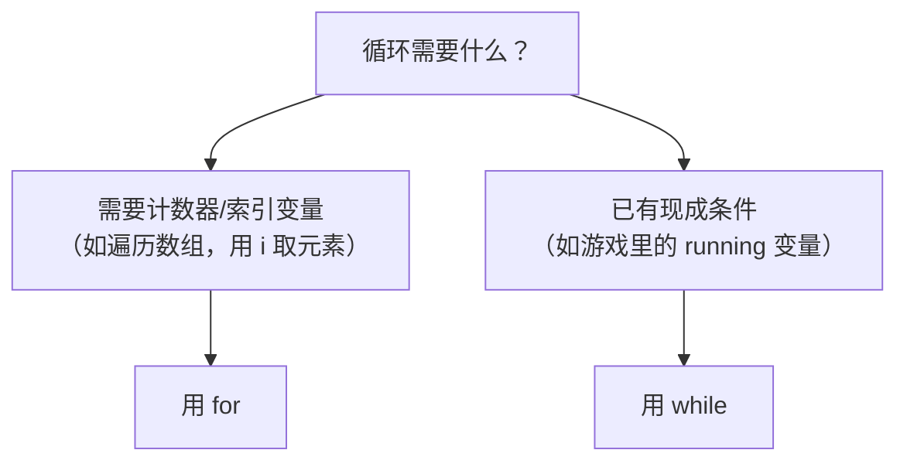
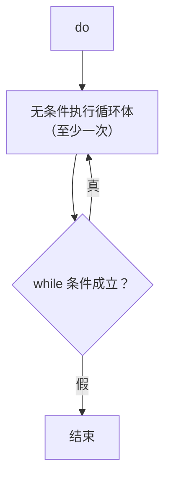

课程链接：视频《Loops in C++ (for loops, while loops)》（The Cherno C++ 系列 第 14 集）

YouTube 链接：（留空）

## 本节概述：让代码反复执行

写程序时常有"把同一件事重复做 N 遍"的需求。与其把代码复制粘贴 N 份，不如告诉程序"这段代码，给我跑 N 次"。这就是**循环（Loop）**。本集介绍 C++ 的三种循环：`for`、`while`、`do-while`，以及它们各自的适用场景。



## 循环是什么：为什么需要循环

最简单的例子：打印 "Hello World" 五次。可以复制粘贴五次 `Log("Hello World!")`，也可以写个函数调用五遍——但都太笨了。循环就是为此而生：**写一遍代码，让它按条件重复运行**。

循环还有个更宏大的用途——**游戏主循环（Game Loop）**。游戏不能只渲染一帧就退出，而是"只要游戏还在运行，就一帧接一帧地更新逻辑、渲染画面"。这正是循环在做的事：



循环是编程的核心工具，和上集的 `if` 一样重要，几乎每个程序都会用到。

## for 循环的三段式

`for` 循环由**三个部分**组成，彼此用**分号 `;`** 分隔：

```cpp
for (int i = 0; i < 5; i++)
{
    Log("Hello World!");
}
```

| 部分 | 示例 | 作用 |
| --- | --- | --- |
| ① 变量声明 | `int i = 0` | 在循环开始时执行**一次**，创建计数变量 |
| ② 条件 | `i < 5` | 每次迭代前检查，为真就继续执行循环体 |
| ③ 末尾语句 | `i++` | 每次迭代结束后、下次检查前执行 |



`i` 只是惯例命名（取 iterator"迭代器"之意），可以叫任何名字，也不必是整数、不必从 0 开始——它只是一个普通的变量。`i++` 等价于 `i += 1` 或 `i = i + 1`，即"每次把 i 加 1"。

## for 循环的执行流程

用调试器（或纸笔）跟踪一遍，for 循环的节奏非常清晰：



配合 `i` 的变化看：



流程：进入 for → 执行 `int i = 0`（仅一次）→ 检查 `i < 5`（0<5 真）→ 执行循环体打印一次 → 执行 `i++`（i 变 1）→ 再检查 `1 < 5`（真）→ …… 直到 `i = 5` 时 `5 < 5` 为假，循环结束，程序继续执行循环后面的代码（如 `std::cin.get()`）。整个过程循环体恰好跑了 5 次。

## for 循环的灵活性

三个部分不是死的，可以随意移动、替换甚至留空，行为完全不变：

**把声明和末尾语句挪出去**——效果相同：

```cpp
int i = 0;
for (; i < 5; )          // 声明挪到外面，i++ 挪进循环体
{
    Log("Hello World!");
    i++;
}
```

**用 bool 变量当条件**：

```cpp
bool condition = true;
for (int i = 0; condition; i++)
{
    if (i >= 5)
        condition = false;      // 手动让条件变为假
    Log("Hello World!");
}
```

这些写法只是"换了个样子"，程序行为一模一样。for 的三个部分可以是任意语句，甚至能调用函数——**只要能完成"初始化、判断、推进"就行，形式完全自由**。

## 死循环：条件永真

如果**省略条件**，等价于写 `true`——条件永远为真，循环永不结束：

```cpp
for (;;)
{
    Log("Hello World!");
}
```



运行它会一直打印 "Hello World"，直到你手动终止程序。死循环并不总是坏事——游戏主循环本质上就是"永不结束的循环"，需要退出时由内部逻辑（如 `running` 变为假）来打破。

## while 循环：只要条件成立就继续

`while` 循环**只有条件**，没有开头的声明和末尾的语句：

```cpp
int i = 0;
while (i < 5)
{
    Log("Hello World!");
    i++;              // 计数器需要自己写在循环体里
}
```



把前面的 for 循环改写成 while，需要：变量 `i` 在**循环外**声明，`i++` 手动写在**循环体末尾**——除此之外完全等价，两种循环输出一样。**for 和 while 没有任何本质区别，可以互换**，选哪个纯粹是惯例与风格问题。

## for vs while：怎么选



- **需要计数变量时用 for**：比如遍历一个有 10 个元素的数组，要精确跑 10 次，且 `i` 从 0 到 9 正好当**索引**（将来讲数组时会反复用这个模式）。
- **已有现成条件时用 while**：比如游戏循环——`running` 变量本来就存在，只需"只要 running 为真就一直跑"，不需要初始化计数器、不需要每轮改动它。

```cpp
bool running = true;
while (running)
{
    // 更新游戏、渲染一帧
}
```

## do-while 循环：至少执行一次

第三种循环 `do-while`，把条件放到了**最后**：

```cpp
int i = 0;
do
{
    Log("Hello World!");
    i++;
} while (i < 5);        // 注意结尾有分号
```



它与 `while` 的唯一区别：**循环体无论如何都会先执行一次**，再检查条件。看这个例子：

```cpp
bool condition = false;
while (condition)        // 条件一开始就是假：一次都不执行
{
    Log("Hello World!");
}

do                       // 即使条件为假：也先执行一次
{
    Log("Hello World!");
} while (condition);
```

`do-while` 用得不那么频繁，但在"至少要先做一次"的场景里有价值（比如先弹一次菜单，再根据选择决定是否继续）。实际项目中它的出场率远低于 `for` 和 `while`。

## 本章小结

**循环的本质**：把一段代码重复执行多次，替代笨拙的复制粘贴；游戏主循环"一帧帧跑下去"就是它的典型应用。

**for 循环**：三段式 `for (声明; 条件; 末尾语句)`——声明只跑一次，条件每次迭代前检查，末尾语句每次迭代后执行；三部分可以移动、替换、留空，省略条件即死循环。

**while 循环**：只有条件，计数器要自己在循环体里维护；与 for 完全等价可互换。

**选择惯例**：需要计数器/数组索引用 `for`；已有现成条件（如 `running`）用 `while`。

**do-while 循环**：条件放最后，循环体**至少执行一次**，与 while 的唯一区别。

**预告**：数组主题里，`for (int i = 0; i < 数组大小; i++)` 用 `i` 当索引遍历数组会反复出现；循环的底层汇编（CPU 指令）将来自有专门深挖。
