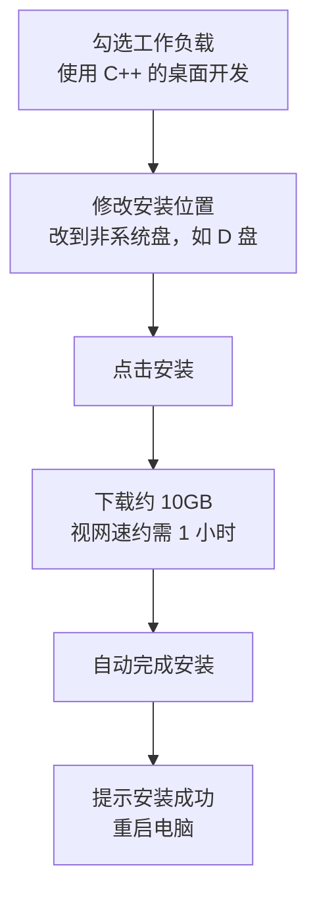

## 这一节要做什么

这一节的目标很简单：把写 C++ 代码所需要的环境装好，然后跑通第一段程序。

具体分成三步：先安装一个叫 Visual Studio 的集成开发环境，再用它创建一个空项目、写一段代码，最后运行起来，看到程序输出的结果。等这一步做完，后面所有内容就都有了可以动手实践的地方。


## 什么是 Visual Studio

Visual Studio 是一个**集成开发环境**，英文缩写 IDE，也就是 Integrated Development Environment。它主要用来写 C 和 C++，也可以写 C# 等其他语言。

初学阶段先记住它的定位就够了：它是一个"什么都有"的工作台。写代码用的编辑器、把代码变成可执行程序的编译器、查找程序问题的调试器，以及项目文件的管理，全都已经集成在里面。装好之后不用再做任何额外配置，直接就能写、能编译、能运行。


> [!NOTE]
> 所谓"集成"，就是把原本需要自己一个个下载、配置的工具打包在一起。这正是 IDE 相比"手动装编译器再配编辑器"最大的价值。

## 下载安装器

安装的第一步是拿到安装程序。打开 Visual Studio 官方网站，在页面上找到免费版的 Visual Studio，点击进入后选择"免费下载"。

下载下来的文件体积很小，它并不是完整的 IDE，而是一个**安装器**（installer）。它的作用是引导后续的下载与安装——真正的 IDE 体积要大得多，会在下一步里由它自动拉取。


## 选择工作负载并安装

双击安装器、确认继续之后，会进入"选择工作负载"的界面。这里要勾选的是**使用 C++ 的桌面开发**（Desktop development with C++），这一项才是写 C++ 程序所需要的。

界面上还会显示单个组件、语言包、安装位置等选项。单个组件不需要动；语言包默认就是中文。需要改的是**安装位置**：把默认的 C 盘改成其他盘，比如 D 盘。原因很直接——整套 IDE 加上组件大约有 10GB，装在系统盘会占用大量空间，放到别的盘更合适。

改好路径后点击安装，接下来就是等待。下载过程视网速而定，可能要一个小时左右；下载完成后安装会自动开始，装完会提示"已成功安装，请尽快重启"，点击确定后重启电脑即可。



> [!TIP]
> 安装位置尽量避开系统盘（通常是 C 盘）。开发工具会持续占用空间，放在数据盘能让系统盘保持清爽。

## 首次启动与初始化设置

重启后第一次打开 Visual Studio，会先进入初始化配置。

第一步会提示创建账户，这一步可以暂时跳过，不影响使用。接着选择开发设置，选 **Visual C++**。然后挑选配色主题，有深色和浅色可选，另外还有蓝色主题，按自己的喜好选一个即可。选完后启动，稍等片刻就会进入主界面。

## 创建第一个项目

进入主界面后，第一件事是**创建新项目**。

项目模板很多，初学阶段只需要关注其中两个：空项目和空控制台项目。下面那些更复杂的模板先不用管，这里选择**空项目**，点击下一步。

下一步是设置项目的位置和名称。位置同样建议放在非系统盘，比如先在 D 盘新建一个文件夹作为项目目录，命名成 project 之类都可以。项目名称这里填 hello world，然后点击创建。

创建完成后，界面可能会弹出介绍页面，直接关掉即可。


## 添加源文件

项目建好后，左侧的**解决方案资源管理器**里会列出项目结构，其中有一个叫**源文件**的节点。源文件用来存放代码，接下来就在这里添加第一个文件。

操作方式是：右键源文件，选择添加、新建项，在对话框里新建一个名为 **main.cpp** 的文件，点击添加。这里后缀名 `.cpp` 很重要，它正是 C++ 源文件的后缀，对应 C plus plus 的缩写。

文件建好后，在编辑区里按住 Ctrl 键滚动鼠标滚轮，可以缩放字体大小，调到看着舒服就行。


## 写下第一段代码

接下来在 main.cpp 里写第一段代码。这段代码只是用来验证环境是否可用，所以先照着敲，暂时不用深究每一行的含义，后面会逐步讲清楚。

```cpp
#include <iostream>

using namespace std;

int main() {
    cout << "Hello World" << endl;
    return 0;
}
```

这段代码一共八行，把中间两个空行去掉之后是六行。它的作用很简单：启动一个控制台窗口，并在里面打印出 Hello World 这行文字。

## 运行程序

代码写好后，在菜单栏找到**调试**，点击其中的**开始执行（不调试）**。

稍等片刻，屏幕上会弹出一个黑色的控制台窗口，里面显示刚才那段文字。能看到这个结果，就说明环境已经搭建成功——代码被编译、链接成了可执行程序，并且真的运行起来了。


## 回头看：环境搭建到底做了什么

回顾整个过程会发现，我们其实没有做任何复杂的配置：只是下载了一个安装器，让它自动完成安装，然后写几行代码就能运行了。

这正是集成开发环境的意义所在——它把编辑器、编译器、调试器等工具全部集成好，使用者不必逐个安装和配置，装完就能直接投入开发。这就是为什么用 IDE 起步，会比手动搭一套工具链省事得多。


## 本章小结

这一节没有涉及编程知识本身，但把最容易被卡住的一步解决了——环境。要点可以归为四点。

**其一**，Visual Studio 是一个集成开发环境，能写 C、C++、C# 等语言。它的核心价值是"集成"：编辑器、编译器、调试器、项目管理都在一个程序里，装完即用。

**其二**，安装流程是：官网下载安装器 → 运行并勾选"使用 C++ 的桌面开发"工作负载 → 把安装位置改到非系统盘 → 等待约 10GB 的下载与自动安装 → 重启。

**其三**，首次启动可跳过账户登录，开发设置选 Visual C++，再按喜好选主题；随后创建空项目、添加 main.cpp、写入第一段代码。

**其四**，通过"调试 → 开始执行（不调试）"运行程序，控制台成功打印出 Hello World，说明整套环境已经可用，后续内容可以随时动手实践。