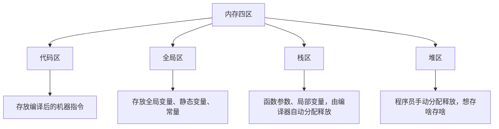
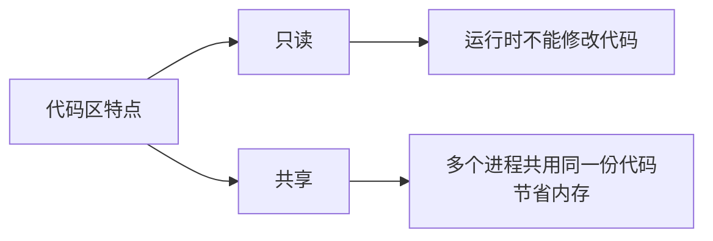
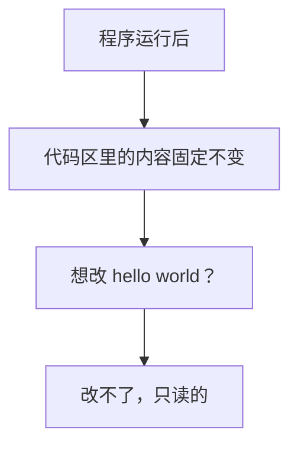
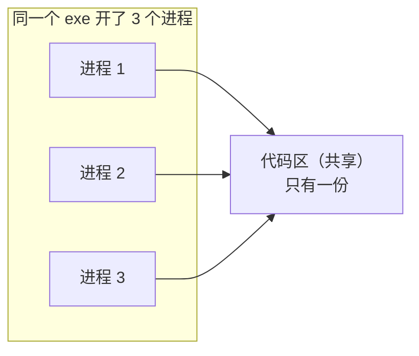
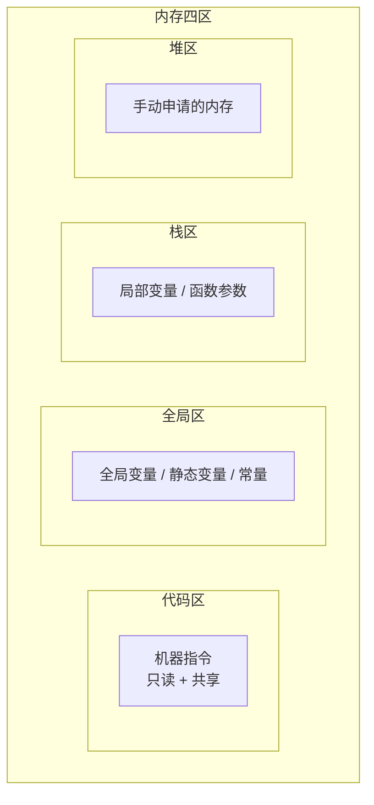

## 本节概述：C++ 的内存四区

这一节开始我们学习 C++ 的**内存四区**。注意是四个区域的"四区"，不是四驱车的四驱。

C++ 程序运行时，内存大致分成四个区域：



这节课我们先讲第一个区——**代码区**。

## 代码区存什么

你写的所有 C++ 代码，最终都会被编译器转换成**二进制的机器指令**（就是一堆 0 和 1），然后由操作系统统一管理。这些编译后的代码，就存放在**代码区**里。


举个最简单的例子：

```cpp
#include <iostream>
using namespace std;

void printMessage()
{
    cout << "hello world" << endl;
}

int main()
{
    printMessage();
    cin.get();
    return 0;
}
```

这段代码编译之后，`printMessage` 函数、`main` 函数里的所有指令，都会变成二进制数据存到代码区里。程序运行时，CPU 就从代码区里一条一条地读指令来执行。

## 代码区的两大特点

代码区有两个关键特性：**只读** 和 **共享**。



### 特点一：只读

程序运行起来之后，代码区里的内容是**只读的**——你只能读，不能改。

比如上面那段代码里有一句 `cout << "hello world"`，程序跑起来之后，你想把 "hello world" 改成别的文字，直接改代码区里的数据是做不到的。



为什么要设计成只读？原因很简单——如果代码能被随便改，一个 bug 就可能把程序的指令给改坏了，程序直接就崩了。只读是一种保护机制，让代码稳稳地待在那里。

> [!WARNING]
> 代码区的"只读"是程序运行时的保护机制。你改源码、重新编译，那是另一回事——重新编译生成新的 exe 文件，新的代码装进新的代码区，当然没问题。

### 特点二：共享

代码区是**共享**的。什么意思呢？就是同一个程序你开好几次，它们共用同一份代码。

我们可以做个实验：找到编译生成的 exe 文件，双击运行一个，再双击运行一个，再双击……能开一大堆窗口。



虽然有好几个进程在跑，但代码区里的指令是同一份。为什么可以这样？因为代码是**只读的**，反正谁都改不了，大家共用一份完全没问题。

共享的好处就是**省内存**。如果每个进程都单独存一份一模一样的代码，那就是浪费。代码只读 + 多进程共享，既安全又高效。

> [!TIP]
> 你可能会问：那每个进程的数据不一样怎么办？数据是放在全局区、栈区、堆区这些地方的，每个进程有自己独立的数据区域，互不干扰。代码大家共用，数据各用各的，这就是操作系统的设计思路。

## 内存四区总览（预告）

代码区讲完了，我们先对剩下三个区有个大概印象，后面几节会逐个深入：

| 区域 | 存什么 | 谁来管 |
|---|---|---|
| **代码区** | 编译后的二进制机器指令 | 操作系统管理，只读、共享 |
| **全局区** | 全局变量、静态变量、常量 | 程序启动时分配，结束时释放 |
| **栈区** | 函数参数、局部变量 | 编译器自动分配和释放 |
| **堆区** | 程序员手动申请的空间 | 程序员自己 new / delete |



接下来几节我们顺着全局区、栈区、堆区一个个讲。

## 本章小结

**代码区**存放编译后的二进制机器指令，是程序运行的"指挥中心"。

**两大特点**：
1. **只读**：程序运行后代码区的内容不能修改，防止代码被意外改坏
2. **共享**：同一个程序开多个进程，共用同一份代码，节省内存

**为什么只读 + 共享是绝配**：正因为只读，所以共享才安全——反正谁也改不了，大家各读各的，互不影响。

**内存四区预告**：代码区 → 全局区 → 栈区 → 堆区，接下来逐个展开。
