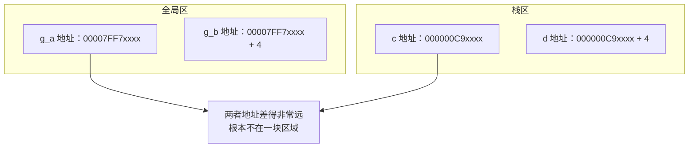
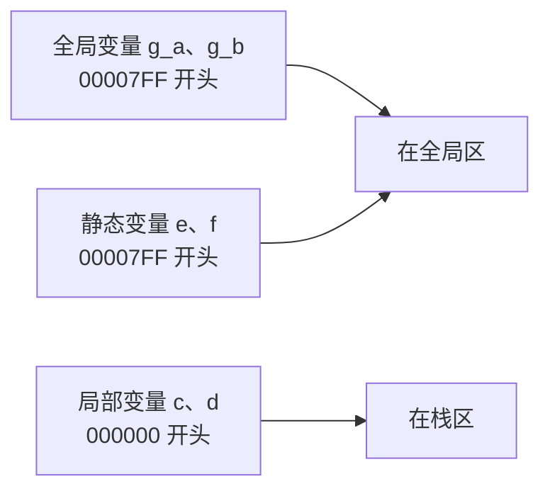
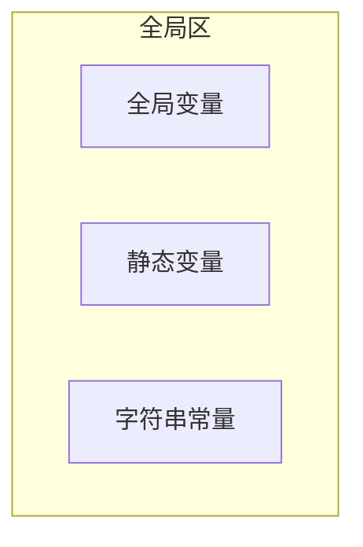
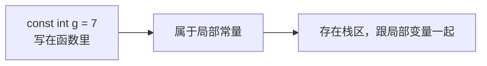
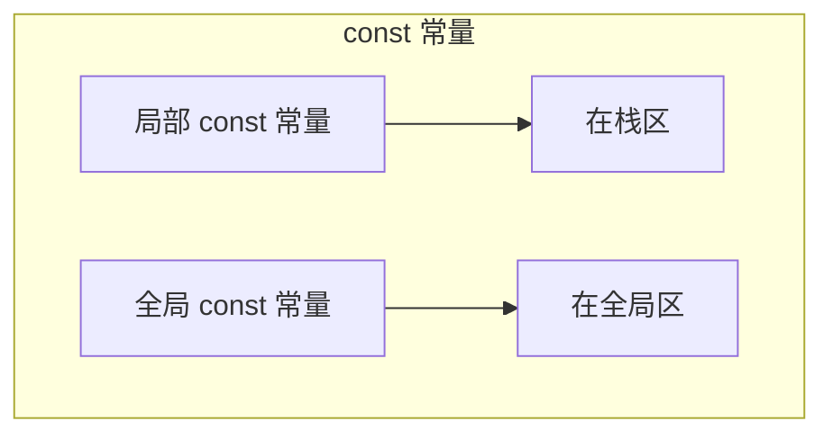
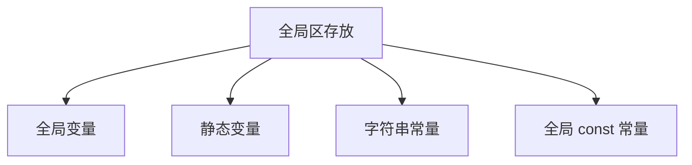

## 本节概述：全局区存了什么

上一节学了代码区，这一节学第二个区——**全局区**。

全局区到底存哪些数据？一句话先给答案：**全局变量、静态变量、全局常量、字符串常量**，这四类都在全局区里。

口说无凭，我们通过打印地址的方式一个个验证。

## 第一组：全局变量 vs 局部变量

先定义两个**全局变量**，再定义两个**局部变量**，把它们的地址都打出来对比：

```cpp
#include <iostream>
using namespace std;

// 全局变量：定义在函数外面
int g_a = 1;
int g_b = 2;

int main()
{
    // 局部变量：定义在函数内部
    int c = 3;
    int d = 4;

    cout << "全局变量 g_a 的地址：" << &g_a << endl;
    cout << "全局变量 g_b 的地址：" << &g_b << endl;
    cout << "局部变量 c 的地址：" << &c << endl;
    cout << "局部变量 d 的地址：" << &d << endl;

    return 0;
}
```

运行后你会发现一个明显的现象：



**观察结论：**
- 两个全局变量的地址挨得很近（差 4 字节，正好是一个 int 的大小）
- 两个局部变量的地址也挨得很近
- 但全局变量和局部变量之间，地址差了十万八千里

为什么？因为全局变量存在**全局区**，局部变量存在**栈区**——它们是内存中完全不同的两个区域，自然地址差很远。

> [!TIP]
> 怎么看出来两个变量在不在一个区？看地址的开头几位。全局变量一般是 `00007FF...` 开头，局部变量是 `000000...` 开头，一眼就能区分。

## 第二组：静态变量

再来看静态变量。静态变量用 `static` 关键字定义，虽然它写在函数里面，挨着局部变量，但它的位置可不一样。

```cpp
int main()
{
    int c = 3;
    int d = 4;

    static int e = 5;   // 静态变量
    static int f = 6;   // 静态变量

    cout << "静态变量 e 的地址：" << &e << endl;
    cout << "静态变量 f 的地址：" << &f << endl;

    return 0;
}
```

运行一看——静态变量的地址也是 `00007FF...` 开头，跟全局变量挨得非常近！



虽然静态变量写在函数里面，语法上像局部变量，但内存里它跟全局变量住在一块儿——都在**全局区**。

> [!NOTE]
> 静态变量为什么叫"静态"？因为它的内存在程序一开始就分配好了，程序结束才释放，不会像局部变量那样进函数才创建、出函数就销毁。它的生命周期是全局的，只是作用域被限制在函数内部。

## 第三组：字符串常量

接下来看常量。最简单的常量就是**字符串常量**，比如 `"hello world"` 这种用双引号括起来的文字。

```cpp
int main()
{
    cout << "字符串常量的地址：" << (void*)"英雄哪里出来" << endl;
    return 0;
}
```

> [!TIP]
> 字符串常量的名字本身就是地址，但 `cout` 遇到 `char*` 会当成字符串打印。要打印地址，需要用 `(void*)` 强转一下，跟之前打印字符数组地址是一个道理。

运行结果：字符串常量的地址也是 `00007FF...` 开头，跟全局变量、静态变量在一块。



所以**字符串常量也在全局区**。

## 第四组：const 修饰的常量

最后来看 `const` 修饰的常量。这里有个坑——const 常量不一定都在全局区，得分两种情况。

### 情况一：局部 const 常量

```cpp
int main()
{
    const int g = 7;   // 局部 const 常量
    const int h = 8;   // 局部 const 常量

    cout << "局部常量 g 的地址：" << &g << endl;
    cout << "局部常量 h 的地址：" << &h << endl;

    return 0;
}
```

运行一看——地址是 `000000...` 开头，跟局部变量在一起！

**结论：局部 const 常量不在全局区，在栈区。**



### 情况二：全局 const 常量

那如果 const 常量定义在函数外面呢？

```cpp
// 全局 const 常量：定义在函数外面
const int c_g_a = 3;
const int c_g_b = 4;

int main()
{
    cout << "全局常量 c_g_a 的地址：" << &c_g_a << endl;
    cout << "全局常量 c_g_b 的地址：" << &c_g_b << endl;
    return 0;
}
```

运行结果：地址是 `00007FF...` 开头，跟全局变量挨在一起。

**结论：全局 const 常量在全局区。**



> [!WARNING]
> 别看到 `const` 就以为一定在全局区！关键看它定义在哪里——定义在函数外面的才在全局区，定义在函数里面的跟局部变量一样在栈区。

## 总结：全局区到底存了什么

通过上面四组实验，答案就很清楚了：



| 数据类型 | 在不在全局区 | 备注 |
|---|---|---|
| 全局变量 | ✅ 在 | 定义在函数外面的变量 |
| 静态变量（static） | ✅ 在 | 即使写在函数里，也在全局区 |
| 字符串常量 | ✅ 在 | `"hello"` 这种双引号字符串 |
| 全局 const 常量 | ✅ 在 | const 定义在函数外面 |
| 局部变量 | ❌ 不在 | 在栈区 |
| 局部 const 常量 | ❌ 不在 | 也在栈区 |

## 本章小结

**全局区**存放四类数据：**全局变量、静态变量、字符串常量、全局 const 常量**。

**验证方法**：打印地址看开头——全局区的地址一般是 `00007FF...` 开头，栈区的是 `000000...` 开头，差得很远。

**几个容易搞错的点：**
1. 静态变量虽然写在函数里，但不在栈区，在全局区
2. 局部 const 常量不在全局区，在栈区（只有全局 const 常量才在全局区）
3. 字符串常量在全局区，不是在代码区

**一句话记牢**：全局的、静态的、字符串常量、全局 const——这四位住全局区。
