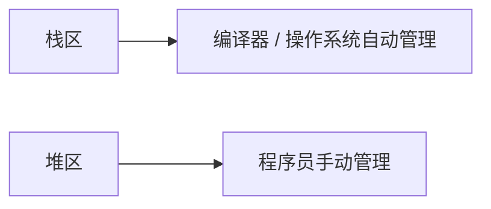
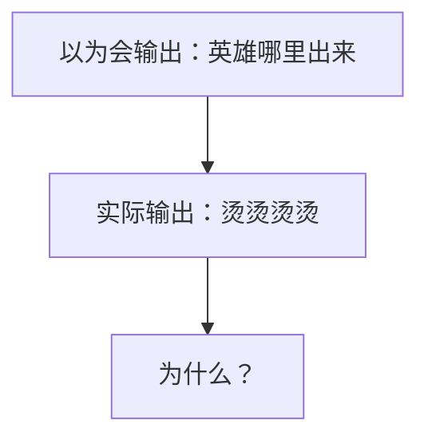
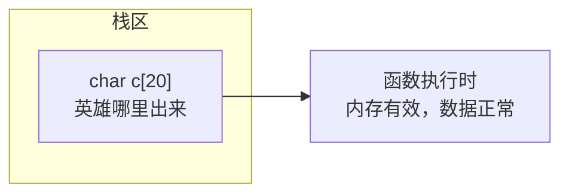
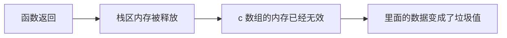
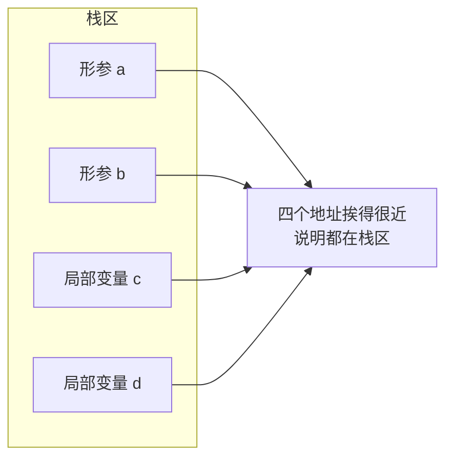
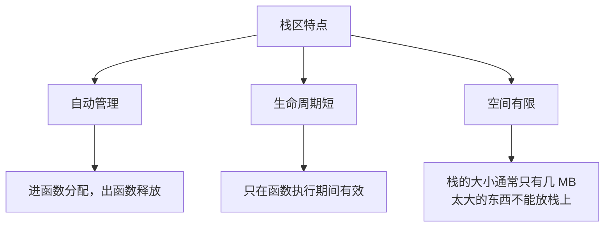

## 本节概述：栈区是什么

内存四区已经讲了两个（代码区、全局区），这一节讲第三个——**栈区**。

栈区和堆区有个共同点：它们的内存都是在**程序运行过程中**动态申请和释放的，不是程序一启动就分好的。

但它们的管理者不一样：



栈区里存什么？两类东西：**函数的参数** 和 **局部变量**。

> [!NOTE]
> 这里的"栈"是内存分区的栈，和数据结构里的"栈（后进先出）"是两个概念，别搞混了。当然它们确实有点关系——内存栈区的分配方式也是"后进先出"的，所以才叫栈区。

## 经典坑：返回局部变量的地址

先看一段代码，你猜猜输出什么：

```cpp
#include <iostream>
using namespace std;

char* func()
{
    char c[20] = "英雄哪里出来";
    return c;   // 返回数组首地址
}

int main()
{
    cout << func() << endl;
    return 0;
}
```

你可能以为会输出 "英雄哪里出来"，但实际运行后——输出的是一堆乱码（类似"烫烫烫烫"）。



为什么会这样？我们一步步拆解。

### 第一步：函数执行时，数组在栈上

调用 `func()` 的时候，函数里的局部变量 `c` 被创建在**栈区**里。



这时候 `c` 里面存的确实是 "英雄哪里出来"，一切正常。

### 第二步：函数返回，栈内存被释放

函数执行完 `return c` 之后，`func` 就结束了。函数一结束，它在栈区占用的内存就被**自动释放**了——意思就是这块内存不归你用了，里面的数据也不作数了。



虽然返回值还是那个地址，但地址指向的内存已经被回收了，里面存的什么东西谁也不知道——于是就打印出了乱码。

### 第三步：这就是野指针

指向一块已经被释放的内存的指针，叫做**野指针**。拿着野指针去读数据，读到的都是垃圾。

> [!WARNING]
> **铁律：不要返回局部变量的地址！**
>
> 局部变量存在栈区，函数结束内存就被释放了，返回出去的地址是个野指针，访问它是未定义行为——可能乱码、可能崩溃、也可能碰巧正常，但都是错的。

### 容易搞混的点：字符串常量去哪了

有人可能会问：`"英雄哪里出来"` 不是字符串常量吗？上节课不是说字符串常量在全局区吗？为什么也会出问题？

注意区分两个东西：

```mermaid
flowchart TB
    A['"英雄哪里出来" 字符串常量'] --> B["在全局区，不会被释放"]
    C["char c[20] 数组变量"] --> D["在栈区，函数结束就释放"]
    B --> E["常量的值被拷贝进了数组"]
    D --> E
```

`"英雄哪里出来"` 这个字符串常量确实在全局区，它不会被释放。但是——`char c[20]` 是一个**局部数组变量**，它把字符串常量的内容**拷贝**了一份到自己的栈空间里。

函数返回时，被释放的是数组 `c` 的栈内存，不是字符串常量本身。我们返回的是 `c` 的地址（数组首地址），指向的是栈区那块已经被释放的内存，所以才出问题。

> [!TIP]
> 怎么判断？看变量本身在哪。`c` 是定义在函数里的字符数组，它本身就是个局部变量，所以它的内存在栈区。

## 验证：函数参数也在栈区

除了局部变量，**函数的参数（形参）** 也存在栈区上。我们来验证一下：

```cpp
void test(int a, int b)   // a 和 b 是形参
{
    int c = 3;            // c 和 d 是局部变量
    int d = 4;

    cout << "形参 a 的地址：" << &a << endl;
    cout << "形参 b 的地址：" << &b << endl;
    cout << "局部变量 c 的地址：" << &c << endl;
    cout << "局部变量 d 的地址：" << &d << endl;
}

int main()
{
    test(5, 6);
    return 0;
}
```

运行之后你会发现，`a`、`b`、`c`、`d` 四个变量的地址挨得非常近，开头几位都一样。



形参和局部变量地址挨在一起，说明它们都住在栈区里。

> [!NOTE]
> 形参本质上也是函数的"局部变量"，只是它的值是从调用方传进来的。函数一结束，形参和局部变量一起被释放。

## 栈区的特点总结



**栈区三大特点：**

1. **自动管理**：不用你手动申请、手动释放，编译器帮你搞定。进函数分配，出函数自动回收。
2. **生命周期短**：只在函数执行期间有效，函数一结束就没了。所以不能返回局部变量的地址。
3. **空间有限**：栈的大小一般就几 MB（具体取决于编译器和系统），太大的数据（比如一个很大的数组）不能往栈上放，会栈溢出。

## 本章小结

**栈区**存放函数参数和局部变量，由编译器自动分配和释放。

**最容易踩的坑**：不要返回局部变量的地址。函数结束后栈内存被释放，返回的地址成了野指针，访问它会读到垃圾数据甚至崩溃。

**一个容易混淆的点**：字符串常量在全局区，但如果把它赋值给局部数组变量，数组本身在栈区——被释放的是数组的内存，不是常量本身。

**形参也在栈区**：函数的参数和局部变量地址挨得很近，它们都住在栈区，函数结束后一起被释放。

**栈区三个关键词**：自动、短命、空间小。
