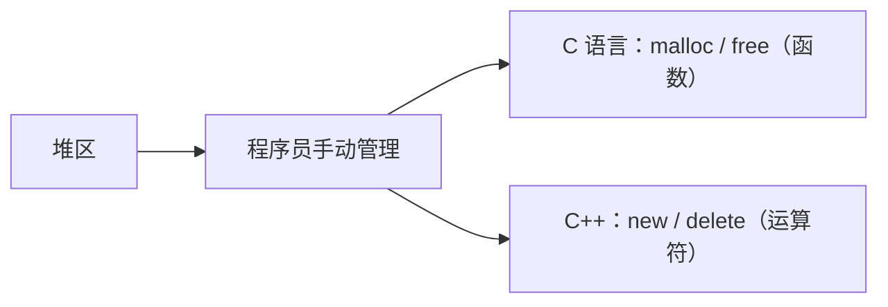
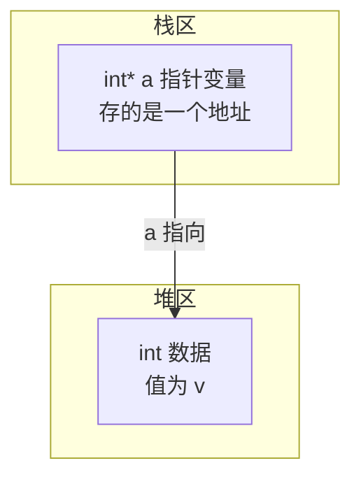
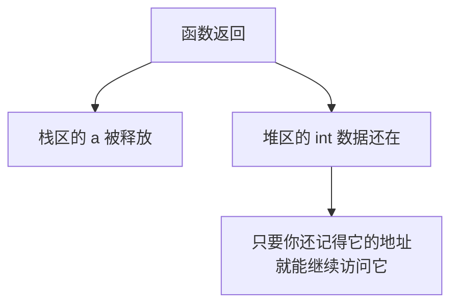
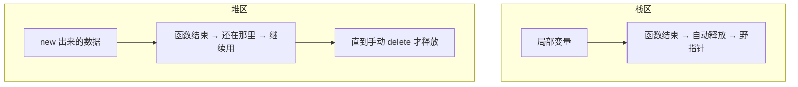
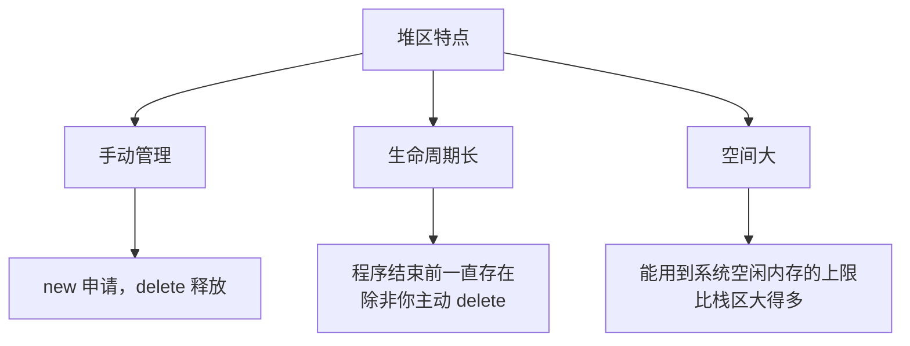

## 本节概述：堆区是什么

内存四区最后一个——**堆区**。

堆区的内存由**程序员自己**申请和释放，你想要多少就申请多少，不用了就自己还回去。在 C 语言里用 `malloc` 和 `free` 两个函数来操作；到了 C++ 里，换成了 **`new`** 和 **`delete`** 两个运算符。



> [!NOTE]
> `malloc` / `free` 是函数，`new` / `delete` 是运算符——这是它们语法层面的区别。当然更深层的区别还涉及构造函数、析构函数的调用，后面学了面向对象就懂了。

## 来个例子：用 new 申请堆内存

我们写一个函数，在堆区申请一块 int 大小的内存，赋值后返回它的地址：

```cpp
#include <iostream>
using namespace std;

int* getValue(int v)
{
    int* a = new int(v);   // 在堆区申请一个 int，初始值为 v
    return a;              // 返回堆区内存的地址
}

int main()
{
    int* p = getValue(1314);
    cout << *p << endl;    // 解引用，输出 1314
    return 0;
}
```

运行结果：**1314**。

哎？上一节栈区我们说"不要返回局部变量的地址"，怎么这里返回地址就没问题了？

关键区别来了——**一个在栈上，一个在堆上**。

## 关键区别：栈上的指针 vs 堆上的数据

仔细看这行代码：

```cpp
int* a = new int(v);
```

这行代码其实涉及两块内存，得把它们分清楚：



- **`a` 本身**：是一个指针变量，存在**栈区**（因为它是函数里的局部变量）
- **`a` 指向的那块内存**：是用 `new` 申请的，存在**堆区**

函数返回的时候：



栈上的指针 `a` 确实被释放了，但 `a` 里面存的**地址值**被返回给了调用方（存到了 `main` 里的 `p` 中）。`p` 拿着这个地址，就能找到堆区里那块数据——因为堆区的内存不会因为函数结束而自动释放。

> [!TIP]
> 怎么理解？打个比方：
> - 栈区变量像酒店房间——你退房（函数结束）就不能再进去了
> - 堆区内存像你自己买的房子——只要你有钥匙（地址），什么时候都能进，直到你主动卖掉（delete）

## 对比一下：栈返回地址 vs 堆返回地址

| 情况 | 数据在哪 | 函数返回后还能用吗 |
|---|---|---|
| 返回局部变量的地址 | 栈区 | ❌ 不能，内存被释放了，野指针 |
| 返回 new 出来的地址 | 堆区 | ✅ 能，内存还在，直到你手动 delete |



## 堆区的特点



**堆区三大特点：**

1. **手动管理**：你不调用 `delete`，它就一直占着。好处是灵活，坏处是容易忘——忘了释放就会造成**内存泄漏**。
2. **生命周期长**：从 `new` 的那一刻起就存在，直到你 `delete` 或者程序结束。跨函数使用完全没问题。
3. **空间大**：堆区能用到的空间比栈区大得多，大数据都往堆上放。

> [!WARNING]
> **new 和 delete 必须配对使用**。有 new 就要有 delete，光申请不释放，内存会越用越少，这就是内存泄漏。后面我们会专门讲 delete 的用法。

## 本章小结

**堆区**由程序员手动管理，用 `new` 申请，用 `delete` 释放。

**new 做了两件事**：
1. 在堆区分配一块指定大小的内存
2. 返回这块内存的首地址

**一个容易搞混的点**：指针变量本身在栈区，但它指向的内存可以在堆区。函数返回时，指针变量被释放了，但它指向的堆内存还在——只要你把地址传出来，外面还能继续用。

**和栈区的核心区别**：
- 栈区：自动分配释放，函数结束就没了，不能返回局部变量地址
- 堆区：手动申请释放，想存多久存多久，返回地址没问题

**下节预告**：new 和 delete 的具体用法，以及怎么用它们来操作数组。
