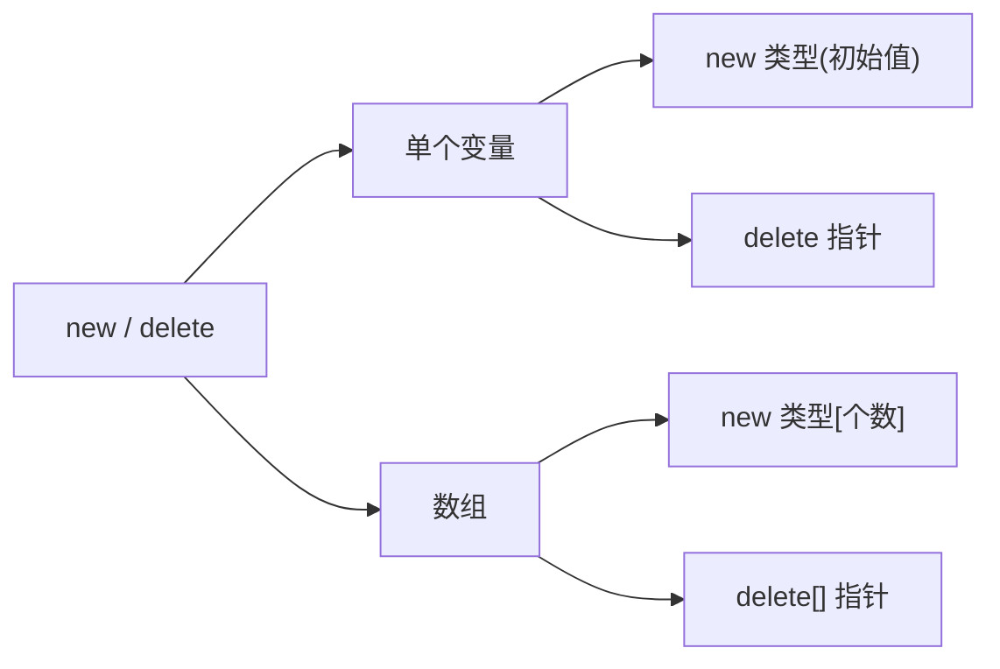
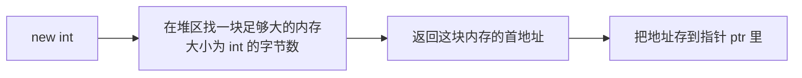
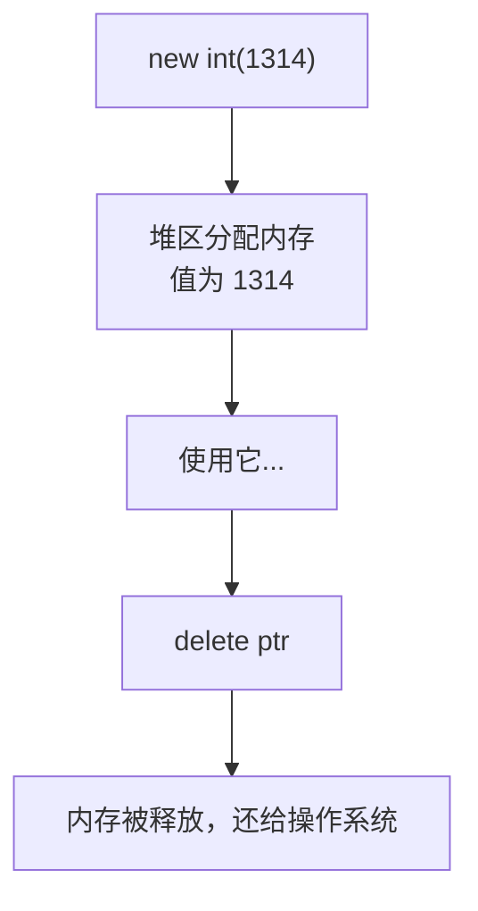
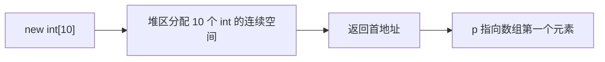
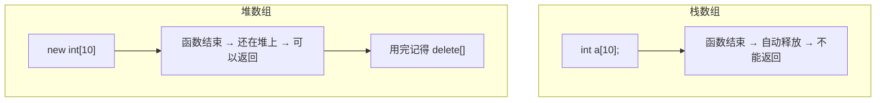
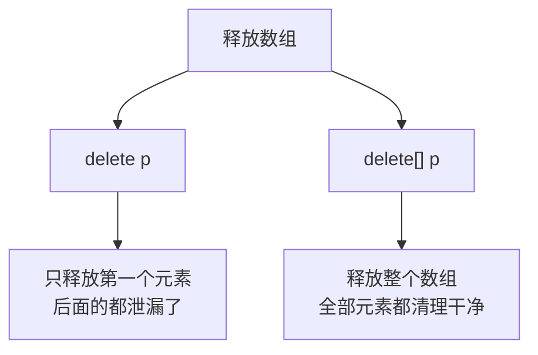
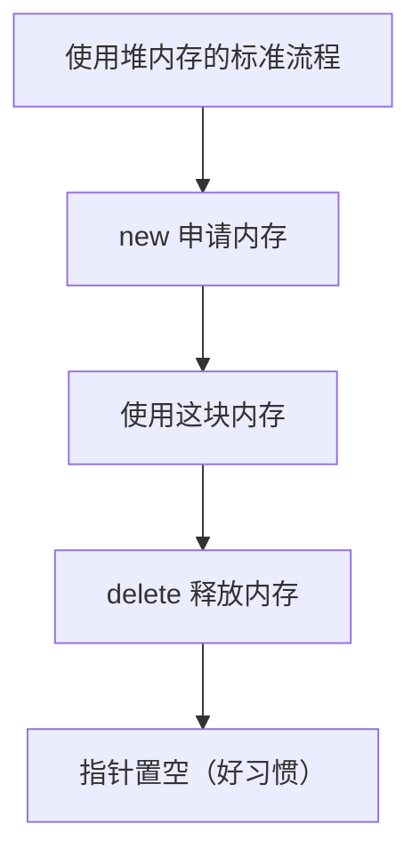

## 本节概述：new 和 delete 的用法

上一节我们知道了堆区由程序员手动管理，用 `new` 申请、用 `delete` 释放。这一节我们把具体用法讲透——从单个变量到数组，从申请到释放，一次性搞定。



## 一、单个变量的申请和释放

### new 申请内存

想要在堆区申请一个 `int` 大小的空间，直接写：

```cpp
int* ptr = new int;
```

这行代码做了三件事：



> [!WARNING]
> 这样直接 `new int` 申请的内存，里面的值是**未定义的**（也就是随机垃圾值）。申请出来之后最好立刻赋个值，不然读到什么东西谁也说不准。

### 两种初始化方式

想给新申请的内存一个初始值，有两种办法：

**方式一：new 的时候直接初始化（推荐）**

```cpp
int* ptr = new int(1314);   // 申请的同时初始化为 1314
```

在类型后面加个括号，把初始值放进去，一句话搞定，干净利落。

**方式二：先申请，再用解引用赋值**

```cpp
int* ptr = new int;
*ptr = 520;                // 通过解引用往内存里写值
```

申请出来之后，通过 `*ptr` 解引用，往里面写值。两种方式都可以，第一种更省事。

### delete 释放内存

内存用完了，必须释放掉，不然就会造成**内存泄漏**。

```cpp
delete ptr;    // 释放 ptr 指向的堆内存
```

语法很简单：`delete` 后面直接跟指针变量名就行。new 的时候要写类型（告诉编译器申请多大），delete 的时候不需要——指针自己知道指向哪里。



> [!WARNING]
> **内存泄漏**：申请了内存却不释放，程序跑着跑着可用内存越来越少。短的小程序可能感觉不到，但长期运行的程序（比如服务器）会出大问题。记住：有 new 就必须有 delete。

### 释放后的指针是野指针

`delete` 释放了内存，但指针变量 `ptr` 本身还在，它存的地址也没变——只是那块地址的内存已经不归你用了。这时候的 `ptr` 就成了**野指针**。

如果你再去访问它：

```cpp
delete ptr;
*ptr = 100;   // 错误！野指针写入，会崩溃
```

运行后会报"写入访问权限冲突"之类的错误——内存都还回去了，你还往里写东西，当然不行。

### 好习惯：释放后置空

怎么避免野指针误用？释放完之后立刻把指针置空：

```cpp
delete ptr;
ptr = NULL;    // 或者 ptr = nullptr;
```

置空之后，别人用之前可以先判断一下：

```cpp
if (ptr != NULL)
{
    // 指针不为空，才去访问
    cout << *ptr << endl;
}
```


> [!TIP]
> 这是一个非常重要的编程习惯。delete 之后顺手把指针置成 NULL，花不了一秒钟，能帮你避开很多难以调试的 bug。

## 二、数组的申请和释放

单个变量搞定了，那数组呢？数组也能在堆上申请，而且用得更多——因为栈的空间有限，大点的数组都得放堆上。

### new[] 申请数组

语法很简单，在类型后面加个方括号，里面写元素个数：

```cpp
int* p = new int[10];    // 在堆上申请一个 10 个 int 的数组
```



### 为什么不用栈上的数组？

你可能会问：直接 `int a[10];` 不就行了，干嘛要 new？

因为**栈上的数组不能作为返回值**——函数一结束，栈内存就释放了，返回出去就是野指针。但堆上的数组可以——你不 delete 它就一直在。



### 实战例子：返回差值数组

我们来写一个实际的函数：传入一个数组，返回一个新数组，新数组的每个元素是原数组相邻两个元素的差值。

比如原数组是 `1 5 6 4 ...`，差值数组就是 `4 1 -2 ...`（元素个数比原数组少 1）。

```cpp
#include <iostream>
using namespace std;

int* getGapList(int arr[], int size)
{
    // 在堆上申请一个 size-1 大小的数组
    int* p = new int[size - 1];

    for (int i = 0; i < size - 1; i++)
    {
        p[i] = arr[i + 1] - arr[i];   // 相邻两数的差值
    }

    return p;   // 返回堆数组的首地址
}

int main()
{
    int arr[] = { 1, 5, 6, 4, 4, 3, 3, 2, 1, 9 };
    int* p = getGapList(arr, 10);

    // 打印差值数组（9 个元素）
    for (int i = 0; i < 9; i++)
    {
        cout << p[i] << " ";
    }
    cout << endl;

    // ... 用完记得释放

    return 0;
}
```

运行结果：

```
4 1 -2 0 -1 0 -1 -1 8
```


因为差值数组是在堆上申请的，所以函数返回之后依然有效，`main` 函数里可以正常使用。

### delete[] 释放数组

数组用完了怎么释放？注意跟单个变量不一样——要加个方括号：

```cpp
delete[] p;    // 释放数组，方括号不能丢
p = NULL;
```

**为什么要加 `[]`？** 因为 `delete p` 只会释放首地址那一个元素的内存，后面的都漏掉了，造成内存泄漏。加了 `[]`，编译器才知道这是个数组，要把所有元素的内存都释放掉。



> [!WARNING]
> **new 和 delete 的配对规则：**
> - `new` 配 `delete`（单个变量）
> - `new[]` 配 `delete[]`（数组）
>
> 千万别搞混了。用 new[] 申请的，必须用 delete[] 释放，不然要么内存泄漏，要么程序崩溃。

## 三、new / delete 总结

把所有用法整理成一张表：

| 场景 | 申请 | 释放 |
|---|---|---|
| 单个变量 | `new 类型` 或 `new 类型(初始值)` | `delete 指针` |
| 数组 | `new 类型[个数]` | `delete[] 指针` |



**几个好习惯：**
1. new 和 delete 配对使用，有借有还
2. 释放后把指针置为 NULL，避免野指针
3. new[] 一定要配 delete[]，别漏了方括号
4. 不确定指针是否有效时，先判空再使用

## 本章小结

**单个变量**：`new 类型(初始值)` 申请，`delete 指针` 释放。申请时可以用括号初始化，也可以申请完了解引用赋值。

**数组**：`new 类型[个数]` 申请，`delete[] 指针` 释放。方括号是关键——申请时加了 `[]`，释放时也必须加 `[]`，否则只释放第一个元素，造成内存泄漏。

**为什么用堆数组**：栈数组函数结束就释放，不能作为返回值；堆数组生命周期由你控制，可以跨函数使用。

**两个好习惯**：delete 后置空指针、使用前判空——这两条能帮你避开 90% 的指针坑。
