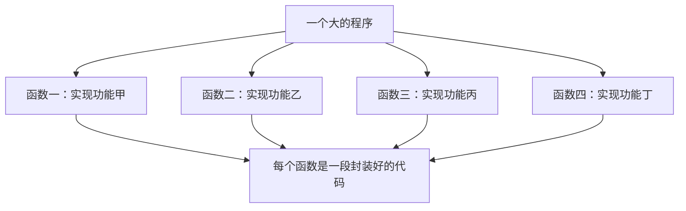
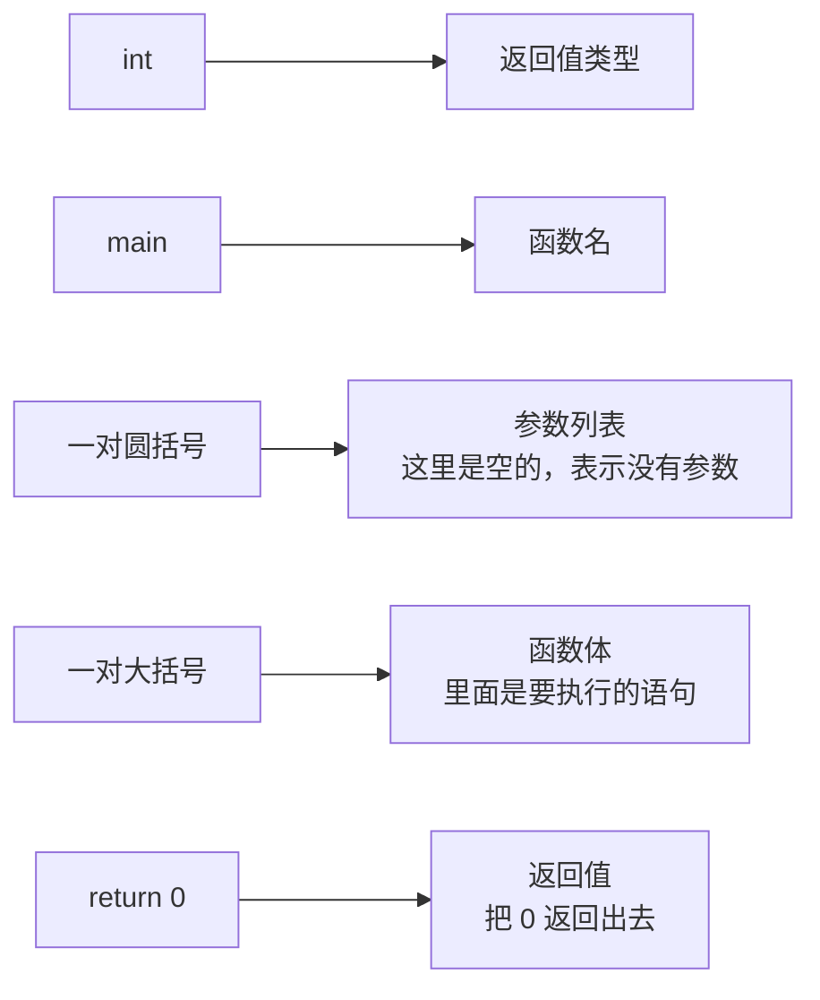
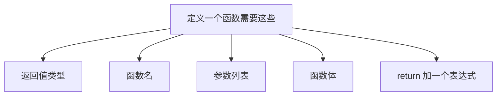
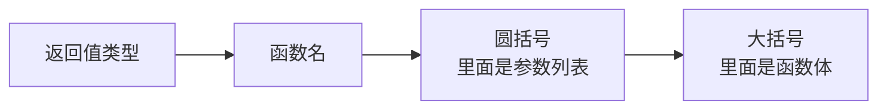
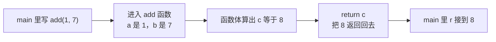
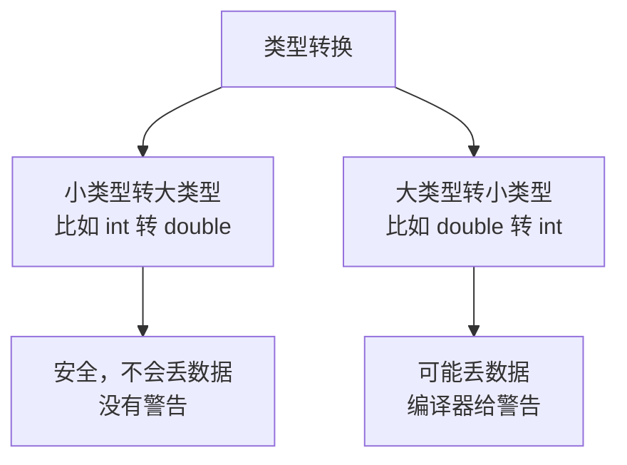
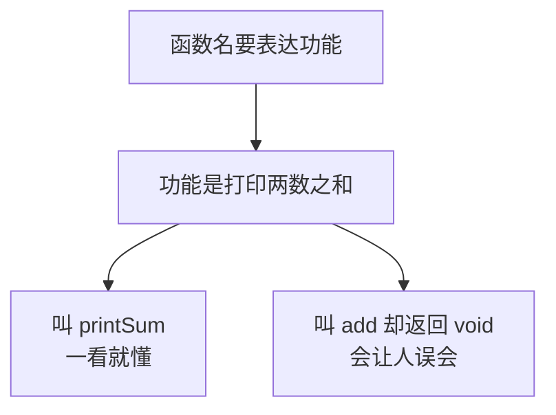
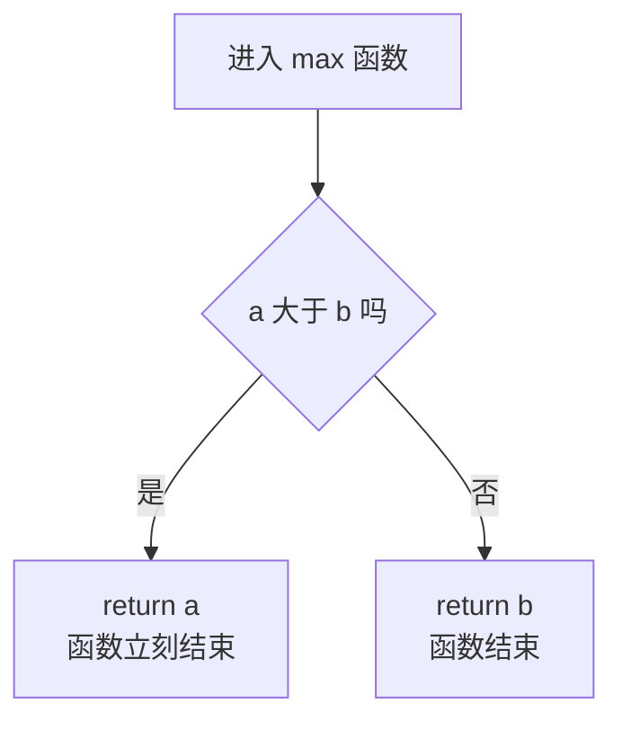
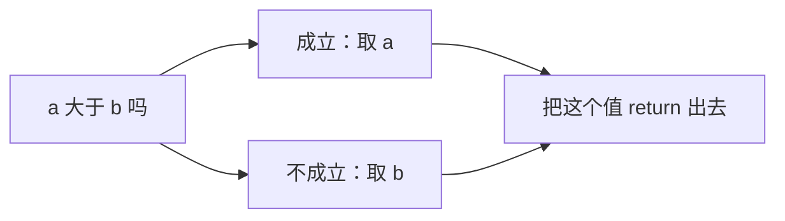

## 函数是什么

写程序写到一定规模，就会遇到一个问题：有些代码反复要用。比如求和、求最大值、打印一段内容，这些逻辑可能在这个地方写一遍、在那个地方又写一遍，代码越堆越长，改起来还容易漏改。

**函数**就是用来解决这个问题的：它把一些**经常用到的代码封装起来**，起一个名字，之后想用的时候直接叫这个名字就行。这样一来，重复的代码就减少了，也就是常说的"减少冗余代码"。

一个大的程序其实是由很多很多**程序块**组成的，每个模块实现一个特定的功能。函数就是这些程序块最基本的组织单位。

函数的英文是 **function**，而 function 本身也是"**功能**"的意思——这个词是从英文翻译过来的。这个名字其实已经点明了函数的本质：**一个函数就是一项功能**。



## 函数的组成

其实我们**一直在写函数**，只是没意识到而已。看这个最熟悉的程序：

```cpp
#include <iostream>

using namespace std;

int main() {
    cout << "Hello World" << endl;
    return 0;
}
```

这个 `main` 就是一个函数，而且它已经包含了定义一个函数所需要的**全部基本元素**。把它拆开看：



对照着看：`int` 是**返回值类型**，`main` 是**函数名**，`main` 后面那对圆括号是**参数列表**——这里是空的，说明它是个**空参函数**，不需要传任何东西进去；一对大括号包起来的部分是**函数体**，里面写着要执行的语句；最后 `return 0` 是**返回值**，把 0 这个值返回出去。



## 函数的定义语法

### 语法格式

把上面这些元素按顺序摆好，就是定义函数的语法：

```text
返回值类型 函数名(参数列表) {
    函数体
    return 表达式;
}
```

逐段说明一下。**返回值类型**写在最前面，可以是整型、浮点型、字符串类型、字符类型等等，之前讲过的所有数据类型都能当返回值类型。接着是**函数名**，后面跟一对**圆括号**——这个圆括号是固定语法，必须写，括号里放的是**参数列表**。再后面是一对**大括号**，大括号里面就是**函数体**。



**函数体是干什么的？** 就是写各种编程语句的地方，可以任意发挥：顺序结构、分支结构、循环结构都能写，想写多复杂就写多复杂。但不管函数体里做了什么，最后**一定要 return 一个值**，这个值可以是数字，也可以是一个表达式。

### 一个加法函数

理论说完了，来写一个真的函数。比如要写一个**加法函数**：

```cpp
#include <iostream>

using namespace std;

int add(int a, int b) {
    int c = a + b;
    return c;
}

int main() {
    int r = add(1, 7);
    cout << r << endl;
    return 0;
}
```

照着语法一段段对照：加法的结果是个整数，所以**返回值类型**写 `int`；函数的作用是加法，所以**函数名**叫 `add`；要做加法需要两个操作数，所以**参数列表**里写两个参数 `int a, int b`。

这里有个容易漏的点：**传参数的时候一定要指定类型**。不能只写 `a, b`，要写成 `int a, int b`，这跟定义变量的写法是一样的——本质上就是在函数内部定义了两个变量 a 和 b，只不过它们的值是从外面传进来的。

**函数体**里做两件事：先把 a 和 b 加起来存到变量 c 里，然后 `return c` 把这个和返回出去。一个加法函数就实现完了。

### 调用一下看看

函数定义好之后，还要**调用**它才能发挥作用。调用就是在函数名后面跟上圆括号，括号里填实际要传进去的值：

```cpp
    int r = add(1, 7);
```

`add(1, 7)` 就是一次**函数调用**，意思是"把 1 和 7 传进 add 函数里算一下"。算完之后函数返回结果 8，这个 8 又赋值给了变量 r。

运行结果：

```text
8
```

一和七的和被算出来是 8，然后输出出来，这就是一次完整的函数调用。至于调用背后发生了什么、参数是怎么传进去的，后面会专门讲，这一节先专注于**怎么定义一个函数**。



## 返回值类型和返回值

### 返回类型可以是任意类型

函数的返回值类型可以是**任意类型**：整型、浮点型、字符型，以及后面会学的自定义类型都行。

但有一个原则：**返回类型和返回值是配套的**。返回类型写在函数名前面，返回值写在 `return` 后面，两者的类型要对得上。如果对不上，编译器会尝试做转换。

### 隐式转换与数据丢失

看一个类型不匹配的例子。返回类型写的是 `int`，但返回的却是一个 `double`：

```cpp
#include <iostream>

using namespace std;

int calc() {
    double d = 3.7;
    return d;
}

int main() {
    cout << calc() << endl;
    return 0;
}
```

这段代码**能编译通过，但会有一条警告**，提示 double 转成 int 可能会丢失数据。运行结果：

```text
3
```

3.7 的小数部分被丢掉了，只剩下 3。这就是所谓的"**丢失数据**"。

那为什么编译器不直接报错，只是警告呢？因为它可以做**隐式转换**——你没写转换代码，它自己默默把 double 转成了 int。当然你也可以自己显式地写强制转换，明确告诉编译器"我知道会丢数据，就是要转"。

反过来，如果返回类型是 `double`，返回的却是整型，那就**不会有任何警告**：

```cpp
#include <iostream>

using namespace std;

double calc() {
    double d = 3.7;
    return d;
}

int main() {
    cout << calc() << endl;
    return 0;
}
```

运行结果：

```text
3.7
```

即使返回的表达式本来是个整数，隐式转换成 double 也是安全的。原因很简单：**小转大不会丢数据，大转小才可能丢数据**。



### void 返回类型

返回值类型还可以写成 **`void`**。`void` 的意思是"**空**"，所以 `void` 表示这是一个**返回类型为空的函数**——它不返回任何值。

既然不返回值，那 `return` 就不用写什么表达式了，甚至可以**连 `return` 都不写**：

```cpp
#include <iostream>

using namespace std;

void printSum(int a, int b) {
    cout << a + b << endl;
}

int main() {
    printSum(1, 7);
    return 0;
}
```

运行结果：

```text
8
```

看到这里可能会有一个疑问：这个函数既没返回任何值，也没修改任何数据，那它的意义是什么呢？

**意义就在于它把"做一件事"的过程封装起来了。** 这个函数的功能是输出 a 和 b 的和，虽然它不返回结果，但它**完成了输出这件事**。调用它的时候，屏幕上就会多出一行结果。这就是它的作用。

### 函数名要表达清楚功能

不过上面这个函数如果还叫 `add`，名字就**不合适**了。因为 `add` 会让人以为它是个"加法函数、返回加法的结果"，但它其实只是"打印两数之和"。

所以应该改成 `printSum` 这样的名字，一看就知道"哦，它是打印和的"。这个道理很重要：**定义函数名的时候，一定要明确它是干什么的**。

如果函数的功能是输出 a 加 b 的和，函数名就该表现出这个意思。反过来，明明只是打印，却起名 `add` 又返回 `void`，别人看代码就会一头雾水。



> [!TIP]
> 命名是件小事，但影响很大。好的函数名让人一眼看懂它在做什么，不需要点进去看实现；坏的名字会误导别人（也误导未来的自己）。一个实用的检验方法是：**把函数名读出来，看它是不是准确描述了函数做的事**。

## 参数列表

**参数列表**是用一对圆括号加上**逗号分隔的表达式**组成的。括号里的参数个数不限：可以有两个，也可以有四个，甚至可以一个都没有（就是前面说的空参函数）。

```text
int add(int a, int b)          // 两个参数
int add(int a, int b, int c)   // 三个参数
int getValue()                 // 没有参数
```

每个参数都要**单独写清楚类型**，多个参数之间用逗号隔开。这些参数在函数体里就像普通的局部变量一样可以直接使用。

## 函数体可以任意发挥

函数体是**可以任意发挥的地方**。前面写的加法函数只是最简单的一种，函数体里完全可以放分支、循环这些结构。

### 求最大值函数

比如把加法函数的函数体改一改，让它变成**求两个数里较大的那个**：

```cpp
#include <iostream>

using namespace std;

int max(int a, int b) {
    if (a > b) {
        return a;
    } else {
        return b;
    }
}

int main() {
    cout << max(3, 9) << " " << max(12, 5) << endl;
    return 0;
}
```

函数体里用一个 if else：当 a 大于 b 时，a 就是大的那个，返回 a；否则 b 就是大的那个，返回 b。

运行结果：

```text
9 12
```

`max(3, 9)` 返回 9，`max(12, 5)` 返回 12，功能完全正确。

注意这里出现了一个新东西：函数体里可以**提前 return**。`if` 分支里一旦执行了 `return a`，函数就立刻结束并把 a 返回出去，根本不会走到 `else`。这是很常用的写法。



> [!TIP]
> 标准库里其实已经有一个 `max` 函数了。上面这样写不会报错，但在实际项目里，最好给自己的函数起一个不冲突的名字（比如 `myMax`），避免混淆。

### 用三目运算符简化

上面那个 if else 其实就是"在 a 和 b 里选一个"，正好是**三目运算符**的用武之地，可以把它压缩成一行：

```cpp
int maxOne(int a, int b) {
    return a > b ? a : b;
}
```

`a > b ? a : b` 的意思是：如果 a 大于 b，这个表达式的值就是 a；否则就是 b。然后把这个表达式的值直接 `return` 出去。一行顶掉了一个 if else，这就是复习一下三目运算符的好处。



### 把 add 也简化

同样的思路，加法函数也能简化。之前是先在函数体里定义变量 c，再把 c 返回；其实**中间那个变量完全可以不要**，直接把表达式返回出去：

```cpp
int add(int a, int b) {
    return a + b;
}
```

`return a + b;` 直接把 a 加 b 这个表达式的值返回出去，效果和之前先存到 c 再返回 c 一模一样。代码更短，意图也更直接：**这是个加法函数，返回两个参数的和。**

**返回值可以是表达式**——这一点在语法里就写明了。所以不必非要先算出来存进变量再返回，能一步到位就一步到位。

## 本章小结

**其一**，**函数**的作用是把经常用到的代码**封装**起来，减少重复代码。一个大的程序由很多程序块组成，每个模块实现一个特定功能，函数就是这些程序块最基本的单位。函数的英文 function 本身就是"功能"的意思。

**其二**，其实我们一直在写函数——`main` 就是一个函数，而且它包含了定义一个函数所需的全部基本元素。`int` 是返回值类型，`main` 是函数名，圆括号是参数列表（空的表示没有参数），大括号里是函数体，`return 0` 是返回值。

**其三**，定义函数的语法是 `返回值类型 函数名(参数列表) { 函数体 return 表达式; }`。返回值类型写最前面，可以是任意数据类型；函数名后面的一对圆括号是固定语法、必须写；大括号里是函数体；最后一定要 return 一个值，这个值可以是数字也可以是表达式。

**其四**，**函数体里可以任意发挥**，顺序结构、分支结构、循环结构都能写。函数体里还可以**提前 return**：一旦执行到 return，函数立刻结束并返回，后面的语句不再执行。

**其五**，函数定义好之后要**调用**才能发挥作用，调用就是函数名加圆括号、括号里填实际的值，比如 `add(1, 7)`。调用返回的结果可以赋值给变量、也可以直接输出。

**其六**，写参数列表时**每个参数都要单独指定类型**（写 `int a, int b` 而不是 `a, b`），本质上相当于在函数内部定义了两个变量，只不过值是从外面传进来的。参数个数不限，零个、两个、四个都可以，多个参数用逗号隔开。

**其七**，返回值类型可以是任意类型，但**返回类型和返回值必须配套**。类型不匹配时编译器会做**隐式转换**：小类型转大类型（如 int 转 double）安全、不会丢数据、不会有警告；大类型转小类型（如 double 转 int）**可能丢数据**，编译器会给警告。也可以用强制转换显式地表达"我就要这么转"。

**其八**，返回值类型可以写成 **`void`**，表示这是一个**不返回任何值的函数**。此时 `return` 不用写表达式，甚至可以连 `return` 都不写。void 函数的意义在于**把"做一件事"的过程封装起来**，比如把"打印两数之和"封装成一个函数。

**其九**，**函数名一定要明确表达它做什么**。功能是打印两数之和就该叫 `printSum`，如果叫 `add` 又返回 `void`，就会误导读代码的人。命名是小事但影响很大，好的名字让人一眼看懂，不用点进实现。

**其十**，函数体可以简化。求两个数的较大值可以用 if else 写，也可以用三目运算符压成 `return a > b ? a : b;`；加法函数不必先存到中间变量再返回，直接 `return a + b;` 就行——**返回值可以是表达式**，能一步到位就一步到位。