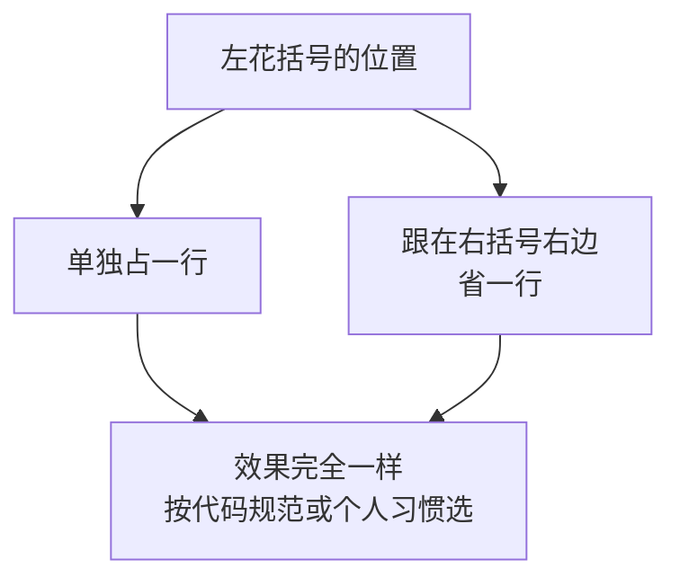
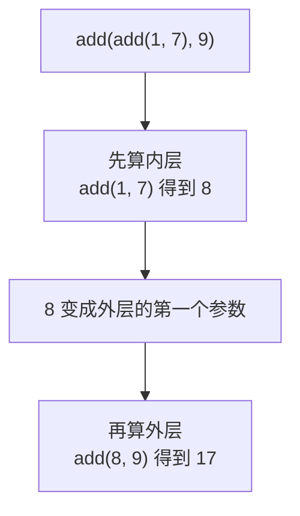
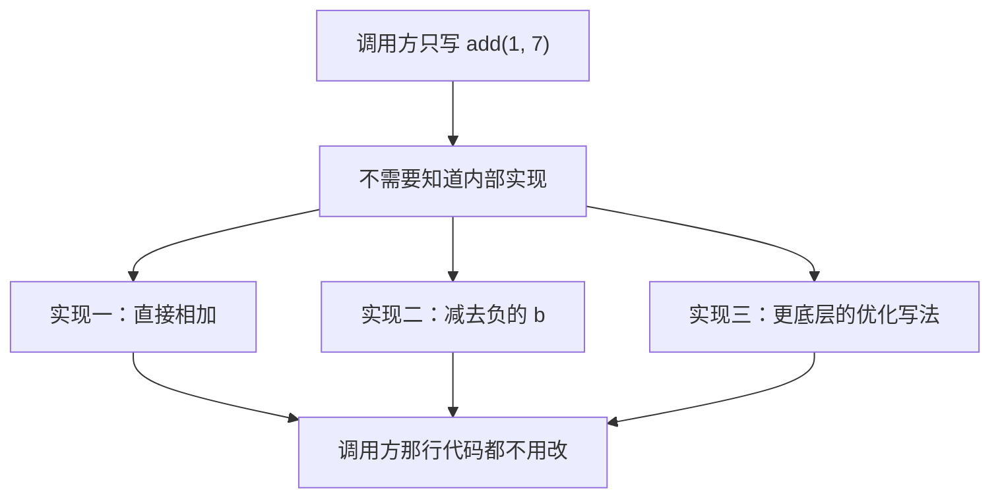
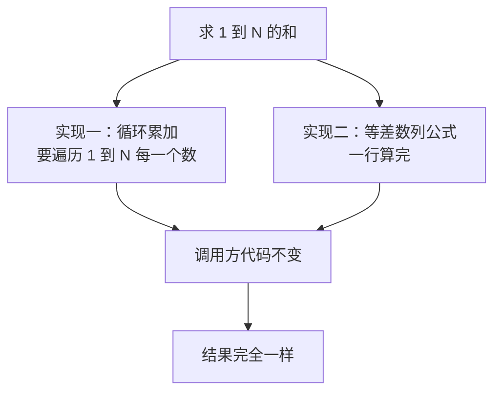
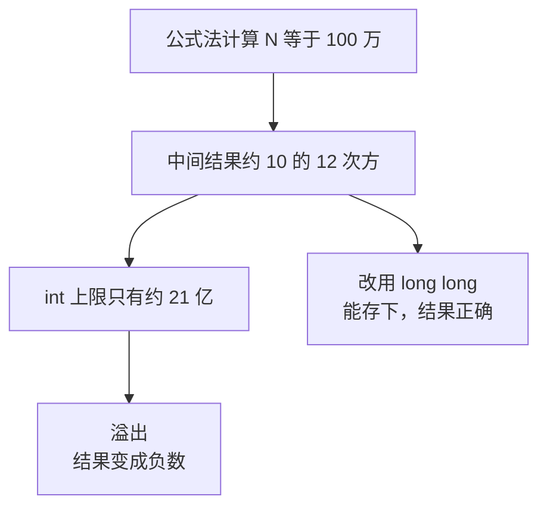
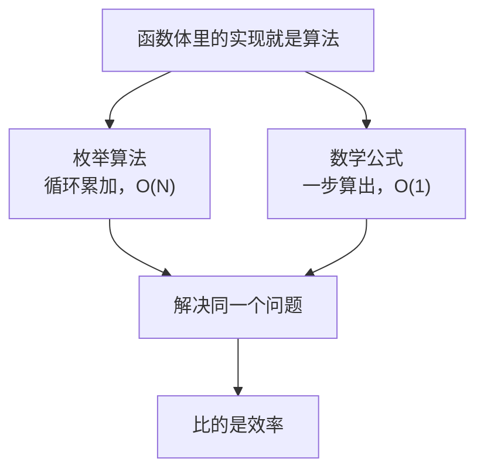

## 回顾：先准备好两个函数

上一节我们把函数的定义讲清楚了，这一节讲**函数的调用**。不过在讲调用之前，先把两个常用的函数摆出来，后面都要用到它们。

一个是加法函数 `add`，用 `return a + b` 一行搞定：

```cpp
int add(int a, int b) {
    return a + b;
}
```

另一个是求最大值函数，这里用 if 语句实现：

```cpp
int max(int a, int b) {
    if (a > b) {
        return a;
    } else {
        return b;
    }
}
```

同一个功能也可以换一种写法，用三目运算符实现，更简洁：

```cpp
int maxOne(int a, int b) {
    return a > b ? a : b;
}
```

顺便说一个纯粹是风格的小问题：左花括号的位置。可以让它**单独占一行**：

```cpp
int add(int a, int b)
{
    return a + b;
}
```

也可以把它**挪到右括号的右边**：

```cpp
int add(int a, int b) {
    return a + b;
}
```

第二种写法能省下一行，两种写法效果完全一样。**这属于个人习惯，觉得哪种好看就用哪种**；在公司里就跟着公司的**代码规范**走——大公司一般都有代码规范文档，照着做就行，不用自己纠结。



## 函数的调用

### 基本调用

调用函数就是在函数名后面跟一对圆括号，括号里填实际要传进去的值。比如调用 `add`：

```cpp
    add(1, 7)
```

这样就会得到 1 加 7 的结果，也就是 8。得到这个结果之后，可以把它存进变量，也可以直接输出：

```cpp
#include <iostream>

using namespace std;

int add(int a, int b) {
    return a + b;
}

int main() {
    int a = add(1, 7);
    cout << a << endl;
    return 0;
}
```

运行结果：

```text
8
```

### 嵌套调用

既然一次调用会得到一个值，那这个值当然可以**继续拿去当参数**，再调用一次函数。比如把 `add(1, 7)` 得到的 8，再和 9 相加：

```cpp
#include <iostream>

using namespace std;

int add(int a, int b) {
    return a + b;
}

int main() {
    int a = add(1, 7);
    int b = add(a, 9);
    cout << b << endl;
    return 0;
}
```

先把 `add(1, 7)` 的结果 8 存进变量 a，再把 a 和 9 传进 `add`，得到 17。运行结果：

```text
17
```

也就是 1 加 7 加 9 等于 17。

也可以不借助中间变量，**直接把一次调用写在另一次调用的参数位置上**：

```cpp
#include <iostream>

using namespace std;

int add(int a, int b) {
    return a + b;
}

int main() {
    cout << add(add(1, 7), 9) << endl;
    return 0;
}
```

运行结果同样是：

```text
17
```

这叫做**嵌套调用**：内层的 `add(1, 7)` 先算出来得到 8，这个 8 就成了外层调用的第一个参数，外层再算 `add(8, 9)` 得到 17。虽然写在一行里，但计算顺序是**由内向外**的。



## 为什么要有函数

看到 `add(add(1, 7), 9)` 这种写法，很自然会有一个疑问：**既然只是加法，为什么不直接写 `1 + 7 + 9` 呢？** 加号明明更简单，何必绕一圈去调用函数？

这个问题问得很好，原因正是函数存在的价值所在：**一旦做成了函数，外部的调用方就不需要关心内部到底是怎么实现的。**

调用方只需要知道"我这个函数是把两个数加起来"，至于里面是加法、是减法，还是别的什么写法，对调用方来说**无所谓**。

比如这个加法函数，内部完全可以写成"**减去一个负数**"来实现：

```cpp
int add(int a, int b) {
    return a - (-b);
}
```

它照样返回 8，调用方完全看不出来区别。当然这么写效率不如直接加，但重点是——**换成任何别的实现，调用方那行代码都不用改。**

如果真有一种比直接相加效率更高的底层写法，那就更值得封装成函数了：内部随便优化，外部照旧调用。



这个道理对更复杂的函数尤其重要。比如求最大值的 `max` 函数，它现在的实现是一堆 if else，换成三目运算符那个简洁版本之后，**调用它的代码一个字都不用动**。

这就是**封装**的好处：函数对外是一个**黑盒**，调用方只看函数名就知道它能返回什么，不需要点进去看实现，也不该关心里面怎么实现。而实现的那一方则要尽量做到**越高效越好**。

## 应用：求 1 到 N 的和

上面两个例子的内部实现都比较简单，还不足以体现"换个实现差别有多大"。下面用一个更典型的例子来说明——**求 1 到 N 的和**。

先写调用方：输入一个 N，调用 `sum` 函数算出结果，然后输出。

```cpp
#include <iostream>

using namespace std;

int sum(int n) {
    int ret = 0;
    for (int i = 1; i <= n; i++) {
        ret += i;
    }
    return ret;
}

int main() {
    int n;
    cin >> n;
    int ret = sum(n);
    cout << ret << endl;
    return 0;
}
```

`sum` 函数的写法和之前一样：一个返回值类型、一个函数名、一个参数 N、一个函数体，函数体里自己实现、最后返回一个值。

这里函数体的实现方式是**用一个 for 循环从 1 累加到 N**：定义一个变量 `ret` 存累加结果，初始为 0，然后让 i 从 1 走到 N，每次把 i 加进 ret 里，循环结束后返回 ret。

运行一下，输入 10：

```text
55
```

从 1 加到 10 等于 55，结果正确。

### 换一个实现：等差数列公式

上面这种实现要**一个一个地加**。而 1 到 N 的和其实有现成的公式——**首项加尾项，乘上项数，再除以 2**，也就是等差数列求和公式：

```cpp
int sum(int n) {
    return (1 + n) * n / 2;
}
```

把原来的循环实现整个删掉，只留这一行。运行结果完全一样，输入 10 还是输出 55，输入 100 输出 5050。

**调用方的代码一个字都没改**，输出的结果也完全一样——但内部做的事情完全不同了。



### 效率对比与数据范围

两种实现的差距有多大？循环累加需要**遍历 1 到 N 所有的数**：N 是 100 万时就要循环 100 万次。而公式法**一个式子直接就算出来了**，一次都不用循环。N 越大，这个差距越明显。

不过公式法有一个**必须注意的坑：数据范围**。

当 N 是 100 万时，`(1 + n) * n` 大约是 10 的 12 次方，也就是一万亿——而 `int` 能表示的最大值只有约 21 亿。**早就溢出了。**

实测一下就知道了：

```cpp
#include <iostream>

using namespace std;

int sum(int n) {
    return (1 + n) * n / 2;
}

int main() {
    cout << sum(1000000) << endl;
    return 0;
}
```

运行结果：

```text
-363189984
```

居然是个负数！正确答案应该是 500000500000，但结果溢出成了一个莫名其妙的负数。把返回类型改成能存更大范围整数的 `long long`，才能得到正确结果。



> [!WARNING]
> 公式法虽然快，但要**留意数据范围**。1 到 N 的和在 N 很大时增长得非常快，`int` 很容易装不下。写这类函数时，先估一下结果最大能到多少，再决定用 `int` 还是 `long long`，否则算出来的数看着像模像样，其实完全是错的。

## 函数与算法

把两种实现摆在一起，就能看出一个更本质的东西：**函数体里的那段实现，其实就是算法。**

循环累加是一种**枚举算法**——把所有情况一个一个试过去；等差数列公式则是一个**数学公式**。两者的目的都是"解决求 1 到 N 的和这个具体问题"，区别只在于**效率**。

算法要干的事情就是这两件：**解决一个具体问题，并且想办法把它的效率提上来。** 用时间复杂度的说法，循环累加是 O(N)，要跟着 N 增长；而公式法直接是 O(1)，不管 N 多大都是一次算完，效率高下立判。



而这一切对调用方都是**透明**的。调用方只写 `sum(n)`，只看函数名就知道"这是在求 1 到 N 的和"，至于里面是循环还是公式、效率高不高，调用方不需要知道。**实现越高效越好，而调用方的代码始终不变**——这正是函数封装的意义。

到这里，函数的调用就讲完了：**直接调用，拿到返回值输出就好。**

## 本章小结

**其一**，**调用函数**就是在函数名后面跟一对圆括号，括号里填实际要传进去的值，比如 `add(1, 7)`。调用得到的结果可以存进变量，也可以直接输出。

**其二**，一次调用的返回值可以**继续当参数**传给下一次调用，这叫**嵌套调用**，比如 `add(add(1, 7), 9)`。嵌套调用的计算顺序是**由内向外**：先算内层得到 8，再把这个 8 当成外层的第一个参数。当然也可以借助中间变量分两步写，效果一样。

**其三**，左花括号的位置（单独占一行，还是跟在右括号右边）**只是个人风格，效果完全一样**。在公司里按代码规范文档来就行。

**其四**，既然加法有 `+` 号，为什么还要封装成 `add` 函数？因为**一旦做成函数，调用方就不需要关心内部到底怎么实现**。调用方只需要知道"这个函数是把两个数加起来"，里面是加法、是减去负数、还是别的更高效的写法，对调用方来说都无所谓。

**其五**，函数对外是一个**黑盒**：调用方只看函数名就知道它会返回什么，不需要也不应该关心内部实现；而实现的一方要尽量做到**越高效越好**。更换实现时，**调用方的代码一个字都不用改**，这就是封装的价值。

**其六**，求 1 到 N 的和可以用两种方式实现：**循环累加**（枚举，要遍历 1 到 N 每个数）和**等差数列公式**（首项加尾项乘项数除以 2，一行算完）。两种实现的结果完全一样，调用方代码也不用改，但效率差别很大。

**其七**，公式法要**留意数据范围**。N 是 100 万时 `(1 + n) * n` 约 10 的 12 次方，远超 `int` 约 21 亿的上限，会**溢出**——实测输出是一个负数 `-363189984`，而正确答案是 500000500000。这类情况要改用 `long long`。

**其八**，函数体里的那段实现其实就是**算法**。算法要做两件事：**解决一个具体问题**，并**想办法提升效率**。循环累加是 O(N)，公式法是 O(1)，后者效率更高。而这一切对调用方都是透明的——它只管调用，不关心实现。

**其九**，函数的调用到这里就讲完了：**直接调用，拿到返回值输出就好。**