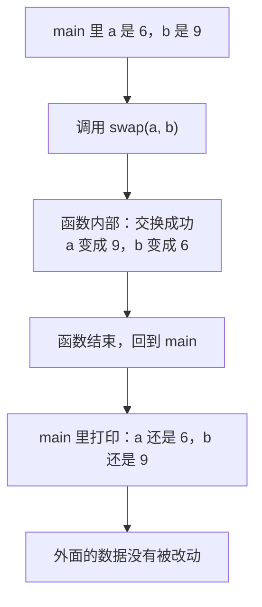
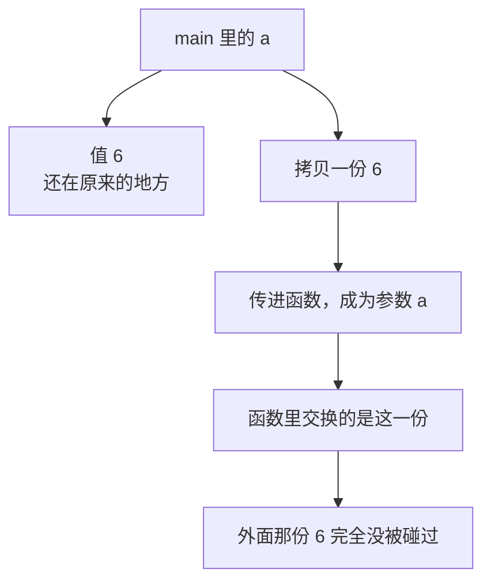
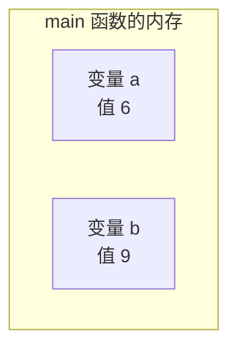
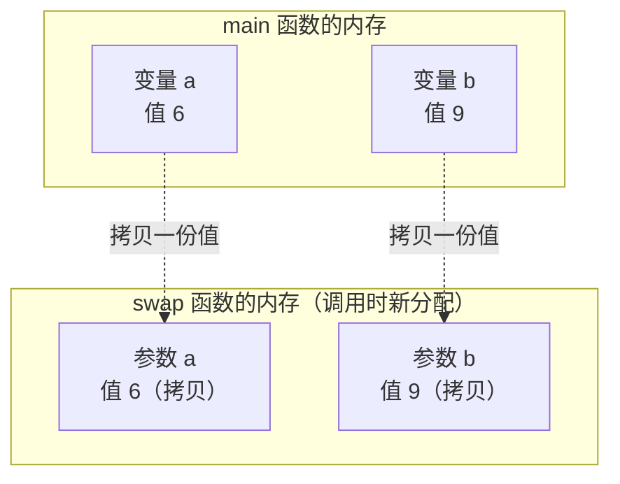
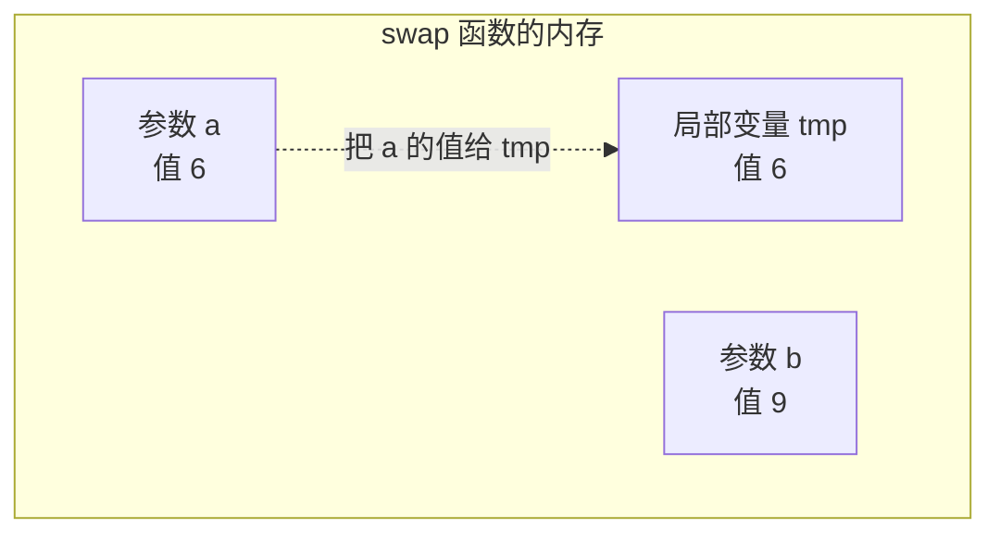
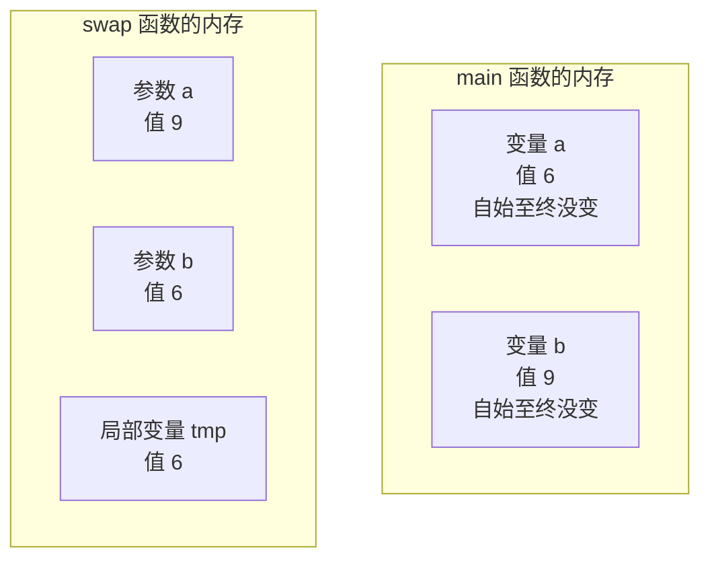
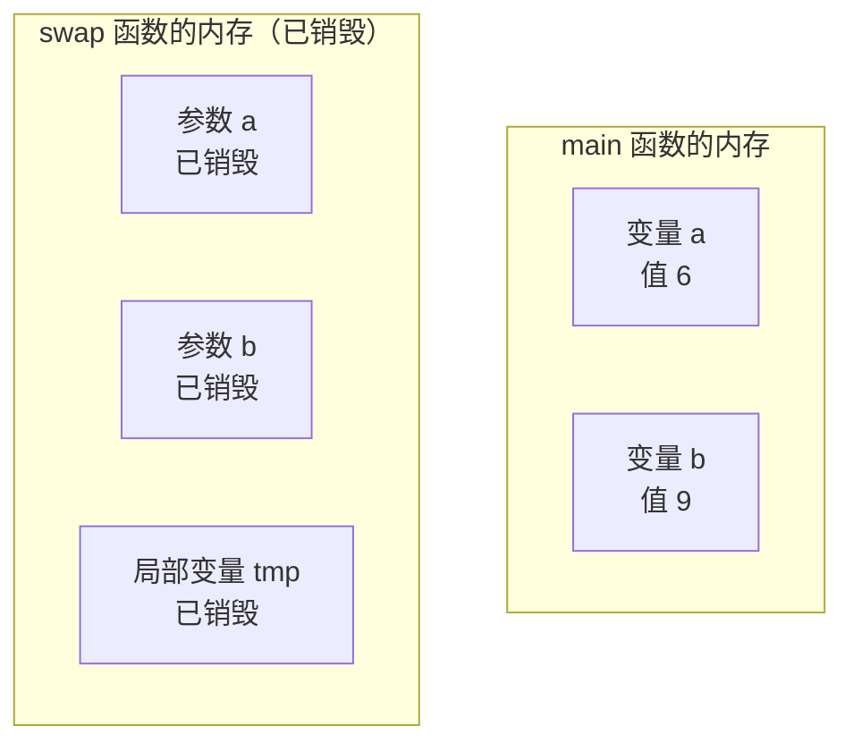
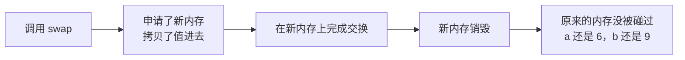

## 什么是值传递

**值传递**指的是：把一些参数传到函数体内部，让函数内部去使用它，这个把值传进去的过程就叫值传递。

听起来很简单，但这里藏着一个**初学者最容易踩的误区**。如果不搞清楚，就会写出"看起来没问题、实际完全不起作用"的代码。下面用一个交换变量的例子把这个误区彻底暴露出来。

## 一个看起来没问题的交换函数

### 写一个 swap 函数

先写一个交换两个变量的函数，名字叫 `swap`，参数是两个整数。交换不需要返回任何东西，所以返回值类型是 `void`：

```cpp
void swap(int a, int b) {
    int tmp = a;
    a = b;
    b = tmp;
}
```

交换两个变量的套路是**引入一个中间变量**：先把 a 的值存到临时变量 `tmp` 里（这样 a 原来的值就不会丢），再把 b 的值赋给 a，最后把 tmp 里存着的原 a 值赋给 b。三步走完，a 和 b 的值就换过来了。

为了看清楚每一步的效果，在交换前后各打印一次：

```cpp
#include <iostream>

using namespace std;

void swap(int a, int b) {
    cout << "交换前：" << a << " " << b << endl;
    int tmp = a;
    a = b;
    b = tmp;
    cout << "交换后：" << a << " " << b << endl;
}

int main() {
    int a = 6;
    int b = 9;
    swap(a, b);
    return 0;
}
```

在 `main` 里定义 a 等于 6、b 等于 9，然后把这两个变量通过传参传进 `swap`——**这个传进去的过程就是值传递**。

运行结果：

```text
交换前：6 9
交换后：9 6
```

传进去的时候 a 是 6、b 是 9，经过交换，a 变成 9、b 变成 6。看起来完全没问题，交换成功了。

### 回到函数外部，居然没变

但真的是这样吗？在函数调用结束之后，**再回到 `main` 里打印一次 a 和 b**：

```cpp
#include <iostream>

using namespace std;

void swap(int a, int b) {
    cout << "交换前：" << a << " " << b << endl;
    int tmp = a;
    a = b;
    b = tmp;
    cout << "交换后：" << a << " " << b << endl;
}

int main() {
    int a = 6;
    int b = 9;
    swap(a, b);
    cout << "----" << endl;
    cout << "函数外部：" << a << " " << b << endl;
    return 0;
}
```

运行结果：

```text
交换前：6 9
交换后：9 6
----
函数外部：6 9
```

分隔线上面，函数内部的 a 已经变成 9、b 已经变成 6 了；可是分隔线下面，**函数外部的 a 居然还是 6，b 还是 9——根本没有交换！**



为什么函数内部明明交换了，出来之后却像什么都没发生？这就是值传递的精髓所在。

## 值传递的精髓：传进去的是拷贝

**你传进去的那个数，其实只是拷贝了一份，并不是原来那份数据。**

原来那个 a 还在它原来的地方，函数里被交换的那个 a 是**另一份新的数据**。这两份数据根本不是同一个东西，所以函数内部再怎么折腾，也影响不到外面传进来的原始数据。



所以结果就是：虽然函数里面确实交换了，但函数一执行完，外面的 a 和 b 还是老样子，交换等于白做了。

那要怎么才能真正交换呢？**等后面学了指针（也就是地址）之后，就知道怎么做了。** 现在先把这个误区记牢。

## 执行过程详解

光说结论还不够，把整个执行过程从头走一遍，就能彻底明白为什么会这样。

### 第一步：main 里分配 a 和 b

程序从上往下执行。执行到 `int a = 6;` 时，系统为这个变量**分配了一块内存**（int 占四个字节），里面存的值是 6。继续执行到 `int b = 9;`，又分配了一块内存，变量名叫 b，存的值是 9。



### 第二步：进入函数，参数是新的一块内存

执行到 `swap(a, b)` 这一行，程序进入函数。**关键就在这里：函数里的 a 和 b，和外面的 a 和 b 不是同一个。**

怎么证明？因为函数里的参数**完全可以取别的名字**，比如叫 x 和 y 也照样能跑——它们只是恰好也叫 a 和 b 而已。名字相同，但**内存是各自独立的**。

进入函数的时候，系统又为参数 a 和参数 b **各分配了一块新的内存**。它们的值从哪里来？就是从外面**拷贝**过来的：参数 a 拿到 6 的拷贝，参数 b 拿到 9 的拷贝。



### 第三步：tmp 又是一块新内存

接着执行 `int tmp = a;`。`tmp` 又是一个**新的局部变量**，系统再给它分配一块内存，值等于当前 a 的值，也就是 6。



### 第四步：交换的是拷贝

然后执行 `a = b;`，参数 a 变成 9；再执行 `b = tmp;`，参数 b 变成 6。

到这里交换完成了，但**被交换的始终是 swap 函数内存里的那两个参数**，和 main 内存里的 a、b 一点关系都没有。



### 第五步：函数结束，局部变量销毁

函数一返回，**swap 内存里的参数 a、参数 b 和局部变量 tmp 全部被销毁**。

这是函数的一个重要特性：**函数内部的局部变量，在函数结束之后会被销毁。** 它们只在这个函数活着的时候存在，函数一结束就没了。



所以等函数调用完毕回到 `main`，a 的值是多少？**还是 6。** 因为从头到尾**根本没有去改过它**——调用这个函数只是申请了几块新内存出来，交换发生在那几块新内存上，原来那块内存自始至终没被碰过。



> [!TIP]
> 这一节讲的内存模型是理解值传递的关键。等学了指针之后，可以用取地址的方式亲眼看到：`main` 里的 a 和 `swap` 里的参数 a，它们的地址是完全不同的两块地方。地址不同，自然互不影响。

## 本章小结

**其一**，**值传递**指的是把参数传到函数体内部、让函数内部去使用它的这个过程。传参时传进去的，是原数据的一份**拷贝**。

**其二**，写一个交换变量的函数 `swap`：返回值类型用 `void`（不需要返回任何东西），函数体里借助一个中间变量完成三步交换——先把 a 存进 `tmp`，再把 b 赋给 a，最后把 `tmp` 赋给 b。

**其三**，**初学者最容易踩的误区**：`swap` 函数在内部打印时明明交换成功了（a 变成 9、b 变成 6），但函数结束回到外面再打印，a 还是 6、b 还是 9，**完全没有交换**。

**其四**，原因就是**值传递的精髓**：传进去的数只是**拷贝了一份**，并不是原来那份数据。原来那个 a 还在原来的地方，函数里被交换的是另一份新数据。两份数据不是同一个东西，所以函数内部的操作**影响不到外面传进来的原始数据**。

**其五**，从内存角度看：执行 `int a = 6;` 时给 a 分配一块内存存 6，`int b = 9;` 时给 b 再分配一块。**进入函数时，参数 a 和参数 b 会各自获得一块新内存**，值是从外面拷贝进来的。

**其六**，函数里的参数和外部的变量**只是名字可能相同，内存是各自独立的**。函数参数完全可以取别的名字（比如 x、y）照样能跑，这正说明它们不是同一个东西。`tmp` 也是一个新分配的局部变量。

**其七**，交换全程只发生在 **swap 自己那块内存**上，`main` 里的 a 和 b 自始至终没被碰过。所以回到 `main` 后 a 还是 6——**不是交换失败了，而是从头到尾就没去改过它**。

**其八**，**函数内部的局部变量在函数结束后会被销毁**。函数一返回，参数 a、参数 b 和 `tmp` 全部消失。这是函数的一个重要特性，也是"函数内部改的东西带不出去"的根本原因。

**其九**，想真正实现两个变量的交换，需要用到**指针**（也就是地址）——把变量的地址传进去，函数才能改到外面那份真正的数据。这部分内容会在讲指针时展开。