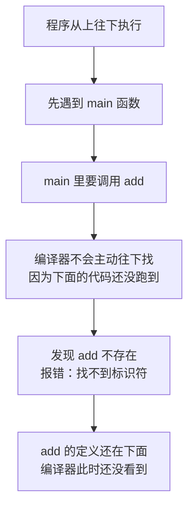
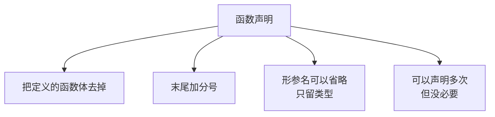
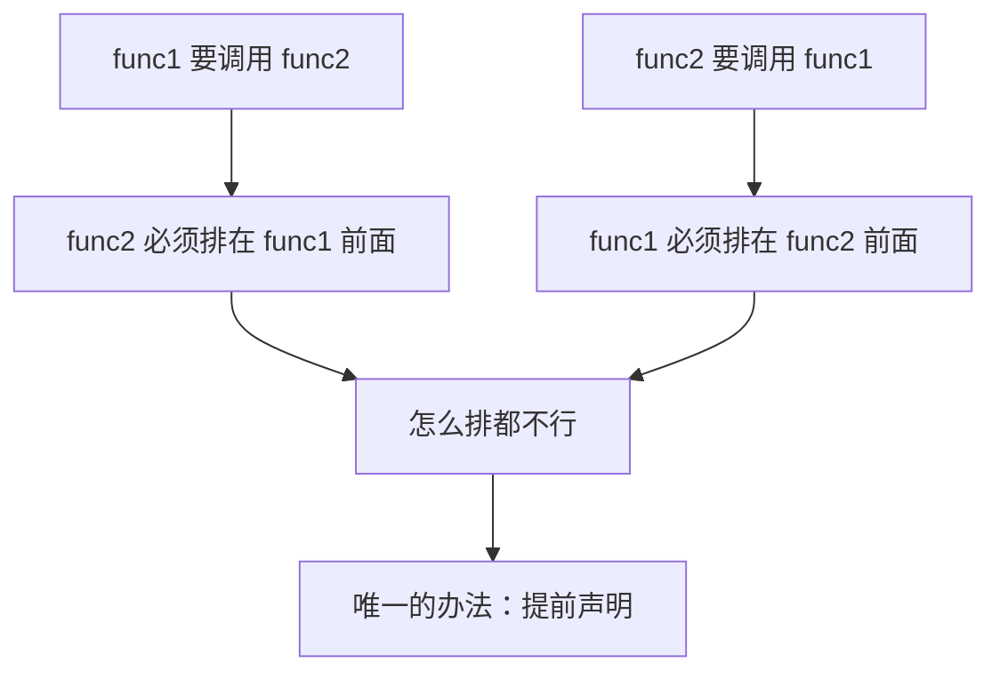
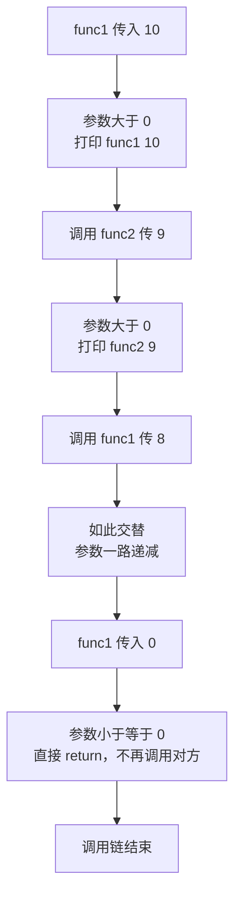
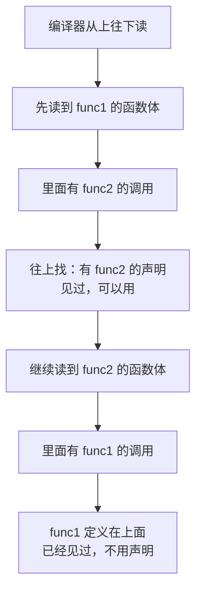
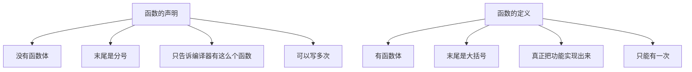

## 为什么要引入函数的声明

函数的**定义**已经会了，函数的**调用**也会了，那**函数的声明**又是干什么的？

简单说：声明是为了解决"**函数被调用时，编译器还不知道它存在**"这个问题。要理解这件事，先看一个会报错的例子。

## 一个报错的例子

### 把函数写在 main 后面

先写一个加法函数，然后在 `main` 里调用它。之前我们都是把函数写在 `main` 前面，这次**故意把它放到 `main` 后面**：

```cpp
#include <iostream>

using namespace std;

int main() {
    int x, y;
    cin >> x >> y;
    int c = add(x, y);
    cout << c << endl;
    return 0;
}

int add(int a, int b) {
    return a + b;
}
```

功能很简单：输入两个数，调用 `add` 算出它们的和并输出。逻辑上完全说得通，但**这样运行会报错**。

### 错误信息：找不到标识符

编译器报的错是：**找不到标识符**（MSVC 下是 error C3861），意思是 **`add` 这个标识符找不到**。

明明函数就写在下面，为什么说找不到？

### 为什么会找不到

因为 **C++ 程序是从上往下执行的**。执行到 `main` 函数里调用 `add` 的那一行时，编译器**不会主动往下面去找**——下面的代码还没跑到呢。

它在这一行发现 `add` 这个函数不存在，就只好报错了。



所以结论是：**如果想把函数写在 `main` 的后面，就必须先声明它。**

## 函数的声明

### 声明怎么写

声明的方法非常直接：**把函数的定义复制一份，去掉函数体，在末尾加一个分号。**

原来的定义是这样的：

```cpp
int add(int a, int b) {
    return a + b;
}
```

把大括号和里面的内容去掉，末尾补上分号，就得到了**函数的声明**：

```cpp
int add(int a, int b);
```

把它写在 `main` 的前面（通常在 `using namespace std;` 下面），程序就能正常运行了：

```cpp
#include <iostream>

using namespace std;

int add(int a, int b);

int main() {
    int x, y;
    cin >> x >> y;
    int c = add(x, y);
    cout << c << endl;
    return 0;
}

int add(int a, int b) {
    return a + b;
}
```

运行一下，输入 5 和 6：

```text
11
```

一切正常。**这行 `int add(int a, int b);` 就是函数的声明。**

### 形参名可以省略

仔细想想，声明里的参数名其实是**形参**，编译器只关心"有几个参数、分别是什么类型"，**参数叫什么名字并不重要**。所以声明里的形参名**完全可以省略**：

```cpp
int add(int, int);
```

这样写照样能正常运行，效果和写全名字完全一样。

### 声明可以写多次

声明还能**写多次**，多写几遍也没关系：

```cpp
int add(int, int);
int add(int, int);

int main() {
    cout << add(100, 200) << endl;
    return 0;
}

int add(int a, int b) {
    return a + b;
}
```

运行结果：

```text
300
```

重复声明是合法的。当然**没必要这么写**——声明一次就够了，写多了只是啰嗦。



## 什么时候真的需要声明

看到这里可能会有一个疑问：**这样写不麻烦吗？直接把函数写在前面不就好了？**

上面那个例子的确体现不出声明的必要性——把 `add` 挪到 `main` 前面，问题就解决了，根本用不着声明。但有一种场景，**除了声明没有别的办法**：**两个函数互相调用**。

### 两个函数互相调用

假设有 `func1` 和 `func2` 两个函数，**`func1` 里面调用 `func2`，`func2` 里面又调用 `func1`**：

```cpp
void func1(int x) {
    func2(x);
}

void func2(int x) {
    func1(x);
}
```

这就麻烦了：`func1` 要调用 `func2`，所以 `func2` 得在 `func1` 前面；可 `func2` 又要调用 `func1`，所以 `func1` 又得在 `func2` 前面——**两个函数都得排在对方前面，怎么排都不行。**

这时候唯一的出路就是**提前声明**。



### 提前声明解决

既然 `func1` 里要用到 `func2`，那就**在 `func1` 之前先把 `func2` 声明出来**：

```cpp
void func2(int x);

void func1(int x) {
    func2(x);
}

void func2(int x) {
    func1(x);
}
```

这样一来，编译器在读到 `func1` 里那句 `func2(x)` 时，**已经通过声明见过 `func2` 了**，知道"有这么个函数、参数是 int"，于是就不会报错。至于 `func2` 的具体实现写在后面，编译器并不需要马上看到。

### 完整例子：用参数递减避免死循环

不过上面那两个函数直接互相调用，其实**已经造成了死循环**——`func1` 调 `func2`、`func2` 又调 `func1`，永远出不来。所以要**用参数来控制**，让它有终止条件。

做法是：每次调用对方时把参数**减 1**，当参数**小于等于 0 时直接返回**，不再调用对方。

```cpp
#include <iostream>

using namespace std;

void func2(int x);

void func1(int x) {
    if (x <= 0) {
        return;
    }
    cout << "func1 " << x << endl;
    func2(x - 1);
}

void func2(int x) {
    if (x <= 0) {
        return;
    }
    cout << "func2 " << x << endl;
    func1(x - 1);
}

int main() {
    func1(10);
    return 0;
}
```

调用 `func1(10)`，运行结果：

```text
func1 10
func2 9
func1 8
func2 7
func1 6
func2 5
func1 4
func2 3
func1 2
func2 1
```

可以看到，两个函数交替执行、参数一路递减：`func1 10` 调用 `func2 9`，`func2 9` 又调用 `func1 8`，如此反复一直到 `func2 1` 调用 `func1 0`。而 `func1(0)` 进来时参数已经**小于等于 0**，直接 `return` 返回——**这里就是函数的出口**，它不再去调用 `func2`，整个调用链就此结束。



### 为什么调用 func2 时不用声明 func1

细心的会发现一个不对称的地方：`func1` 里调用 `func2` 需要提前声明，可 `func2` 里调用 `func1` **却不用声明**，这是为什么？

因为 **`func1` 在 `func2` 的前面**。编译器从上往下读，读到 `func2` 的函数体时，**早就已经见过 `func1` 了**——既然见过，自然可以直接调用，不需要额外声明。

**声明的作用就是"提前告诉编译器有这么个函数"。** 谁被排在了后面、谁在被调用时还没露面，谁就需要被提前声明。

如果把这个声明注释掉，程序就会报错，提示 `func2` 未声明——编译器读到这里时**从来没见过 `func2`**，自然不知道该怎么调用它。



## 声明和定义的区别

把两者摆在一起对比，区别就很清楚了：

```cpp
int add(int a, int b);      // 声明：没有函数体，末尾是分号

int add(int a, int b) {     // 定义：有函数体，末尾是花括号
    return a + b;
}
```

**声明**只是告诉编译器"有这么个函数，它叫什么名字、返回什么类型、要几个什么类型的参数"，**没有函数体**，所以末尾写分号。**定义**则是真正把这个函数实现出来，**有函数体**，末尾是大括号。

一个函数**只能定义一次**（不能有两份实现），但**可以声明多次**。



## 本章小结

**其一**，**函数的声明**用来解决"函数被调用时编译器还不知道它存在"这个问题。它的写法很简单：**把函数的定义复制一份，去掉函数体，末尾加一个分号**，比如 `int add(int a, int b);`。

**其二**，**C++ 程序从上往下执行**。如果把函数写在 `main` 的后面，执行到调用它的那一行时，编译器**不会主动往下面去找**（下面的代码还没跑到），于是报"**找不到标识符**"（MSVC 下是 error C3861）。

**其三**，解决办法有两个：要么把函数定义**挪到 `main` 前面**，要么在 `main` 前面**加一行函数声明**。声明之后，编译器在调用处就已经知道这个函数存在了。

**其四**，声明里的**形参名可以省略**，只写类型就行，比如 `int add(int, int);`。因为编译器只关心参数的个数和类型，参数叫什么名字并不重要。

**其五**，**声明可以写多次**，重复声明是合法的，效果一样。但没有必要，**声明一次就够了**。

**其六**，**两个函数互相调用**是声明真正不可替代的场景：`func1` 要调用 `func2`、`func2` 又要调用 `func1`，两个函数都得排在对方前面，怎么排都不行。这时唯一的办法就是**提前声明**——在 `func1` 之前先写上 `void func2(int x);`，编译器读到 `func1` 里调用 `func2` 时就已经"见过"它了。

**其七**，互相调用如果**没有终止条件就会变成死循环**，所以要用参数控制：每次调用对方时**把参数减 1**，当参数**小于等于 0 时直接 return**，不再调用对方。这个 return 的地方就是**函数的出口**。

**其八**，`func2` 里调用 `func1` **不需要声明**，因为 **`func1` 定义在 `func2` 前面**，编译器从上往下读时早就见过它了。**声明的作用就是提前告诉编译器有这么个函数**——谁在被调用时还没露面，谁就需要被提前声明。

**其九**，**声明和定义的区别**：声明**没有函数体**、末尾是分号，只告诉编译器"有这么个函数"；定义**有函数体**、末尾是大括号，真正把功能实现出来。一个函数**只能定义一次，但可以声明多次**。