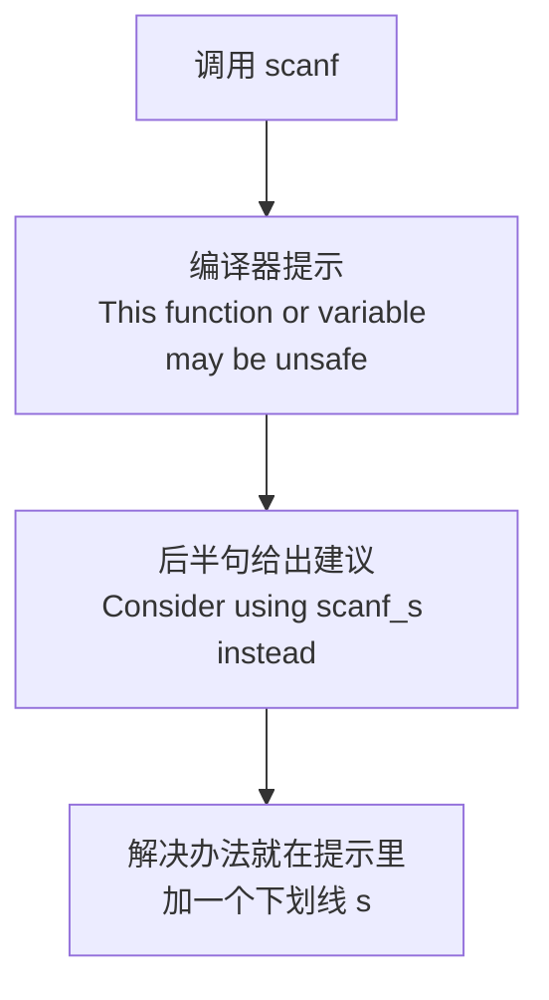
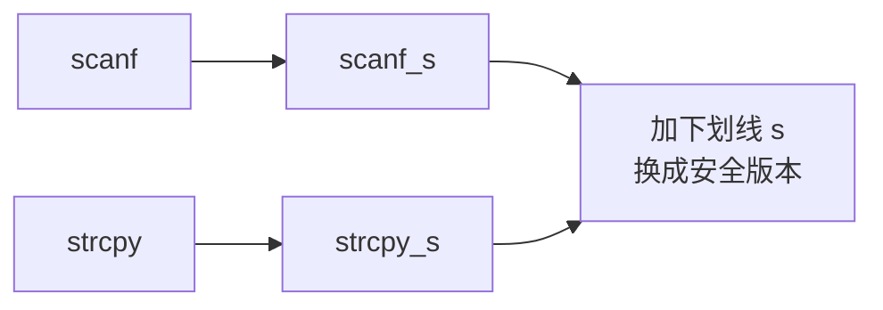
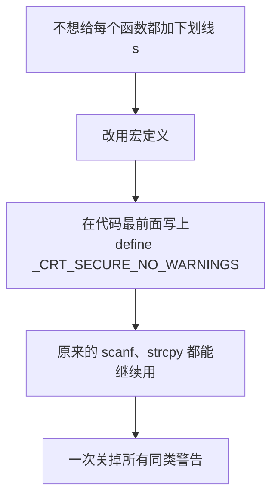
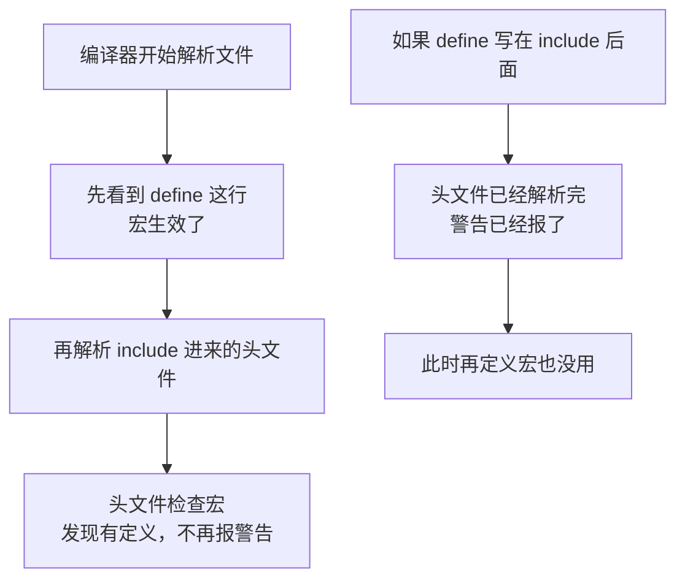
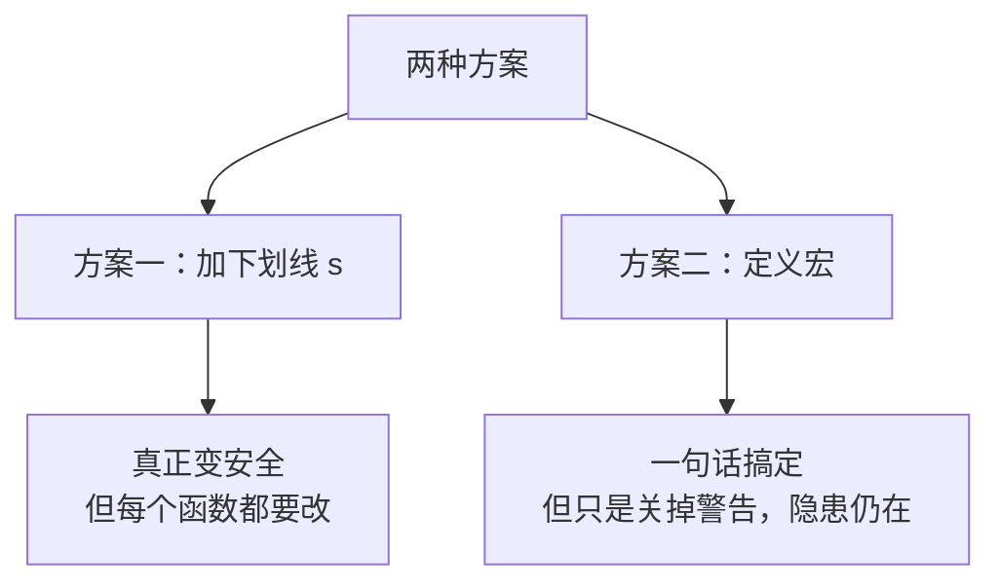
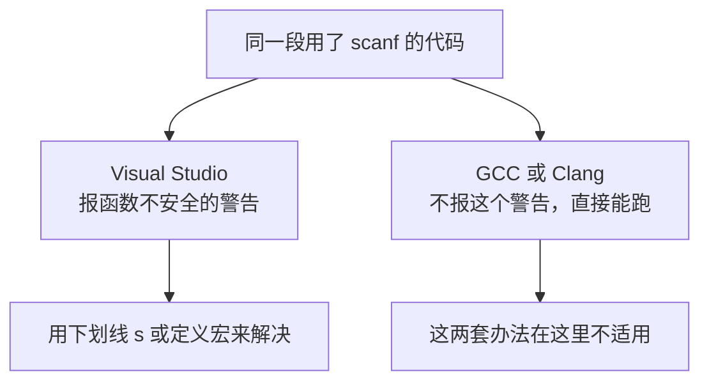

## 一个很常见的问题

这一节来看一个**非常常见**的问题，很多人在刚开始用 Visual Studio 写代码时都会撞上。

先定义一个变量 a，然后调用 `scanf` 函数给它输入一个值：

```cpp
#include <cstdio>

int main() {
    int a;
    scanf("%d", &a);
    return 0;
}
```

`scanf` 是 **C 语言里的输入函数**，在 C++ 里同样可以使用。它具体怎么用先不用深究，这里只关注一件事：**这样写会报错。**

> [!NOTE]
> 代码里的 `&a` 用到了**取地址符** `&`，意思是"把变量 a 的地址交给 scanf"，scanf 才能把读到的值写进 a 里。这个符号的原理会在讲指针时详细展开，这里先照着写就行。

## 问题现象

### 提示函数不安全

在 Visual Studio 里运行上面这段代码，编译器会给出这样一条提示：

```text
This function or variable may be unsafe
```

这句话的意思是：**这个函数或变量可能是不安全的。**

### 怎么读这条英文提示

关键在于，这条提示**不只是告诉你出错了，它同时告诉了你解决办法**。完整的信息里还有后半句：

```text
Consider using scanf_s instead.
```

也就是"**考虑改用 `scanf_s` 代替**"。看到 `scanf_s` 就明白了——**在原函数名后面加一个下划线加 s**。

这种"不安全"的提示在 MSVC 里是 **C4996**，在新版的 Visual Studio 里默认会当成错误来处理，所以程序跑不起来。



> [!TIP]
> 这类英文提示看起来吓人，其实**信息量很足**。养成一个习惯：**把整条提示从头读完**，尤其是 "consider using ..." 这种后半句——它往往直接写着解决方案。能看懂这段话的意思，以后遇到同类问题就能自己解决，不必每次都去搜。

## 方案一：使用安全版本

### s 代表 safe

把 `scanf` 改成 `scanf_s`，程序就能正常运行了：

```cpp
#include <cstdio>

int main() {
    int a;
    scanf_s("%d", &a);
    return 0;
}
```

运行一下，输入一个数，程序正常结束，没有任何报错。

这个 **s 代表 safe，也就是"安全"的意思**。`scanf_s` 就是 `scanf` 的**安全版本**——它在读写的时候会做边界检查，避免越界，所以编译器不再认为它"不安全"。

### strcpy 也有同样的问题

C++ 里这类"不安全"的函数不止一个。另一个很常见的是 **`strcpy`**，它是 **string copy** 的缩写，用来把一个字符串拷贝到另一个字符串里：

```cpp
#include <cstring>

int main() {
    char str[100];
    strcpy(str, "Hello World");
    return 0;
}
```

`strcpy` 的问题在于：它**只管往目标里拷，不检查目标够不够大**。如果源字符串比目标数组长，就会写越界，这正是"不安全"的根源。

### 两个都加下划线 s

如果代码里同时用了这两个函数，**两个地方都会报错**。不过没关系，**加下划线 s 都能解决**：

```cpp
#include <cstdio>
#include <cstring>

int main() {
    int a;
    scanf_s("%d", &a);
    char str[100];
    strcpy_s(str, 100, "Hello World");
    return 0;
}
```

`strcpy` 变成 `strcpy_s`，`scanf` 变成 `scanf_s`，这样一来就不会有报错了。



不过这里有个**细节要注意**：`strcpy_s` 的参数和 `strcpy` **不完全一样**，它在中间多了一个**目标缓冲区的大小**：

```text
strcpy(目标, 源)                  // 两个参数
strcpy_s(目标, 目标的大小, 源)     // 三个参数
```

上面例子里的 `100` 就是 `str` 数组的大小。**这个大小必须填对**，因为它正是安全版本用来做边界检查的依据——告诉它"目标只有 100 个字节，别写超了"。

> [!WARNING]
> 用 `scanf_s` 读字符串时也有类似的要求：`%d`、`%f` 这类用法和原来一样，但读字符串（`%s`）和字符（`%c`）时**必须额外传入缓冲区的大小**，比如 `scanf_s("%s", buf, 100)`。漏掉这个参数可能会导致程序崩溃，这是从 `scanf` 换到 `scanf_s` 时最容易踩的坑。

## 方案二：用宏关掉警告

### 在代码最前面 define

如果不想加下划线 s，其实还有**另一种方法**——不加 `_s`，照样能用原来那个"非安全"的版本。

做法是：把编译器提示里给出的那个**宏**定义出来，**放在代码的最前面**：

```cpp
#define _CRT_SECURE_NO_WARNINGS
#include <cstdio>
#include <cstring>

int main() {
    int a;
    scanf("%d", &a);
    char str[100];
    strcpy(str, "Hello World");
    return 0;
}
```

这样一来，`scanf` 和 `strcpy` 都能继续用了，**不用给每个函数都加上下划线 s**。

为什么要用这个方法？因为**如果函数很多，每个都要加下划线 s 就很麻烦**。而写一句宏定义，一次就把所有这类警告都关掉了。



### 为什么必须放在最前面

`#define` 这一行**必须写在 `#include` 之前**，也就是整个文件的最顶端。

原因是：这个警告是**在编译器解析 CRT 头文件的时候触发的**。如果先 `#include` 了头文件，警告已经报出来了，再去定义宏就晚了——宏得**在头文件被处理之前**就已经存在，才能起到作用。



## 两种方案怎么选

两个方案都能解决问题，各有各的适用场景：

**方案一（加下划线 s）**：把函数换成安全版本，程序本身变得更安全，能真正避免缓冲区越界这类问题。代价是**每个用到的函数都要改**，而且有些 `_s` 函数的参数和原来不一样（比如 `strcpy_s` 要多传一个大小）。

**方案二（定义宏）**：一句话搞定，不用改动任何函数调用。代价是**只是把警告关掉了，函数本身该不安全还是不安全**——如果真发生了越界，问题依然存在，只是编译器不再提醒你。



**如果是学习阶段**，方案二更省事，不会因为一堆警告打断练习；**如果是写正式的、要长期维护的代码**，更推荐方案一，或者干脆用 C++ 自己的输入方式和字符串类型，从根本上绕开这些 C 风格的函数。

## 补充：这是 Visual Studio 特有的机制

有一点需要特别说明，否则换到别的编译器上会一头雾水：**上面这两套方案，都是 Visual Studio（也就是 MSVC 编译器）特有的机制。**

首先，那个"函数不安全"的警告**是 MSVC 加上的**，用 GCC 或 Clang 编译同样的代码**不会报这个警告**，程序直接就能跑。其次，`scanf_s`、`strcpy_s` 这些带下划线 s 的函数**也是 MSVC 提供的**，在别的编译器上它们**可能根本不存在**，写了会直接报"找不到标识符"。最后，`_CRT_SECURE_NO_WARNINGS` 这个宏**只在 MSVC 下有作用**，在别的编译器上写了也没有任何效果（当然也不会报错）。



所以：**在 Visual Studio 里遇到这个提示，按上面两种方案处理；把代码拿到别的编译器上编译时，如果出现 `scanf_s` 找不到之类的错误，那不是代码写错了，而是这个函数在当前编译器上不存在。** 跨平台的项目里，尽量少用 `_s` 版本的函数。

## 本章小结

**其一**，在 Visual Studio 里调用 `scanf`、`strcpy` 这类 C 语言函数，编译器会提示 **This function or variable may be unsafe**（这个函数或变量可能是不安全的）。这类提示在 MSVC 里是 **C4996**，在新版 Visual Studio 里默认当成错误处理，程序跑不起来。

**其二**，这些函数之所以被认为"不安全"，是因为它们**不做边界检查**。比如 `strcpy` 只管往目标里拷，不检查目标够不够大，源字符串比目标长就会写越界。

**其三**，**提示里就写着解决办法**。完整信息里有 "Consider using scanf_s instead" 这样的后半句，直接告诉你改用哪个函数。养成把整条英文提示读完的习惯，"consider using ..." 后面往往就是答案。

**其四**，**方案一：使用安全版本**。在原函数名后面加一个下划线加 s，`scanf` 变成 `scanf_s`、`strcpy` 变成 `strcpy_s`。这个 **s 代表 safe（安全）**，安全版本会做边界检查，所以编译器不再认为它不安全。

**其五**，换用安全版本时要注意**参数可能不一样**。`strcpy_s` 在中间多了一个**目标缓冲区的大小**参数（`strcpy_s(目标, 大小, 源)`），这个大小必须填对，它正是安全版本用来做边界检查的依据。用 `scanf_s` 读字符串时也要额外传入缓冲区大小，比如 `scanf_s("%s", buf, 100)`。

**其六**，**方案二：用宏关掉警告**。在代码最前面写上 `#define _CRT_SECURE_NO_WARNINGS`，原来的 `scanf`、`strcpy` 就能继续使用，不用给每个函数都加下划线 s。

**其七**，这个 `#define` **必须写在所有 `#include` 之前**。因为警告是在编译器**解析 CRT 头文件时**触发的，宏必须在头文件被处理之前就存在才能生效；写在后面就晚了。

**其八**，两种方案各有取舍。**加下划线 s** 让程序真正变安全，但每个函数都要改、参数还可能不同；**定义宏**一句话搞定，但**只是关掉警告，函数本身该不安全还是不安全**。学习阶段用宏更省事，正式代码更推荐安全版本，或者干脆用 C++ 自己的输入方式和字符串类型。

**其九**，**这两套方案都是 Visual Studio（MSVC）特有的**。GCC 和 Clang 下不会报这个警告，`scanf_s`、`strcpy_s` 这些函数可能根本不存在，`_CRT_SECURE_NO_WARNINGS` 也没有作用。跨平台代码里要谨慎使用 `_s` 版本的函数。