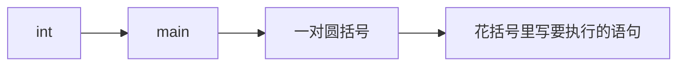
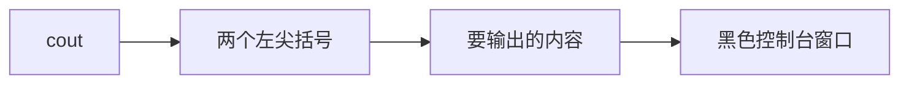
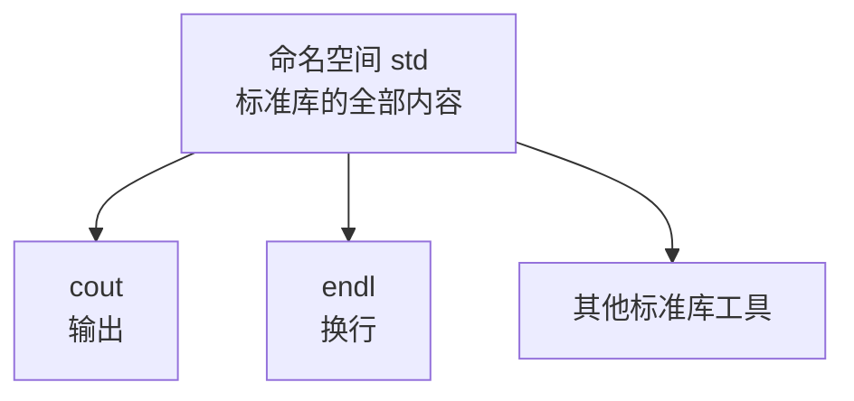
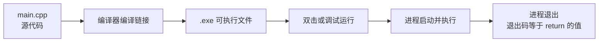
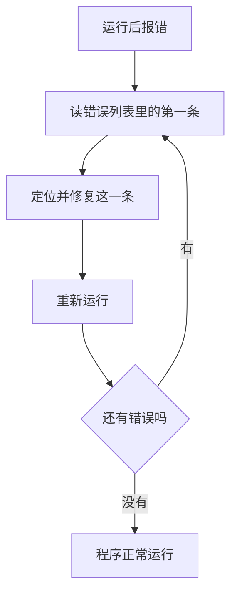
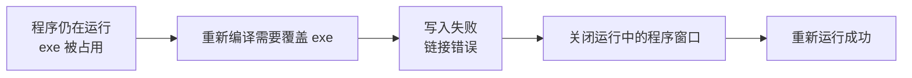
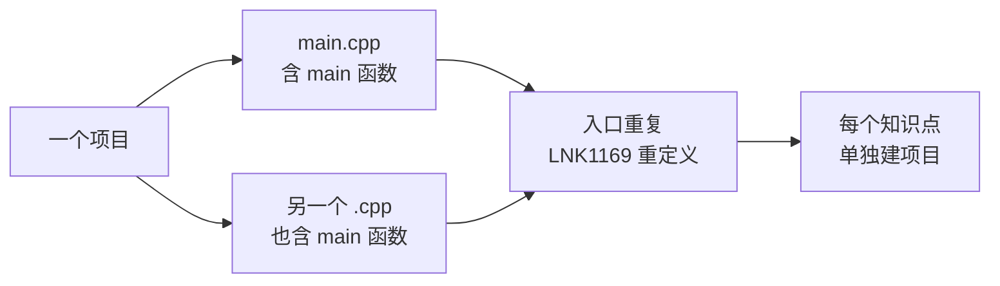
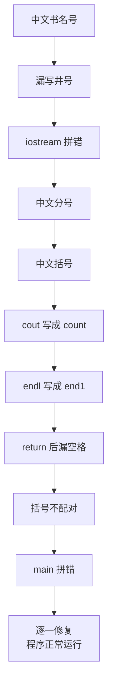
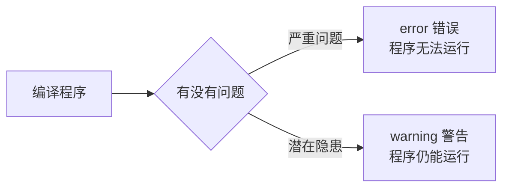

## 创建项目

写第一个程序之前，先要有一个存放代码的项目。打开 Visual Studio，在菜单栏选择文件，然后依次选择新建、项目。

弹出的窗口里会列出很多项目模板。初学阶段用**空项目**就够了，选中它，点击下一步。

接下来设置项目的存放位置和名称。位置放在平时放代码的目录里，比如 D 盘的 project 文件夹；名称按自己的习惯取，比如用知识点编号来命名。设置好之后点击创建。


项目建好后，左侧的解决方案资源管理器里会显示一个树形结构，里面有几个叫**筛选器**的节点，常见的有源文件、头文件、资源文件。

有一点需要特别说明：筛选器**并不是磁盘上真实的文件夹**，它只是把同一类型的文件归到同一个分类里，方便查看和管理。比如源文件这个分类，对应的就是所有以 `.cpp` 结尾的文件。至于头文件是什么，现在先不用管，后面讲到的时候再说。

## 添加源文件

接着在源文件里添加第一个代码文件。右键源文件，选择添加、新建项，在对话框里把文件名填成 **main.cpp**，点击添加。

这里的 `.cpp` 是 C++ 源文件的后缀，也就是 c plus plus 的缩写——plus 是"加"的意思，所以 c plus plus 读作 C 加加。


> [!TIP]
> 在编辑区里按住 Ctrl 键滚动鼠标滚轮，可以缩放代码字体大小，调到自己觉得合适即可。

## 第一段代码

文件建好后就可以写代码了。一个最基础的 C++ 程序是这样的：

```cpp
#include <iostream>

using namespace std;

int main() {
    cout << "Hello World" << endl;
    return 0;
}
```

其实程序还可以更简单。如果只保留 main 函数和里面的返回语句，其余内容全部去掉，程序依然能编译运行：

```cpp
int main() {
    return 0;
}
```

这说明一个 C++ 程序的核心就是 main 函数，其余内容都是按需添加的。下面逐行来看。

## 逐行理解第一个程序

### main 函数：程序的入口

程序总得有个起点。C++ 规定，程序从 **main 函数**开始执行，所以它被称为程序的**入口**。

main 的写法是固定的：前面是一个 int 加一个空格，接着是函数名 main，然后跟一对圆括号，最后是一对花括号。花括号里的内容，就是这个程序要做的事情。

这里有两个容易出问题的地方。一是拼写，函数名只能是 m-a-i-n，写成别的样子，编译器就找不到入口，会报"无法解析的外部符号 main"。二是括号，圆括号和花括号都必须成对出现，而且要用英文符号。



### return 0：程序的出口

花括号里的最后一行是 `return 0;`，它代表程序的**出口**：程序执行到这一行就结束了。

它后面的数字是**返回值**。返回 0 表示程序执行成功；也可以返回别的数字，比如 -1 或 -12，用来表示不同的执行结果。这个返回值就是进程的退出码，程序运行结束后可以在调试信息里看到它。

注意 return 后面要有一个空格，语句末尾要有一个分号。写成 `return0` 这种没有空格的形式，编译器会把它当成一个名字，从而报错。

### 分号：语句的结束符

C++ 里，分号是表示**一条语句结束**的标识。一条语句写完之后要加上分号，就像中文句子末尾要加句号一样。

漏掉分号是最常见的语法错误之一，而且它引发的报错往往会"连累"后面的代码，牵出一大堆看似莫名其妙的错误。

### cout：输出

要让程序输出内容，用到的是 **cout**。这个单词由两部分组成：c 代表 C++，out 是"出来"的意思，合在一起就是"输出"——把内容输出到那个黑色的控制台窗口里。

用法是：先写 cout，接着写两个左尖括号，再写要输出的内容。这两个左尖括号就是键盘上小于号的位置，注意不要打成中文的书名号。

要输出的文字要用**英文双引号**括起来，比如 `"Hello World"`。引号同样不能写成中文的。



> [!WARNING]
> 在 C++ 中，所有符号都必须是英文符号，不能出现中文符号。中文的书名号、分号、圆括号、双引号，都是初学者最常见的报错来源。

### 头文件与输入输出流

只写 cout 会立刻报错，提示"未定义标识符"。原因是 cout 并不是语言自带的关键字，它定义在标准库的头文件里，需要先把对应的头文件引进来。

引入的方式是写 `#include <iostream>`。

这里的 `#include` 是一个**预处理指令**，作用是：在编译之前，把指定文件的内容包含到当前文件里。而 `iostream` 代表的是**输入输出流**头文件——在 C++ 中要做输入输出，比如在屏幕上显示信息、从用户那里获取输入，都要用到它。

换句话说，写下这一行，就相当于告诉编译器：把处理输入输出的那些工具和函数都引进来，这样 cout 才能用。

### using namespace std：命名空间

加上了头文件，cout 依然报未定义，还差一句话：`using namespace std;`。

在 C++ 中，**命名空间**就像是一个容器，或者一块独立的区域，用来组织和管理代码中的各种名称。想象一下很多人一起写代码，难免有人给不同的东西起同一个名字；如果没有命名空间，这些同名的名字就会产生冲突，导致程序出错。命名空间的存在就是为了避免这种冲突。

标准 C++ 库里的所有内容，都放在一个叫 **std** 的命名空间里，cout 也是其中之一。所以 `using namespace std;` 的含义是：告诉编译器我要使用标准库这个命名空间里的内容。这样一来，后面就可以直接写 cout 了。



如果不写这一句，也可以改成显式指定，写成 `std::cout`——两个冒号表示"取出 std 里面的 cout"。只是这样每用一次就要多写几个字符，所以初学阶段一般在开头统一加上 `using namespace std;`。

### endl：换行

最后是 **endl**，它的意思是 end line，也就是**换行**。在输出的内容后面加上 `<< endl`，输出之后就会换到下一行。

如果把 endl 去掉再运行，输出结果里就不会有那一行空行；反过来，连续写多个 `<< endl`，就会连续换好几行：

```cpp
#include <iostream>

using namespace std;

int main() {
    cout << "Hello World" << endl << endl << endl;
    return 0;
}
```

这段程序会在输出之后连续空出三行。这类"改一改、看一看"的尝试，是理解代码最有效的办法。

## 运行程序

代码写好后，在菜单栏点击**调试**，选择**开始执行（不调试）**。

如果一切正常，屏幕上会弹出一个黑色的控制台窗口，里面显示输出的内容。这个黑框出现，说明代码通过了编译并成功运行。

如果点了运行却没有弹出这个黑框，通常说明代码里有语法问题，具体的报错信息会显示在窗口下方的错误列表里。这时候不要慌，从上往下看第一条报错，先解决它。

## 可执行文件与进程

程序运行之后，会在磁盘上生成一个 **.exe 文件**，这是 Windows 上可以直接双击运行的可执行文件。它的路径会打印在输出信息里，可以照着路径在本地找到它，双击同样能运行。

需要注意的是，如果程序里没有任何需要等待的内容，双击之后窗口可能一闪而过——因为程序执行完就立刻返回并关闭了。

另外，这个 exe 启动后会形成一个**进程**，程序结束时进程退出，退出码就是 return 后面写的那个数字。把返回值改成 -1：

```cpp
#include <iostream>

using namespace std;

int main() {
    cout << "Hello World" << endl;
    return -1;
}
```

运行之后，进程的退出码就变成了 -1。所以返回 0 时退出码是 0，返回别的数字时，退出码也跟着变。



## 新手常见报错

### 排错的基本思路

程序报错是必然会发生的事，尤其是初学阶段。面对满屏红色的报错信息，第一件事是不要慌。

正确的做法是：**只看第一条错误**。从上往下读，先定位并解决第一条报错，然后重新运行。很多时候，后面那一大串错误都是被第一条"连累"出来的——第一个问题修好之后，它们会成批消失。



### 报错一：无法打开 exe 进行写入

**现象**：上一次运行的程序窗口还开着，这时修改了代码再运行，会弹出一个链接错误，提示某个 .exe 文件无法打开、无法写入。

**原因**：上一次运行生成的 exe 已经启动成了一个进程，文件正被它占用着。再次运行时，编译器要先重新生成 exe 再写入，但文件被占用，写入自然失败。

复现这个过程，只需要在程序运行着的时候改动代码，比如在末尾再加一条输出：

```cpp
#include <iostream>

using namespace std;

int main() {
    cout << "Hello World" << endl;
    cout << "Hello World" << endl;
    return 0;
}
```

**解决**：把之前运行的程序窗口关掉，再重新运行即可。



### 报错二：无法解析的外部符号 main

**现象**：运行后报链接错误，提示"无法解析的外部符号 main"，或者"无法解析的外部命令"。

**原因**：编译器找不到程序的入口函数，也就是 main 函数——通常是 main 拼错了，比如把 m-a-i-n 写成了别的形式。

错误写法就是在 main 这个单词上做文章，比如写成 mian：

```cpp
#include <iostream>

using namespace std;

int mian() {
    cout << "Hello World" << endl;
    return 0;
}
```

**解决**：检查 main 的拼写。看到"无法解析的外部符号 main"这类报错，第一个要检查的就是 main 函数在不在、拼得对不对。

### 报错三：找到一个或多个重定义的符号

**现象**：运行后报链接错误，提示 LNK1169，找到一个或多个重定义的符号。

**原因**：同一个项目里出现了两个（或更多）定义重复的东西。最常见的场景是：为了把代码分开，在源文件里建了好几个 .cpp 文件，而每个文件里都写了一个 main 函数。同一个程序只能有一个入口，于是冲突就出现了。

出问题的项目里，两个源文件内容几乎一样。main.cpp：

```cpp
#include <iostream>

using namespace std;

int main() {
    cout << "Hello World" << endl;
    return 0;
}
```

main1.cpp：

```cpp
#include <iostream>

using namespace std;

int main() {
    cout << "Hello World" << endl;
    return 0;
}
```

**解决**：把多余的 main 改名或删掉。更规范的做法是**每学一个知识点就新建一个项目**，每个项目只放一个 main 函数，这样从根上避免这类问题。



### 报错四：一连串的报错

还有一种情况是：一运行就报出一大堆错误，而且改动一下之后，错误的条数还会变。这通常是因为代码里同时存在好几个基础性的笔误。这段代码的原始样子大致是这样：

```cpp
include 《iostream》

using namespace std；

int mian（) {
    count << "Hello World" << end1
    return0;
}
```

下面按排查顺序，把这一串错误串起来看。

第一步，报错提示"不允许将此字符作为标识符的第一个字符"。原因是头文件那一行里用了中文的**书名号**，它被当成标识符的开头了。把书名号换成英文的尖括号，这个错误就消失了。

第二步，报错变成"语法错误，缺少分号"。检查后发现是 `include` 前面漏掉了井号 `#`。补上井号，错误再次减少。

第三步，报错提示 `iostream` 拼写有问题——把它写成了类似 steam 的形式。改回正确的拼写后，错误又变了。

第四步，报错提示"未声明的标识符"。检查发现语句末尾用了中文的分号，改成英文分号后，这一条消失。

第五步，报错又指向别处，发现圆括号或花括号用的是中文符号，同样改成英文符号。

第六步，报错提示参数不匹配。原因是把 cout 打成了 count——count 是"计数"的意思，cout 才是"输出"。改回 cout 后继续。

第七步，报错提示 endl 未声明。原来是把它写成了 end1（数字 1），而不是 endl（字母 l）。endl 是系统自带的标识符，写成 end1 之后，编译器就把它当成一个没定义过的自定义名字了。

第八步，报错再次提示未声明。这次是 `return` 后面漏了空格，写成了 `return0`。补上空格即可。

第九步，报错提示"未找到匹配的令牌"。意思是有一个左括号没有对应的右括号，把括号补全就解决了。

第十步，报错提示"无法解析的外部符号 main"。这就回到了前面报错二的情况——main 又拼错了。

走完这一串会发现，**报错信息本身往往不够精确**，它会指向一个"被牵连"的位置，而真正的原因在别处。所以除了看第一条报错，还要结合基础语法去核对：符号是不是英文、关键字有没有拼错、括号是否成对、语句末尾有没有分号。



全部修完之后，代码回到正确的样子：

```cpp
#include <iostream>

using namespace std;

int main() {
    cout << "Hello World" << endl;
    return 0;
}
```

> [!TIP]
> 遇到报错时，除了读第一条信息，还要回头核对四件事：符号是否全为英文、关键字拼写是否正确、括号是否成对、语句末尾是否漏了分号。这四条能覆盖初学阶段绝大多数错误。

## 警告（warning）

写代码时会遇到两种提示：**错误**和**警告**。错误叫 error，警告叫 warning。

错误会直接导致程序无法生成、无法运行，必须解决；警告则不同——程序仍然能正常运行，只是编译器觉得这段代码"可能有问题"，提醒你注意一下。



一个典型的警告是这样的：在代码里定义一个整数类型的变量 a，却从头到尾都没有使用它。

```cpp
#include <iostream>

using namespace std;

int main() {
    int a;
    return 0;
}
```

这段代码没有语法错误，能正常运行，但编译器会给出警告，提示"未引用的局部变量"。


定义了一个变量却没有使用，本身不会让程序出错，但它往往意味着代码里存在疏忽：可能是忘了写后续的逻辑，也可能是写了多余的东西。所以处理原则是：**能解决的警告尽量解决**。警告不是错误，不必恐慌，但把它清理干净，能让代码更可靠，也能避免隐患在后面变成真正的问题。

## 需要记住的单词与符号

这一节出现了不少单词，它们会在后面的代码里反复出现，写着写着自然就记住了，不需要单独去背。这里先列出来加深印象：int 表示整数类型，main 表示主函数，return 表示返回，cout 表示输出，include 表示包含，iostream 表示输入输出流，endl 表示换行，using 表示使用，namespace 表示命名空间，std 表示标准库。

符号方面，需要熟悉的有：井号 `#`、尖括号 `<>`、圆括号 `()`、花括号 `{}`、分号 `;`、双引号 `""`、两个左尖括号 `<<`，以及表示命名空间的双冒号 `::`。所有这些符号都必须用英文输入。

## 本章小结

这一节完成了第一个真正的 C++ 程序，并顺手解决了初学阶段最常遇到的报错与警告。

**其一**，一个 C++ 程序的核心是 main 函数，它是程序的入口；花括号里写要执行的语句，`return 0;` 是程序的出口，返回值就是进程的退出码。

**其二**，输出用 cout 加两个左尖括号，要输出的文字用英文双引号括起来；`<< endl` 表示换行。

**其三**，要让 cout 可用，需要两样东西：头文件 `#include <iostream>` 提供输入输出的工具，`using namespace std;` 打开标准库命名空间；也可以不写后者，改用 `std::cout` 显式指定。

**其四**，运行后生成 .exe 可执行文件，它的退出码就是 return 的值；程序不弹黑框通常意味着存在语法错误，应从第一条报错开始排查。

**其五**，几类典型报错分别是：exe 被占用导致无法写入、main 拼写错误、同一项目里有多个 main 函数（LNK1169），以及中文符号和关键字拼错叠加出的一连串错误。

**其六**，错误（error）会阻断程序生成，必须解决；警告（warning）不阻断运行，只提示隐患，但应尽量清理。

**其七**，C++ 中的所有符号都必须是英文符号，关键字拼写必须准确——这两条是后面避免大部分低级错误的基础。