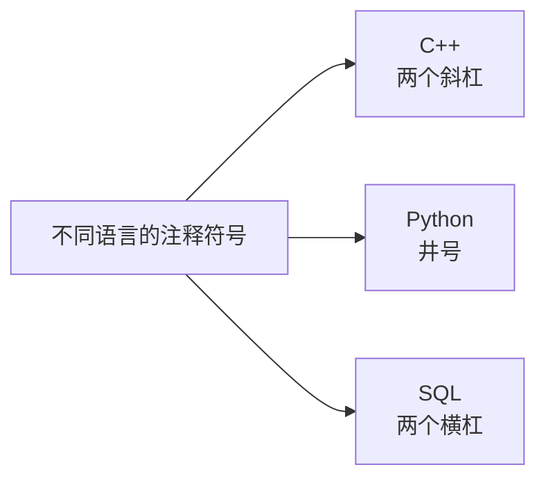

## 为什么需要注释

注释的作用，可以理解成"给未来的自己留话"。

写代码的时候，你当时很清楚这一段在干什么；但代码越写越多，过一段时间再回头看，往往会发现连自己写的代码都看不懂了。如果不写注释，代码一多，维护就会失控。

所以需要用注释来说明：这段代码在表达什么含义。它的读者既可能是几个月后的自己，也可能是接手代码的同事。


## 先写出程序框架

在讲注释之前，先把程序的框架写出来：

```cpp
#include <iostream>

using namespace std;

int main() {
    cout << "Hello World" << endl;
    return 0;
}
```

这段代码的含义上一节已经讲过，可以自己动手敲一遍。下面就在它的基础上添加注释。

## 单行注释

C++ 里最常用的注释有两种，第一种是**单行注释**，用两个斜杠 `//` 开头。

```cpp
#include <iostream>

using namespace std;

int main() {
    // 输出一行文字到控制台
    cout << "Hello World" << endl;
    return 0;
}
```

`//` 后面的内容就是注释。它只作用于当前这一行——从 `//` 开始到这一行结束，全部被当作注释处理。

如果要写多行说明，就得每一行都加一次 `//`：

```cpp
// 第一行说明
// 第二行说明
// 第三行说明
```

行数一多，每行都要补两个斜杠就很麻烦。于是就有了第二种注释。

## 多行注释

**多行注释**用斜杠加星号 `/*` 开头，用星号加斜杠 `*/` 结尾，中间的内容可以自由换行：

```cpp
/*
这一整段都是注释
可以写很多行
编译器会全部忽略
*/
```

这样一来，中间的行就不需要再写两个斜杠了，只要保证整段内容被包在 `/*` 和 `*/` 之间即可。

两种注释写在一起是这样：

```cpp
#include <iostream>

using namespace std;

int main() {
    // 单行注释：输出一行文字到控制台
    cout << "Hello World" << endl;
    /*
    多行注释：
    这里可以写多行说明
    编译器都会忽略
    */
    return 0;
}
```

## 注释不影响程序运行

加不加注释，程序的运行结果完全一样。

原因是：编译器在编译程序、生成可执行文件的时候，会把注释的内容**全部忽略掉**。所以注释不参与程序的运行，也不会影响输出结果。


> [!NOTE]
> 注释不是给计算机看的，而是**给人看的**。计算机不需要解释，需要解释的是读代码的人。

## 其他语言的注释

注释不是 C++ 独有的，其他语言也有，只是符号各不相同。

比如 Python 的注释是井号 `#`；再比如数据库里常用的 SQL，它的注释是两个横杠 `--`。这些符号不要记混——每种语言的写法都不一样。



不过不管哪种语言，在编译或解释的时候都会跳过注释，这一点是相同的。

## 本章小结

这一节讲的是注释，内容不复杂，但它是后面写代码时一直会用到的习惯。

**其一**，注释的作用是说明代码在表达什么，写给未来的自己和同事看。代码越写越多，没有注释就会越来越难维护。

**其二**，C++ 有两种常用注释：单行注释用两个斜杠开头，只作用于本行；多行注释用斜杠加星号开头、星号加斜杠结尾，中间内容可以跨多行。

**其三**，注释会被编译器完全忽略，加不加注释，程序的运行结果完全一样；注释是给人看的，不是给计算机看的。

**其四**，其他语言也有注释，但符号不同——Python 用井号，SQL 用两个横杠，不要记混。