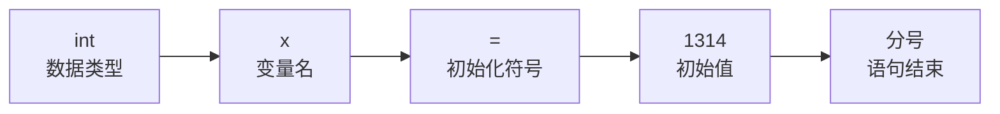
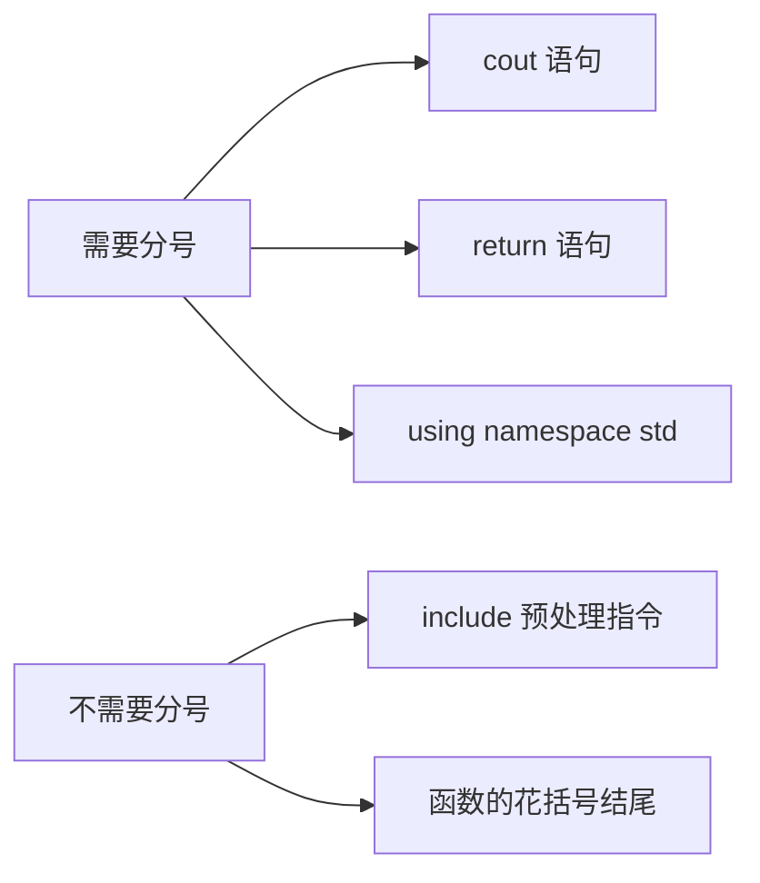
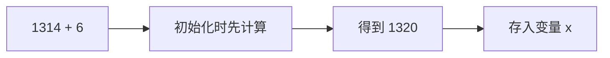
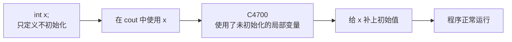

## 什么是变量

变量就是"会变的量"。

这个概念在初中、高中的数学里就见过：x 就是一个变量，它可以等于 1、等于 2、等于 3，也可以等于 1314，值能随时改变，所以叫变量。


在 C/C++ 这样的编程语言里，变量和数学里的用法有一个重要区别：**必须先定义，然后才能使用**。不定义就直接用，编译器不认识它。

## 先写出程序框架

按老规矩，先把程序框架写出来：

```cpp
#include <iostream>

using namespace std;

int main() {
    cout << "Hello World" << endl;
    return 0;
}
```

> [!TIP]
> 每次都手动把这套框架敲一遍，而不是复制粘贴。写得多自然就熟练了——真正比赛的时候，这套代码也只能靠手写。

## 变量的定义语法

定义一个变量，语法由四部分组成：数据类型、变量名、等号加初始值，最后是分号。



这里的等号虽然长得和数学里的等号一样，但它的含义是**初始化**——把右边的值放进左边这个变量里。所以这一整行读作"定义一个整数变量 x，初始值设为 1314"。

### 别忘了分号

C++ 里每条语句结束都要有分号。需要分号的有 `cout` 语句、`return` 语句，以及 `using namespace std;` 这一行。

不需要分号的有两类：`#include` 是预处理指令，它的结尾不写分号；函数结尾的那一对花括号也不写分号。



## 第一个例子：定义一个整数变量

数据类型先认识第一种：**整数**，英文是 int，也就是 integer 的缩写，编程里叫**整型**。

定义一个整型变量 x，初始值设为 1314：

```cpp
#include <iostream>

using namespace std;

int main() {
    int x = 1314;
    cout << "x = " << x << endl;
    return 0;
}
```

运行之后，控制台输出：

```text
x = 1314
```

这样就把 x 定义出来、把初始值设成了 1314，最后又把它打印了出来——这就是变量的定义与使用。

## 初始值可以是一个表达式

初始值不一定是一个写死的数字，也可以是一段计算式，比如：

```cpp
int x = 1314 + 6;
```

这里有两种可能：一种是原样输出 `1314 + 6`，另一种是把它算成 1320。实际结果是后者——程序在初始化的时候会**先把右边的式子算出来**，再把结果存进 x，所以 x 的值就是 1320。



`1314 + 6` 这样的式子叫做**表达式**，后面会专门讲。

## 变量一定要初始化

有一个很重要的习惯：**变量在创建的时候，最好就给它一个初始值**。

如果不给初始值会怎样？把上面那句改成只定义、不赋值：

```cpp
#include <iostream>

using namespace std;

int main() {
    int x;
    cout << "x = " << x << endl;
    return 0;
}
```

运行时会直接报错，提示 C4700：**使用了未初始化的局部变量 x**。也就是说，只要变量没有初始化就被使用，编译器就会立刻报错。



> [!TIP]
> 写代码要有好奇心：这行代码如果换个写法会怎样？心里先存下这个问号，然后自己动手去试，而不是直接去问别人。自己试出来的结论，印象最深。

## 一次定义多个变量

把上面的代码补上初始值，再定义第二个变量：

```cpp
#include <iostream>

using namespace std;

int main() {
    int x = 1314;
    int y = 520;
    cout << "x = " << x << endl;
    cout << "y = " << y << endl;
    return 0;
}
```

运行结果：

```text
x = 1314
y = 520
```

第一行输出 x 的值，第二行输出 y 的值。到这里，变量的定义和使用就都清楚了。

## 本章小结

**其一**，变量就是值可以改变的量，和数学里的变量概念一致；但在编程语言里，变量必须先定义、后使用。

**其二**，定义变量的语法是：数据类型、变量名、等号加初始值，最后写分号。等号的含义是初始化，也就是把右边的值放进左边的变量里。

**其三**，C++ 里每条语句结束都要有分号，包括 cout 语句、return 语句和 using namespace std；而 #include 预处理指令和函数结尾的花括号不需要分号。

**其四**，第一个数据类型是整数（int，整型）。初始值可以直接写数字，也可以写成表达式，程序会先算出结果再存入变量。

**其五**，变量在创建时一定要给初始值，否则一旦被使用就会报 C4700，提示"使用了未初始化的局部变量"。