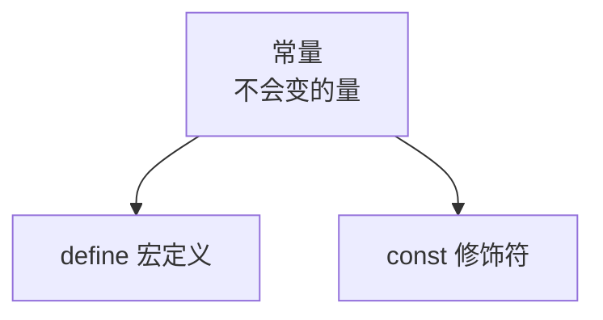
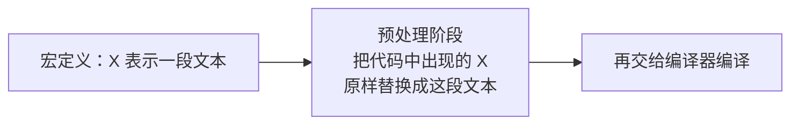
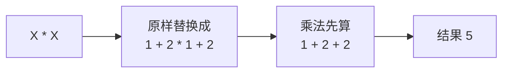
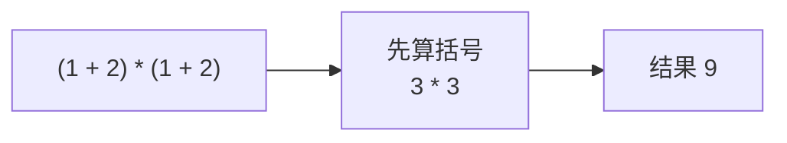
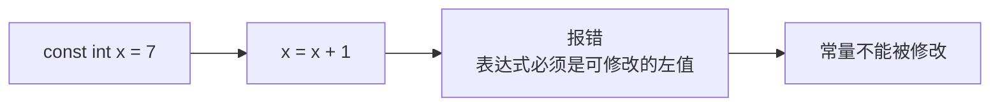

## 什么是常量

上一节说变量是"会变的量"，那么常量就是**不会变的量**——一个不变量。

在 C++ 里，常量有不止一种表示方法，这一节先认识两种：一种用 `#define` 定义，一种用 `const` 修饰。



## 用 define 定义常量

先把程序框架写出来：

```cpp
#include <iostream>

using namespace std;

int main() {
    return 0;
}
```

然后定义一个宏：

```cpp
#define X "Hello World"
#define Y "C++"
```

它的含义是：**把下面代码里出现的所有 X，都替换成这段文本**。所以当写出这样的输出语句时：

```cpp
#include <iostream>

using namespace std;

#define X "Hello World"
#define Y "C++"

int main() {
    cout << X << endl;
    cout << Y << endl;
    return 0;
}
```

运行结果就是把这两段文本原样打印出来：

```text
Hello World
C++
```

X 代表的是被替换进去的那段文本，Y 也一样。



### 替换带来的陷阱

把 X 换成一个表达式，问题就来了。假设改成：

```cpp
#define X 1 + 2
```

再写一句 `cout << X * X << endl;`，输出会是多少？

看起来 X 等于 3，3 乘 3 应该是 9；但实际运行的结果是 **5**。

原因还是在"替换"这两个字上。宏只做原样替换，不负责加括号，所以 `X * X` 被展开成：

```cpp
1 + 2 * 1 + 2
```

乘法的优先级高于加法，会先算 `2 * 1` 得到 2，整个式子就变成 `1 + 2 + 2`，结果是 5。



要让结果符合预期，就必须在宏定义里把表达式用括号包起来：

```cpp
#define X (1 + 2)
```

这样 `X * X` 展开成 `(1 + 2) * (1 + 2)`，先算括号得到 `3 * 3`，结果就是 9。



> [!WARNING]
> 用宏定义表达式时，一定要给整个表达式加上括号。这类"看着像 9、实际是 5"的问题，是面试题里非常喜欢考的点。

完整的程序是这样：

```cpp
#include <iostream>

using namespace std;

#define X (1 + 2)

int main() {
    cout << X * X << endl;
    return 0;
}
```

## 用 const 修饰常量

第二种方式是在变量前面加一个修饰符 `const`，它是英文 constant（常量）的缩写。

先看没有 const 的情况，定义一个变量并让它加一：

```cpp
#include <iostream>

using namespace std;

int main() {
    int x = 7;
    x = x + 1;
    cout << x << endl;
    return 0;
}
```

运行结果是 8。这里 `x = x + 1` 是一个赋值：先把右边的 `7 + 1` 算出来得到 8，再赋给 x。（赋值运算符后面会专门讲。）

现在给 x 加上 const：

```cpp
const int x = 7;
```

x 就从变量变成了常量。这时如果还写 `x = x + 1;`，代码上会立刻出现波浪线提示，运行也会报错，提示这个表达式必须是**可修改的左值**。

所谓左值，简单理解就是"可以被赋值的东西"。x 现在是常量，不可以被修改，而赋值本身就是一种修改，所以这句是非法的。



> [!NOTE]
> 这个提示的文字在不同编译器、不同版本上会略有差别（有的显示为"不能给常量赋值"），表达的是同一件事：常量不允许被重新赋值。

把那一句删掉，程序就正常了：

```cpp
#include <iostream>

using namespace std;

int main() {
    const int x = 7;
    cout << x << endl;
    return 0;
}
```

运行结果输出 7。

### C++ 是大小写敏感的

这里要特别提醒一点：`#define X` 里的 X 是大写，`int x` 里的 x 是小写，**这两个不是同一个东西**。

C++ 是大小写敏感的，同一个字母的大写和小写会被当成完全不同的名字。所以写代码时不要把 X 和 x 混着用，否则会得到意想不到的结果。

## 为什么需要常量

有人会问：变量能改，不是更方便吗？为什么还要引入常量？

原因很简单：在有些需求场景下，这个量**本来就不应该变**。既然不希望它变，那就把它定义成常量，从语法上直接禁止修改。这样即使以后手误写了赋值语句，编译器也会立刻拦下来。

所以常量的价值不在"省事"，而在"约束"——用语法把"这个值不该被改"这件事固定下来。

## 本章小结

**其一**，常量是不会变的量，与"会变的量"的变量相对；C++ 里常见的表示方法有 `#define` 宏定义和 `const` 修饰符两种。

**其二**，`#define` 的本质是文本替换：在预处理阶段，把代码中出现的名字原样替换成定义的那段内容，替换完再交给编译器编译。

**其三**，宏替换不负责加括号。若宏定义的是表达式（如 `1 + 2`），必须写成 `#define X (1 + 2)`，否则 `X * X` 会被展开成 `1 + 2 * 1 + 2`，结果是 5 而不是 9。

**其四**，在变量前加 `const` 就得到常量。常量不能被赋值修改，一旦写下赋值语句，编译器会报错提示"表达式必须是可修改的左值"（也可能提示"不能给常量赋值"）。

**其五**，C++ 是大小写敏感的，大写的 X 和小写的 x 是两个不同的名字，不要混用。

**其六**，使用常量的意义在于约束：某些值本来就不应该改变，用常量从语法上禁止修改，比靠人记住更可靠。