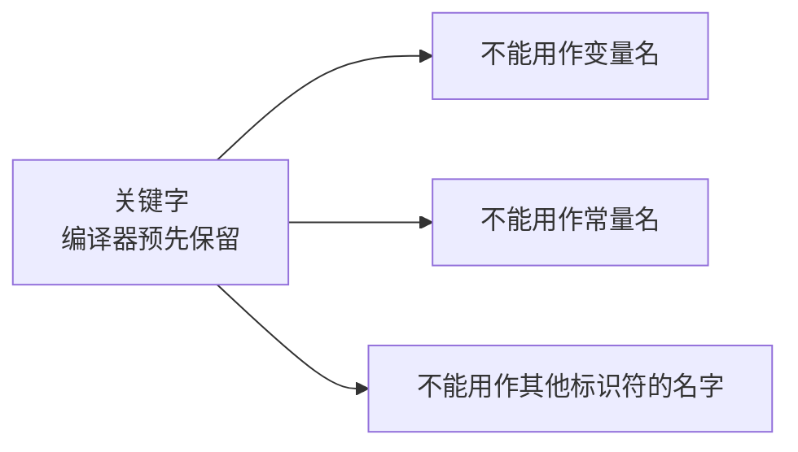
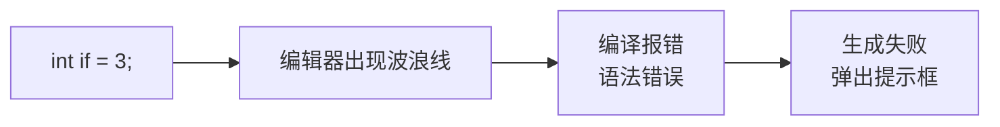
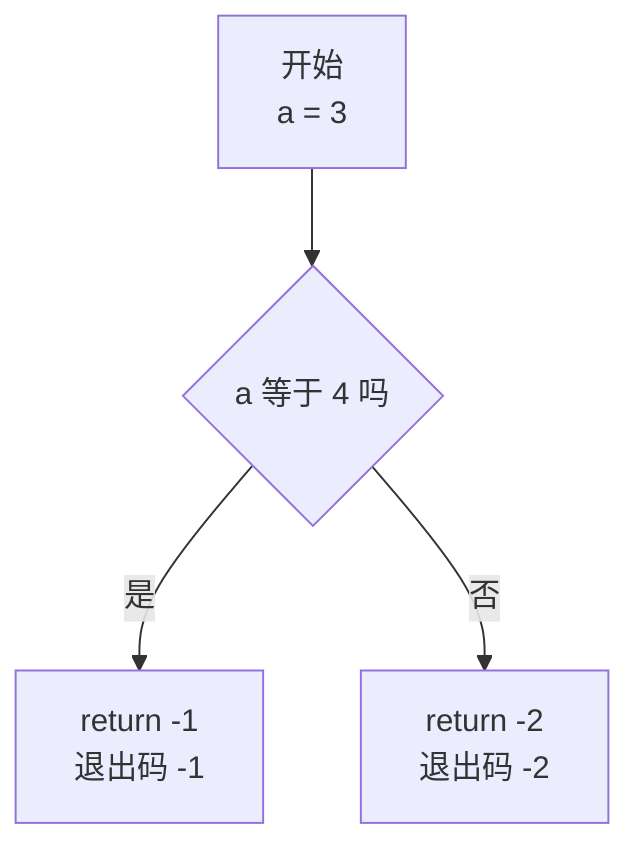
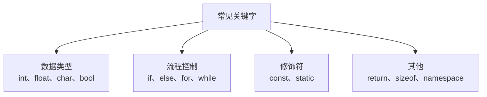

## 什么是关键字

在 C++ 里，关键字就是**编译器预先保留的一些单词**。这些单词已经被语言本身占用了，所以你不能拿它们来给变量、常量起名字。



## 关键字不能用作变量名

先把程序框架写出来，然后试着定义一个整型变量，名字叫 namespace：

```cpp
#include <iostream>

using namespace std;

int main() {
    int namespace = 5;
    cout << namespace << endl;
    return 0;
}
```

这句话刚敲完，编辑器就会在 namespace 下面画出波浪线——因为它是一个保留的关键字，不能作为变量名使用。

换几个名字再试，结果一样：return 不行、for 不行、float 不行、private 不行、sizeof 不行、static 也不行。这些全都是关键字。

其实前面几节已经无意中用过不少关键字了，比如 int、return、using、namespace，只是当时没有专门提这一点。

把名字换成一个没有被保留的，比如 f，代码立刻正常：

```cpp
#include <iostream>

using namespace std;

int main() {
    int f = 5;
    cout << f << endl;
    return 0;
}
```

运行结果输出 5。

## 关键字误用会怎样

如果不知道某个词是关键字，直接拿来当变量名，会怎样？试一下：

```cpp
#include <iostream>

using namespace std;

int main() {
    int if = 3;
    cout << if << endl;
    return 0;
}
```

这时会出现错误，去调试运行还会弹出提示框，报的是**语法错误**。原因就是 if 是关键字，不能当变量名。



> [!TIP]
> 遇到"语法错误"这类提示时，先看一眼报错指向的那个名字，是不是撞上了关键字。这是初学者很容易踩的一个坑。

## 顺便认识 if 和 else

既然提到了 if，就顺手把它认识一下。先看一段代码：

```cpp
#include <iostream>

using namespace std;

int main() {
    int a = 3;
    if (a == 4) {
        return -1;
    }
    else {
        return -2;
    }
}
```

if 是关键字，意思是"如果"；else 也是关键字，意思是"否则"。

这里的 `==` 是比较运算符，用来判断两边是否相等——**两个等号表示判相等，一个等号表示赋值**，这两个不要写混。（比较运算符后面会专门讲。）

所以这段代码的逻辑是：如果 a 等于 4，就返回 -1；否则返回 -2。



前面讲过，return 后面的数字就是进程的退出码。这里 a 的值是 3，并不等于 4，所以会走 else 这一支，运行完的退出码是 -2。

两条路只会走其中一条：要么走 if 这一支，要么走 else 这一支。

## 常见关键字一览

C++ 的关键字数量不少，而且随着语言标准更新还会增加，这里先列出常见的一部分，不需要一次记住，遇到再查即可。

| 关键字 | 含义 | 常见场景 |
| --- | --- | --- |
| int、float、double、char、bool、void | 数据类型 | 定义变量、函数返回值 |
| if、else | 如果、否则 | 条件判断 |
| for、while、do | 循环 | 重复执行一段代码 |
| switch、case、default | 多分支选择 | 按不同取值分别处理 |
| break、continue | 跳出、跳过本次 | 控制循环与分支流程 |
| return | 返回 | 结束函数并返回结果 |
| const | 常量修饰 | 定义不可修改的量 |
| static | 静态 | 静态变量、静态成员 |
| sizeof | 求大小 | 计算类型或变量占用的字节数 |
| namespace、using | 命名空间、使用 | `using namespace std;` |
| class、struct | 类、结构体 | 面向对象编程 |
| public、private、protected | 访问权限 | 类的成员访问控制 |
| new、delete | 动态内存 | 申请与释放堆内存 |
| try、catch、throw | 异常处理 | 捕获与抛出异常 |



## 本章小结

**其一**，关键字是编译器预先保留的单词，已经被语言本身占用，不能用来给变量、常量或其他标识符起名字。

**其二**，误用关键字的直接表现是编辑器出现波浪线；如果强行编译运行，会报语法错误并弹出提示框。namespace、return、for、float、private、sizeof、static 这些词都属于关键字。

**其三**，`if` 表示"如果"，`else` 表示"否则"，它们都是关键字。`==` 是比较运算符，表示判断两边是否相等；一个等号 `=` 表示赋值，两者不要写混。

**其四**，`if...else` 的两条分支只会执行其中一条。a 等于 4 时返回 -1，否则返回 -2；a 的值为 3，所以退出码是 -2。

**其五**，C++ 的关键字数量较多，不需要一次背下来。写代码时给变量起名，只要避开这些被保留的单词即可，遇到拿不准的词查一下表就行。