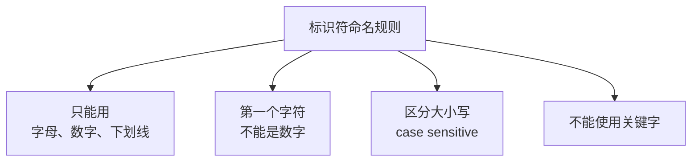
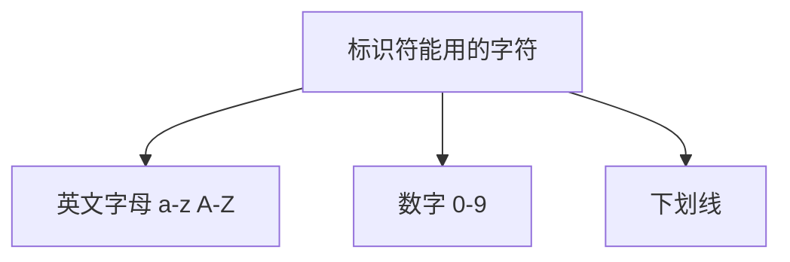
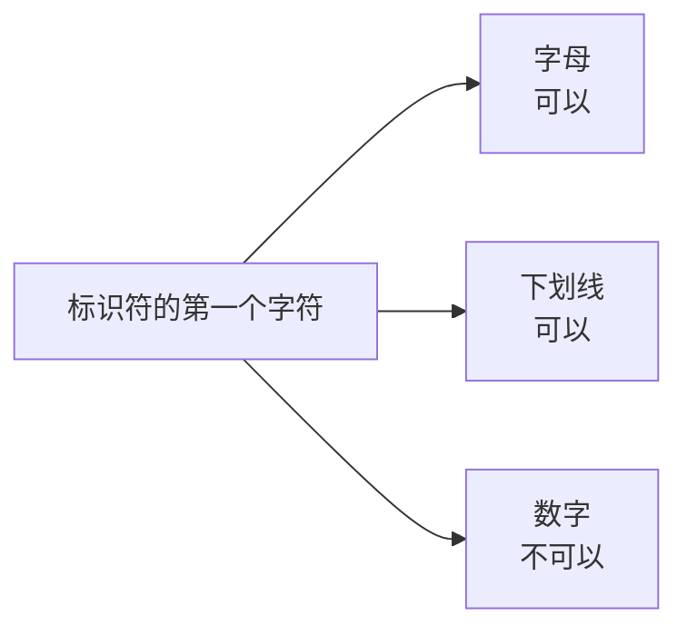
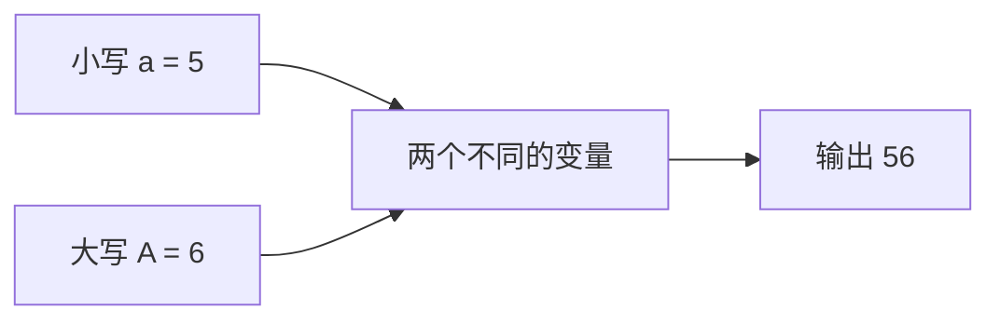

## 什么是标识符

标识符就是**给程序里的东西起的名字**——变量的名字、常量的名字，都属于标识符。

上一节讲的关键字是"不能用的名字"，这一节讲的是"能用的名字该怎么取"。



## 规则一：只能由字母、数字、下划线组成

标识符能用的字符只有三类：英文字母（a~z、A~Z）、数字（0~9）、下划线 `_`。除此之外的字符一律不能出现在标识符里。



把这三类字符混在一起用，是可以的。比如下面这个标识符由字母 a、数字 12、下划线 A 组成，完全合法：

```cpp
#include <iostream>

using namespace std;

int main() {
    int a12_A = 1314;
    cout << a12_A << endl;
    return 0;
}
```

敲完就会发现它没有出现波浪线，说明这个名字是被允许的。

## 规则二：第一个字符不能是数字

标识符的第一个字符只能是字母或者下划线，**不能是数字**。

试一下把数字放在开头：

```cpp
#include <iostream>

using namespace std;

int main() {
    int 1a_ = 520;
    cout << 1a_ << endl;
    return 0;
}
```

这段代码会直接报错，提示与"用户定义的文本（user-defined literal）"有关。这个提示文字看起来不太好懂，但只要记住结论就够了：**标识符的第一个字符不能是数字**。



> [!TIP]
> 可以养成一个习惯：在代码里用注释把结论记下来，比如写一行"标识符的第一个字符不能是数字"。自己动手记过的规则，比看别人的总结记得牢。

## 规则三：区分大小写

标识符中的字母是**区分大小写**的，这个特性叫 case sensitive。

看一段代码：

```cpp
#include <iostream>

using namespace std;

int main() {
    int a = 5;
    int A = 6;
    cout << a << A << endl;
    return 0;
}
```

这里定义了 a 和 A 两个标识符，看起来只差一个大小写，但它们是**两个完全不同的变量**。运行结果输出 `56`——因为中间没有换行，5 和 6 连着打印了出来。



也就是说，`a`、`A` 是两个互不相干的标识符，命名时千万不要指望它们能通用。

## 规则四：不能用关键字

还有一点比较隐蔽的规则：标识符不能使用系统已经定义好的关键字。

这条规则上一节已经专门讲过，比如 namespace、if、for、float、return 这些词都不能拿来当变量名。

## 命名建议：见名知意

规则之外，还有一个建议：**名字要能说明它是干什么的**。看到变量名就知道它的含义，代码的可读性会好很多。

比如统计水果数量：

```cpp
int appleCount = 3;
int bananaCount = 5;
int xiguaCount = 2;
```

appleCount 一看就是苹果的数量，bananaCount 是香蕉的数量。第三个用的是拼音加英文的混合写法，虽然看起来不太整齐，但它同样能表达清楚含义。

用英文还是用拼音，其实没有绝对的对错。真正的要求是**项目内部统一**：如果一个项目里大家都用拼音，那用拼音也完全可以；反过来，如果项目里都用英文，就跟着用英文。

有些概念本来就很难找到合适的英文单词，硬翻过去反而没人看得懂，这时候用拼音表达反而不容易产生歧义。所以不必在这件事上纠结，保持团队一致、看得懂，就是好名字。

## 本章小结

**其一**，标识符就是给变量、常量等起的名字。命名要满足三条基本规则，外加一条容易忽略的限制。

**其二**，标识符只能由英文字母、数字、下划线三类字符组成，其他字符一律不行；并且第一个字符只能是字母或下划线，不能是数字，否则会报错（提示与"用户定义的文本"有关）。

**其三**，标识符区分大小写，也就是 case sensitive。a 和 A 是两个不同的标识符，不能混用。

**其四**，标识符不能使用系统已经定义好的关键字，这条规则与上一节的内容一致。

**其五**，规则之外还要做到见名知意，让名字本身说明用途，比如 appleCount 表示苹果数量。用英文还是用拼音没有对错，关键是项目内部保持统一。