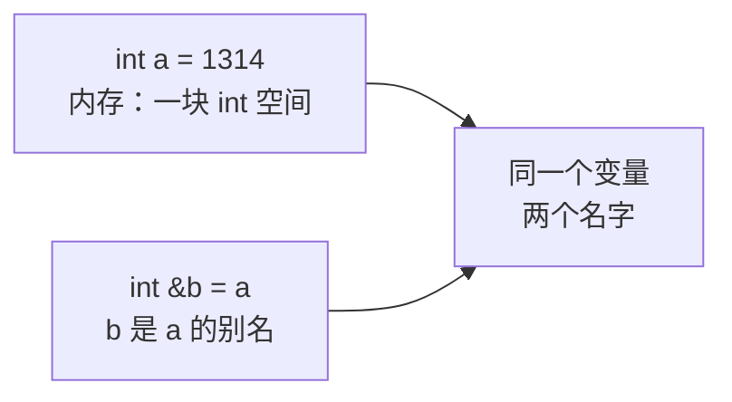
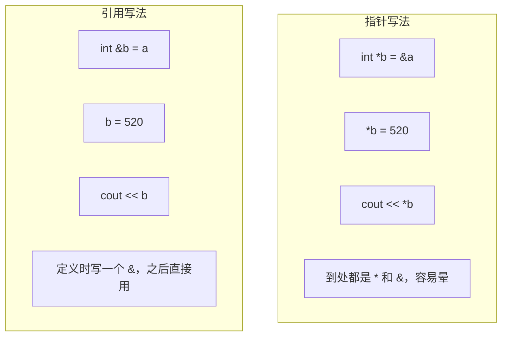
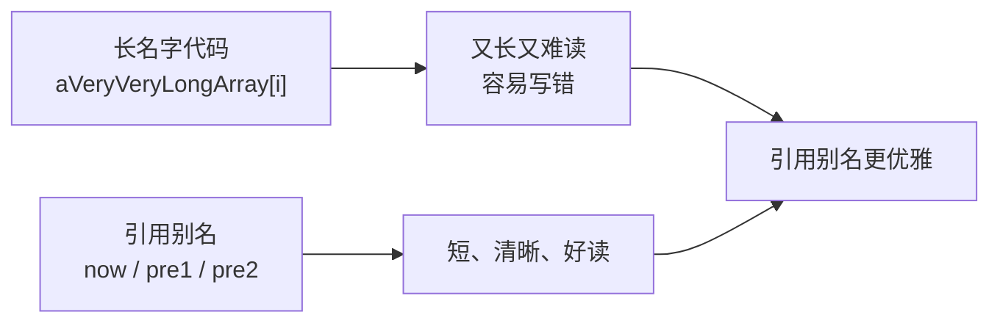
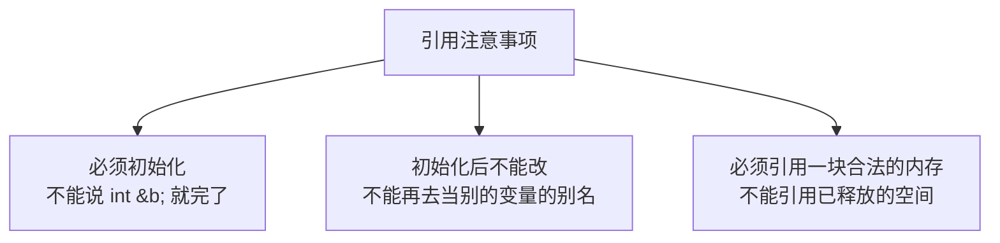

## 本节概述：引用是什么

这一节我们学习 C++ 里一种非常重要的语法——**引用**。

你可能会问：指针已经能实现地址操作了，为什么还要学引用？

原因很简单：**引用比指针更好理解、写出来的代码更简洁**。而且 STL 底层大量使用了引用，不学的话很多代码看不懂。C 语言里没有引用照样能写程序，但 C++ 里有了引用，代码能变得更优雅。

> 用指针的同学会说："所以爱会消失对吗？"——哈哈，指针不会消失，但引用能让你少写好多星号。

## 引用的基本语法

引用，说白了就是**给变量起个别名**。就像你大名叫张三，小名叫小三——叫哪个都是在叫你。

语法格式：

```
数据类型 &别名 = 原变量;
```

举个例子：

```cpp
int a = 1314;
int &b = a;    // b 是 a 的引用（别名）
```

这时候 `a` 和 `b` 指的是**同一块内存**、同一个变量。改 `b` 的值，`a` 也会跟着变。



我们来验证一下：

```cpp
#include <iostream>
using namespace std;

int main()
{
    int a = 1314;
    int &b = a;

    cout << "a = " << a << endl;   // 输出 1314
    cout << "b = " << b << endl;   // 输出 1314

    b = 520;                       // 改 b 的值

    cout << "a = " << a << endl;   // 输出 520，a 也变了
    cout << "b = " << b << endl;   // 输出 520

    return 0;
}
```

运行结果：a 和 b 都是 520。因为它们本来就是同一个东西，只是叫了两个名字而已。

> [!TIP]
> **怎么理解引用？** 把引用想成"外号"就对了。你本名是张三，别人叫你小三，你应不应？当然应——因为都是你。引用就是这么回事。

## 引用 vs 指针：谁更简洁

你可能觉得：哎，这不是跟指针很像吗？

确实，引用能做的事，指针基本也能做。但写法上，引用要简洁得多。我们来对比一下同样的功能，指针怎么写、引用怎么写。

**指针版本：**

```cpp
int a = 1314;
int *b = &a;      // 定义指针，取地址
*b = 520;         // 解引用赋值
cout << *b;       // 解引用读取
```

**引用版本：**

```cpp
int a = 1314;
int &b = a;       // 定义引用
b = 520;          // 直接赋值
cout << b;        // 直接读取
```



指针要取地址（`&`）、要解引用（`*`），写起来全是符号，新手容易晕。引用只在定义时写一个 `&`，之后就像普通变量一样用——你说哪个省心？

> [!NOTE]
> 注意区分两个 `&`：
> - 放在类型旁边的 `&`（如 `int &b`）：表示引用
> - 放在变量前面的 `&`（如 `&a`）：表示取地址
>
> 位置不同，意思完全不一样，别搞混了。

## 引用的实用场景：给长名字起别名

引用除了代替指针，还有一个非常实用的功能——**给长名字的变量起个短别名**，让代码更好读、更少出错。

举个例子，假设有一个名字特别长的数组：

```cpp
int aVeryVeryLongArray[8] = { 1, 1 }; // 前两个元素都是 1
```

现在要写一个循环，每个元素等于前一个数的平方 + 前两个数的平方（类似斐波那契的变体）。直接写的话：

```cpp
for (int i = 2; i < 8; i++)
{
    aVeryVeryLongArray[i] =
        aVeryVeryLongArray[i - 1] * aVeryVeryLongArray[i - 1] +
        aVeryVeryLongArray[i - 2] * aVeryVeryLongArray[i - 2];
}
```

这代码也太长了！一行写不下，而且看的时候眼睛都花了，很容易写错。

### 用引用简化

我们可以给这些元素起个短别名，代码瞬间清爽：

```cpp
for (int i = 2; i < 8; i++)
{
    int &now = aVeryVeryLongArray[i];       // 当前元素的别名
    int &pre1 = aVeryVeryLongArray[i - 1];  // 前一个的别名
    int &pre2 = aVeryVeryLongArray[i - 2];  // 前两个的别名

    now = pre1 * pre1 + pre2 * pre2;
}
```



`now` 就是 `aVeryVeryLongArray[i]` 的别名，对 `now` 赋值就等于对原数组元素赋值——因为它们是同一个东西。

> [!WARNING]
> 这里有个坑：如果你忘了加引用符号 `&`，那 `now` 就只是一个普通变量，它会把数组元素的值**拷贝**一份。你改 `now` 的值只会改这个拷贝，原数组不会变——那就白写了。一定要加 `&`！

## 引用的注意事项

学引用有几个关键点必须记住，先在这里预告一下（后面的章节会详细展开）：



这些我们放到后面「引用的特性」和「引用的本质」里慢慢讲。

## 本章小结

**引用**就是给变量起个别名，两个名字指向同一块内存，改一个另一个也跟着变。

**语法**：`类型 &别名 = 原变量;`，定义时就要绑定好。

**相比指针的优势**：
- 不用取地址、不用解引用，写起来更简洁
- 读起来更自然，代码更易维护

**实用场景**：
1. 代替指针实现地址操作（少写星号）
2. 给长名字的变量起短别名，提升代码可读性

**预告**：引用还有不少讲究——必须初始化、不能改指向、和指针的关系等等，后面几节一一拆解。
