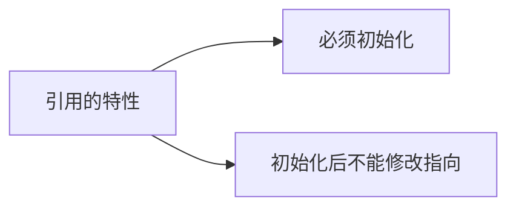
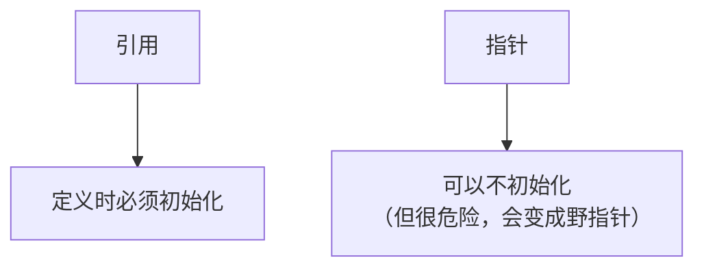
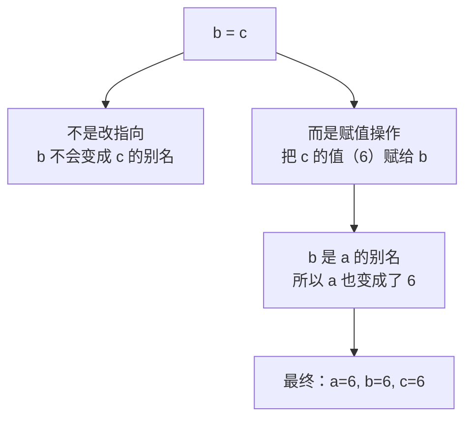
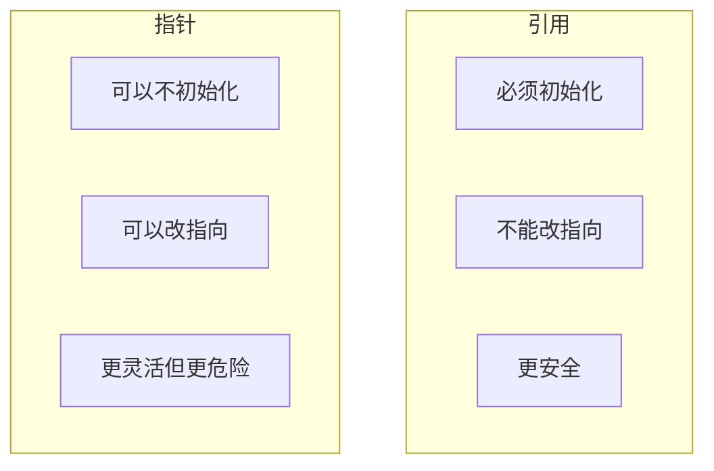
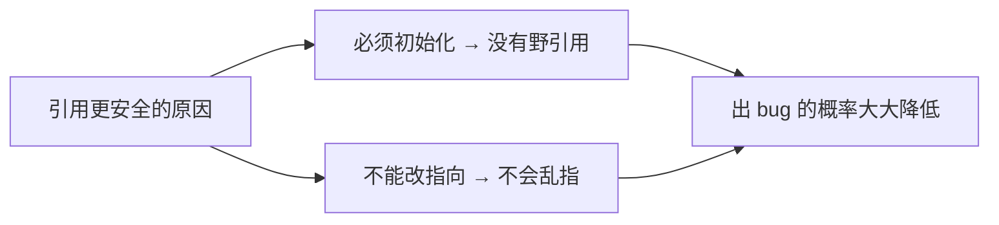

## 本节概述：引用的两个特性

上一节我们学会了引用的基本语法，这一节讲引用的两个核心特性——也是引用和指针最关键的区别：



就这两条，但这两条让引用比指针安全得多。

## 特性一：必须初始化

引用在定义的时候，**必须同时指定它是谁的别名**，不能先定义再绑定。

错误写法：

```cpp
int &b;   // 错误！引用必须初始化
```

这么写编译器直接报错，告诉你"引用变量需要初始值设定项"——意思就是你得告诉我这是谁的别名。

正确写法：

```cpp
int a = 3;
int &b = a;   // 正确：定义的同时绑定到 a
```



> 对比一下指针：指针可以只定义不初始化（`int *p;`），但这时候 `p` 是个野指针，非常危险。引用从语法上就杜绝了这个问题——你不初始化，编译器不让你过。

## 特性二：初始化后不能改指向

引用一旦绑定到某个变量，就**一辈子都是它的别名**，不能再去当别的变量的别名了。

这是引用和指针最大的区别。指针你随时可以让它指向别的变量，但引用不行。

我们来看一段容易搞混的代码：

```cpp
int a = 3;
int c = 6;

int &b = a;   // b 初始化为 a 的别名
b = c;        // 这行是什么意思？
```

问你一个问题：执行完 `b = c;` 之后，`b` 变成了谁的别名？是 `a` 还是 `c`？

很多人会说："那还用问，b = c 就是让 b 当 c 的别名呗。"

错！答案是：**b 还是 a 的别名，只是 a 和 b 的值变成了 6。**



因为引用从一开始绑定到 `a` 之后，就再也改不了了。`b = c` 这句话里的 `=` 不是"绑定"的意思，而是**赋值**的意思——把 `c` 的值 6 赋给 `b`，而 `b` 是 `a` 的别名，所以 `a` 也变成了 6。

完整代码验证一下：

```cpp
#include <iostream>
using namespace std;

int main()
{
    int a = 3;
    int c = 6;

    int &b = a;    // b 是 a 的别名
    b = c;         // 赋值，不是改指向

    cout << "a = " << a << endl;   // 输出 6
    cout << "b = " << b << endl;   // 输出 6
    cout << "c = " << c << endl;   // 输出 6

    return 0;
}
```

运行结果：三个都是 6。因为 `b = c` 是赋值操作，把 6 赋给了 `b`，`b` 和 `a` 是同一个东西，所以 `a` 也变成 6 了。

> [!TIP]
> **怎么记？** 把引用想成"认亲"——一旦认了谁当大哥，这辈子就是他小弟了，不能换大哥。你给小弟塞点钱，大哥的钱也会变——因为他俩是一家人。

## 引用 vs 指针：特性对比

把引用和指针的关键区别整理一下：

| 特性 | 引用 | 指针 |
|---|---|---|
| 是否必须初始化 | ✅ 必须，不初始化编译报错 | ❌ 可以不初始化（野指针，危险） |
| 能否改指向 | ❌ 不能，绑定后就固定了 | ✅ 可以，随时指向别的变量 |
| 会不会有空的情况 | ❌ 不会，必须绑定有效内存 | ✅ 可能是 NULL 或野指针 |
| 使用时需不需要解引用 | ❌ 不需要，直接当变量用 | ✅ 需要，用 * 解引用 |



## 为什么引用更安全

正是因为这两个特性，引用比指针安全得多：

1. **必须初始化** → 不会出现"未初始化的引用"，从根源上避免了野引用
2. **不能改指向** → 绑定好之后就一直是那个变量，不会乱跑

指针的很多坑——空指针、野指针、悬垂指针——引用要么从语法上杜绝了，要么大大降低了风险。



> [!NOTE]
> 当然，引用也不是绝对安全的。如果引用绑定的变量被销毁了（比如函数返回了局部变量的引用），照样会出问题——那个我们放到"引用作为返回值"那一节再讲。

## 本章小结

**引用两大特性：**
1. **必须初始化**：定义时就要绑定到某个变量，不能光定义不初始化
2. **不能改指向**：一旦绑定，终身不变，之后再赋值只是改值，不是改绑定对象

**和指针的区别**：指针可以不初始化、可以随时改指向，更灵活但也更危险；引用从语法上强制了初始化和不可改变，更安全。

**一个容易踩的坑**：`b = c;` 不是让 b 变成 c 的别名，而是把 c 的值赋给 b（同时也改变了 b 绑定的原变量）。

引用的这两个特性是它在 C++ 中不可替代的原因，也是后面学习 STL 的基础，务必吃透。
