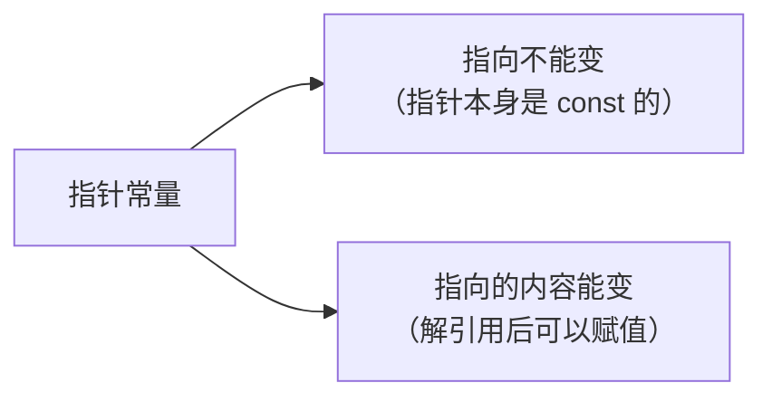
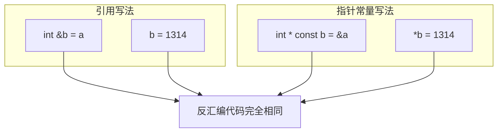
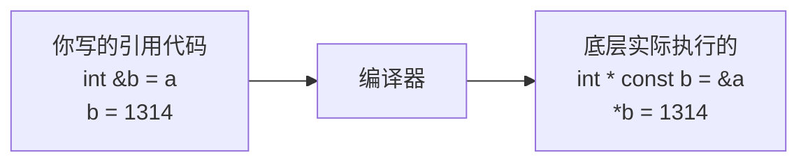
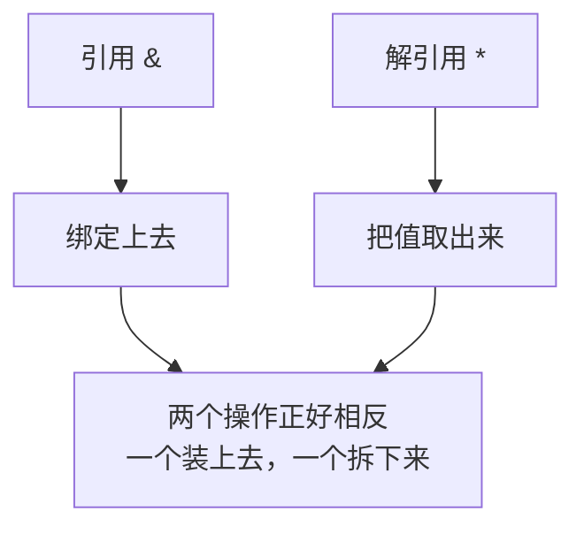
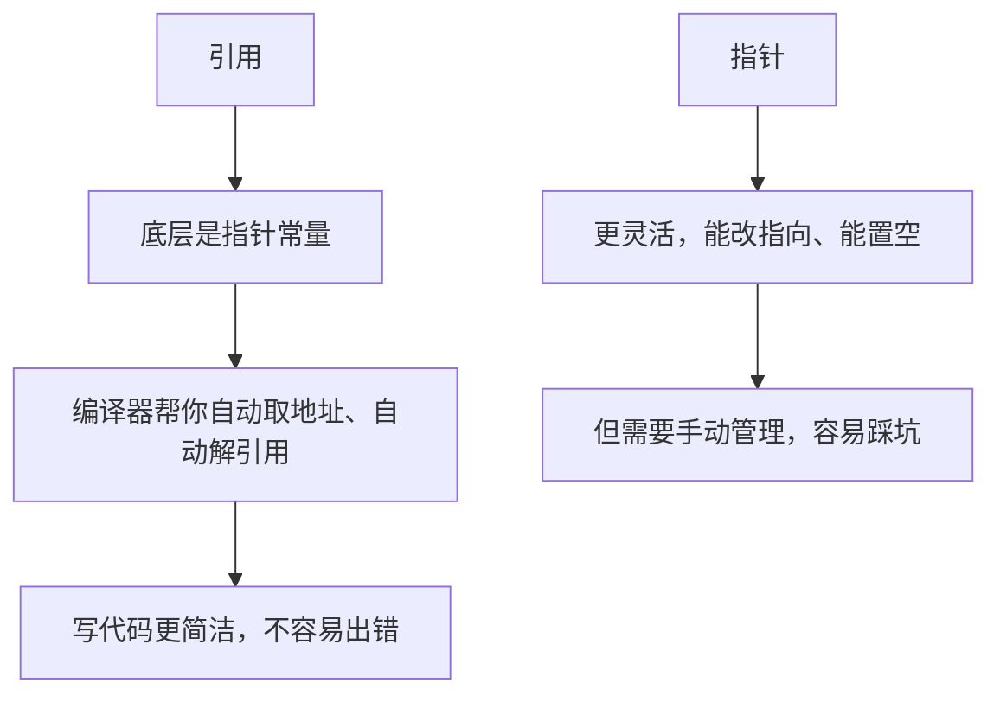

## 本节概述：引用的底层是什么

上一节我们学了引用的两个特性：必须初始化、初始化后不能改指向。

有没有觉得这两个特性有点眼熟？是不是跟指针常量（`int * const`）特别像？

没错——**引用的底层实现，就是一个指针常量**。

## 什么是指针常量

先复习一下：指针常量，就是指针本身是个常量——指针的指向不能改，但指向的内容可以改。

```cpp
int a = 520;
int * const b = &a;   // 指针常量：指向不能改，内容能改
```

- `*b = 1314;` ✅ 可以，改的是指向的内容
- `b = &c;` ❌ 不行，改的是指针的指向



是不是跟引用的特性一模一样？
- 必须初始化 ✅
- 不能改指向 ✅
- 可以改内容 ✅

## 用反汇编验证：引用就是指针常量

口说无凭，我们用**反汇编**来验证——看看引用和指针常量编译出来的机器码是不是一样的。

> 不用怕汇编，我们不需要看懂每一句，只需要对比两段代码的汇编是不是一样就行。

### 第一段：引用写法

```cpp
int a = 520;
int &b = a;      // 引用
b = 1314;        // 赋值
```

### 第二段：指针常量写法

```cpp
int a = 520;
int * const b = &a;   // 指针常量
*b = 1314;            // 解引用赋值
```

两段代码，一个用引用，一个用指针常量。我们把它们分别编译，看反汇编：



结果很明确：**两段代码的反汇编一模一样**。

- `int &b = a;` 和 `int * const b = &a;` —— 编译出来的机器码一样
- `b = 1314;` 和 `*b = 1314;` —— 编译出来的机器码也一样

这就证明了：引用在底层就是一个指针常量。编译器帮你把取地址、解引用这些工作都做了。



> [!NOTE]
> 你可能会问：既然底层一样，那为什么还要有引用？
>
> 因为**用起来更省心**。定义时写一个 `&`，后面就像普通变量一样用——不用你取地址、不用你解引用、不容易写错。编译器帮你把脏活累活都干了。

## 再理解"解引用"这个词

知道了引用的本质，再回头看"解引用"这个词，是不是更有感觉了？

- **引用**：给变量起个别名，绑定上去
- **解引用**：把指针里的地址"解开"，拿到它指向的值



指针要拿值的时候需要"解引用"——就像把一个包装拆开，拿出里面的东西。而引用相当于编译器自动帮你做了解引用，你直接用名字就能拿到值。

## 引用和指针的关系总结



| 层面 | 引用 | 指针常量 |
|---|---|---|
| 语法上 | `int &b = a` | `int * const b = &a` |
| 使用时 | 直接当变量用 `b = 1314` | 要解引用 `*b = 1314` |
| 底层实现 | 一样的汇编代码 | 一样的汇编代码 |

> [!TIP]
> **一句话记牢**：引用就是穿着"马甲"的指针常量。表面上看着不一样，底层其实是一回事——只是编译器帮你把星号都藏起来了。

## 本章小结

**引用的本质**：底层就是一个指针常量（`Type * const`），通过反汇编可以验证——引用代码和指针常量代码编译出的机器码完全相同。

**编译器帮你做了什么**：
- 定义引用时，自动帮你取地址
- 使用引用时，自动帮你解引用

**为什么要有引用**：让代码更简洁、更安全。你只需要在定义时写一个 `&`，后面就像普通变量一样用——不用记取地址、不用理解引用，少写很多星号，少踩很多坑。

**理解了本质再看术语**："解引用"就是把指针里地址的那层"包装"解开，拿出里面的值。和引用正好是相反的操作。
