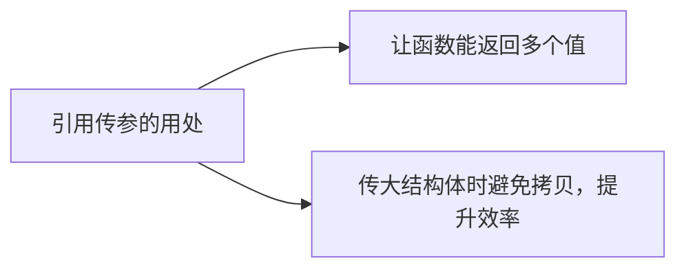
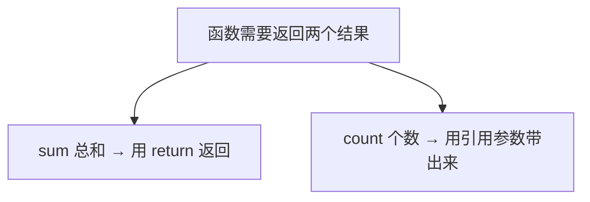
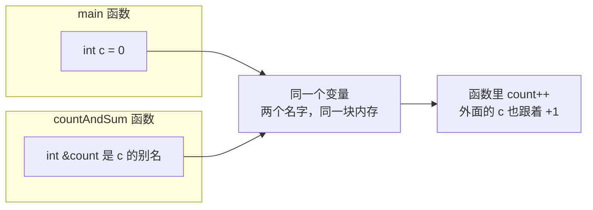
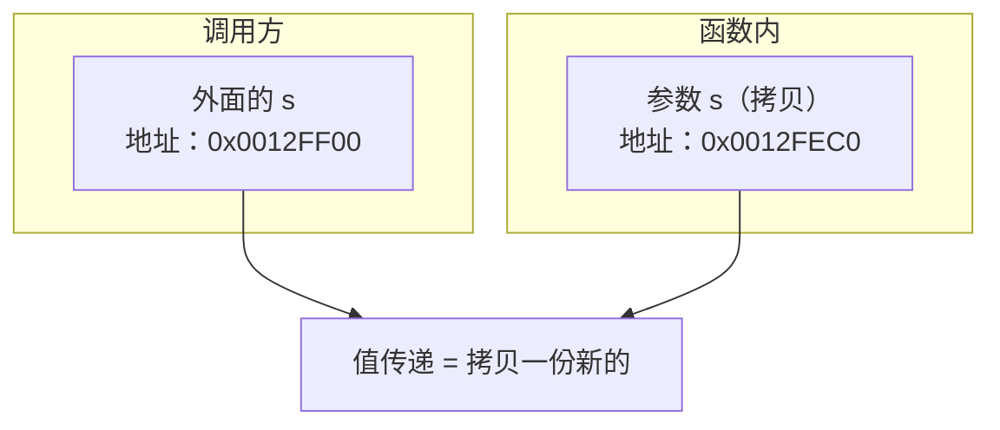
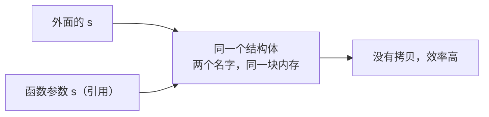
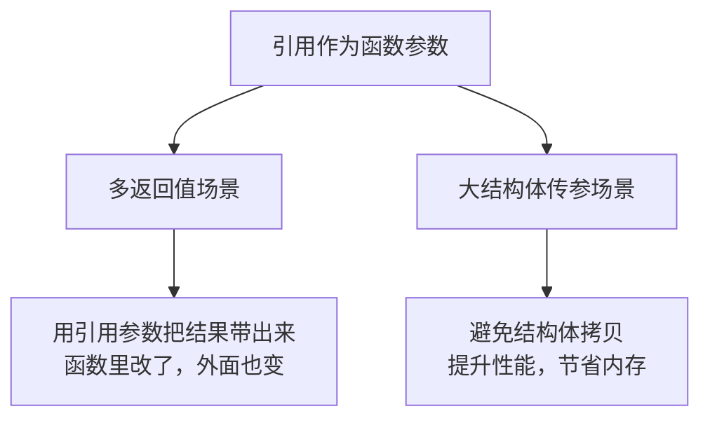

## 本节概述：引用传参的两大用处

前面我们学了引用的语法、特性和本质，这一节来看引用最常用的场景——**作为函数参数**。

引用传参主要解决两个问题：



一个一个来看。

## 一、用引用让函数"返回"多个值

函数的返回值只能有一个，但有时候我们需要从函数里拿出好几个结果。怎么办？

### 场景：统计数组里的目标值

举个例子：有一个数组，我想统计里面有多少个值为 2 的元素，还要返回这些元素的总和。

- 总和 → 可以用 return 返回
- 个数 → 第二个结果，怎么传出来？

这时候引用就派上用场了——把一个变量通过引用传进函数，函数内部改它，外面也跟着变。



### 代码实现

```cpp
#include <iostream>
using namespace std;

// arr：数组地址，size：元素个数
// target：要找的值
// count：引用参数，用来带出"有多少个"
int countAndSum(int arr[], int size, int target, int &count)
{
    int sum = 0;
    count = 0;

    for (int i = 0; i < size; i++)
    {
        if (arr[i] == target)
        {
            count++;          // 找到一个，个数 +1
            sum += arr[i];    // 累加总和
        }
    }

    return sum;   // 总和通过返回值返回
}

int main()
{
    int arr[] = { 1, 2, 3, 2, 4, 5, 6, 4, 3, 2 };
    int c = 0;

    int sum = countAndSum(arr, 10, 2, c);

    cout << "总和：" << sum << endl;     // 输出 6（三个 2 相加）
    cout << "个数：" << c << endl;       // 输出 3（有三个 2）

    return 0;
}
```

运行结果：
```
总和：6
个数：3
```

### 为什么能行

因为 `count` 是引用参数，它是外面 `c` 的别名——函数里改 `count`，等于直接改外面的 `c`。



> [!TIP]
> 怎么验证？打印地址——在 main 里打印 `&c`，在函数里打印 `&count`，你会发现两个地址完全一样。这就证明了它们是同一个东西。

### 和指针对比

用指针也能实现同样的功能，但写起来要麻烦一些：

| 对比项 | 引用传参 | 指针传参 |
|---|---|---|
| 函数定义 | `int countAndSum(..., int &count)` | `int countAndSum(..., int *count)` |
| 函数内使用 | `count++` 直接用 | `(*count)++` 要解引用 |
| 调用时 | `countAndSum(..., c)` 直接传变量 | `countAndSum(..., &c)` 要取地址 |

引用传参不用取地址、不用解引用，写起来像普通变量一样自然——这就是引用比指针舒服的地方。

## 二、用引用避免大结构体的拷贝

引用传参的第二个用处：**传大结构体时，避免拷贝，提高效率**。

### 值传递的问题：结构体被拷贝了一份

先看一个不用引用的版本：

```cpp
struct BigStruct
{
    int a, b, c, d, e, f, g;
    // 想象一下这里面还有大数组...
};

void printS(BigStruct s)   // 值传递
{
    cout << s.a << s.b << s.c << endl;
    // ...
}
```

调用 `printS(s)` 的时候，会发生什么？

**整个结构体会被拷贝一份**，函数里的 `s` 和外面的 `s` 是两个不同的东西，地址不一样。



小结构体还好，如果结构体特别大（比如里面有个巨大的数组），那拷贝一次就非常耗时，还浪费内存。

> 打个比方：你有一本 1000 页的书，只是想让别人看看封面——值传递相当于把整本书复印一本给他，又费纸又费时间。

### 用引用就不用拷贝了

改成引用传参：

```cpp
void printS(BigStruct &s)   // 引用传递
{
    cout << s.a << s.b << s.c << endl;
}
```

加了一个 `&`，一切都不一样了——函数里的 `s` 是外面那个 `s` 的别名，**根本没有拷贝**，直接用原来的。



结构体越大，引用传参节省的时间就越多。而且写法上跟值传递几乎一样，只是多了一个 `&`，非常方便。

> [!WARNING]
> 引用传参虽然高效，但也意味着函数里能直接修改外面的数据。如果你只是想读不想改，可以加上 `const` 变成常量引用——`void printS(const BigStruct &s)`，这样既能避免拷贝，又能防止不小心改了原数据。这个后面学了 const 引用会详细讲。

## 引用传参总结



**两种经典场景**：
1. **需要从函数里拿出多个结果时** — 用引用参数当"额外的返回通道"
2. **传递大结构体（或大对象）时** — 用引用避免拷贝，提高效率

**和指针的对比**：同样的功能，引用写法更简洁、更安全、更易读。所以在 C++ 里，能用引用的地方尽量用引用。

## 本章小结

**引用作为函数参数有两大用处：**

1. **让函数能"返回"多个值** — 函数只能有一个 return，但引用参数可以当额外的出口，把多个结果带出来。原理就是：引用是实参的别名，函数里改了，外面也跟着变。

2. **传递大结构体时避免拷贝** — 值传递会把整个结构体拷贝一份，大结构体既费时间又费内存。用引用传参，直接用原数据，零拷贝，效率高。

**为什么选引用不选指针**：引用不用取地址、不用解引用，写起来像普通变量一样自然，代码更简洁、更不容易出错。

**一个好的习惯**：如果传引用只是为了读数据、不想修改，就加 `const` 变成常量引用——既高效又安全。
