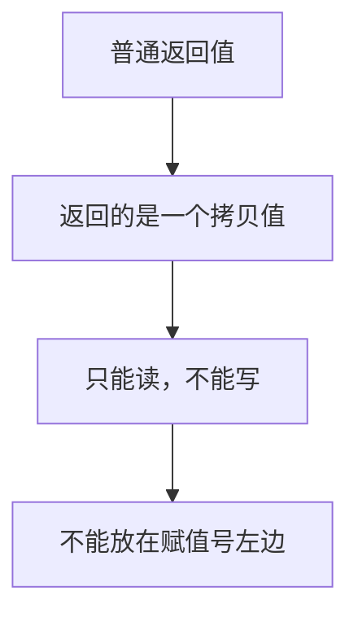
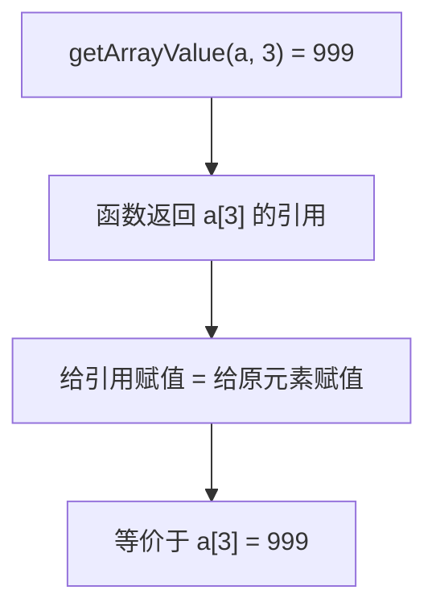
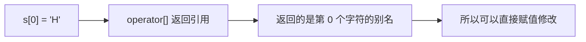
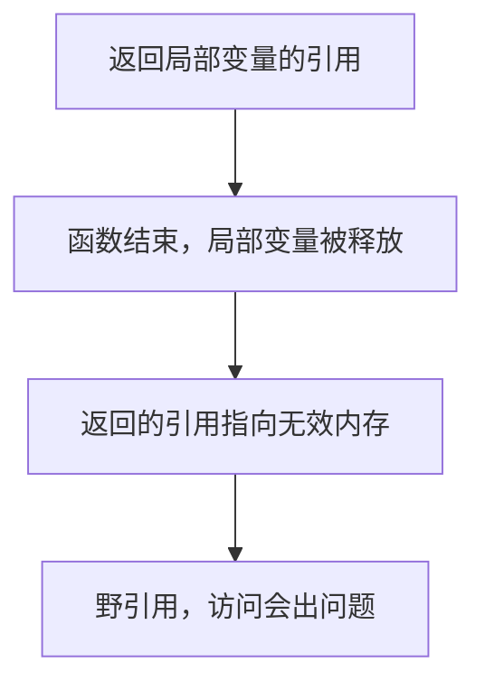

## 本节概述：返回引用有什么用

前面我们学了引用作为函数参数，这一节来看引用作为**函数返回值**的情况。

引用作返回值，最核心的好处是：**让函数调用的结果可以当左值用**——也就是你可以直接给函数调用的结果赋值。听起来有点玄乎，我们一步步来看。

## 普通返回值：只能读

先看一个普通的函数，返回数组的某个元素：

```cpp
int getArrayValue(int arr[], int index)
{
    return arr[index];
}
```

用它来读数据没问题：

```cpp
int a[] = { 8, 7, 6, 5, 4, 3 };

cout << getArrayValue(a, 3) << endl;   // 输出 5（第 3 个元素）
```

但如果你想通过这个函数来**修改**数组元素呢？比如想把第 3 个元素改成 999：

```cpp
getArrayValue(a, 3) = 999;   // 错误！编译不通过
```

编译器会报错：**表达式必须是可修改的左值**。

为什么？因为普通返回值返回的是一个**值的拷贝**——它是一个临时的数，不是原数组里的那个元素。你不能给一个"数"赋值，就像你不能写 `5 = 999;` 一样。



> 什么叫**左值**？简单说就是能放在赋值号 `=` 左边的东西。变量是左值（`a = 5;`），数字 5 不是左值（`5 = a;` 是错的）。

## 返回引用：既能读又能写

那怎么让函数既能读又能写？加个引用就行！

```cpp
int& getArrayValue(int arr[], int index)
{
    return arr[index];
}
```

只是在返回类型 `int` 后面加了个 `&`，一切都不一样了——现在函数返回的不是值的拷贝，而是**原数组元素的引用（别名）**。


### 既能读也能写

读的时候跟之前一样：

```cpp
cout << getArrayValue(a, 3) << endl;   // 输出 5
```

但现在你还能写——直接给函数调用赋值：

```cpp
getArrayValue(a, 3) = 999;   // 正确！把第 3 个元素改成 999
```

这行代码居然不报错，而且真的把数组里的值改掉了！

我们来验证一下：

```cpp
#include <iostream>
using namespace std;

int& getArrayValue(int arr[], int index)
{
    return arr[index];
}

int main()
{
    int a[] = { 8, 7, 6, 5, 4, 3 };

    cout << "修改前，第 3 个元素：" << getArrayValue(a, 3) << endl;

    getArrayValue(a, 3) = 999;   // 直接给函数返回值赋值

    cout << "修改后，第 3 个元素：" << a[3] << endl;   // 输出 999

    return 0;
}
```

运行结果：
```
修改前，第 3 个元素：5
修改后，第 3 个元素：999
```

### 为什么能这么写

因为函数返回的是 `arr[index]` 的引用——也就是原数组元素的别名。`getArrayValue(a, 3) = 999;` 这句话，本质上跟 `a[3] = 999;` 是一回事。



是不是很神奇？一个函数调用，居然能放在赋值号的左边——这就是返回引用的魔力。

> [!TIP]
> **一句话理解**：返回值就是返回一个"值"，你只能看；返回引用就是返回"原东西的别名"，你既能看也能改。

## 实际应用：STL 里到处都是

这种写法你可能觉得有点"花里胡哨"，但它在 C++ 里非常常见——**STL 的底层源码里到处都是**。

最典型的例子就是 `string` 和 `vector` 的 `[]` 运算符：

```cpp
string s = "hello";
s[0] = 'H';    // 把第一个字符改成大写
```

`s[0]` 为什么能放在赋值号左边？因为 `[]` 运算符重载的返回值就是引用——它返回的是字符串里那个字符的引用，所以你既能读也能写。



后面学面向对象、运算符重载的时候，你会大量见到这种写法。现在先有个印象就行。

## 重要警告：不要返回局部变量的引用

讲到这里必须插一个非常重要的提醒——**千万不要返回局部变量的引用**。

```cpp
int& badFunc()
{
    int a = 10;
    return a;   // 错误！返回局部变量的引用
}
```

局部变量 `a` 在栈区，函数一结束就被释放了。你返回了它的引用，结果就是个野引用——跟之前讲的返回局部变量地址是一个道理，外面拿到的是一块已经失效的内存。



> [!WARNING]
> **铁律：不要返回局部变量的引用！**
>
> 返回引用的前提是：被引用的那个变量在函数返回之后**仍然有效**。比如上面例子里的数组元素，是调用方传进来的，函数结束后它还在，所以没问题。但局部变量函数一结束就没了，返回它的引用就是找死。

## 本章小结

**引用作为函数返回值**的核心作用：让函数调用可以当左值用——既能读，又能写。

**普通返回值 vs 返回引用**：
- 普通返回值：返回值的拷贝，只能读，不能当左值
- 返回引用：返回原变量的别名，既能读又能写，可以当左值赋值

**经典应用**：
- 类似 `getArrayValue(arr, i) = xxx` 这种"通过函数改数组元素"的操作
- STL 中 `string`、`vector` 的 `[]` 运算符，底层就是返回引用

**一个大坑**：不能返回局部变量的引用。局部变量函数结束就释放了，返回它的引用就是野引用，跟野指针一样危险。
