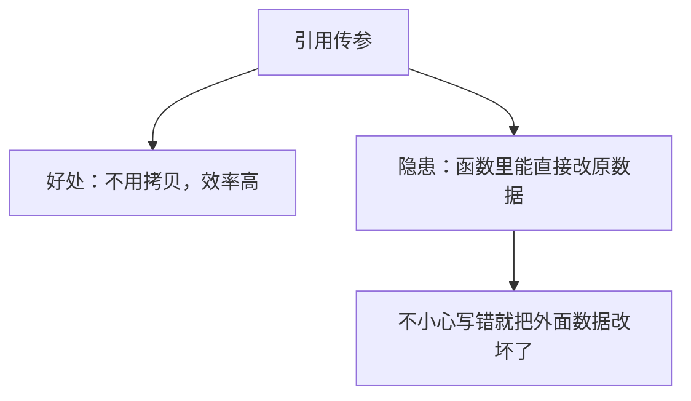
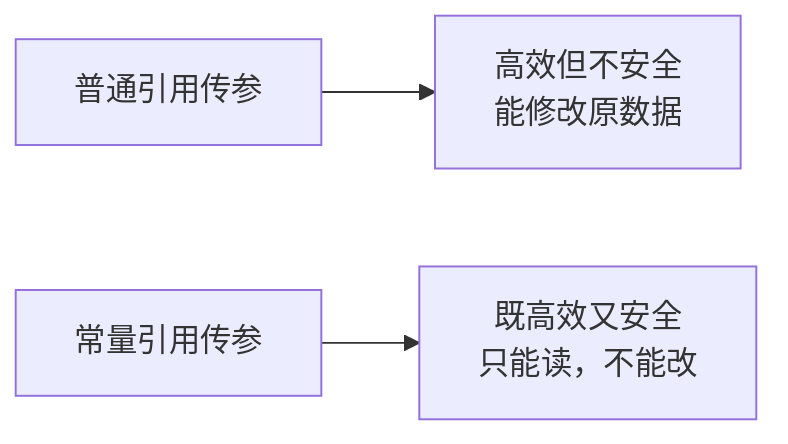
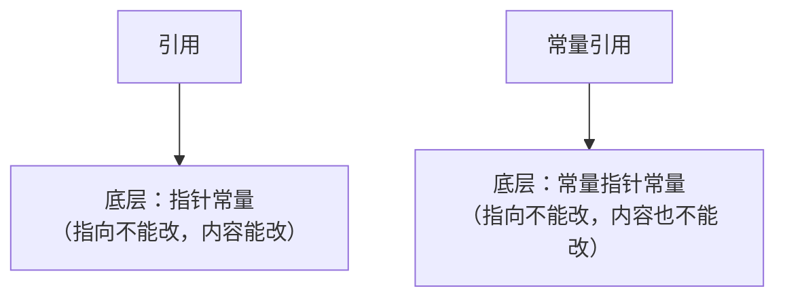
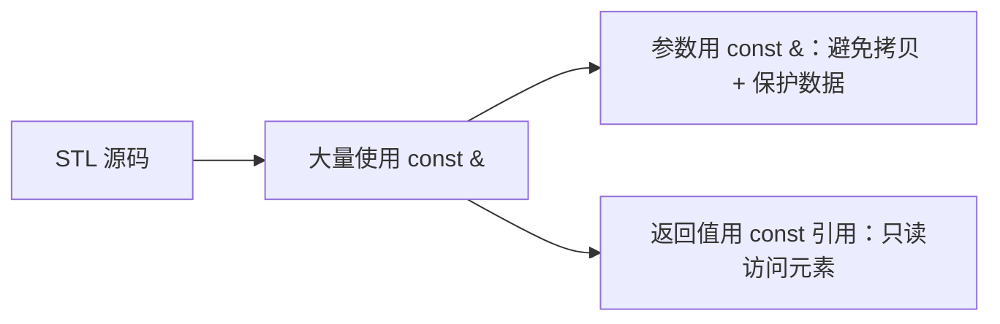

## 本节概述：为什么要有常量引用

前面我们学了引用传参——既能避免拷贝、提高效率，又能让函数修改外面的数据。

但有时候我们用引用传参，只是为了**省掉拷贝**，并不想让函数修改原数据。这时候怎么办？

答案就是：**常量引用**（const 引用）。

## 引用传参的隐患

先回顾一下引用传参的场景。假设有一个大结构体，我们写一个打印函数，用引用传参避免拷贝：

```cpp
struct BigS
{
    int a, b, c, d, e, f;
};

void printS(BigS &s)    // 引用传参，避免拷贝
{
    cout << s.a << s.b << s.c << s.d << s.e << s.f << endl;
}
```

引用传参很好——不用拷贝，效率高。但有个隐患：

```cpp
void printS(BigS &s)
{
    s.b = 520;    // 不小心改了原数据！
    cout << s.a << s.b << s.c << s.d << s.e << s.f << endl;
}
```

写函数的人手一滑，把 `s.b` 改成了 520——因为是引用，外面的原结构体也跟着变了。本来只是想打印一下，结果数据被改了，这不就出事了吗？



> 打个比方：你把家里钥匙给了保姆，让她来打扫卫生——结果她顺手把你家家具挪了个位置。你说闹心不闹心？

## 常量引用：既高效又安全

怎么解决？在引用前面加个 **`const`**，变成**常量引用**：

```cpp
void printS(const BigS &s)   // 常量引用
{
    s.b = 520;              // 编译报错！改不了
    cout << s.a << s.b << ... << endl;
}
```

加了 `const` 之后，如果你试图在函数里修改 `s` 的内容，编译器直接给你报错——"表达式必须是可修改的左值"。改不了，自然就改不坏了。



**常量引用 = 引用的高效 + const 的安全**，两全其美。

> [!TIP]
> **什么时候用常量引用？**
>
> 只要你传引用进去只是为了读数据、不是为了改数据，就应该加 `const`。这既是保护数据不被误改，也是一种"文档"——告诉调用方"放心，我这个函数不会改你的数据"。

## 常量引用的本质：常量指针常量

前面我们学过，引用的底层是**指针常量**（指向不能改，内容能改）。

那常量引用呢？就是在引用前面再加个 const——对应到底层，就是在指针常量前面再加个 const，变成**常量指针常量**。



- **引用** → `Type * const`（指针本身是 const 的）
- **常量引用** → `const Type * const`（指针本身和指向的内容都是 const 的）

所以常量引用既不能改指向，也不能改内容——只能老老实实读数据。

## 常量引用有多常见

常量引用在 C++ 里应用非常广泛，**STL 的底层源码里到处都是**。

比如你去看 `vector` 的源码，很多函数的参数都是 `const T&`，很多返回值也是 `const_reference`（就是常量引用的别名）。



后面学 STL 的时候你会经常见到 `const &` 这个组合，到时候就不会陌生了。

## 本章小结

**常量引用**就是 `const + 引用`，用来解决引用传参的安全问题。

**为什么要有常量引用**：
- 引用传参能避免拷贝、提高效率
- 但引用也让函数能修改原数据，有安全隐患
- 加了 const 之后，函数只能读不能写，既高效又安全

**本质**：常量引用底层就是**常量指针常量**——指向不能改，内容也不能改。

**使用原则**：如果传引用只是为了读数据，就加 `const`。这是一个非常好的编程习惯，也是 STL 里的通用做法。
