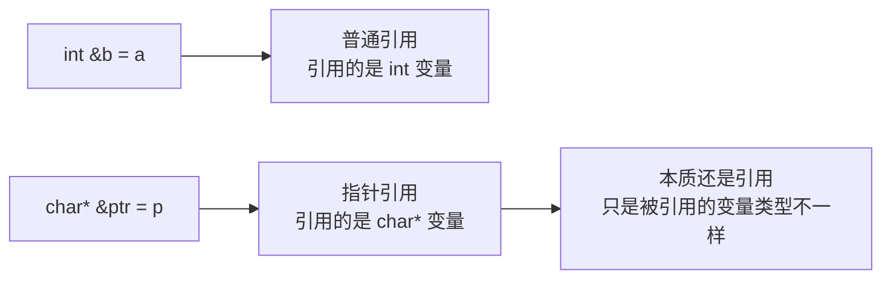
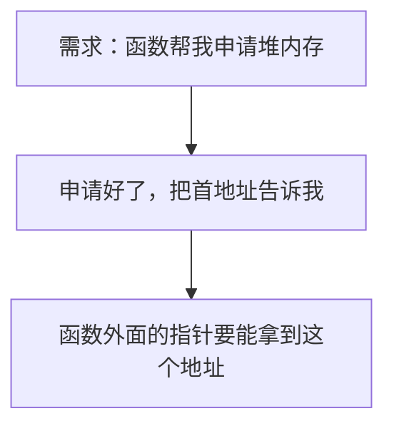
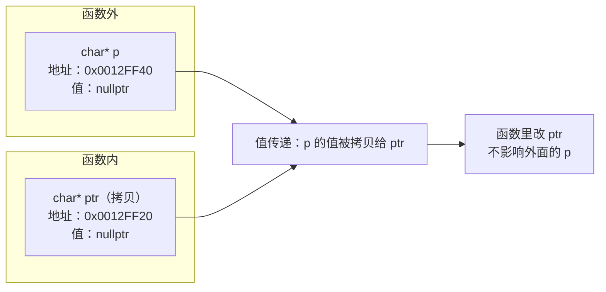
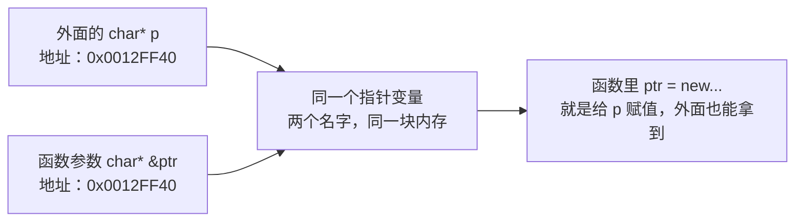
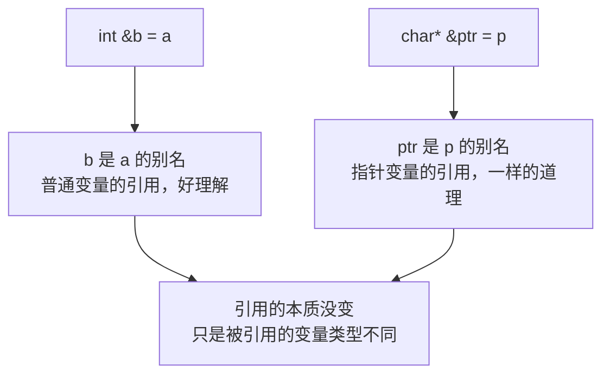

## 本节概述：指针引用是啥

指针引用，听名字有点吓人——`*` 和 `&` 放一块儿了，`char* &ptr` 这是啥玩意儿？

别慌，这玩意儿本质上还是引用。只不过引用的那个东西，恰好是一个指针变量而已。



这一节我们通过一个经典场景，来搞懂指针引用到底有什么用。

## 场景：让函数帮忙申请堆内存

先想一个需求：我想写一个函数，它从堆上申请指定字节数的内存，然后把申请到的首地址传出来给我。



### 第一次尝试：传指针参数（失败）

直觉上，传一个指针进去，函数里给指针赋值不就行了？

```cpp
#include <iostream>
using namespace std;

// 申请 bytes 字节的堆内存，把首地址存到 ptr 里
void allocMem1(char *ptr, int bytes)
{
    ptr = new char[bytes];   // 申请内存，赋值给 ptr
    cout << "函数内 ptr 的地址：" << &ptr << endl;
}

void test1()
{
    char *p = nullptr;       // 定义一个空指针

    allocMem1(p, 5);         // 让函数帮我申请 5 个字节

    cout << "函数外 p 的地址：" << &p << endl;
    cout << "p 的值：" << (void*)p << endl;   // 期望：非空的堆地址
}

int main()
{
    test1();
    return 0;
}
```

运行一下，你会发现：**p 的值还是空的（0）**。

而且你看打印的地址——函数里 `ptr` 的地址和外面 `p` 的地址，**根本不是同一个**。

### 为什么会失败

原因很简单：**值传递**。

指针变量本质上也是个变量，只不过它存的是地址而已。把 `p` 传给 `ptr`，传的是值——`ptr` 是 `p` 的一份拷贝。



函数里 `ptr = new char[bytes];` 改的是拷贝的那个 `ptr`，函数一结束，`ptr` 就没了——外面的 `p` 还是原来的空指针。

> 一句话：你想改指针本身的值（让它指向新地址），光传指针是不够的，因为传的是指针的拷贝。

> [!NOTE]
> **为什么打印 p 要转 void***
>
> 因为 `char*` 在 `cout` 眼里是字符串，它会顺着地址一直打印直到遇到 `\0`。如果 `p` 是空指针，`cout` 去访问无效地址，程序直接崩溃。转成 `void*` 就是告诉编译器："我就是想打印地址本身，别把它当字符串。"

## 解决方案：指针引用（成功）

那怎么让函数里改指针，外面也跟着变？

答案你应该已经想到了——**引用**。之前我们学过，引用传参能让形参成为实参的别名，改形参就是改实参。

只不过这次，被引用的变量是一个指针变量，所以叫**指针引用**。

```cpp
// 注意这里：char* &ptr —— 指针的引用
void allocMem2(char * &ptr, int bytes)
{
    ptr = new char[bytes];
    cout << "函数内 ptr 的地址：" << &ptr << endl;
}
```

就多了一个 `&`，效果天差地别。完整代码：

```cpp
#include <iostream>
using namespace std;

void allocMem2(char * &ptr, int bytes)
{
    ptr = new char[bytes];
    cout << "函数内 ptr 的地址：" << &ptr << endl;
}

void test2()
{
    char *p = nullptr;

    allocMem2(p, 5);

    cout << "函数外 p 的地址：" << &p << endl;
    cout << "p 的值：" << (void*)p << endl;   // 这次有值了！

    // 用完记得释放
    delete[] p;
    p = nullptr;
}

int main()
{
    test2();
    return 0;
}
```

这次运行：
- `ptr` 的地址和 `p` 的地址**完全一样** —— 因为它们是同一个变量
- `p` 的值不再是 0 了 —— 成功拿到了堆内存的首地址



搞定！

## 怎么理解指针引用

很多人一看到 `char* &ptr` 就慌了——又是星号又是引用号，这是什么鬼？

教你一个方法：**把指针变量当成最普通的变量来看**。



- `int &b = a` —— `b` 是 `a` 的别名，`a` 是 int 变量
- `char* &ptr = p` —— `ptr` 是 `p` 的别名，`p` 是 `char*` 变量

引用就是引用，跟被引用的东西是 int 还是指针没关系。指针引用，说穿了就是"引用了一个指针变量"——仅此而已。

> [!TIP]
> **判断方法**：从右往左读。`char * &ptr` —— `&ptr` 说明 ptr 是个引用，引用的是什么？`char *`，也就是 char 指针。所以：ptr 是一个 char* 类型变量的引用。

## 本章小结

**指针引用**就是引用的一种——只不过引用的对象是指针变量而已。

**经典应用场景**：当你需要在函数内部修改外面的指针本身（比如让指针指向新申请的堆内存）时，就需要用指针引用。

**为什么普通指针传参不行**：因为传指针也是值传递，形参是实参的拷贝——函数里改形参的指向，改的是拷贝，外面的实参不受影响。

**理解技巧**：把指针变量当普通变量看。普通变量加 `&` 是引用，指针变量加 `&` 也是引用，没什么特殊的。从右往左读类型名，就不会晕了。
