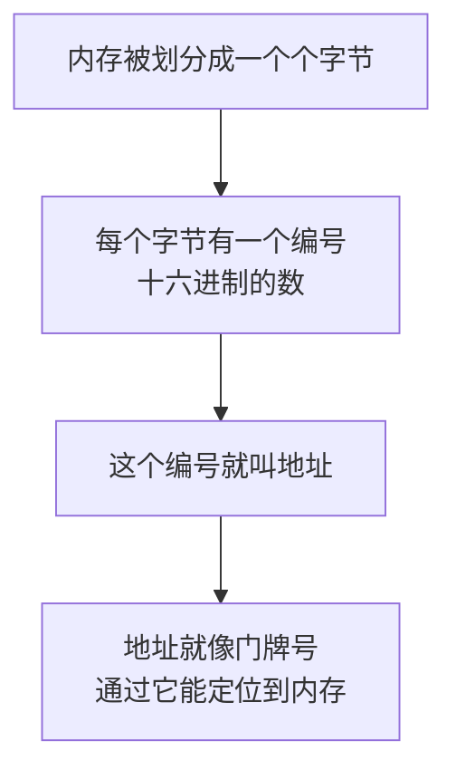
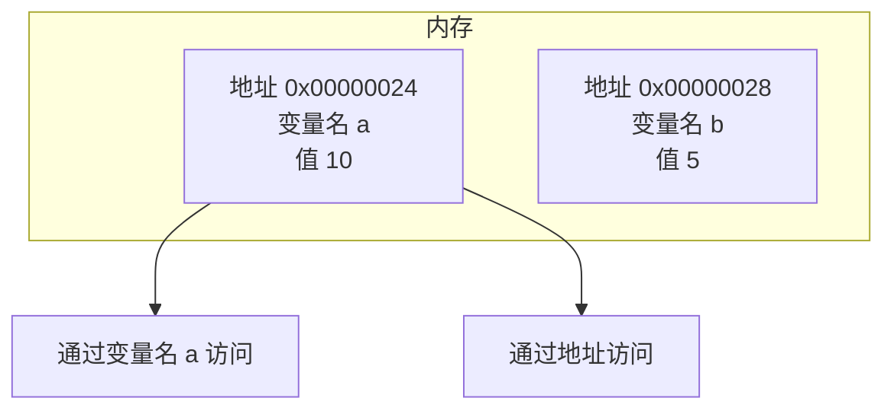
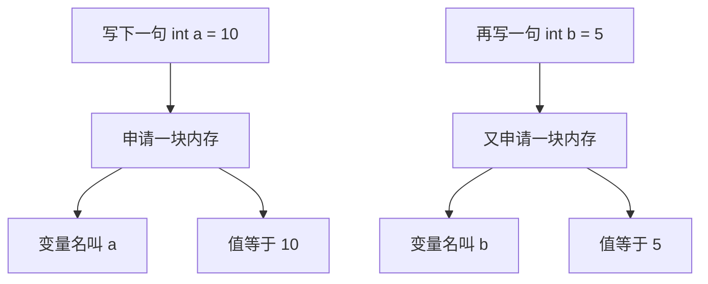
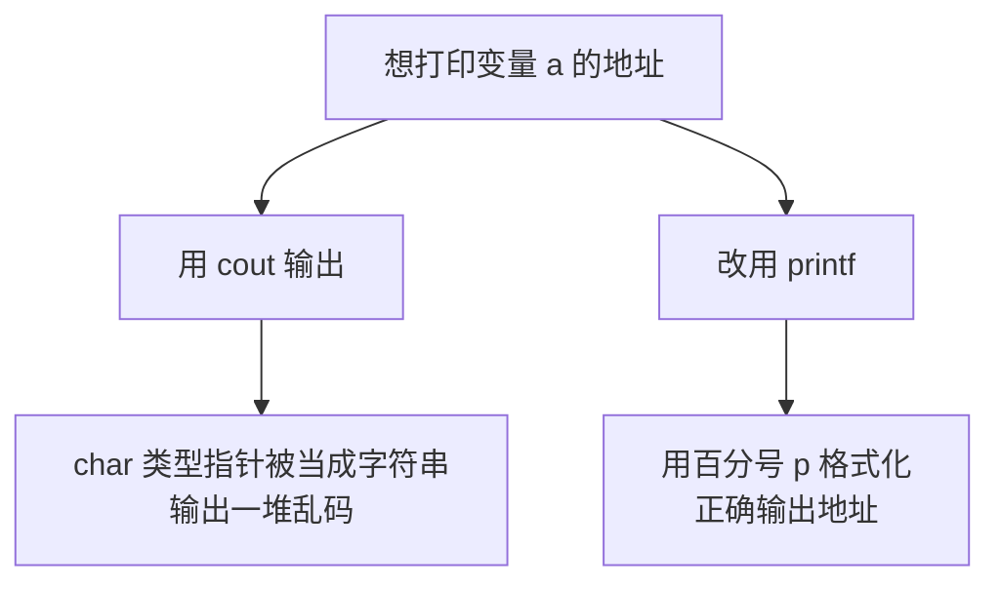
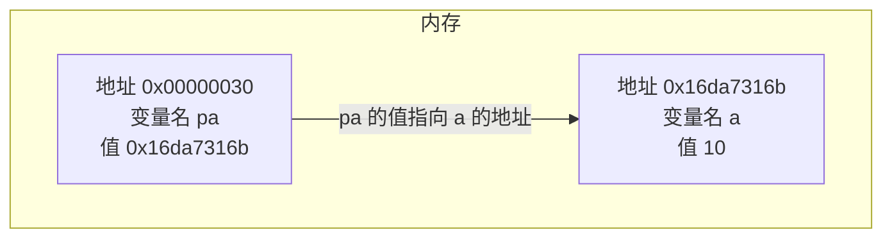
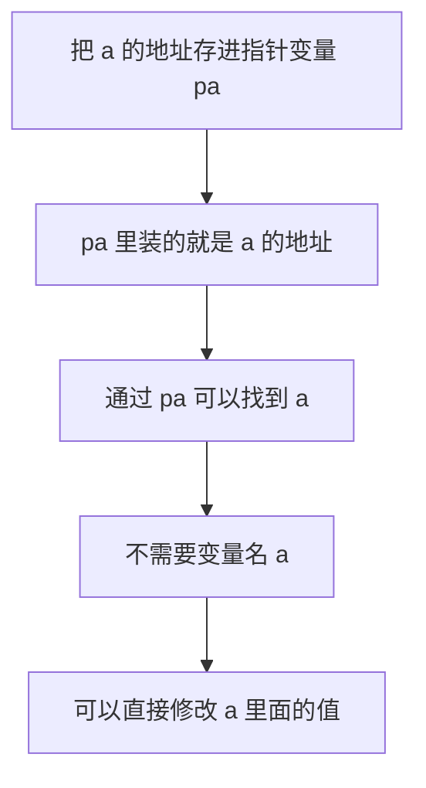
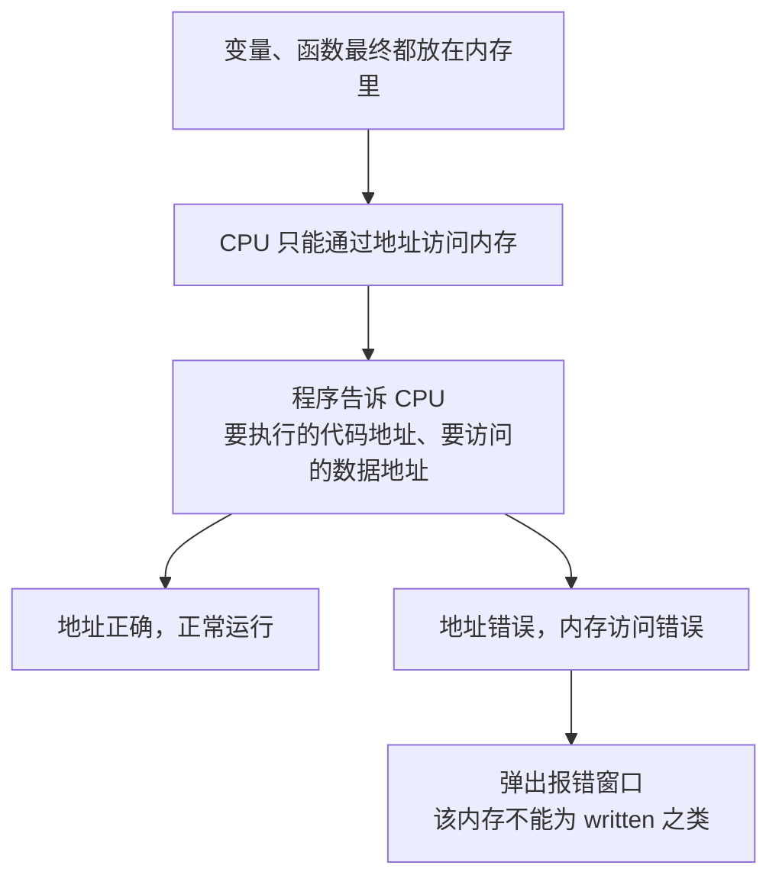

## 指针的概念：内存与地址

这一节开始学习**指针**。指针是很多人学 C++ 时最头疼的一块，但它的核心概念其实很简单——**只要把"内存"和"地址"这两件事想清楚，指针就理解了一半。**

### 数据都存放在内存里

在计算机里面，**所有的数据其实都是存放在内存里的**。

而且，**不同类型的数据占用的内存大小也不同**。前面已经学过一些数据类型，比如 `int`、`char`、`double`，它们各自占的字节数并不一样。理解这一点是理解地址的前提：内存是被划分成一个个字节来管理的，不同类型的数据占的格子数不同。

### 内存地址就像门牌号

内存里的每一个字节，都有一个**编号**。这个编号是一个**十六进制的数**，比如像 `0x00000001` 这样，一直往后数下去。

为了能够访问内存里的数据，我们就**对每个数据进行了编号**，**这个编号就叫地址**。

地址其实就像**门牌号**一样：我知道门牌号，就能找到那户人家；计算机知道地址，就能定位到那块内存。**通过地址就能定位到变量。**



### 变量名和地址都能访问数据

内存里面存着具体的值。比如这里存了一个 10，那里存了一个 5。这些数据各自有一个**名字**，叫做**变量名**——比如变量 a、变量 b。

所以访问一块数据有**两条路**：一条是通过**变量名**，另一条是通过**地址**。



两个 `int` 变量的地址相差 4，而不是相差 1，正是因为**一个 `int` 占四个字节**——这也印证了前面说的"不同类型的数据占用的内存大小不同"。

## 用取地址符拿到地址

### 定义变量就是申请内存

写下一句 `int a = 10;`，实际发生的事情是：**在这个位置申请了一块内存**，这块内存的**变量名叫 a**，里面的**值等于 10**。

再写一句 `int b = 5;`，就在另一个位置申请了一块内存，放进去一个 5。



这样一来，通过变量名 a 就能访问到那个 10。把 a 改成 11，那块内存里的值也就变成了 11；把 b 改成 9，那块内存就变成了 9：

```cpp
#include <iostream>

using namespace std;

int main() {
    int a = 10;
    int b = 5;
    cout << a << " " << b << endl;
    a = 11;
    b = 9;
    cout << a << " " << b << endl;
    return 0;
}
```

运行结果：

```text
10 5
11 9
```

这一步很好理解——**变量名就是我们给某块内存起的一个称呼**，改变量就是改那块内存。

### 取地址符

不过除了变量名，**也可以拿到 a 的地址**。怎么拿到呢？需要引入一个新的符号：**`&`，叫做取地址符**。

在变量名前面加上 `&`，拿到的就是这个变量的**地址**：

```cpp
&a
```

### 用 cout 输出地址：乱码

拿到地址之后，第一反应是把它打印出来看看。如果直接用 `cout`：

```cpp
#include <iostream>

using namespace std;

int main() {
    char a = 10;
    cout << &a << endl;
    return 0;
}
```

运行结果却是一堆**乱码**。

为什么会这样？因为 `cout` 在处理**字符类型的指针**（`char*`）时，会**把它当成一个字符串**来输出，而不是当成一个地址。它会从 `&a` 这个位置开始，一个字节一个字节地往后读，直到读到一个表示结束的 0 才停下——读出来的自然是一串莫名其妙的东西。

> [!TIP]
> 这里用 `char` 举例，是因为它只占**一个字节**，正好能体现"不同类型占的内存不同"；同时也因为 `cout` 对字符类型指针有这种特殊处理，问题才会暴露出来。如果换成 `int`，`cout << &a` 会直接把地址正常打印出来，不会有乱码。

### 改用 printf 打印地址

既然 `cout` 不听话，那就**改用 C 语言里的 `printf`**。C++ 是完全兼容 C 语言的，所以 `printf` 可以直接用：

```cpp
#include <cstdio>

int main() {
    char a = 10;
    printf("%p\n", &a);
    return 0;
}
```

运行结果：

```text
0x16da7316b
```

得到的就是 a 的地址了。`printf` 通过**格式化**的方式，把地址按十六进制的形式打印了出来。

这里的 **`%p`** 是专门用来**打印地址**的格式符，p 就是 pointer（指针）的意思。用 `printf` 打印地址时**应该用 `%p`**。

> [!WARNING]
> 打印地址不要用 `%x` 或 `%#x`。`%x` 是给**整数**用的格式符，而地址是一个**指针**，类型对不上。实测中编译器会给出警告提示"format specifies type 'unsigned int' but the argument has type 'int *'"，而且打印出来的结果也不可靠。**打印地址就用 `%p`。**



## 用变量存地址：这就是指针

拿到了地址之后，很自然会想：**这个地址能不能存起来？**

当然可以——**用一个变量来存储这个地址**。而**存储地址的这个变量，我们就叫它指针**。

比如 a 的地址是 `0x16da7316b`，把这个值存进另一个变量里，这个变量就叫做**指针变量**。

指针变量自己也有三样东西，别搞混。第一样是**它自己的内存地址**——指针变量本身也是变量，也要占一块内存，也有门牌号；第二样是**它的值**，也就是它存着的那个地址；第三样是**它的名字**，也就是指针变量的变量名。



关键在于：**只要把这个地址存下来，我就可以通过地址去访问 a，而不需要 a 这个变量名了。**

**通过地址访问到 a，就能修改它的值。** 这就是指针的威力——它让我们可以**绕过变量名，直接操作内存**。



## 地址为什么重要

地址这个概念之所以重要，是因为**它是计算机访问内存的唯一方式**。

用变量来存储数据、用函数来定义一段代码，这些东西**最终其实都是放到内存里面的**。而 **CPU 只能通过地址，去把内存中的数据取出来执行**。

程序在执行的过程中，会告诉 CPU 要执行的代码的地址、要访问的数据的地址。

正因为如此，**如果访问出现了错误的数据（错误的地址），就可能出现内存访问错误。** 平时经常看到的那种突然弹出来的报错窗口，比如"应用程序错误""该内存不能为 written"之类，**都是因为内存访问出了错**。



所以指针虽然难，但它是理解"程序到底怎么和内存打交道"的钥匙。

## 本章小结

**其一**，计算机里**所有的数据都存放在内存里**，不同类型的数据占用的内存大小不同。内存被划分成一个个字节来管理。

**其二**，内存里的每个字节都有一个**编号**，这个编号是一个**十六进制的数**。为了能够访问内存里的数据，我们给每个数据做了编号，**这个编号就叫地址**。地址就像**门牌号**一样，通过它就能定位到变量。

**其三**，访问一块数据有**两条路**：一条是通过**变量名**，另一条是通过**地址**。写下一句 `int a = 10;`，实际就是**申请了一块内存**，变量名叫 a、值等于 10；把 a 改成 11，那块内存里的值也就变成 11。

**其四**，用 **`&`（取地址符）** 可以拿到变量的地址，写法是在变量名前面加 `&`，比如 `&a`。

**其五**，用 `cout` 输出 `char` 类型的地址会得到**一堆乱码**，因为 `cout` 处理 `char*` 时会**把它当成字符串**来输出，从一个字节往后一直读到 0 才停。如果换成 `int`，`cout << &a` 会正常打印地址。

**其六**，改用 **`printf`** 就能正确打印地址。C++ 完全兼容 C 语言，`printf` 可以直接用。**`%p`** 是专门用来打印地址的格式符，p 代表 pointer。打印地址**应该用 `%p`**，不要用给整数准备的 `%x`——类型对不上，编译器会警告，结果也不可靠。

**其七**，**用一个变量来存储地址，这个变量就叫指针。** 指针变量自己也有三样东西：它**自身的内存地址**（它也要占一块内存）、它的**值**（存着的那个地址）、它的**名字**（变量名）。

**其八**，把地址存下来之后，就可以**通过地址去访问变量，而不需要变量名**，进而**直接修改它的值**。这就是指针的意义——绕过变量名，直接操作内存。

**其九**，地址之所以重要，是因为**它是计算机访问内存的唯一方式**。变量和函数最终都放在内存里，而 **CPU 只能通过地址**去取内存中的数据和代码。如果访问的地址出错，就会出现**内存访问错误**——平时看到的"应用程序错误""该内存不能为 written"这类弹窗，都是这么来的。