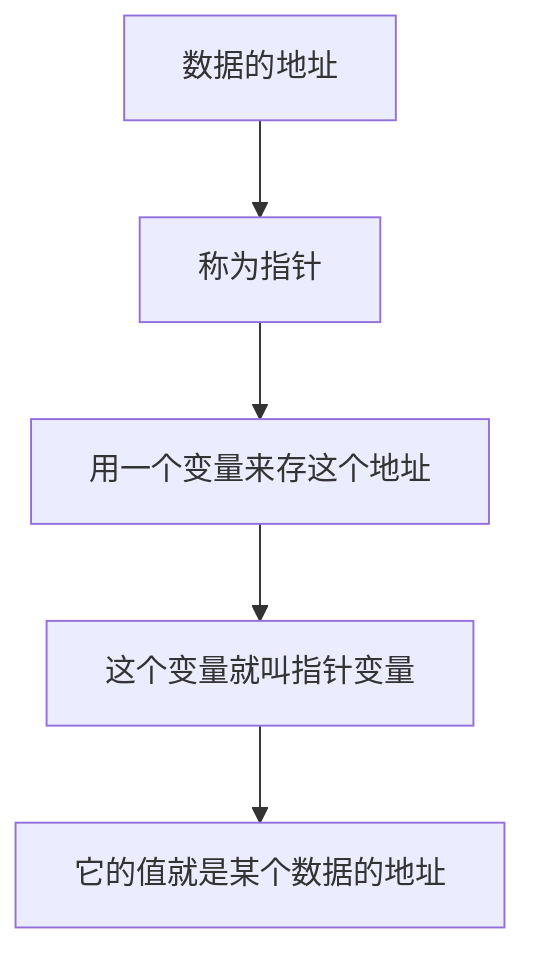
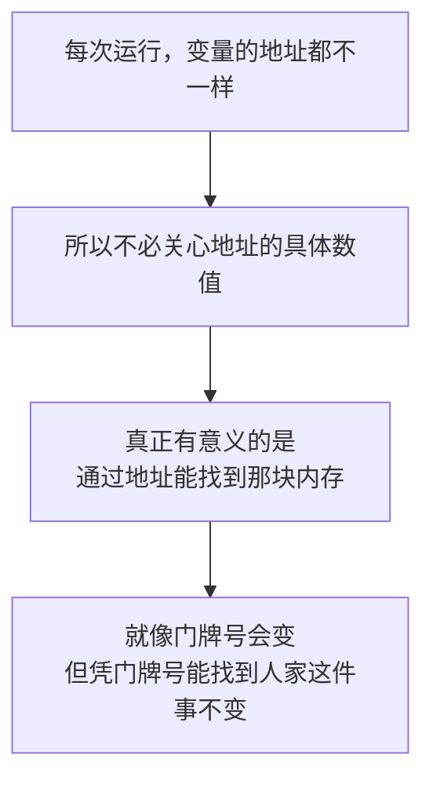
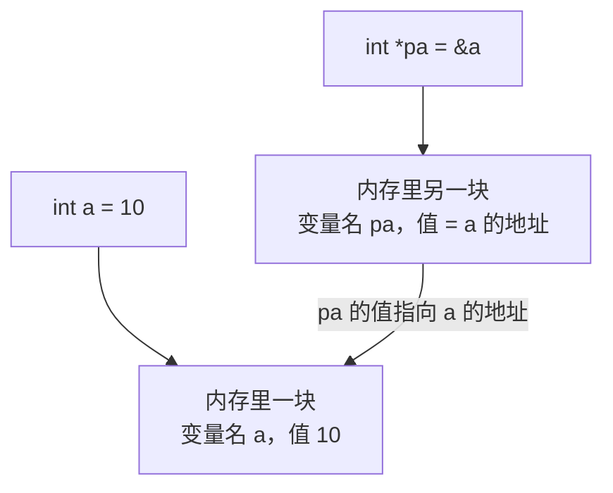
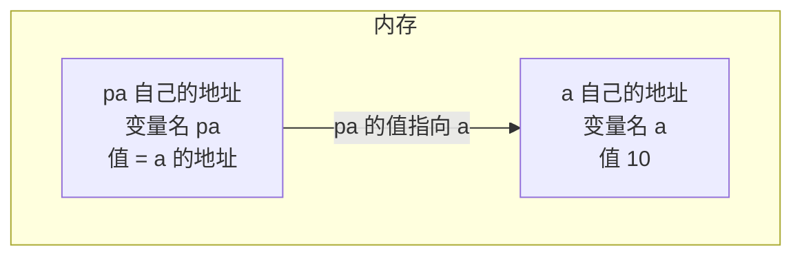
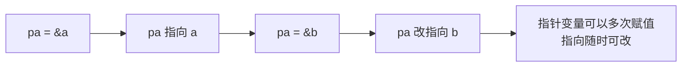
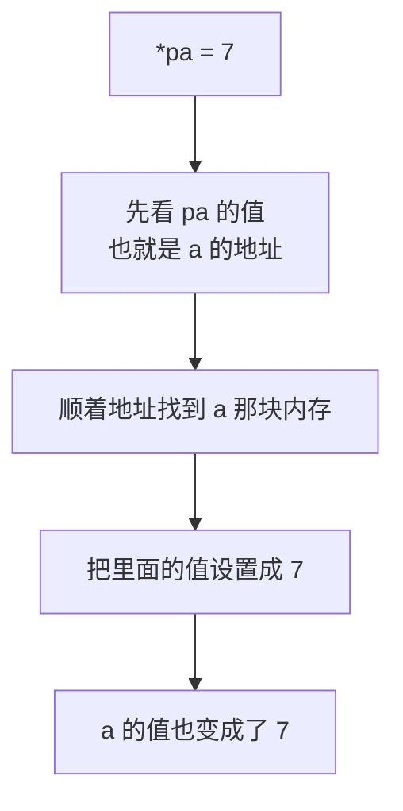
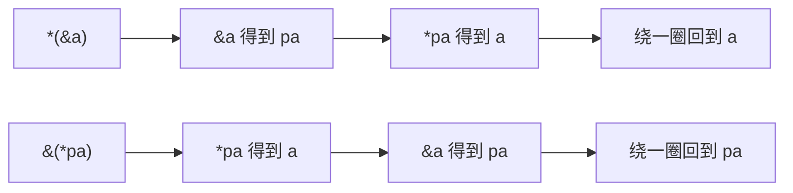
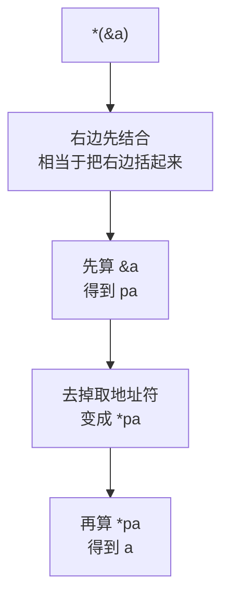
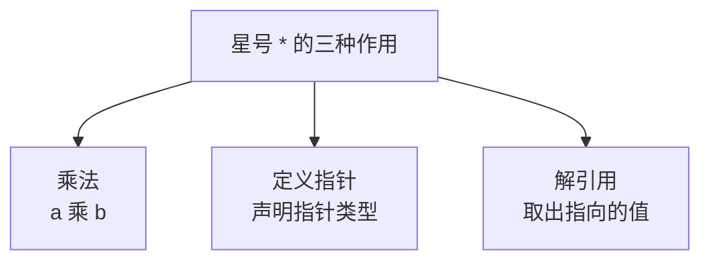

## 指针变量也是一种变量

上一节搞清楚了"地址"和"指针"这两个概念，这一节来看在 C++ 里**指针变量到底怎么定义、怎么使用**。

先说一句让人安心的话：**指针变量其实就是变量，它也是一种变量类型。** 不用把它想得太特殊，定义和使用的方式和普通变量是同一套。

先把上一节的结论接过来：数据在内存中的**地址**，我们称它为**指针**；如果**一个变量存储了一份数据的指针**（也就是地址），那么这个变量就叫**指针变量**；而在 C++ 里可以用一个变量来存放指针，**这个变量的值就是某个数据的地址**。



## 指针的定义

### 先看两个变量的地址

先定义两个整数变量，把它们的地址打印出来看看：

```cpp
#include <cstdio>

int main() {
    int a = 10;
    int b = 20;
    printf("a: %p\n", &a);
    printf("b: %p\n", &b);
    return 0;
}
```

运行结果：

```text
a: 0x16d2e7168
b: 0x16d2e7164
```

### 地址每次都变，不用关心

这里有两个现象值得注意。

**第一，两个地址不是相邻的**，中间差了一点位置。这不是巧合——`int` 占四个字节，所以两个 `int` 变量之间本来就会隔开几个字节，这正好呼应了上一节说的"不同类型的数据占用的内存大小不同"。

**第二，再运行一次，地址又变了**：

```text
a: 0x16b49f168
b: 0x16b49f164
```

不只是后面几位变了，**前面的一大串也全变了**。

所以结论是：**我们不需要关心这个地址到底是什么，它每次运行都会变。** 因为操作系统每次会把程序加载到内存里的不同位置，具体的地址值对我们来说没有意义。

**地址的"具体数值"不重要，重要的是"通过它能找到那块内存"。** 就像门牌号本身是多少并不重要，重要的是"凭这个门牌号能找到那户人家"。



后面的讲解里为了方便，我们会用**假设的固定地址**来画图，真实的地址以实际运行为准。

### 定义语法

指针变量的定义格式是：**数据类型 星号 指针变量名 分号**

```cpp
int *pa;
```

三段分别的含义是：**数据类型**说明这个指针指向的是**什么类型**的数据；**星号**表示"这是一个指针"；后面就是**指针变量名**，它和普通变量的名字没有区别。

这里把它命名为 `pa`，是因为 **p 是 pointer 的意思**，而 pointer 就是"指针"的英文。后面看到 `p` 开头的变量名，多半就是指针。

### 给指针变量赋值

定义好之后，把 a 的地址存进去：

```cpp
int a = 10;
int *pa = &a;
```

也可以定义和赋值分开写：

```cpp
int a = 10;
int *pa;
pa = &a;
```

**把 a 取个地址，再赋值给 pa**，这样一来 **pa 就存储了 a 的地址**。



## 指针变量的地址和值

对于 `pa` 这个指针变量，一定要分清**两样东西**。第一样是 **pa 自己的地址**——它本身也是一个变量，也要占一块内存，所以它**也有自己的门牌号**；第二样是 **pa 的值**——它存着的那个地址，也就是 **a 的地址**。

**这是两段完全无关的内存**：一块是 a 的，一块是 pa 的。pa 那块内存里装的，是 a 那块内存的门牌号。



### 打印验证

把 `&a` 和 `pa` 都打印出来，会发现**两个值一模一样**：

```cpp
#include <iostream>
#include <cstdio>

using namespace std;

int main() {
    int a = 10;
    int b = 20;
    int *pa = &a;

    cout << "&a = " << &a << endl;
    cout << "pa = " << pa << endl;
    return 0;
}
```

运行结果：

```text
&a = 0x16f8a3168
pa = 0x16f8a3168
```

两个值完全一样，因为 **pa 存储的就是 a 的地址**。

这里顺带呼应上一节：**用 `cout` 打印 `pa` 不会再出现乱码了**。因为 `pa` 是 `int*`，而不是上一节举例用的那个 `char*`——`cout` 只对**字符类型的指针**有"当成字符串输出"的特殊处理，对 `int*` 会老老实实打印地址。

### 指针变量可以多次赋值

指针变量和普通变量一样，**是可以多次赋值的**。比如把 pa 改成 b 的地址：

```cpp
pa = &b;
```

再打印就会发现 pa 的值变了，变成了 b 的地址：

```text
&b = 0x16f8a3164
pa = 0x16f8a3164
```

**同一个指针变量，可以让它先后指向不同的变量。** 指针的"指向"是可以随时改的——它只是存了一个地址，换个地址就是换个指向。



## 指针的解引用

### 拿到地址要干什么

拿到了 a 的地址，如果**不去干任何事情，那就没有意义**。必须拿这个地址去**干点事情**。

最典型的一件事就是：**拿到这个地址里面的值，然后去修改它。**

### 用星号取出地址里的值

写法是：**星号 + 指针变量名**，然后赋值。

```cpp
#include <iostream>

using namespace std;

int main() {
    int a = 10;
    int *pa = &a;

    *pa = 7;

    cout << "a   = " << a << endl;
    cout << "*pa = " << *pa << endl;
    return 0;
}
```

运行结果：

```text
a   = 7
*pa = 7
```

**两个都是 7。** 明明只改了 `*pa`，为什么 a 也变了？

原因就是：**通过星号把 pa 指向的那个地址里面的值取出来了，并且把这个位置设置成了 7。** 而 pa 指向的地址就是 a——把 a 那块内存的值改成 7 之后，a 这个变量当然也就变成了 7。

这个操作叫做**解引用**，意思是"通过指针找到它指向的那块内存，然后访问里面的值"。



**这就是指针真正有用的地方**：通过一个指针，可以间接地修改它指向的那个变量。

## 星号与取地址符是互逆的

`*` 和 `&` 这两个符号的关系，可以理解成**互逆**——就像加号和减号一样，一个"取出来"，一个"放回去"。

### 推导“取地址再解引用”

`&a` 是"对 a 取地址"，得到的就是 **pa**；所以 `*(&a)` 就是 `*pa`；而 `*pa` 就是 **a**。**结论：对 a 取地址再解引用，得到的还是 a。**

### 推导“解引用再取地址”

`*pa` 是"对 pa 解引用"，得到的就是 **a**；所以 `&(*pa)` 就是 `&a`；而 `&a` 就是 **pa**。**结论：对 pa 解引用再取地址，得到的还是 pa。**



### 打印验证

一步步推导完了，可以把每一步的值都打印出来验证：

```cpp
#include <iostream>

using namespace std;

int main() {
    int a = 10;
    int *pa = &a;
    *pa = 7;

    cout << a << " " << *pa << " " << *(&a) << endl;
    cout << pa << " " << &a << " " << &(*pa) << endl;
    return 0;
}
```

运行结果：

```text
7 7 7
0x16dafb168 0x16dafb168 0x16dafb168
```

第一行**三个都是 7**，第二行**三个都是同一个地址**。完全符合推导。

### 右结合

`*` 和 `&` 这两个运算符是**右结合的**，也就是**先计算右边**。所以推导的时候，可以理解成**先在右边加了一对括号**，把括号里面的东西算完，再把最外层的操作符去掉。

以 `*(&a)` 为例：



**如果推导的时候不太理解，最有效的办法就是在每一步都把想要的值打印出来**，看看实际结果是不是符合预期。一步步对照着看，这两个符号的关系就会变得非常清楚。

## 星号的三种作用

到这里这一课的内容就讲完了。最后梳理一个容易混淆的点：同一个星号 `*`，在 C++ 里其实有**三种完全不同的作用**，要靠上下文来区分。

```cpp
int a = 10, b = 3;
cout << a * b << endl;   // 第一种：乘法，输出 30

int *pa = &a;            // 第二种：定义指针，声明这是一个指针类型

cout << *pa << endl;     // 第三种：解引用，取出指针指向的值，输出 10
```



### 定义指针时的空格

定义指针的时候，星号**左边右边加多少空格都是合法的**，三种写法效果完全一样：

```cpp
int* pa;    // 星号靠左边，跟着类型
int *pa;    // 星号在中间
int * pa;   // 星号靠右边，跟着变量名
```

**星号到底是跟左边的类型、还是跟右边的变量名，完全取决于你的代码风格。** 语法上都是对的，选一种自己看着顺眼的写法保持一致就好。

## 本章小结

**其一**，**指针变量其实就是变量，它也是一种变量类型**，定义和使用的方式和普通变量是同一套。数据在内存中的地址称为**指针**；如果一个变量存储了一份地址，这个变量就叫**指针变量**，**它的值就是某个数据的地址**。

**其二**，指针变量的**定义格式**是 `数据类型 * 指针变量名;`，比如 `int *pa;`。数据类型说明它指向的是什么类型的数据，星号表示"这是一个指针"。变量名常以 `p` 开头，因为 **p 就是 pointer（指针）的缩写**。

**其三**，把地址存进指针变量：`int *pa = &a;`，或者定义和赋值分开写 `pa = &a;`。**"把 a 取个地址再赋值给 pa"，pa 就存储了 a 的地址。**

**其四**，变量的地址**每次运行都会变**，不只是后面几位，前面的一大串也会全变。因为操作系统每次会把程序加载到内存的不同位置。所以**不需要关心地址的具体数值**，真正有意义的是"通过地址能找到那块内存"。

**其五**，两个相邻定义的 `int` 变量，地址**不是相邻的**，中间会隔开几个字节——因为一个 `int` 占四个字节。

**其六**，指针变量要分清**两样东西**：**它自己的地址**（它也是变量，也占一块内存、也有门牌号）和**它的值**（它存着的那个地址）。**这是两段完全无关的内存。** 打印 `&a` 和 `pa` 会发现两个值一模一样，因为 pa 存的就是 a 的地址。

**其七**，用 `cout` 打印 `int*` 类型的指针**不会出现乱码**，因为乱码只发生在**字符类型指针**（`char*`）身上——`cout` 会把它当成字符串。

**其八**，**指针变量可以多次赋值**，比如 `pa = &b;` 就让它改指向 b。**指针的"指向"随时可以改**，因为它只是存了一个地址，换个地址就是换个指向。

**其九**，**解引用**的写法是**星号 + 指针变量名**，比如 `*pa = 7;`。它的含义是"顺着 pa 里存的地址找到那块内存，然后访问里面的值"。所以 `*pa = 7` 执行后，**a 也变成了 7**——这正是指针真正有用的地方：**通过指针间接修改它指向的变量**。

**其十**，**`*` 和 `&` 是互逆的关系**，像加号和减号一样。**对 a 取地址再解引用（`*(&a)`）得到的还是 a**；**对 pa 解引用再取地址（`&(*pa)`）得到的还是 pa**。这两个运算符是**右结合的**，先算右边，推导时相当于先在右边加一对括号，把里面算完再剥掉外层操作符。

**其十一**，星号 `*` 有**三种作用**：**乘法**（`a * b`）、**定义指针**（`int *pa;`）、**解引用**（`*pa`）。定义指针时星号**左边右边加多少空格都合法**（`int* pa`、`int *pa`、`int * pa` 都可以），星号跟类型还是跟变量名**完全取决于代码风格**。