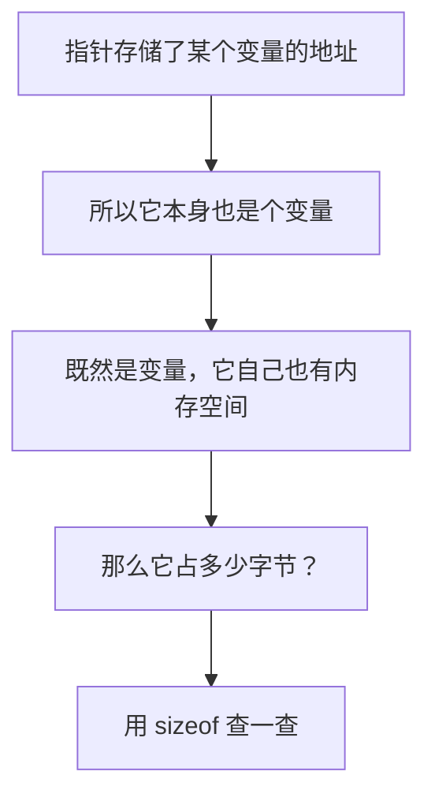
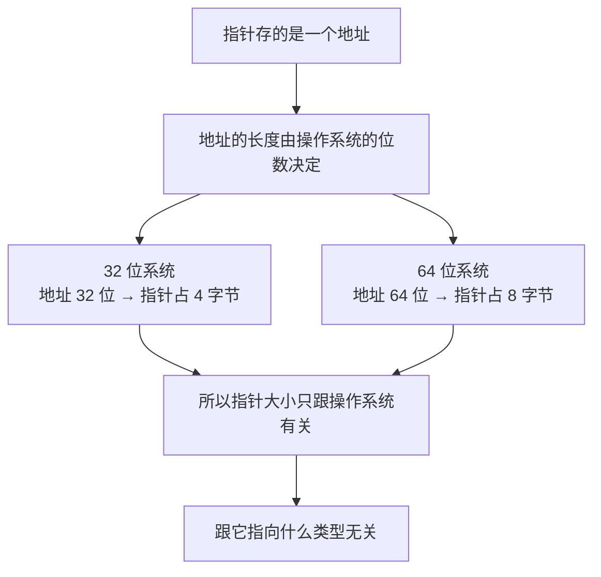

## 指针也是一种变量，也占内存

前面两节把指针的"定义"和"使用"都讲完了，这一节来看一个很容易被忽略的问题：**指针变量本身占多少内存空间？**

思路其实很直接：**指针代表的是某个变量的地址**，既然它存储了某个变量的地址，那**它本身也是个变量**；既然它本身也是变量，那**它自己也是有内存空间的**。

那它到底占用多少内存空间呢？用 `sizeof` 就能查出来。



## 用 sizeof 查看类型的大小

### 回顾 sizeof

前面学过可以用 **`sizeof`** 来知道某一个类型占用的内存空间。比如一个 `char` 类型，它占的内存空间是：

```cpp
sizeof(char)   // 等于 1
```

而 `int` 类型占的内存空间是：

```cpp
sizeof(int)    // 等于 4
```

把这两个值打印出来验证一下：

```cpp
#include <iostream>

using namespace std;

int main() {
    cout << "sizeof(char) = " << sizeof(char) << endl;
    cout << "sizeof(int)  = " << sizeof(int) << endl;
    return 0;
}
```

运行结果：

```text
sizeof(char) = 1
sizeof(int)  = 4
```

**`char` 占一个字节，`int` 占四个字节**，和之前学的一致。

### 各种指针类型的大小

那指针变量的 `sizeof` 是多少呢？**把各种常见类型的指针都打印出来**看看：

```cpp
#include <iostream>

using namespace std;

int main() {
    cout << "sizeof(char*)      = " << sizeof(char*)      << endl;
    cout << "sizeof(short*)     = " << sizeof(short*)     << endl;
    cout << "sizeof(int*)       = " << sizeof(int*)       << endl;
    cout << "sizeof(long*)      = " << sizeof(long*)      << endl;
    cout << "sizeof(long long*) = " << sizeof(long long*) << endl;
    cout << "sizeof(float*)     = " << sizeof(float*)     << endl;
    cout << "sizeof(double*)    = " << sizeof(double*)    << endl;
    return 0;
}
```

这里打印的每一个都是**指针类型**：指向整型的指针、指向短整型的指针、指向字符型的指针、指向浮点型的指针……覆盖了常见的类型。

运行结果：

```text
sizeof(char*)      = 8
sizeof(short*)     = 8
sizeof(int*)       = 8
sizeof(long*)      = 8
sizeof(long long*) = 8
sizeof(float*)     = 8
sizeof(double*)    = 8
```

**结果你会发现都是 8。**

## 为什么都是 8

这就要注意了：**指向 `char` 的指针和指向 `double` 的指针，大小竟然完全一样**，都是 8 个字节。可 `char` 只占 1 个字节、`double` 占 8 个字节，它们指向的东西大小差这么多，指针本身怎么会一样大？

原因是：**所有的指针类型，它的大小都是一样的，只跟操作系统有关系。** 具体来说，**32 位操作系统**下指针占 **4** 个字节，**64 位操作系统**下指针占 **8** 个字节。

为什么只跟操作系统有关？因为**指针存的是一个地址，而地址的长度是由操作系统的位数决定的**。32 位系统里地址用 32 位表示，也就是 4 个字节；64 位系统里地址用 64 位表示，也就是 8 个字节。

**指针需要多大的空间，取决于"地址有多长"，而不是"它指向的东西有多大"。** 所以不管指向 `char` 还是指向 `double`，指针的大小都一样。



如今绝大多数人用的都是 **64 位操作系统**，所以打印出来的指针大小是 **8**。


## 一个容易混淆的地方

这里有个**很容易搞混的点**，顺便说清楚：**"指针本身的大小"和"指针指向的东西的大小"是两回事。**

```cpp
#include <iostream>

using namespace std;

int main() {
    int a = 10;
    int *p = &a;

    cout << "sizeof(p)  = " << sizeof(p)  << endl;
    cout << "sizeof(*p) = " << sizeof(*p) << endl;
    return 0;
}
```

运行结果：

```text
sizeof(p)  = 8
sizeof(*p) = 4
```

**`sizeof(p)` 是 8**——p 是一个指针，所以占 8 个字节；**`sizeof(*p)` 是 4**——`*p` 是对 p 解引用，得到的就是那个 `int`，所以占 4 个字节。

一个是"装地址的盒子有多大"，一个是"盒子里地址指向的东西有多大"，两者完全不同。


## 需要记住的结论

这一节的内容不多，但结论要记牢：

**所有的指针类型，占用的字节数都是一样的，只和操作系统有关系。32 位操作系统占用 4 个字节，64 位操作系统占用 8 个字节。**

## 本章小结

**其一**，**指针变量本身也是一个变量**，所以**它自己也是有内存空间的**。既然指针存的是某个变量的地址，而它本身又是变量，那就值得问一句：它占多少内存？

**其二**，用 **`sizeof`** 可以查看某个类型占用的内存空间。`sizeof(char)` 等于 1，`sizeof(int)` 等于 4，和前面学过的类型大小一致。

**其三**，把各种常见类型的指针都打印出来——`char*`、`short*`、`int*`、`long*`、`long long*`、`float*`、`double*`——**结果全都是 8**。

**其四**，这看起来有点奇怪：`char` 只占 1 个字节、`double` 占 8 个字节，可指向它们的指针居然一样大。原因是**所有的指针类型大小都一样，只跟操作系统有关系**。

**其五**，**32 位操作系统**下指针占 **4** 个字节，**64 位操作系统**下指针占 **8** 个字节。因为**指针存的是地址，而地址的长度由操作系统的位数决定**——32 位系统里地址是 32 位（4 字节），64 位系统里地址是 64 位（8 字节）。

**其六**，关键在于：**指针需要多大空间，取决于"地址有多长"，而不是"它指向的东西有多大"。** 所以指向 `char` 还是指向 `double`，指针本身的大小完全一样。

**其七**，要区分**"指针本身的大小"和"指向的东西的大小"**。以 `int *p` 为例，`sizeof(p)` 是 **8**（p 这个指针本身占 8 个字节），而 `sizeof(*p)` 是 **4**（`*p` 是它指向的那个 `int`）。一个是装地址的盒子有多大，一个是盒子里地址指向的东西有多大。

**其八**，这一节要记牢的结论就一句话：**所有指针类型占用的字节数都一样，只和操作系统有关；32 位是 4 个字节，64 位是 8 个字节。**