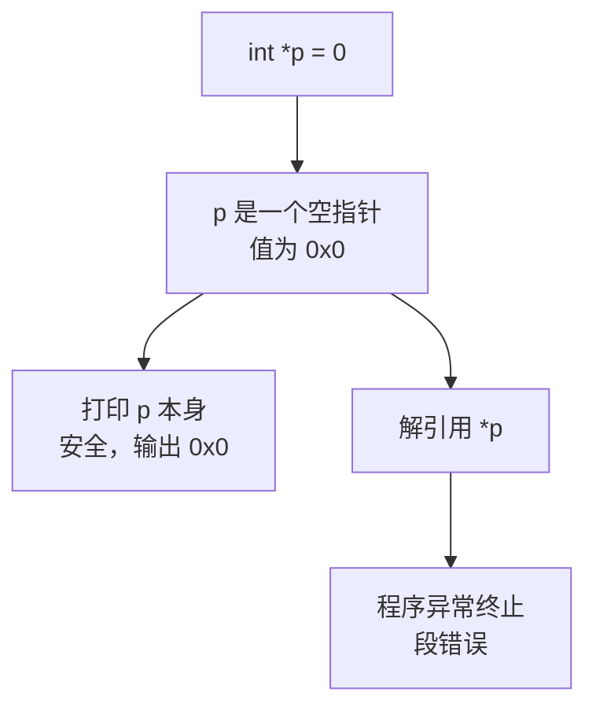
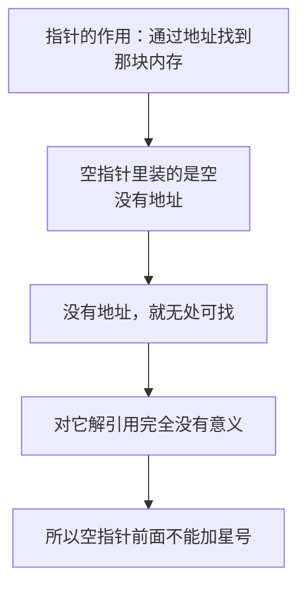
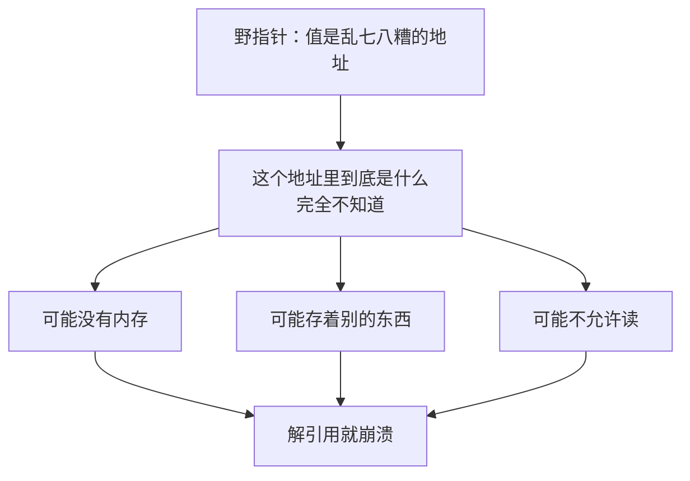
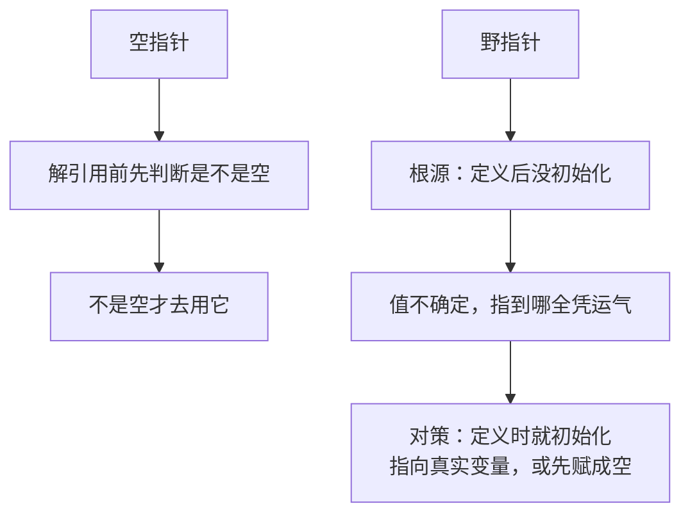

## 两个危险的角色

前面几节讲的指针都是"正常"的指针：它存着一个真实存在的变量的地址，可以放心地解引用。但指针还有两种**危险的状态**，必须认识清楚，否则程序会在运行时莫名其妙地崩溃。

这两种状态就是**空指针**和**野指针**。它们的共同点是：**都不能解引用。**

## 空指针

### 什么是空指针

用指针的时候，如果**一开始还没有确定要指向谁**，我们通常会把它**定义成一个空**。

比如一个整型的指针，暂时用不到，就先把它定义为空：

```cpp
int *p = 0;
```

**值为 0 的指针，就叫空指针。** 它表示"**这个指针不指向任何地方**"。

在 C++ 里也可以用 `nullptr` 来表示空，效果和 `0` 完全一样：

```cpp
int *p = nullptr;
```

这两种写法是等价的。**把暂时不用的指针初始化为空，本身是个好习惯**——至少它的值是明确的，不会是一堆乱码。

### 解引用空指针会崩溃

但要注意：**空指针绝对不能解引用。**

如果对着一个空指针加星号，想取出它指向的值：

```cpp
#include <iostream>

using namespace std;

int main() {
    int *p = 0;
    cout << "指针 p 的值: " << p << endl;
    cout << "即将解引用..." << endl;
    cout << *p << endl;
    cout << "这一行不会被执行" << endl;
    return 0;
}
```

运行结果：

```text
指针 p 的值: 0x0
即将解引用...
```

然后就**异常终止**了——后面那句"这一行不会被执行"**根本没有打印出来**，程序也没有正常返回 0。

打印 `p` 本身是安全的，它会显示 `0x0`，也就是空。但**一旦对它解引用（`*p`），程序立刻崩溃**。实测这个程序的退出码是 139，也就是发生了**段错误**。



### 为什么不能解引用空指针

道理其实很朴素：**空代表"没有这个地址"。**

指针的作用是"通过地址找到那块内存"。可空指针里装的是"空"，**根本没有一个地址**。既然没有地址，那对它解引用就是**完全没有意义的**——你让它去找，它也无处可找。

调试器给出的提示大意就是"**不要解引用一个空指针**"。**但凡一个指针是空的，它前面就不能加星号。**



## 野指针

### 什么是野指针

另一种更隐蔽的情况是**野指针**：**指针里的地址是乱七八糟的**。

比如随便拿一个十六进制数当成地址塞给指针：

```cpp
int *p = (int *)0x12345678;
```

这个地址不是任何变量的地址，只是随便写的一个数。**指针的值是一个来路不明的地址，这就是野指针。**

它和空指针的区别在于：空指针至少还明确地表示"我谁都不指向"，而野指针**看起来像指向了某个地方，但那个地方到底是什么，谁也不知道**。

### 解引用野指针同样崩溃

对着野指针解引用，一样会出事：

```cpp
#include <iostream>

using namespace std;

int main() {
    int *p = (int *)0x12345678;
    cout << "指针 p 的值: " << p << endl;
    cout << "即将解引用..." << endl;
    cout << *p << endl;
    cout << "这一行不会被执行" << endl;
    return 0;
}
```

运行结果和空指针那次一样，也是打印完前两行就**异常终止**，退出码同样是 139。

原因也很清楚：**因为这个地址里面到底是什么东西，完全不知道。** 那个位置可能根本没有内存，可能存着别的东西，也可能不允许你读——不管哪种情况，去访问它都是错的。

在 IDE 里运行时，这种错误还可能表现为**弹出一个报错框**，或者**卡住一会儿**才返回错误码。代码明明只有两三句话，却执行了很久，那就说明**它其实已经出错了**。



## 怎么避免这两种指针

两种指针的应对方式不太一样。

对于**空指针**，重点是**解引用之前先判断**。既然空指针的值是明确的 0，那就先检查一下它是不是空，确认不是空再去用它：

```cpp
#include <iostream>

using namespace std;

int main() {
    int *p = nullptr;

    if (p == nullptr) {
        cout << "p 是空指针，不能解引用" << endl;
    } else {
        cout << *p << endl;
    }
    return 0;
}
```

运行结果：

```text
p 是空指针，不能解引用
```

程序正常返回，**没有崩溃**。所以在解引用之前加一个判空的判断，就能避开空指针的问题。

对于**野指针**，重点是**不要让指针处于"值不确定"的状态**。野指针往往就是因为**指针定义后没有初始化**才出现的——它的值是内存里残留的垃圾数据，指到哪里全凭运气。所以：

**指针在定义的时候就应该初始化**——要么指向一个真实存在的变量，要么先赋成空。**只要指针的值是明确的，它就不会变成野指针。**



## 本章小结

**其一**，指针有两种**危险的状态**：**空指针**和**野指针**。它们的共同点是——**都不能解引用**。

**其二**，**空指针**是指**值为 0 的指针**，写法是 `int *p = 0;`。它表示"**这个指针不指向任何地方**"。在 C++ 里也可以用 `nullptr`，效果和 `0` 完全一样（实测两者相等）。

**其三**，**把暂时不用的指针初始化为空，本身是个好习惯**，因为它的值是明确的，不会是一堆乱码。

**其四**，**空指针绝对不能解引用**。打印 `p` 本身是安全的，会显示 `0x0`；但一旦写 `*p`，程序立刻**异常终止**——实测退出码 139，也就是**段错误**。程序不会正常返回 0，崩溃点后面的代码也不会执行。

**其五**，不能解引用空指针的道理很朴素：**空代表"没有这个地址"**。指针的作用是通过地址找到那块内存，可空指针里根本没有地址，对它解引用**完全没有意义**。**但凡一个指针是空的，它前面就不能加星号。**

**其六**，**野指针**是指**指针里的地址是乱七八糟的**，比如 `int *p = (int *)0x12345678;` 这种随便塞进去的地址。它和空指针的区别是：空指针明确表示"谁都不指向"，而野指针**看起来指向了某个地方，但那个地方是什么谁也不知道**。

**其七**，**解引用野指针同样会崩溃**，实测退出码也是 139。原因是**那个地址里到底是什么东西完全不知道**——可能没有内存，可能存着别的东西，也可能不允许读。在 IDE 里还可能表现为弹报错框或卡顿一会儿才返回错误码；**代码只有两三句却执行很久，就说明它已经出错了**。

**其八**，应对方式：**空指针**要在解引用之前**先判断是不是空**，确认不是空再去用；**野指针**的根源是**指针定义后没有初始化**，所以**定义时就应该初始化**——要么指向真实存在的变量，要么先赋成空。**只要指针的值是明确的，它就不会变成野指针。**