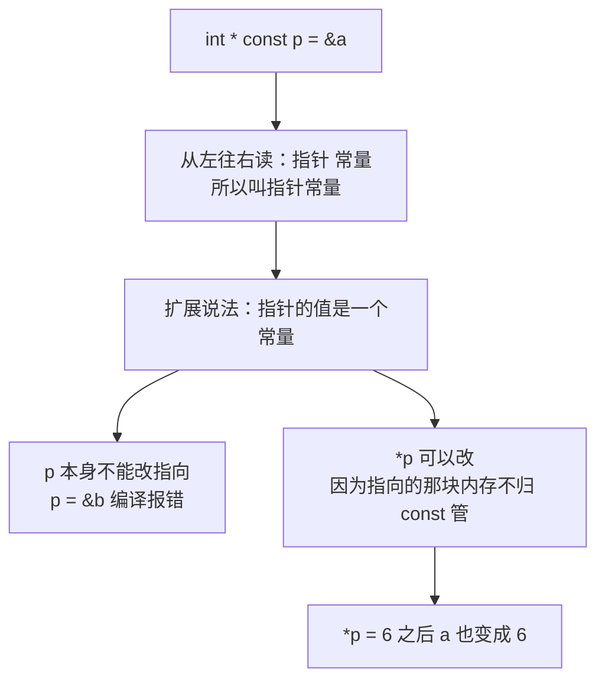
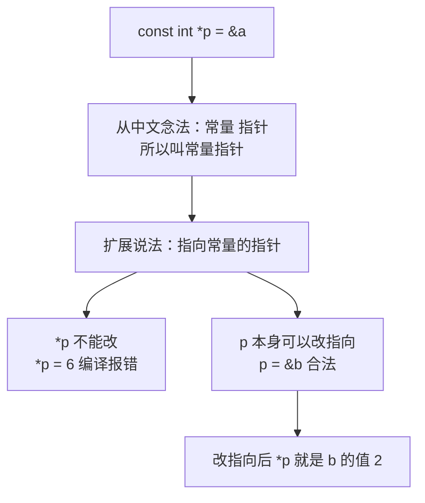
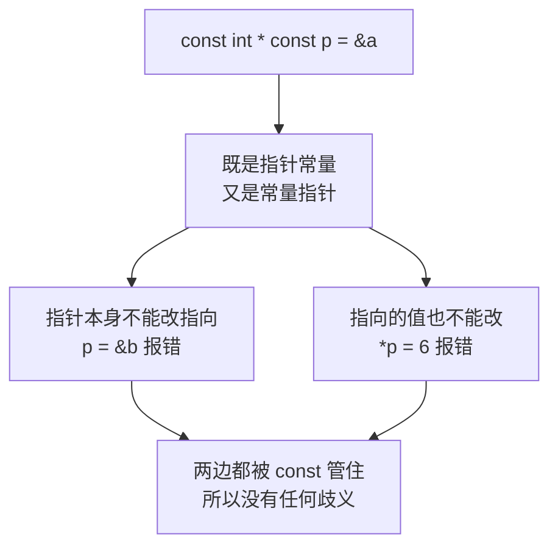
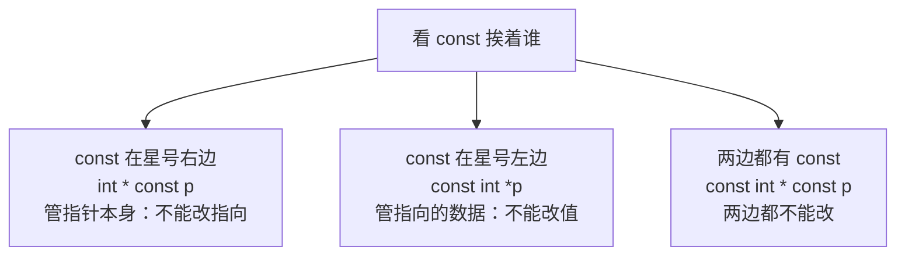

## const 与指针的三种组合

前面几节讲的指针，值和指向都是可以自由改的。从这一节开始，把 `const` 和指针组合起来看。

`const` 是"常量"的意思。**常量和指针组合在一起，总共有三个概念**：**指针常量**、**常量指针**、**常量指针常量**。这三个名字长得很像，**非常容易记混**。

所以关键不在于背结论，而在于**掌握记忆方式**——按名字的顺序一步步推导，结论自然就出来了。下面依次看这三个概念，最后再把它们放在一起对比。

## 指针常量

### 写法

先定义两个普通变量备用：

```cpp
int a = 1;
int b = 2;
```

然后写一个指针常量：

```cpp
int * const p = &a;
```

**从左往右读这个声明：先"指针"，再"常量"**——`int *` 是指针，`const` 是常量，合起来就是**指针常量**。

### 扩展说法：指针的值是一个常量

把名字展开成一句完整的话，就是**"指针的值是一个常量"**。

指针的值是什么？**就是一个地址**。所以这句话的意思是：**这个指针 p 本身是一个常量，它指向的地址不能改。** 换句话说，**p 一旦指向了 a，就再也不能改指向别人了。**

### 能改什么，不能改什么

推导到这里，两件事就分清了。**不能改的是 p 本身的值**，也就是它指向哪个地址；**可以改的是 p 指向的那块内存里的值**，也就是解引用之后的 `*p`。

用一段完整代码验证：

```cpp
#include <iostream>

using namespace std;

int main() {
    int a = 1;
    int b = 2;

    int * const p = &a;

    *p = 6;

    cout << "a = " << a << endl;
    cout << "*p = " << *p << endl;

    return 0;
}
```

运行结果：

```text
a = 6
*p = 6
```

**`*p = 6` 编译通过了，程序正常跑完。** 因为 p 指向的是 a，所以给 `*p` 赋值就等于给 a 赋值，最后 a 的值变成了 6。

### 改指向会编译报错

反过来，如果想让 p 改指向 b：

```cpp
int * const p = &a;
p = &b;   // 编译错误
```

编译直接报错，提示大意是**不能给 const 限定的变量 p 赋值**（编译器原文是 `cannot assign to variable 'p' with const-qualified type 'int *const'`）。用"左值"的说法就是：**赋值号左边这个值现在不可修改，所以赋值不成立。**



## 常量指针

上一个概念"指针常量"是 `int * const p`，`const` 贴在变量名这一侧。接着看第二个概念：**常量指针**，它的 `const` 贴在类型这一侧。

### 写法：从中文念法出发

常量指针的语法**很好记，直接从中文念法出发就行**：**先"常量"，再"指针"**。

```cpp
int a = 1;
int b = 2;

const int *p = &a;
```

**先写 `const`，再写 `int *`**——常量放前面，指针放后面，拼起来正好就是**常量指针**。

### 扩展说法：指向常量的指针

把名字展开成一句话，常量指针就是**"指向常量的指针"**。

既然它指向的是一个"常量"，那么**它所指向的那块地址里的值，就不能通过这个指针来改变**。这里要留意，**不能改的是"通过指针去改值"这件事**，而不是那个变量本身不能被别的方式修改。

### 解引用赋值会报错

如果对着常量指针解引用并赋值：

```cpp
const int *p = &a;
*p = 6;   // 编译错误
```

编译直接报错，提示大意是**表达式必须是可修改的左值**（编译器原文是 `read-only variable is not assignable`），也就是**这个左值无法被修改**。

### 但指针本身的值可以改

虽然不能改指向的值，**指针本身的值却不受影响，可以随便改**。它本来指向 a 的地址，现在让它改指向 b：

```cpp
#include <iostream>

using namespace std;

int main() {
    int a = 1;
    int b = 2;

    const int *p = &a;

    p = &b;

    cout << "*p = " << *p << endl;

    return 0;
}
```

运行结果：

```text
*p = 2
```

**`p = &b;` 编译通过了**，因为常量指针本身是可以改指向的。改完之后 p 指向 b，所以解引用打印出来的是 **b 的值 2**。



### 记忆方式：记推导过程，不要记结果

这两个概念最容易记混，**所以不要去背最终结论，而要记住推导过程**。

常量指针的推导是这样走的：**它叫常量指针 → 常量放前面、指针放后面 → 写成 `const int *p` → 扩展说法是"指向常量的指针" → 既然指向常量，那么它指向的值不能改 → 但它本身的值是可以修改的。**

顺着这个过程走一遍，结论不用背也会自己冒出来。

## 常量指针常量

第三个概念是**常量指针常量**。名字虽然最长，但**其实它是最简单的一个**——因为它**既是一个指针常量，又是一个常量指针**，两边都占全了。

### 两边都不能改

既然是"指针常量"和"常量指针"的合体，那么结论就很干脆：**指针本身的值和它指向的那块地址里的值，都无法改变。** 这样一来反而**没有任何歧义**，不用再去分辨哪边能改、哪边不能改。

### 写法

```cpp
int a = 1;
int b = 2;

const int * const p = &a;
```

`const` 出现了两次：**一个在 `int` 前面，一个在变量名前面**，两边都被 const 管住了。

这里要特别注意，**`= &a` 不是赋值符号，而是初始化**。**初始化的时候给 p 赋一个值是完全允许的**；一旦初始化完成，两边就都不能再动了。

### 两种修改都报错

写一段代码同时试这两种改法：

```cpp
#include <iostream>

using namespace std;

int main() {
    int a = 1;
    int b = 2;

    const int * const p = &a;

    p = &b;   // 错误：不能改指向
    *p = 6;   // 错误：不能改指向的值

    return 0;
}
```

编译时**直接报出两个错误**：

```text
error: cannot assign to variable 'p' with const-qualified type 'const int *const'
error: read-only variable is not assignable
```

第一个错误是**改指向失败**（不能给 const 限定的变量 p 赋值），第二个错误是**解引用赋值失败**（只读变量不可赋值）。两边都堵死了，**这正是它"最简单"的原因**——没有任何可以改的地方，也就不存在记混的可能。



## 三种写法的对比

把学过的这三种写法和结论放在一起，总结成一张表：

| 名称 | 写法 | 扩展含义 | 指针本身能否改指向 | 指向的值能否改 |
| --- | --- | --- | --- | --- |
| 指针常量 | `int * const p` | 指针的值是一个常量 | 不能 | 能 |
| 常量指针 | `const int *p` | 指向常量的指针 | 能 | 不能 |
| 常量指针常量 | `const int * const p` | 指针的值和指向的值都是常量 | 不能 | 不能 |

记忆的关键还是那句：**看 `const` 挨着谁**。

**`const` 在星号右边、紧挨着变量名**，它管的是**指针本身**，所以指针不能改指向；**`const` 在星号左边、紧挨着类型**，它管的是**指向的那块数据**，所以不能通过指针改值；**两边各有一个 `const`**，那就两边都不能改。



## 本章小结

**其一**，`const` 和指针组合在一起共有三个概念：**指针常量**、**常量指针**、**常量指针常量**。这三个名字很容易记混，所以不要背结论，要按名字的顺序**推导**。

**其二**，**指针常量**的写法是 `int * const p = &a;`，**从左往右读就是"指针 常量"**。它的扩展说法是**"指针的值是一个常量"**，意思是 p 本身是常量、指向的地址不能改；但**指向的那块内存里的值可以改**，实测 `*p = 6;` 编译通过，a 的值也跟着变成 6。而写 `p = &b;` 会**编译报错**，提示大意是不能给 const 限定的变量赋值。

**其三**，**常量指针**的写法是 `const int *p = &a;`，**语法直接从中文念法出发**：先"常量"再"指针"。它的扩展说法是**"指向常量的指针"**，所以**不能通过它改指向的值**，写 `*p = 6;` 会**编译报错**（提示大意是表达式必须是可修改的左值）；但**它本身可以改指向**，实测 `p = &b;` 编译通过，改完之后 `*p` 就是 b 的值 2。

**其四**，**常量指针常量**的写法是 `const int * const p = &a;`，`const` 出现两次。它**既是指针常量又是常量指针**，所以两边都不能改。这里 `= &a` 是**初始化而不是赋值**，初始化时赋值是允许的，之后就不能再动了。实测同时写 `p = &b;` 和 `*p = 6;` 会报出两个编译错误。

**其五**，三个概念记忆的关键是**看 `const` 挨着谁**：`const` 在星号右边紧挨变量名，管的是指针本身，**不能改指向**；`const` 在星号左边紧挨类型，管的是指向的数据，**不能改值**；两边各有一个 `const`，就**两边都不能改**。名字最长的常量指针常量，反而因为两边都不能改而没有歧义，是三者中最简单的。