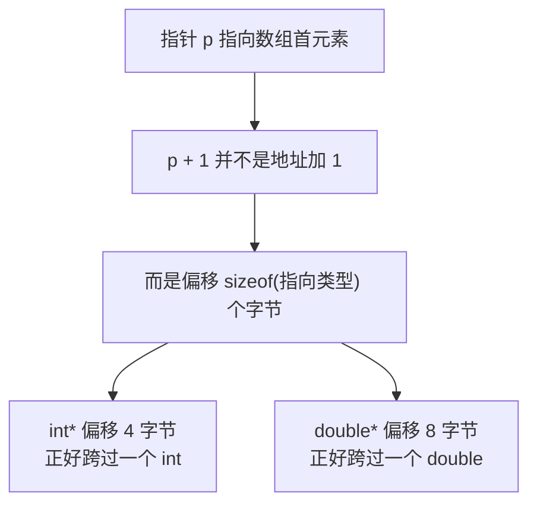
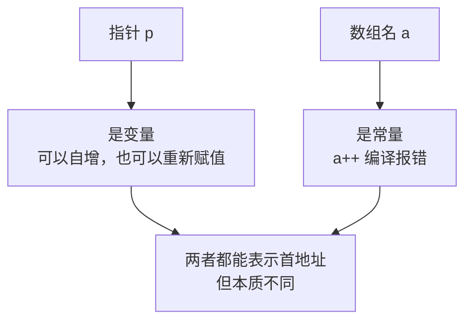
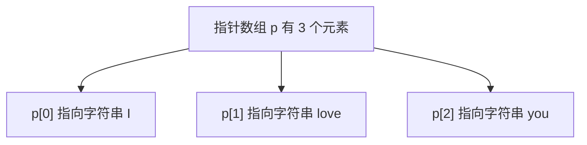
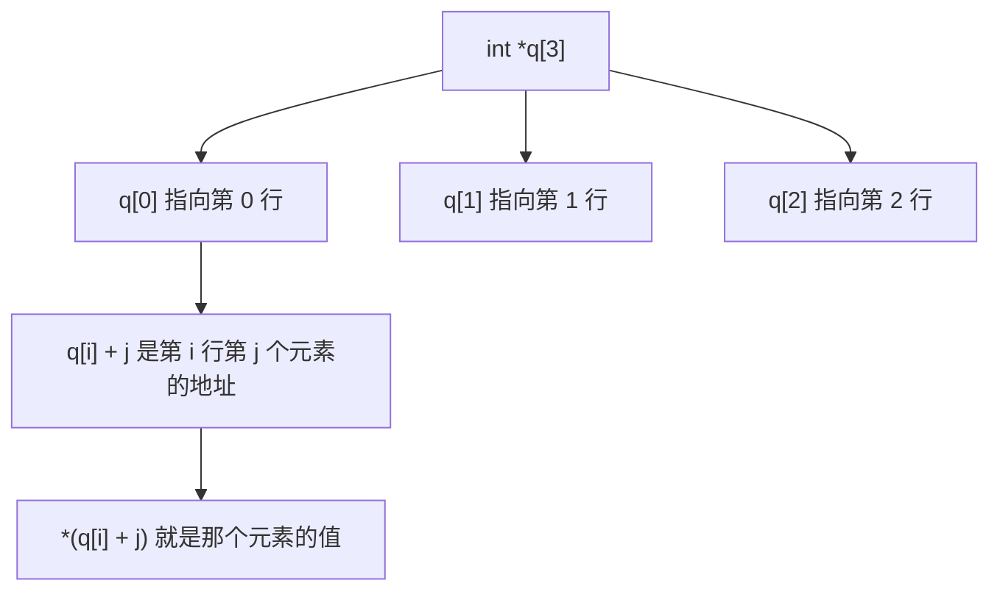
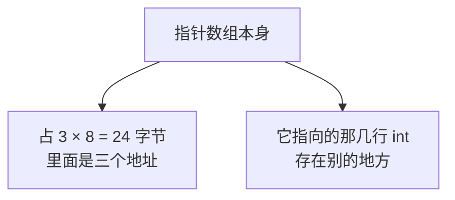
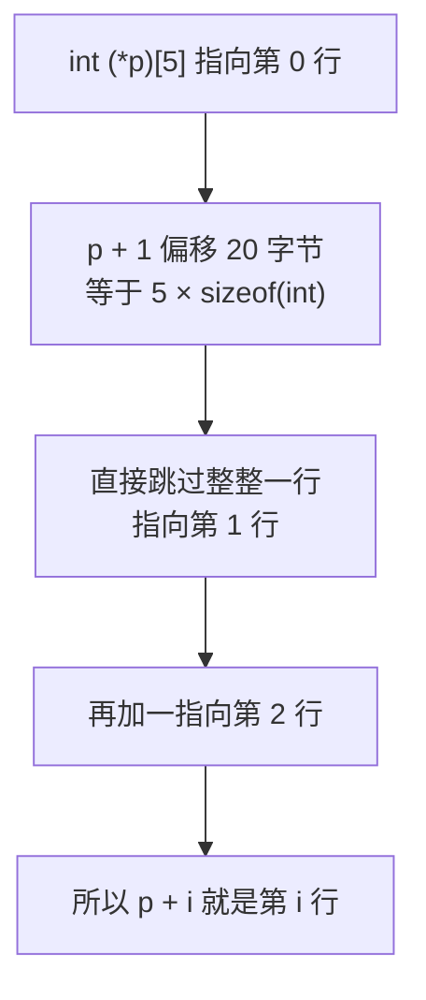
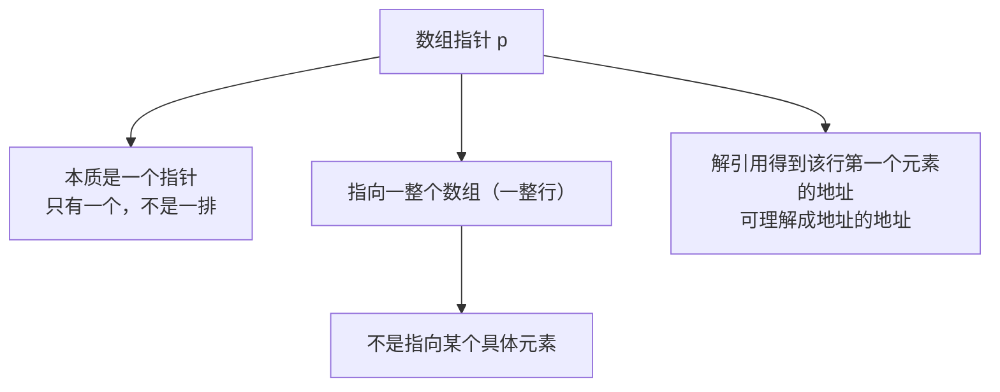
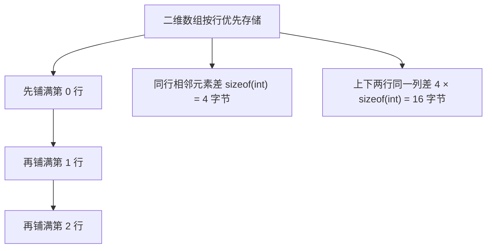
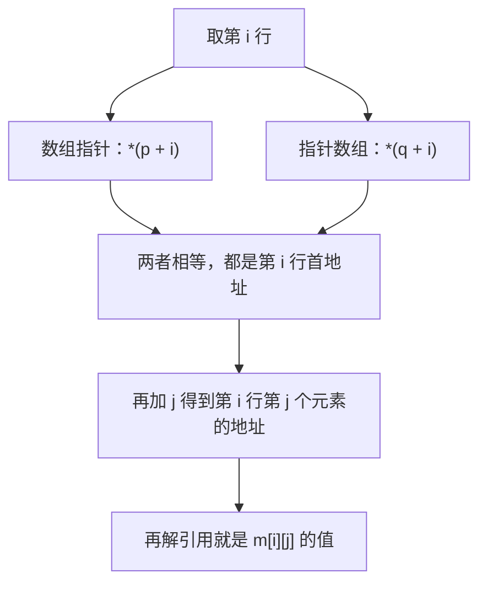

## 指针和数组到底是不是一回事

网上有不少说法讲"**指针就是数组**"，**这个说法是不对的**。**指针和数组不能相互转化**，但它们之间确实有一些**相通的地方**。

为什么会有这种说法？因为**指针是地址，数组名也是一个地址**，于是就把两者错误地等同起来了。

那它们到底像在哪、又差在哪，这一段先把它弄清楚，再看两个由它们衍生出来的概念：指针数组和数组指针。

## 数组名代表首地址

先定义两个变量：

```cpp
int a[5] = {5, 4, 3, 2, 1};
int *p = a;
```

**数组名 a 代表的是这个数组的首地址**，所以可以直接把它赋给一个指针。既然 p 拿到了这个地址，那么：

```cpp
cout << "a  = " << a << endl;
cout << "p  = " << p << endl;
cout << "*p = " << *p << endl;
```

运行结果：

```text
a  = 0x16d8f30b0
p  = 0x16d8f30b0
*p = 5
```

两个地址**一定相等**，因为就是把 a 赋给了 p。`*p` 解引用得到的就是数组的第一个元素 **5**。

## 指针加一，往后挪一个元素

数组第二个元素的地址是 `&a[1]`，那 `p + 1` 又是什么呢？

```cpp
cout << "&a[1] = " << &a[1] << endl;
cout << "p + 1 = " << p + 1 << endl;
```

运行结果：

```text
&a[1] = 0x16d8f30b4
p + 1 = 0x16d8f30b4
```

**两者一模一样。** 同理 `&a[2]` 和 `p + 2` 也相等。

于是用指针就能访问数组元素了：`*(p + 1)` 是第二个元素，`*(p + 2)` 是第三个元素。

```cpp
cout << *(p + 1) << endl;   // 4
cout << *(p + 2) << endl;   // 3
```

要注意，`p + 1` 只是**算出了一个新地址**，p 本身并没有变。

## 指针加加：让游标往后走

`p++` 和 `p + 1` 不一样：**`p++` 会把 p 自己改掉**，让它指向下一个元素。

```cpp
int *p = a;
cout << *p << endl;   // 5
p++;
cout << *p << endl;   // 4
```

第一次输出的是第一个元素 5；自增之后 p 指向了第二个元素，再解引用就是 4。

## 用指针遍历整个数组

把自增放进循环里，就能从头到尾走一遍：

```cpp
#include <iostream>

using namespace std;

int main() {
    int a[5] = {5, 4, 3, 2, 1};
    int *p = a;

    for (int i = 0; i < 5; i++) {
        cout << "数组的第 " << i + 1 << " 个元素是 " << *p << endl;
        p++;
    }

    return 0;
}
```

运行结果：

```text
数组的第 1 个元素是 5
数组的第 2 个元素是 4
数组的第 3 个元素是 3
数组的第 4 个元素是 2
数组的第 5 个元素是 1
```

循环里的 `*p` 一直停在原地不动，所以每一步都要让 p 往后走一格。

## 指针加一到底挪了几个字节

上面看到 `p + 1` 跳到了下一个元素，可**地址并不是加 1**。

这个数组是 int 类型，**每个元素占 4 个字节**。p 本来指向第一个元素的起始位置，加一之后要跨过整整一个 int，也就是**地址加了 4**。

**指针怎么知道该加 4 而不是加 1？** 因为它知道自己指向的是 int，而 int 的大小是 4 个字节。

换成 double 验证一下：double 占 8 个字节，那么 `double*` 加一就应该偏移 8 个字节。

实测各种类型指针 +1 的偏移量：

```cpp
#include <iostream>

using namespace std;

int main() {
    int a[2] = {1, 2};
    int *pi = a;
    double b[2] = {1, 2};
    double *pd = b;
    char c[2] = {1, 2};
    char *pc = c;
    short s[2] = {1, 2};
    short *ps = s;
    float f[2] = {1, 2};
    float *pf = f;
    long long g[2] = {1, 2};
    long long *pg = g;

    cout << "int*       +1: " << (char *)(pi + 1) - (char *)pi << " 字节" << endl;
    cout << "double*    +1: " << (char *)(pd + 1) - (char *)pd << " 字节" << endl;
    cout << "char*      +1: " << (char *)(pc + 1) - (char *)pc << " 字节" << endl;
    cout << "short*     +1: " << (char *)(ps + 1) - (char *)ps << " 字节" << endl;
    cout << "float*     +1: " << (char *)(pf + 1) - (char *)pf << " 字节" << endl;
    cout << "long long* +1: " << (char *)(pg + 1) - (char *)pg << " 字节" << endl;

    return 0;
}
```

运行结果：

```text
int*       +1: 4 字节
double*    +1: 8 字节
char*      +1: 1 字节
short*     +1: 2 字节
float*     +1: 4 字节
long long* +1: 8 字节
```

每一行的数字都**正好等于它指向的那个类型的大小**。

所以结论是：**指针加一，实际偏移的是 `sizeof(指向的类型)` 个字节。** 偏移的步长由指针指向的类型决定，而不是固定的 1。



## 那指针就是数组吗

既然指针和数组配合得这么默契，那"指针就是数组"成立吗？试一下给数组名自增：

```cpp
#include <iostream>

using namespace std;

int main() {
    int a[5] = {5, 4, 3, 2, 1};
    a++;

    return 0;
}
```

编译直接报错：

```text
error: cannot increment value of type 'int[5]'
```

提示大意是**表达式必须是可修改的左值**。原因在于：**数组名 a 是一个常量，它不能变**。而指针变量 p 是变量，`p++` 完全合法。

**这就是指针和数组最本质的区别**——数组名虽然也是一个地址，但它是一个**不可修改的常量地址**，所以既不能自增，也不能重新赋值。指针和数组有相通之处，但**不能相互转化，更不是一回事**。



## 指针数组

### 从名字看本质

遇到"指针数组"这种概念，**先看后面两个字——数组**。

所以它**起码是一个数组**，**并且它的每个元素的数据类型是一个指针**。

### 写法

```cpp
int *p[3];
```

星号加名字，后面跟中括号和长度。**它表示一个有 3 个元素的数组，每个元素都是一个 `int *`。**

### 例子：把三个字符串组织到一起

```cpp
#include <iostream>

using namespace std;

int main() {
    const char *a = "I";
    const char *b = "love";
    const char *c = "you";

    const char *p[3] = {a, b, c};

    for (int i = 0; i < 3; i++) {
        cout << p[i] << " ";
    }
    cout << endl;

    return 0;
}
```

运行结果：

```text
I love you
```

**p 是一个有三个元素的数组，每个元素都是一个指针。** 第 0 个元素指向 `"I"`，第 1 个指向 `"love"`，第 2 个指向 `"you"`。本来三个互不相关的字符串，就这样被组织进了一个数组里，于是也就可以**遍历**了。



### 用指针数组存二维数组（矩阵）

指针数组还有一个常见用途：**表示二维数组或者矩阵**。

```cpp
#include <iostream>

using namespace std;

int main() {
    int m[3][4] = {
        {1, 2, 3, 4},
        {5, 6, 7, 8},
        {9, 10, 11, 12}
    };

    int *q[3] = {m[0], m[1], m[2]};

    for (int i = 0; i < 3; i++) {
        for (int j = 0; j < 4; j++) {
            cout << *(q[i] + j) << " ";
        }
        cout << endl;
    }

    return 0;
}
```

运行结果：

```text
1 2 3 4
5 6 7 8
9 10 11 12
```

`m[0]` 是第 0 行的首地址，`m[1]` 是第 1 行的首地址，`m[2]` 是第 2 行的首地址。**把每一行的首地址分别赋给指针数组的三个元素**，这个指针数组就"表示"了原来的矩阵。

访问的时候，`q[i]` 是第 i 行的首地址，`q[i] + j` 就是第 i 行第 j 个元素的地址，再解引用就拿到了值。这也印证了前面的结论：**加一偏移的步长由指向的类型决定**，这里的元素是 int，所以 `q[i] + j` 每次挪 4 个字节，正好在行内一格一格走。

这种写法也可以换成指针偏移的写法：`q + i` 是第 i 个元素的地址，解引用 `*(q + i)` 得到第 i 个元素（也就是第 i 行的首地址），再加 j 再解引用，`*(*(q + i) + j)` 取到的就是同一个值。实测两种写法取到的地址和值完全一致。



### 指针数组占多大空间

```cpp
cout << sizeof(q) << endl;   // 24
```

**24 = 3 × 8**。在 64 位系统下指针占 8 个字节，三个指针就是 24 个字节。

**注意它存的是 3 个地址，不是 3 个 int。** 数组本身只占 3 × 8 个字节，至于它指向的那几行数据，存在另外的地方。



## 数组指针

### 从名字看本质

遇到"数组指针"这种概念，**还是先看后面两个字——指针**。

所以它**起码是一个指针**，**并且是一个指向数组的指针**。

### 写法：多了一对括号

```cpp
int (*p)[5];
```

和指针数组 `int *p[5]` 相比，**区别就在这对括号上**。

### 类型必须匹配

先有一个 4 行 5 列的二维数组：

```cpp
int a[4][5] = {
    {4, 3, 2, 1, 0},
    {9, 8, 7, 6, 5},
    {4, 3, 2, 1, 0},
    {9, 8, 7, 6, 5}
};

int (*p)[5] = a;   // 可以直接赋值
```

为什么能直接赋值？因为**两者的类型一模一样**：a 是"4 个 `int[5]` 组成的数组"，用它去初始化时退化成一个**指向 `int[5]` 的指针**，正好就是 p 的类型。

如果把中括号里的 5 改成 6：

```cpp
int (*q)[6] = a;   // 编译错误
```

编译直接报错：

```text
error: cannot initialize a variable of type 'int (*)[6]' with an lvalue of type 'int[4][5]'
```

**因为类型不一样，不能赋值。** 中括号里的数字是类型的一部分，写错了就不匹配。

所以可以这样理解：**数组指针就相当于一个二维数组**，它能用来操作二维数组上的数据。

### p + 1 会跳过整整一行

先看 p 和 p + 1 的地址：

```cpp
cout << "sizeof(*p) = " << sizeof(*p) << endl;
cout << "p+1 偏移   = " << (char *)(p + 1) - (char *)p << " 字节" << endl;
```

实测结果：

```text
sizeof(*p) = 20
p+1 偏移   = 20 字节
```

**偏移了 20 个字节**，而 `20 = 4 × 5`——**4 是 sizeof(int)，5 是这一行的元素个数**。

所以 `p + 1` 不是挪一个元素，而是**直接跳过一整行**，指向第 1 行；再加一就指向第 2 行。

验证一下 p 和每一行首地址的关系：

```cpp
cout << p << " : " << a[0] << endl;
cout << p + 1 << " : " << a[1] << endl;
```

运行结果：

```text
0x16efdf0b8 : 0x16efdf0b8
0x16efdf0c8 : 0x16efdf0c8
```

（每次运行地址都不一样，因为那是虚拟地址，这里只看两边的对应关系。）

**两边完全相等。** p 一开始指向第 0 行，加一之后直接走到了第 1 行。



### 数组指针的几点性质

**其一，数组指针是一个值，它本身不是一个数组**，所以它只有"一个"，不是一排。

**其二，它指向的是一整个数组**，也就是一整行——不是指向某一个 1、某一个 2，而是指向这一整行。

**其三**，对数组指针解引用，得到的是**这一行第一个元素的地址**。因为二维数组里"这一行的地址"和"这一行第一个元素的地址"在数值上正好重合，所以也可以把它理解成**"地址的地址"**，也就是一个二级指针。



## 指针数组和数组指针

### 前置知识：p + i 就是 a[i] 的地址

先看一段最基础的代码：

```cpp
int a[1024];
int *p = a;
```

a 是这个数组的首地址，p 是指向第 0 个元素的指针。对 `a[0]` 取地址，得到的正好就是 a，也就是 p；而 p 和 `p + 0` 又是一回事。把这个 0 换成 i，就得到一个恒等式：**`p + i` 就是 `a[i]` 的地址**，这两个写法是等价的。

再对 `p + i` 解引用，**解引用和取地址这两个符号正好抵消**，得到的就是 `a[i]` 的值。

所以有两条必须记牢的结论：**`p + i` 等于 `&a[i]`，`*(p + i)` 等于 `a[i]`。**

这个前置知识**务必搞懂，不然后面会直接懵掉**。

### 二维数组在内存里怎么放

3 行 4 列的数组，每个元素都有自己的地址，并且**按行优先的方式存储**——先铺满第 0 行，再铺满第 1 行，再铺满第 2 行。

于是有两条规律：**同一行相邻两个元素差 4 字节**（一个 int 的大小），**同一列上下两行差 16 字节**（4 × 4，也就是一整行）。

一般地，`a[i][j]` 的地址等于**首地址 + (i × 列数 + j) × sizeof(元素类型)**。



### 两种写法的区别

```cpp
int *q[3];      // 指针数组
int (*p)[4];    // 数组指针
```

**区别就在那对括号上**，而中括号里的数字含义也不一样：**指针数组的 3 表示数组长度（行数），数组指针的 4 表示它指向的数组长度（列数）**。

先实测两者的偏移量差别：

```text
sizeof(int*) = 8
sizeof(q)    = 24
q+1 偏移     = 8 字节
p+1 偏移     = 16 字节
```

`q` 加一偏移 **8 字节**（一个指针的大小），因为它是数组，往后走是走到下一个元素；`p` 加一偏移 **16 字节**（一整行），因为它是数组指针，往后走是走到下一行。

### 三种访问方式对比

准备数据：

```cpp
int m[3][4] = {{1, 2, 3, 4}, {5, 6, 7, 8}, {9, 10, 11, 12}};
int *q[3] = {m[0], m[1], m[2]};
int (*p)[4] = m;
```

**情况一：p + i 和 q + i**

实测两者**不相等**：

```text
i=0  p+i=0x16b4a7118  q+i=0x16b4a7100  相等=0
i=1  p+i=0x16b4a7128  q+i=0x16b4a7108  相等=0
i=2  p+i=0x16b4a7138  q+i=0x16b4a7110  相等=0
```

`p + i` 是**第 i 行的地址**，而 `q + i` 是**"存放第 i 个指针元素的位置"的地址**，也就是一个**地址的地址（二级指针）**。这个值本身**用处不大**，但要知道它是什么。

**情况二：*(p + i) 和 *(q + i)**

实测两者**完全相等**：

```text
i=0  *(p+i)=0x16b4a7118  *(q+i)=0x16b4a7118  相等=1
i=1  *(p+i)=0x16b4a7128  *(q+i)=0x16b4a7128  相等=1
i=2  *(p+i)=0x16b4a7138  *(q+i)=0x16b4a7138  相等=1
```

`*(p + i)` 是**第 i 行第一个元素的地址**；`*(q + i)` 是第 i 个元素，也就是**第 i 行的首地址**。两者指向的是同一行的开头，所以相等。

**情况三：*(p + i) + j 和 *(q + i) + j**

实测两者也**完全相等**，并且 `*(*(p + i) + j)` 与 `*(*(q + i) + j)` 取出的值都等于 `m[i][j]`，逐个元素比对的结果是**全部一致**。

到这里，指针数组和数组指针在二维数组上的行为就完全对上了：**取行首地址用 `*(p + i)` 或 `*(q + i)`，取具体元素再往后加 j 并解引用。**



### 两者对比一览

| 对比项 | 指针数组 `int *q[3]` | 数组指针 `int (*p)[4]` |
| --- | --- | --- |
| 本质 | 数组 | 指针 |
| 元素与指向 | 3 个元素，每个是 `int *` | 指向一个 `int[4]` |
| 中括号里的数字 | 行数 | 列数 |
| 加一偏移 | 8 字节（一个指针） | 16 字节（一整行） |
| 第 i 行首地址 | `*(q + i)` | `*(p + i)` |
| 取 `m[i][j]` | `*(*(q + i) + j)` | `*(*(p + i) + j)` |
| 自身地址的含义 | `q + i` 是地址的地址，用处不大 | `p + i` 就是第 i 行的地址 |

## 本章小结

**其一**，网上讲"**指针就是数组**"的说法**是不对的**。**指针和数组不能相互转化**，但确实有一些相通的地方。会有这种说法，是因为**指针是地址，数组名也是一个地址**，容易被错误地等同起来。

**其二**，**数组名代表数组的首地址**，所以可以直接赋给指针；`p + 1` 的地址等于 `&a[1]`，而 `p++` 会把 p 自己改掉，把自增放进循环就能用指针遍历整个数组。

**其三**，**指针加一并不是地址加 1**，而是偏移 `sizeof(指向的类型)` 个字节。实测 int* 偏移 4、double* 偏移 8、char* 偏移 1、short* 偏移 2、float* 偏移 4、long long* 偏移 8，**每个数字都正好等于它指向类型的大小**。

**其四**，**数组名是常量，不能修改**。对数组名做 `a++` 会**编译报错**（提示大意是表达式必须是可修改的左值），而指针变量 `p++` 完全合法。**这就是指针和数组最本质的区别。**

**其五**，**指针数组**先看后面两个字"数组"，它**起码是一个数组，每个元素都是指针**，写法是 `int *p[3];`。它可以把互不相关的字符串组织到一起（实测输出 `I love you`），也常用来表示二维数组或矩阵（`int *q[3] = {m[0], m[1], m[2]};`）。

**其六**，**指针数组存的是地址，不是数据本身**。实测 `sizeof(q)` 是 **24**，也就是 3 × 8——三个指针的大小；它指向的那几行数据存在别的地方。

**其七**，**数组指针**先看后面两个字"指针"，它**起码是一个指针，指向的是一个数组**，写法是 `int (*p)[5];`，**比指针数组多了一对括号**。它的类型必须和数组匹配，把中括号里的 5 改成 6 会**编译报错**，因为中括号里的数字是类型的一部分。

**其八**，**数组指针 `p + 1` 会跳过整整一行**。实测 4 行 5 列的数组里 `sizeof(*p)` 是 20、`p + 1` 的偏移量也是 **20 字节**，正好等于 `sizeof(int) × 列数`，所以 `p + i` 就是第 i 行。数组指针**是一个值、只有一个**，指向的是一整行，对它解引用得到的是该行第一个元素的地址。

**其九**，两者最关键的差别记两条就够了：**`p + i` 等于 `&a[i]`、`*(p + i)` 等于 `a[i]`**；以及**指针数组的中括号数字是行数，数组指针的中括号数字是列数**。在二维数组上，`*(p + i)` 和 `*(q + i)` 完全相等，都是第 i 行的首地址，再加 j 解引用都能取出 `m[i][j]`。

**其十**，理解这两个概念之后，可以自己动手把每个元素的地址打印出来、再解引用打印一次，**用结果验证自己的理解到底对不对**。