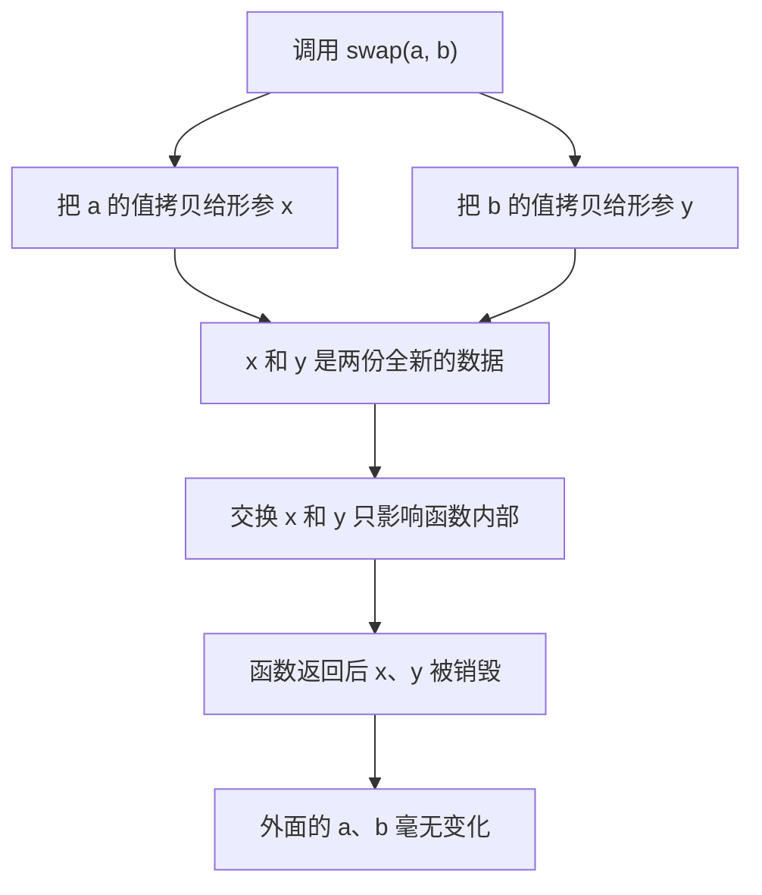
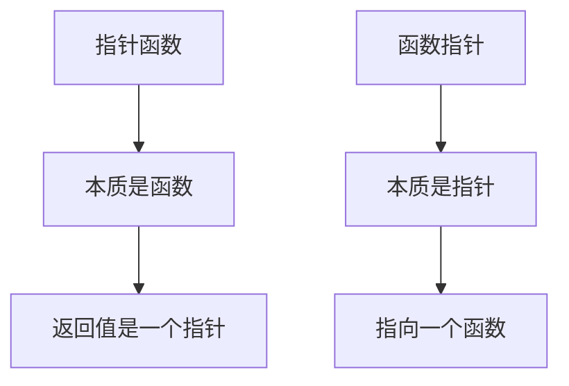
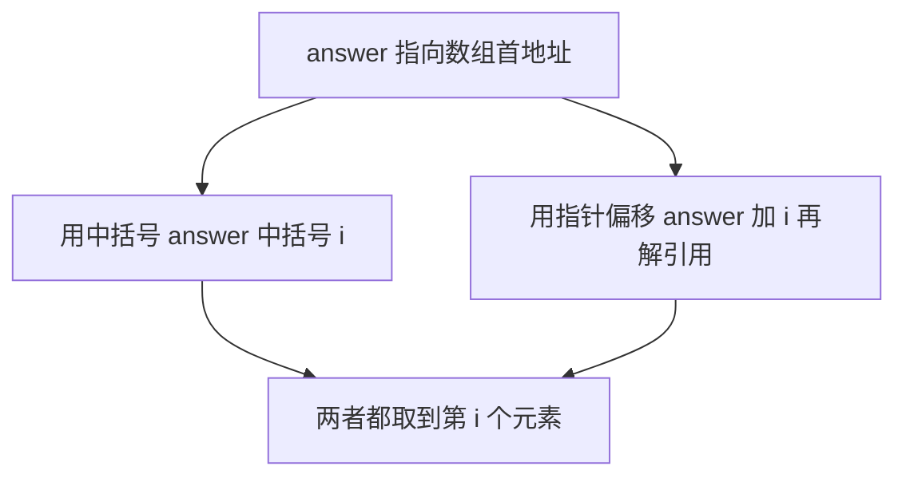
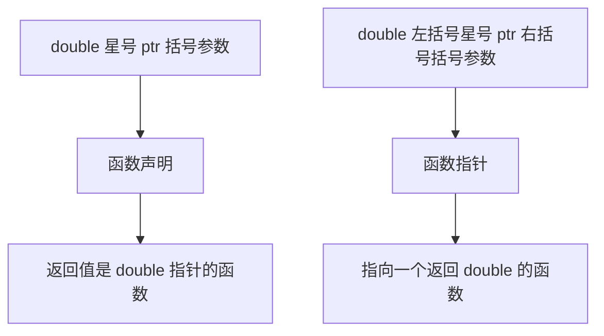
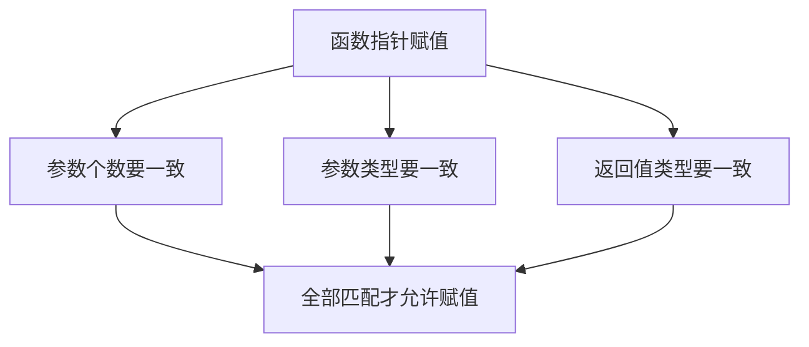
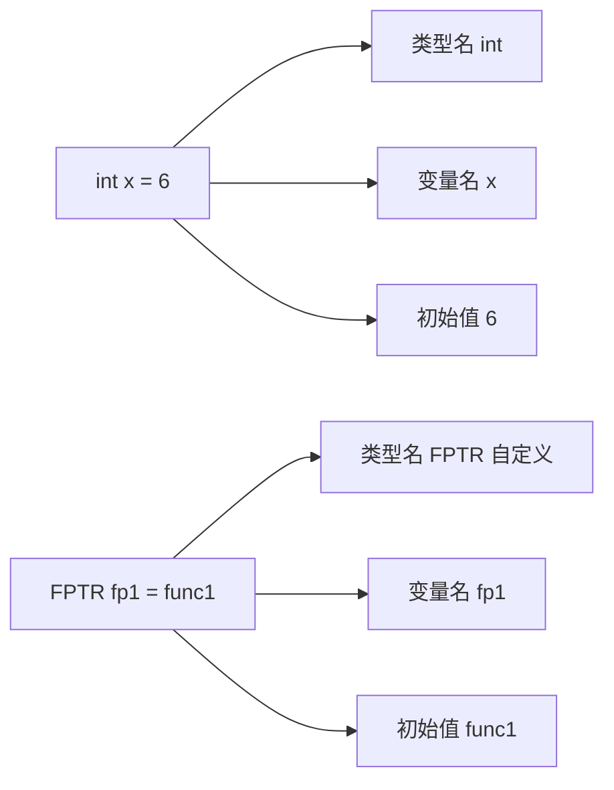
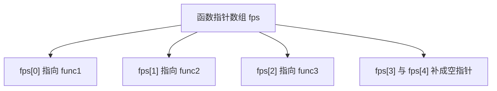
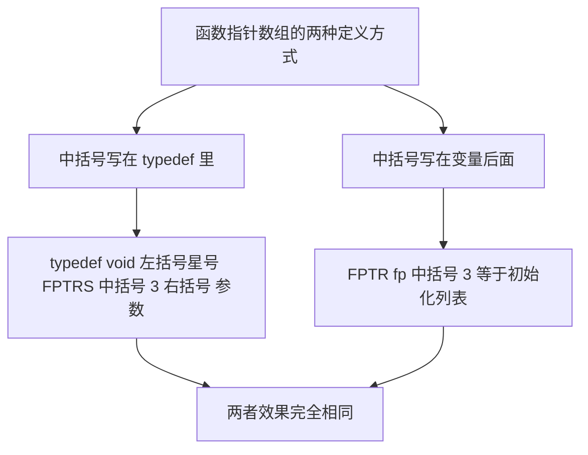

## 指针传参

### 值传递为什么改不了实参

先看一段之前学过的代码，实现一个交换两个整数的函数：

```cpp
void swap(int a, int b) {
    int temp = a;
    a = b;
    b = temp;
}

int main() {
    int a = 1;
    int b = 2;
    swap(a, b);
    cout << "a = " << a << "  b = " << b << endl;   // a = 1  b = 2
    return 0;
}
```

函数的名字叫 swap，做的事就是把两个数换过来，可是运行之后 a 还是 1、b 还是 2，**根本没有换成功**。

原因在于：**参数传递的过程中实际上进行了一次拷贝**。函数里的 a 和 b 只是拿到了外面 a 和 b 的值，它们是两份互不相干的数据。在没有指针的时候，这一点要靠画图才能讲清楚；有了指针之后，把地址打印出来就能直接说明问题。

### 把地址打印出来看

在调用前后各打印一次地址：

```cpp
int main() {
    int a = 1;
    int b = 2;

    cout << "调用前 a 的地址 = " << &a << endl;
    cout << "调用前 b 的地址 = " << &b << endl;

    swap(a, b);
    cout << "值传递后 a = " << a << "  b = " << b << endl;
    return 0;
}
```

在 swap 内部也打印一次：

```cpp
void swap(int a, int b) {
    cout << "函数内部 a 的地址 = " << &a << endl;
    cout << "函数内部 b 的地址 = " << &b << endl;
    int temp = a;
    a = b;
    b = temp;
}
```

运行结果：

```text
调用前 a 的地址 = 0x16baeb148
调用前 b 的地址 = 0x16baeb144
函数内部 a 的地址 = 0x16baeb0fc
函数内部 b 的地址 = 0x16baeb0f8
值传递后 a = 1  b = 2
```

**函数内外的地址完全不一样**。函数内部打印出来的那两个地址，其实是函数自己的局部变量所在的地址，它们只是把外面的值复制了过来。既然内存里都不是同一份数据，那么函数内部怎么交换，都动不了外面的 a 和 b。

也可以把参数名改成 x 和 y 来理解：

```cpp
void swap(int x, int y) {
    int temp = x;
    x = y;
    y = temp;
}
```

x 只是拿到了 a 的值，y 只是拿到了 b 的值，**交换 x 和 y 当然不会改变 a 和 b**。



### 改成指针：把地址传进去

要想真正交换，就得把**变量的地址**交给函数。把参数类型改成指针：

```cpp
void swap(int *a, int *b) {
    int temp = *a;
    *a = *b;
    *b = temp;
}
```

参数变成指针之后，函数里原来的代码就全错了——`int temp = a;` 会报错，因为 a 现在是 `int *`，编译器不允许用一个指针去初始化一个 `int` 变量。要**先解引用**才能拿到地址里的值。

调用时传的也不再是值，而是 `&a` 和 `&b`：

```cpp
int main() {
    int a = 1;
    int b = 2;

    swap(&a, &b);
    cout << "地址传递后 a = " << a << "  b = " << b << endl;   // a = 2  b = 1
    return 0;
}
```

这里有一个容易踩的坑：在函数内部想打印"传进来的那个变量的地址"时，直接写 `a` 就够了，**不要再写成 `&a`**。因为 a 本身已经是一个指针（地址），再取一次地址就变成了**二级指针**，那是"指针变量自己的地址"，不是我们要的那个变量的地址。

### 逐步跟踪一次交换

在函数内部把每一步的值打印出来：

```cpp
void swap(int *a, int *b) {
    cout << "函数内部 a 指向的地址 = " << a << endl;
    cout << "函数内部 b 指向的地址 = " << b << endl;
    int temp = *a;
    cout << "temp = *a  -> temp=" << temp << "  a=" << *a << "  b=" << *b << endl;
    *a = *b;
    cout << "*a = *b    -> temp=" << temp << "  a=" << *a << "  b=" << *b << endl;
    *b = temp;
    cout << "*b = temp  -> temp=" << temp << "  a=" << *a << "  b=" << *b << endl;
}
```

运行结果：

```text
调用前 a 的地址 = 0x16baeb148
调用前 b 的地址 = 0x16baeb144
函数内部 a 指向的地址 = 0x16baeb148
函数内部 b 指向的地址 = 0x16baeb144
temp = *a  -> temp=1  a=1  b=2
*a = *b    -> temp=1  a=2  b=2
*b = temp  -> temp=1  a=2  b=1
地址传递后 a = 2  b = 1
```

这一次**函数内外的地址一模一样**，因为传进来的就是那两个变量本身的地址。整个交换过程分三步。

第一步 `int temp = *a;`，把 a 指向的值存进临时变量，此时 temp 是 1，a 和 b 都没变。

第二步 `*a = *b;`，把 b 指向的值写进 a 指向的那块内存，于是 a 变成 2，b 还是 2。

第三步 `*b = temp;`，把临时变量里存着的 1 写进 b 指向的那块内存，于是 b 变成 1。

一开始 a 和 b 是 1 和 2，函数走完变成 2 和 1。temp 是函数里的局部变量，函数一结束它就被销毁了。


### 两个 swap 可以同时存在

值传递的 `swap(int, int)` 和地址传递的 `swap(int *, int *)` 可以写在同一个文件里，编译器会根据实参的类型自动挑选：**传的是指针就调指针版本，传的是整数就调整数版本**。这叫函数重载。

```cpp
int main() {
    int a = 1, b = 2;
    swap(a, b);     // 调 swap(int, int)
    swap(&a, &b);   // 调 swap(int *, int *)
    return 0;
}
```

## 指针函数

### 先看最后两个字

指针函数和函数指针，这两个词只差一个字的顺序，含义却正好相反，很容易搞混。分辨的办法是**先看最后两个字**。

"指针函数"最后两个字是"函数"，所以它**本质上是一个函数**，前面的"指针"只是修饰，说明**这个函数的返回值是一个指针**。

反过来，"函数指针"最后两个字是"指针"，它**本质上是一个指针**，只不过它指向的不是变量，而是一个函数。



下面先讲指针函数，函数指针放到后面。

### 什么情况下需要返回指针

最典型的场景是**函数需要返回一个数组**。

函数没有办法直接返回一个数组，但可以**返回这个数组的首地址**。数组首地址本身就是一个地址，也就是一个指针，所以只要把返回值写成指针类型，问题就解决了。

一个指针函数长这样：

```cpp
int *func() {
    return nullptr;   // 返回一个空指针
}
```

`int *` 说明返回值是 `int` 类型的指针，`func` 是函数名。这里先返回一个空指针占位。

### 实现一个生成等差数列的函数

下面实现一个函数，作用是返回一个 N 个元素的数列，数列以 A 开始、公差为 D。函数名取 `getA`，三个参数分别是首项 A、公差 D 和元素个数 N。

返回值是指针，代表要返回出去的数组首地址：

```cpp
int *getA(int a, int d, int n) {
    int *ret = new int[n];
    for (int i = 0; i < n; i++) {
        ret[i] = a + i * d;
    }
    return ret;
}
```

先申请一块能放 N 个元素的内存，`ret` 指向这块内存的首地址。然后按通项公式 `ret[i] = a + i * d` 把每个元素填进去：第 0 个是 A，第 1 个是 A + D，第 i 个就是 A + i × D。

循环结束后 `ret` 本身就是数组首地址，直接把它返回。**首地址既是一个地址，也就是一个指针**，所以返回值和函数签名正好对得上。

NOTE：这里的 `new int[n]` 是在堆区申请内存，用完之后要配合 `delete[]` 释放，内存管理会专门讲。

### 调用这个函数

```cpp
int main() {
    int *answer = getA(5, 3, 6);

    for (int i = 0; i < 6; i++) {
        cout << answer[i] << " ";
    }
    cout << endl;

    delete[] answer;
    return 0;
}
```

用一个 `int *answer` 接住返回的地址，首项传 5、公差传 3、元素个数传 6。运行结果：

```text
5 8 11 14 17 20
```

首项是 5、公差是 3、总共 6 个元素，完全正确。

### 指针也能用中括号访问

`answer` 明明是一个指针，却写了 `answer[i]`，看起来有点别扭。其实这是可以的：**对指针使用中括号，等价于先加偏移再解引用**。写成下面这样完全一样：

```cpp
for (int i = 0; i < 6; i++) {
    cout << *(answer + i) << " ";
}
```

运行结果同样是：

```text
5 8 11 14 17 20
```

也就是说，**`answer[i]` 和 `*(answer + i)` 是一回事**，指针和数组在"按下标访问"这件事上可以混着用。



## 函数指针

### 函数指针就是指向函数的指针

还是先看最后两个字。"函数指针"最后两个字是"指针"，所以它**就是一个指针**，只不过它指向的不是变量，而是**一个函数**。

之前学的指针指向的都是变量，那指向函数该怎么办？先写一行代码：

```cpp
double *ptr(int a, int b, int c);
```

这行看起来像一个函数，实际上**它就是函数声明**：一个名字叫 `ptr` 的函数，有三个参数，返回值是 `double` 类型的指针。注意这里没有括号把 `*ptr` 包起来。

加上一对括号，含义立刻变了：

```cpp
double (*ptr)(int a, int b, int c);
```

**括号一加，`ptr` 就从一个函数名变成了一个函数指针**。它指向一个函数，这个函数的参数是三个 `int`，返回值是 `double`。括号的作用是让 `*` 先和 `ptr` 结合，表明 ptr 本身是一个指针，而不是一个返回指针的函数。



### 让函数指针指向一个函数

定义一个和它签名匹配的函数：

```cpp
double func(int a, int b, int c) {
    cout << a << ", " << b << ", " << c << endl;
    return 0.0;
}
```

返回值是 `double`，参数是三个 `int`，和上面函数指针所描述的类型完全一致。**函数名本身就是一个地址**，所以可以直接把它赋给函数指针：

```cpp
double (*ptr)(int, int, int) = func;
```

赋值之后就可以用 `ptr` 来调用这个函数，写法和平常调函数一样：

```cpp
ptr(4, 5, 6);
```

运行结果：

```text
4, 5, 6
```

### 类型必须严格匹配

再定义一个返回值是 `void`、只有两个参数的函数：

```cpp
void func1(int a, int b) {
    cout << a << ", " << b << endl;
}
```

想把它赋给上面那个 `ptr` 就会报错：

```text
error: assigning to 'double (*)(int, int, int)' from incompatible type 'void (int, int)':
different number of parameters (3 vs 2)
```

**函数指针在赋值的时候，参数个数、参数类型、返回值类型都必须完全匹配**，只要有一项对不上就通不过编译。

换成一个签名匹配的函数指针就能正常使用了：

```cpp
void (*ptr2)(int, int) = func1;
ptr2(5, 6);
```

运行结果：

```text
5, 6
```



## 函数指针类型定义

### 每次都重写一遍太麻烦

先定义一个函数指针，返回值是 `void`，参数列表是三个 `int`、一个 `float`、一个 `double`：

```cpp
void (*fptr)(int a, int b, int c, float d, double e);
```

再定义一个签名一模一样的函数：

```cpp
void func1(int a, int b, int c, float d, double e) {
    cout << "func1" << endl;
}
```

函数名直接赋给函数指针，然后用它调用：

```cpp
fptr = func1;
fptr(1, 2, 3, 4, 5);   // 输出 func1
```

到这里都还是前面讲的内容。问题在于：**如果还想再定义一个同类型的函数指针，就得把那一长串类型重新写一遍**。

```cpp
void (*fptr2)(int a, int b, int c, float d, double e) = func1;
fptr2(9, 8, 7, 6, 5);   // 输出 func1
```

两个函数指针都能正常调用，但每定义一次就要抄一次参数列表，非常麻烦。

### 用 typedef 抽象出一种新类型

既然"返回值 void、参数是这五个类型"的函数指针会被反复用到，就有必要把它**固化成一个类型**。引入 `typedef` 关键字：

```cpp
typedef void (*FPTR)(int, int, int, float, double);
```

**原来写的是一个函数指针变量，前面加上 `typedef` 之后，它定义的就是一个类型**。名字也从 `fptr` 换成了 `FPTR`，不然就和变量重名了。

有了这个类型，定义函数指针就变得和定义普通变量一样简单：

```cpp
FPTR fp1 = func1;
fp1(1, 2, 3, 4, 5);   // 输出 func1

FPTR fp2 = func1;
fp2(9, 8, 7, 6, 5);   // 输出 func1
```

### 和普通变量的定义格式一模一样

把这两行放在一起对比：

```cpp
int x = 6;
FPTR fp1 = func1;
```

格式是**完全对应**的：第一个位置是类型名（`int` 对应 `FPTR`），第二个位置是变量名（`x` 对应 `fp1`），等号是初始化符号，最后是要赋的值（常量 `6` 对应函数名 `func1`）。

区别只在于 `FPTR` 是我们**自己定义出来的类型**。结构体是自定义类型，类是自定义类型，这个函数指针类型也一样，都是自己造出来的类型。



顺带一提，有些编辑器在刚写完 `typedef` 那一行时会把它标成另一种颜色，这**只是编辑器的着色问题，不影响编译**，以编译器给出的结果为准。

## 函数指针数组

### 每个元素都是函数指针的数组

函数指针数组，说白了就是**一个数组，数组里每个元素都是函数指针**。

用前面定义的类型来写，先有：

```cpp
typedef void (*FPTR)(int, int, int, float, double);
```

在这个基础上加一对中括号，就变成了函数指针数组的类型：

```cpp
typedef void (*FPTRS[3])(int, int, int, float, double);
```

**多加的这对中括号就是"数组"的标志**，名字也顺手改成 `FPTRS`。中括号里的 3 表示这个数组有三个元素。

### 用这种类型定义数组

先定义三个签名一致的函数：

```cpp
void func1(int a, int b, int c, float d, double e) { cout << "func1" << endl; }
void func2(int a, int b, int c, float d, double e) { cout << "func2" << endl; }
void func3(int a, int b, int c, float d, double e) { cout << "func3" << endl; }
```

然后用刚才的类型定义数组并初始化：

```cpp
FPTRS fps = {func1, func2, func3};

fps[0](1, 2, 3, 4, 5);   // func1
fps[1](1, 2, 3, 4, 5);   // func2
fps[2](1, 2, 3, 4, 5);   // func3
```

运行结果依次是 `func1`、`func2`、`func3`。**按下标取出元素，再像函数一样加括号调用**，这就是函数指针数组的用法。

### 中括号里的数字必须放得下所有元素

中括号里的 3 表示只有三个元素，而初始化时正好给了三个，放得下。如果写成 2：

```cpp
typedef void (*FPTRS[2])(int, int, int, float, double);
FPTRS fps = {func1, func2, func3};
```

编译就会报错：

```text
error: excess elements in array initializer
```

因为**元素放不下了**。

写成 4、5、6 都没有问题，多出来的位置会被自动填成空指针：

```cpp
typedef void (*FPTRS[5])(int, int, int, float, double);
FPTRS fps = {func1, func2, func3};

cout << "fps[0] = " << (void *)fps[0] << endl;
cout << "fps[1] = " << (void *)fps[1] << endl;
cout << "fps[2] = " << (void *)fps[2] << endl;
cout << "fps[3] = " << (void *)fps[3] << endl;
cout << "fps[4] = " << (void *)fps[4] << endl;
```

运行结果：

```text
fps[0] = 0x1002ac538
fps[1] = 0x1002ac64c
fps[2] = 0x1002ac698
fps[3] = 0x0
fps[4] = 0x0
```

前三个是三个函数的地址，后两个是 `0x0`，也就是空指针。这跟普通整型数组的初始化规则是一样的：**后面没写出来的元素一律补零**。

打印时把元素强制转换成 `void *` 是有必要的，因为**函数指针直接交给 `cout` 会被当成布尔值**，输出的是 1 而不是地址。



### 另一种写法：把中括号写在变量后面

不把中括号写进类型里，而是写在使用的时候：

```cpp
typedef void (*FPTR)(int, int, int, float, double);

FPTR fp[3] = {func1, func2, func3};
```

`FPTR` 还是普通的函数指针类型，后面跟一个 `fp[3]`，就成了三个元素的函数指针数组。这两种写法的效果完全一样，在同一次运行里打印出来的地址逐一对应：

```text
fps[0] = 0x1002ac538    fp[0] = 0x1002ac538
fps[1] = 0x1002ac64c    fp[1] = 0x1002ac64c
fps[2] = 0x1002ac698    fp[2] = 0x1002ac698
```

**区别只是中括号的位置**：一种写在 `typedef` 里面，一种写在变量后面。第二种更直观一些，因为一眼就能看出这是一个数组。



## 本章小结

**其一**，**值传递改不了实参**，是因为参数传递时进行了一次拷贝。把地址打印出来就能证明：**函数内外的地址完全不一样**。要让函数真正修改实参，就把**变量的地址传进去**——参数写成 `int *`，调用时传 `&a`、`&b`。

**其二**，参数变成指针后，函数内部必须**先解引用**才能拿到地址里的值；而要打印"传进来的那个变量的地址"时，直接写形参名就够了，**不要再取一次地址**，否则拿到的是指针变量自己的地址，变成二级指针。

**其三**，交换过程可以拆成三步：`temp = *a` 存下 a 的值，`*a = *b` 把 b 的值写进 a，`*b = temp` 把存下来的值写进 b。走完之后 1 和 2 变成 2 和 1。值传递和地址传递的两个 swap 可以同时存在，**编译器会根据实参类型自动选择**，这就是函数重载。

**其四**，分辨"指针函数"和"函数指针"先看最后两个字：**指针函数本质是函数**，返回值是一个指针；**函数指针本质是指针**，指向的是一个函数。指针函数最常见的用途是**让函数返回一个数组**——返回数组的首地址，而首地址就是一个指针。

**其五**，指针函数的例子用通项公式 `ret[i] = a + i * d` 生成等差数列，传入首项 5、公差 3、元素个数 6，输出 `5 8 11 14 17 20`。另外要记住 **`answer[i]` 和 `*(answer + i)` 完全等价**，指针也能用中括号按下标访问。

**其六**，**一对括号就能决定含义**：`double *ptr(int, int, int)` 是函数声明，返回值是 `double` 指针；`double (*ptr)(int, int, int)` 是函数指针。**函数名本身就是一个地址**，可以直接赋给签名匹配的函数指针，之后用这个指针就能调用函数。

**其七**，函数指针赋值时，**参数个数、参数类型、返回值类型必须完全匹配**。把 `void func1(int, int)` 赋给 `double (*)(int, int, int)` 会直接报错（提示参数个数不匹配，`3 vs 2`）。

**其八**，函数指针的类型写法很长，**每定义一个同类型的指针就要重抄一遍参数列表**，所以用 `typedef` 把它抽象成一个类型：`typedef void (*FPTR)(int, int, int, float, double);`。写完这一行，**原来的变量名就变成了类型名**，之后定义函数指针就和定义普通变量一样简单。`FPTR fp1 = func1;` 和 `int x = 6;` 的格式**完全对应**——类型名、变量名、初始化符号、初始值，四个位置一一对应。

**其九**，**函数指针数组**就是每个元素都是函数指针的数组，在函数指针类型的基础上加一对中括号即可：`typedef void (*FPTRS[3])(int, int, int, float, double);`。用法是**按下标取出元素，再像函数一样加括号调用**。

**其十**，函数指针数组的中括号里**必须放得下所有初始化的元素**。写 2 却初始化三个会报错 `excess elements in array initializer`；写 4、5、6 都可以，多出来的位置自动补成空指针，这一点和普通整型数组的规则一致。另外打印函数指针时要先转换成 `void *`，因为**函数指针直接交给 `cout` 会被当成布尔值**，只会输出 1。

**其十一**，定义函数指针数组有**两种写法**：中括号写在 `typedef` 里（`FPTRS fps`），或者中括号写在变量后面（`FPTR fp[3]`）。两者效果完全相同，地址逐一对应，后一种更直观。