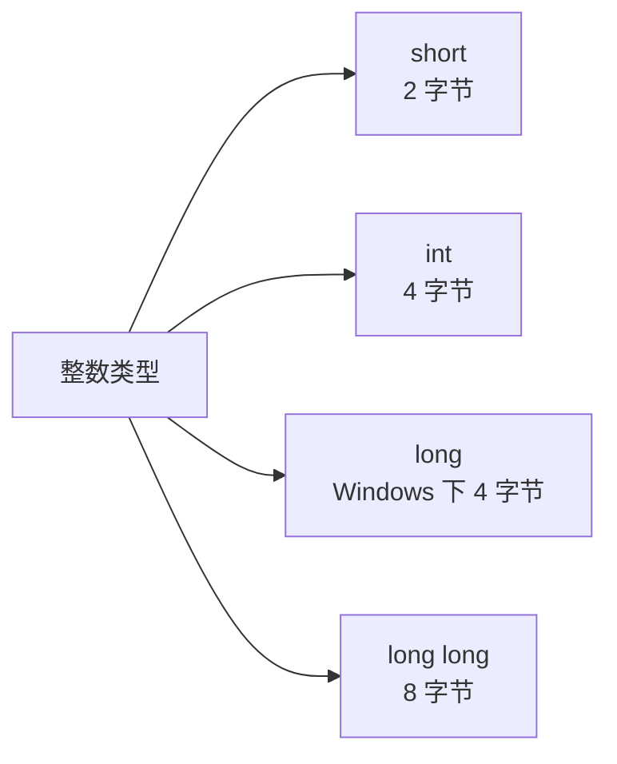
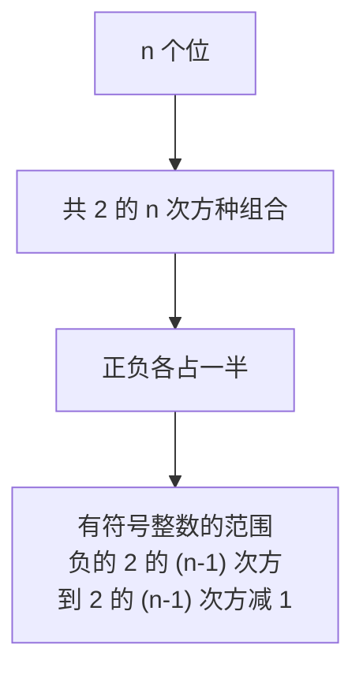
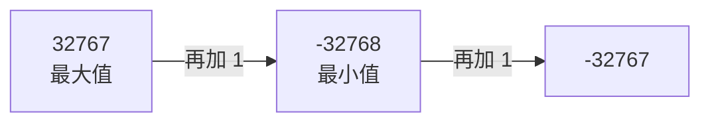
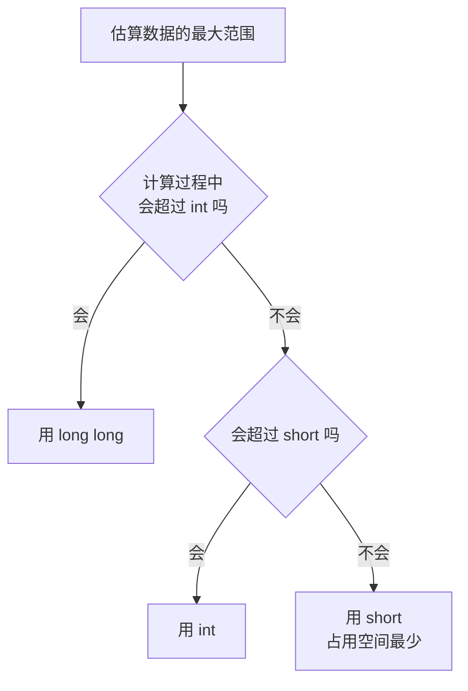

## 为什么必须指定数据类型

在 C++ 里创建一个变量或常量的时候，**必须指定它的数据类型**。

之前写过的 `int x = 1314;` 里，int 就是数据类型，它代表**整型**，也就是整数。如果不指定类型，编译器就不知道该给这个变量分配多大的内存空间——类型决定了这块空间的大小。

## 四种整数类型

整数不只有一种类型，常用的有四种：short、int、long、long long。



它们占用的内存空间不同：short 是 2 个字节，int 是 4 个字节，long 在 Windows 上是 4 个字节（在 Linux 上可能是 4 个或 8 个字节，存在平台差异），long long 是 8 个字节，属于 64 位整型。

既然都是整数，为什么要分出这么多种？原因是**它们能表示的整数范围不一样**：占的字节少，能表示的范围就小；占的字节多，能表示的范围就大。范围的计算要从"字节"这个概念说起。

## 字节与位

一个字节（byte）等于 **8 个位**（bit），每个位只能取 0 或者 1。这是计算机组成原理里的基础知识。


由此可以推出：2 个字节是 16 个位，能表示 2 的 16 次方种组合；4 个字节是 32 个位，能表示 2 的 32 次方种组合；8 个字节是 64 个位，能表示 2 的 64 次方种组合。

不过这些组合并不是全部用来表示正数的。因为整数要区分正负，最高位被拿去当符号位，正负各占一半，所以实际范围是：



## 各种类型的取值范围

按上面的规律套进去，就能算出每种类型的范围。

| 类型 | 字节 | 位 | 取值范围 |
| --- | --- | --- | --- |
| short | 2 | 16 | -32768 ~ 32767 |
| int | 4 | 32 | -2147483648 ~ 2147483647 |
| long | 4（Windows） | 32 | 与 int 相同 |
| long long | 8 | 64 | 负的 2 的 63 次方 ~ 2 的 63 次方减 1 |

以 short 为例：位数是 16，所以范围是负的 2 的 15 次方到 2 的 15 次方减 1。而 2 的 15 次方等于 32768，所以 short 的范围就是 **-32768 ~ 32767**。

可以用"区间里有多少个整数"来验证这个范围是否合理。一个从 L 到 R 的区间，包含的整数个数是 `R - L + 1`。代入 short 的范围：

```text
32767 - (-32768) + 1 = 2 的 16 次方
```

正好等于 16 个位能提供的组合总数，说明这个范围是对的。

int 同理：2 的 31 次方等于 2147483648，所以 int 的范围是 **-2147483648 ~ 2147483647**，上限大约是 21 亿。这是整型最常见的一个边界值。

long long 的 2 的 63 次方已经是一个非常巨大的数，用计算器算一下就知道，这里不再展开。

## 用代码验证

定义四个不同类型的变量，都赋值为 1，然后全部输出：

```cpp
#include <iostream>

using namespace std;

int main() {
    short a = 1;
    int b = 1;
    long c = 1;
    long long d = 1;
    cout << "a = " << a << endl;
    cout << "b = " << b << endl;
    cout << "c = " << c << endl;
    cout << "d = " << d << endl;
    return 0;
}
```

运行结果：

```text
a = 1
b = 1
c = 1
d = 1
```

四个变量输出的值完全一样。也就是说，**光看输出是看不出它们区别的**——它们的差别不在"能存什么值"，而在"能存多大的值"，也就是取值范围。

## 溢出：范围是一个环

把 short 的值改成 32768，也就是刚好超出它的上限：

```cpp
#include <iostream>

using namespace std;

int main() {
    short a = 32768;
    cout << "a = " << a << endl;
    return 0;
}
```

运行结果却是：

```text
a = -32768
```

明明是正的 32768，输出却变成了负的 32768。这种现象在计算机里叫**溢出**。

原因在于：short 的取值范围 -32768 ~ 32767 并不是一条直线，而是一个**首尾相接的环**。当值到达最大值 32767 之后再加 1，它不会继续往上走，而是绕回到最小值 -32768。



按这个规律，32769 超出上限 2，所以会落到最小值往上数第 2 个位置，也就是 -32767：

```cpp
#include <iostream>

using namespace std;

int main() {
    short a = 32769;
    cout << "a = " << a << endl;
    return 0;
}
```

运行结果确实是 -32767。

int 也一样。把它的值设成 2147483648：

```cpp
#include <iostream>

using namespace std;

int main() {
    int b = 2147483648;
    cout << "b = " << b << endl;
    return 0;
}
```

运行结果会退回成 -2147483648，同样是溢出后绕回最小值。

> [!WARNING]
> 溢出不会报错，程序照常运行，只是结果悄悄变了。这类问题非常隐蔽，所以选类型时一定要先估算数据范围。

## 如何选择整数类型

既然范围不同，选择类型时就要先**估算数据范围**：在整个计算过程中，这个值最大可能到多少。



判断的规则是：如果计算过程中可能超过 int 的范围，就必须用 long long；不会超过 int 就用 int；不会超过 short 就用 short。

这里的原则是**能省则省**：short 占用的空间最少，能放下就用它。类型选得刚好够用，既不会溢出，也不浪费内存。

## 本章小结

**其一**，创建变量或常量时必须指定数据类型，因为类型决定了给它分配多大的内存空间。int 代表整型，也就是整数。

**其二**，常用的整数类型有四种：short（2 字节）、int（4 字节）、long（Windows 下 4 字节，Linux 上可能是 4 或 8 字节）、long long（8 字节，64 位整型）。

**其三**，1 个字节等于 8 个位，每个位是 0 或 1。所以 2 字节对应 16 位、4 字节对应 32 位、8 字节对应 64 位。整数要区分正负，正负各占一半，因此有符号整数的范围是"负的 2 的 (n-1) 次方到 2 的 (n-1) 次方减 1"。

**其四**，short 的范围是 -32768 ~ 32767，int 的范围是 -2147483648 ~ 2147483647（上限约 21 亿）。用"区间整数个数 = R - L + 1"可以验证：32767 - (-32768) + 1 正好等于 2 的 16 次方。

**其五**，超出范围会发生溢出。short 的取值范围首尾相接构成一个环，32767 再加 1 就绕回 -32768，32769 则落到 -32767；int 的 2147483648 会绕回 -2147483648。溢出不会报错，只会让结果悄悄出错。

**其六**，选择类型要先估算数据范围，遵循能省则省的原则：可能超过 int 就用 long long，不超过 int 就用 int，不超过 short 就用 short。