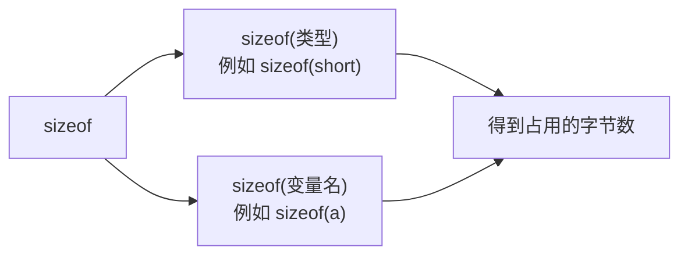
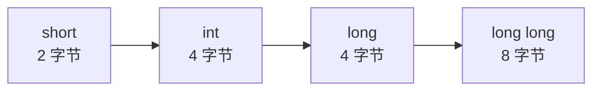

## sizeof 是什么

sizeof 是 C++ 的一个**关键字**，它的作用是获取某个类型或某个变量**占用了多少个字节**。

虽然它的写法看起来像函数调用——名字后面跟一对括号——但它并不是函数，而是一个关键字，由编译器直接处理。

## 用 sizeof 查看类型占用的字节数

上一节已经知道各种整数类型分别占几个字节，这一节用 sizeof 来实际验证一下。

先把四种整型变量定义好：

```cpp
#include <iostream>

using namespace std;

int main() {
    short a = 1;
    int b = 1;
    long c = 1;
    long long d = 1;
    cout << sizeof(short) << endl;
    cout << sizeof(int) << endl;
    cout << sizeof(long) << endl;
    cout << sizeof(long long) << endl;
    return 0;
}
```

把类型名直接放进 sizeof 的括号里，就能得到它的字节数。运行结果：

```text
2
4
4
8
```

和上一节说的完全一致：short 是 2 个字节，int 是 4 个字节，long 在 Windows 上也是 4 个字节，long long 是 8 个字节。（long 的字节数存在平台差异，在 Linux 上可以自己用同样的方式验证。）

## 也可以直接传变量名

除了传类型名，还可以把**变量名**传进去：

```cpp
#include <iostream>

using namespace std;

int main() {
    short a = 1;
    int b = 1;
    long c = 1;
    long long d = 1;
    cout << sizeof(a) << endl;
    cout << sizeof(b) << endl;
    cout << sizeof(c) << endl;
    cout << sizeof(d) << endl;
    return 0;
}
```

运行结果和刚才一样，仍然是 2、4、4、8。

原因很简单：对计算机来说，每个变量都有自己的类型，只要知道 a 是 short 类型，自然就知道 short 占多少个字节，也就知道了 a 占多少个字节。


所以 sizeof 有两种写法，效果是等价的：



## 四种整型的字节数关系

把这几个结果串起来，可以得到一条规律：short 的字节数不超过 int，int 不超过 long，long 不超过 long long。



也就是说，类型从左到右占用的空间不会变小，只会持平或者变大。这和上一节"范围越大的类型占的字节越多"是同一件事的两种说法。

## sizeof 有什么用

知道一个变量或类型占多少字节，在写代码时是有实际用处的。最典型的地方是**数组**——后面讲到数组时，会再次用到 sizeof 这个关键字。

在后面学习其他数据类型时，同样可以用它来确认某个类型到底占几个字节，不必死记。

## 本章小结

**其一**，sizeof 是一个关键字，作用是获取某个类型或某个变量占用的字节数。它写法上像函数调用，但并不是函数。

**其二**，sizeof 有两种等价写法：`sizeof(类型)` 和 `sizeof(变量名)`。前者直接给出类型的字节数，后者先取变量的类型再给出字节数，结果完全一样。

**其三**，实测结果是 short 占 2 字节、int 占 4 字节、long 在 Windows 上占 4 字节、long long 占 8 字节，与上一节的结论一致。

**其四**，四种整型的字节数关系是 short ≤ int ≤ long ≤ long long，从左到右占用的空间不会变小。

**其五**，sizeof 的实际用途之一是处理数组，后面讲数组时会再次用到它；在学习其他数据类型时，也可以用它来确认类型占用的字节数。