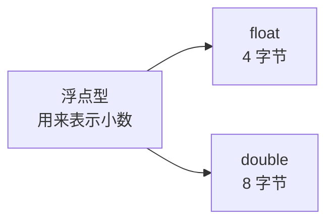
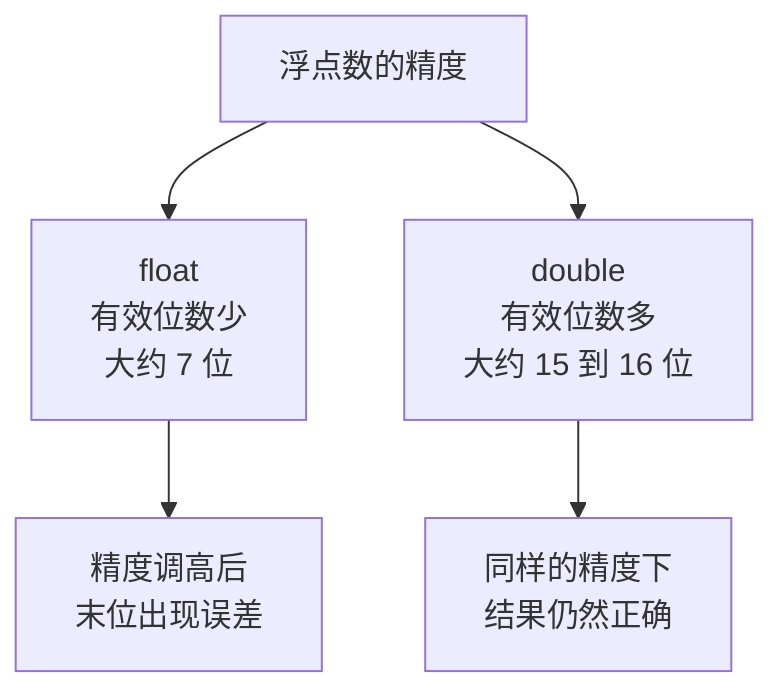
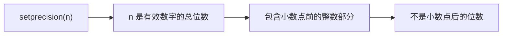
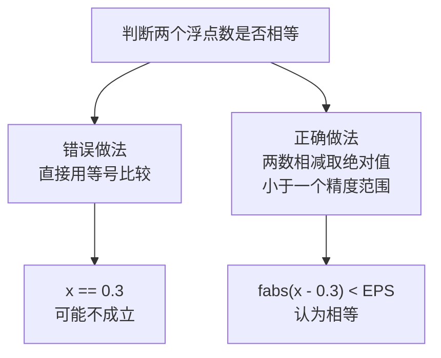

## 浮点型是什么

浮点型（也叫实型）用来**表示小数**。数学里把包含小数的数叫做实数，浮点型对应的就是这一类数。



它只有两种类型：float 和 double。float 占 4 个字节，也就是 32 位；double 占 8 个字节。

## 先用代码对比一下

定义两个浮点变量，都赋同一个值，然后输出：

```cpp
#include <iostream>

using namespace std;

int main() {
    float a = 3.1415926f;
    double b = 3.1415926;
    cout << a << endl;
    cout << b << endl;
    return 0;
}
```

运行结果：

```text
3.14159
3.14159
```

两个变量输出得一模一样，而且都只显示了小数点后 5 位。原因是**输出时没有做精度控制**，默认只显示 6 位有效数字。

另外注意 float 变量的写法：初始化时在数字后面加了一个 `f`，表示这个字面量是 float 类型。

## 输出精度控制：setprecision

要控制输出精度，可以用 setprecision。它是标准库里的一个工具，需要额外引入一个头文件：

```cpp
#include <iostream>
#include <iomanip>

using namespace std;

int main() {
    float a = 3.1415926f;
    double b = 3.1415926;
    cout << setprecision(10) << a << endl;
    cout << setprecision(10) << b << endl;
    return 0;
}
```

运行结果：

```text
3.141592741
3.1415926
```

这里出现了一个值得注意的现象：精度调高之后，float 的末位变成了 741，已经不是原来的数字了；而 double 输出的仍然是 3.1415926，完全正确。



### 精度指的是什么

这里要澄清一个容易误解的点：setprecision 里的数字表示**有效数字的总位数**，它包含了小数点前面的整数部分，而不是"小数点后保留几位"。



所以 `setprecision(7)` 时，3.1415926 只会显示到小数点后 6 位。

那 double 到底能表示多少位？一直把精度往上加就会发现，加到 16 位左右还是准确的，再往后数字就完全不对了。不过这些误差都出现在小数点后非常靠后的位置，量级已经小到可以忽略，所以不必在意。

## 为什么刷题一定要用 double

float 能保证的有效位数比较少，只有 7 位左右。在精度要求不高的场景里用 float 没问题，但**刷题和比赛时一定要用 double**，因为 float 的精度不够，很容易在判断答案时出错。

## 浮点常量的科学计数法写法

浮点数还可以写成科学计数法的形式：

```cpp
#include <iostream>

using namespace std;

int main() {
    double c = 1.5e5;
    double d = 1.5e-5;
    cout << c << endl;
    cout << d << endl;
    return 0;
}
```

运行结果：

```text
150000
1.5e-05
```

这里的 e 表示"乘上 10 的多少次方"：`1.5e5` 就是 1.5 乘上 10 的 5 次方，也就是 150000；`1.5e-5` 就是 1.5 乘上 10 的 -5 次方。

## 浮点数不能用 == 判等

浮点数有一个必须记住的特性：**它天生带有误差**。看下面这段代码：

```cpp
#include <iostream>

using namespace std;

int main() {
    double x = 1.0 / 3 * 3;
    cout << x << endl;
    return 0;
}
```

三分之再乘三，数学上应该等于 1，运行结果也确实输出了 1——这一次恰好没有出现误差。

但这并不代表可以放心用 `==` 去比较浮点数。有没有误差取决于具体的数，换一组数字就会露馅：

```cpp
#include <iostream>
#include <iomanip>

using namespace std;

int main() {
    double x = 0.1 + 0.2;
    cout << setprecision(17) << x << endl;
    return 0;
}
```

运行结果：

```text
0.30000000000000004
```

数学上 0.1 加 0.2 就是 0.3，但在计算机里它等于 0.30000000000000004。这时候如果写 `if (x == 0.3)`，条件是不成立的——程序会认为它们不相等。



正确的判断方式是：把两个数相减，取绝对值，看它是否小于一个很小的精度范围。取绝对值要用到数学库里的 fabs：

```cpp
#include <iostream>
#include <cmath>

using namespace std;

#define EPS 1e-7

int main() {
    double x = 0.1 + 0.2;
    if (fabs(x - 0.3) < EPS) {
        cout << "相等" << endl;
    }
    return 0;
}
```

运行结果会输出"相等"。

这里的 EPS 就是精度范围，用宏定义成了一个常量，值为 1e-7，也就是 10 的 -7 次方。这个值由自己决定，1e-6、1e-7、1e-8 都可以，取到多少取决于对精度的要求。

> [!WARNING]
> 处理计算几何这类问题的时候，一定要把浮点误差考虑进去，**不要用等号去比较两个浮点数**。这是浮点数最容易踩的坑。

## 本章小结

**其一**，浮点型（实型）用来表示小数，只有两种类型：float 占 4 个字节，double 占 8 个字节。float 变量初始化时一般加上 `f` 后缀，如 `3.1415926f`。

**其二**，输出浮点数时默认只显示 6 位有效数字，可以用 setprecision 控制精度，但它需要引入头文件 `<iomanip>`。

**其三**，setprecision(n) 中的 n 是**有效数字的总位数**，包含小数点前的整数部分，而不是小数点后的位数。float 的有效位数大约 7 位，double 大约 15 到 16 位；精度调得过高时，float 的末位会暴露出误差，这些误差量级极小，可以忽略。

**其四**，刷题和比赛时一定要用 double，float 的精度不够，容易导致判断结果出错。

**其五**，浮点常量可以写成科学计数法：`1.5e5` 表示 1.5 乘上 10 的 5 次方，`1.5e-5` 表示 1.5 乘上 10 的 -5 次方。

**其六**，浮点数天生带误差，所以不能用 `==` 判等。正确做法是把两个数相减取绝对值（fabs），判断它是否小于一个精度范围（通常用宏定义成常量，如 `#define EPS 1e-7`）。