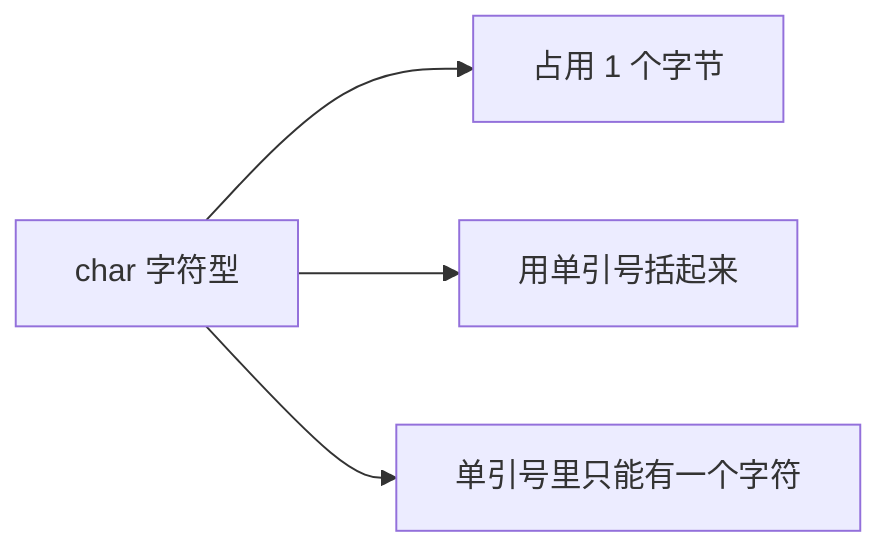
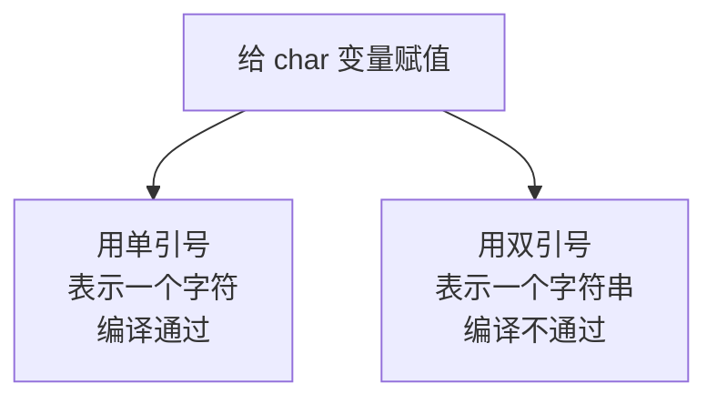
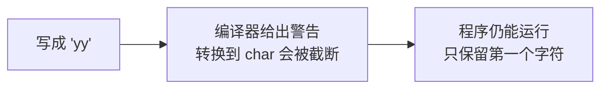
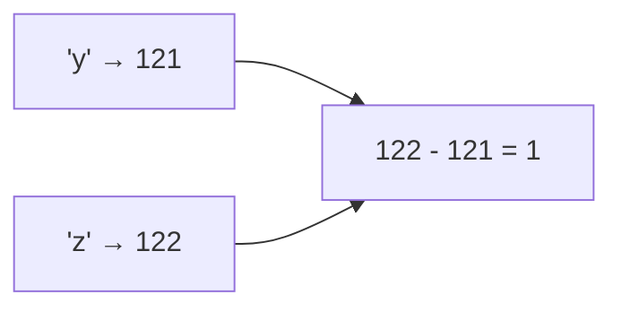
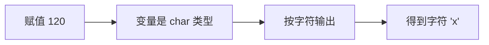

## 字符型是什么

字符型用来存储**单个字符**，比如 A、B、C、D 这种。

它的数据类型关键字是 char。定义一个字符变量，用**单引号**把字符括起来：

```cpp
#include <iostream>

using namespace std;

int main() {
    char a = 'y';
    cout << a << endl;
    return 0;
}
```

运行结果：

```text
y
```

注意输出的只有 y 这个字符本身，**引号是不会被输出来的**。



## 单引号，不是双引号

如果把单引号换成双引号，编译就通不过了：

```cpp
#include <iostream>

using namespace std;

int main() {
    char a = "y";
    cout << a << endl;
    return 0;
}
```

原因是编译器会把双引号里的内容当成**字符串**，而不是单个字符，类型对不上，所以报错。



单引号表示字符、双引号表示字符串，这个区别要记住。

## 字符型占几个字节

每个数据类型都有大小，字符型的大小可以用 sizeof 查看：

```cpp
#include <iostream>

using namespace std;

int main() {
    char a = 'y';
    cout << sizeof(a) << endl;
    cout << sizeof(char) << endl;
    return 0;
}
```

运行结果：

```text
1
1
```

传变量名和传类型名结果一样，都是 **1 个字节**。

## 单引号里只能有一个字符

单引号里只能放一个字符。如果放两个，比如写成 `'yy'`：

```cpp
#include <iostream>

using namespace std;

int main() {
    char a = 'yy';
    cout << a << endl;
    return 0;
}
```

这段代码编译时不会直接报错，但会出现一条警告，大意是"从 int 转换到 char 会被截断"。程序仍然可以运行，输出的只有第一个字符 y。



前面已经讲过警告的含义，这里同样：警告不影响运行，但应该尽量把警告消灭掉。

## 字符在内存里存的是什么

字符型占 1 个字节，也就是 8 个位。8 个位一共能表示 2 的 8 次方，也就是 256 种情况。

但内存里存的**并不是字符本身**，而是先把这个字符转换成一个整数，再把整数存进去。这套字符与整数的对应关系叫做 **ASCII 码**，它是一张固定的表。


这张表不需要背，因为可以反过来把字符转成整数直接看。只要在输出的时候加一个强制类型转换：

```cpp
#include <iostream>

using namespace std;

int main() {
    char a = 'y';
    cout << (int)a << endl;
    return 0;
}
```

运行结果是：

```text
121
```

也就是说，字符 y 在 ASCII 表里对应的整数是 121。

再看一个字符 z：

```cpp
#include <iostream>

using namespace std;

int main() {
    char a = 'y';
    char b = 'z';
    cout << (int)a << endl;
    cout << (int)b << endl;
    return 0;
}
```

运行结果：

```text
121
122
```

z 是 122，正好比 y 大 1。

| 字符 | ASCII 码 |
| --- | --- |
| 'x' | 120 |
| 'y' | 121 |
| 'z' | 122 |

需要留意的是，**大写和小写是两个完全不同的字符**，对应的 ASCII 码也不同。例如小写 y 是 121，而大写 Y 是 89。

## ASCII 码可以参与运算

既然字符在底层就是整数，那么它们自然可以参与运算。比如把两个字符相减：

```cpp
#include <iostream>

using namespace std;

int main() {
    char a = 'y';
    char b = 'z';
    cout << b - a << endl;
    return 0;
}
```

运行结果：

```text
1
```

b 是 122，a 是 121，相减得到 1。因为字母在 ASCII 表里是连续排列的，所以相邻字母相减就是 1。



不需要记住 x 是 120、y 是 121，只要知道**字符和整数之间有一张一一对应的映射表，并且这些整数可以参与运算**就够了。

## 直接给字符变量赋整数

既然字符本质上是整数，那么反过来，直接给字符变量赋一个整数也是可以的。比如把 120 赋给一个字符变量：

```cpp
#include <iostream>

using namespace std;

int main() {
    char b = 120;
    cout << b << endl;
    return 0;
}
```

运行结果：

```text
x
```

输出的是字符 x，而不是数字 120。因为变量是 char 类型，输出时会按字符的方式显示，而 120 在 ASCII 表里对应的字符正好是 x。



这也印证了字符和整数之间是**双向**的：字符可以转成整数，整数也可以转成字符。

字符的这个特性有一个很实际的用途：对字符串里的字符做大小写转换。原理就是利用大写字母和小写字母在 ASCII 表里的固定差值来加减。具体做法后面讲字符串时会展开。

## 本章小结

**其一**，字符型的关键字是 char，用来存储单个字符。赋值时必须用**单引号**，例如 `char a = 'y';`；用双引号会被当成字符串，编译不通过。输出字符时只显示字符本身，不显示引号。

**其二**，字符型占 1 个字节，用 `sizeof(a)` 或 `sizeof(char)` 查看结果都是 1。

**其三**，单引号里只能放一个字符。写成 `'yy'` 不会报错，但会出现"转换到 char 会被截断"的警告，程序仍能运行，输出只保留第一个字符。警告虽不影响运行，但应尽量消除。

**其四**，字符在内存里存的不是字符本身，而是转换成整数后存储，这套对应关系叫 ASCII 码。它是一张固定的表，不需要背，可以用 `(int)a` 把字符转成整数直接查看。y 对应 121，z 对应 122，x 对应 120。大写和小写是两个不同的字符，ASCII 码也不同。

**其五**，ASCII 码可以参与运算。因为字母在表中连续排列，所以 `b - a`（122 减 121）得到 1。记住"字符和整数一一对应、并且可以运算"即可，具体数值不必死记。

**其六**，也可以直接给字符变量赋整数，例如 `char b = 120;` 输出的是字符 x。字符与整数之间的转换是双向的，这个特性常用于字符串的大小写转换。